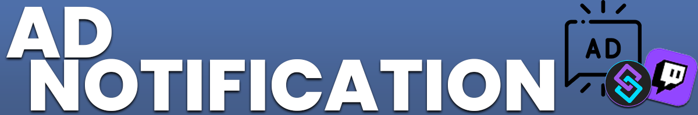
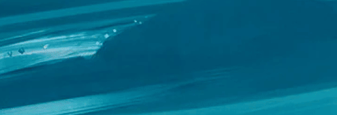
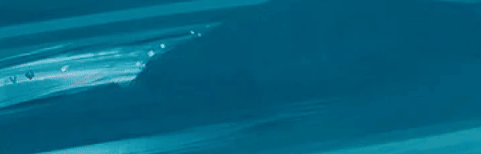
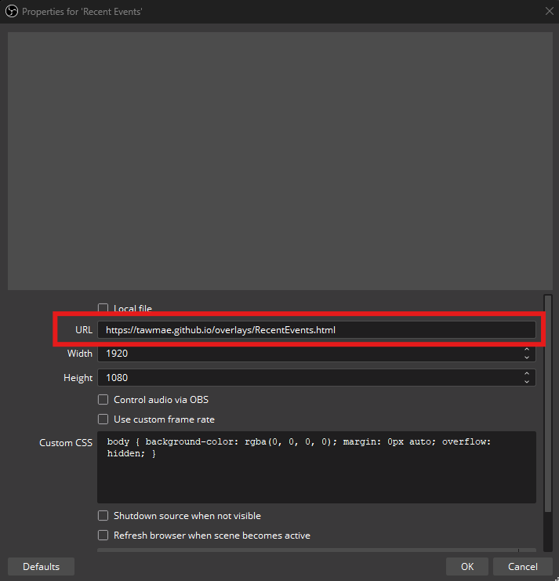
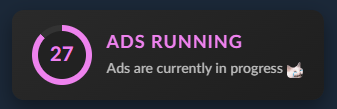

Twitch
{: .label .label-purple }

OBS
{: .label .label-yellow }

StreamerBot
{: .label .label-blue }


# Table of contents
{: .no_toc .text-delta }

1. TOC
{:toc}

---


## <span class="iconify" data-icon="material-symbols:description-outline-sharp" data-inline="false"></span> Description
An overlay for when Twitch ads are about to start or are currently in progess.






- - - -

## <span class="iconify" data-icon="tabler:tool" data-inline="false"></span> Setup

1. Go into Streamerbot and head to the tab `Servers/Clients -> WebSocket Server` and start the websocket server. Leave the adress at `127.0.0.1` and the port at `8080`. Check `Auto Start` as well. You can set a password, but you don't have to. If you do, make sure `Enforce for All Requests` stays unchecked.

   [](https://tawmae.github.io/assets/media/notif_sb.png)
   
2. Copy the URL: 
   ```
   https://tawmae.github.io/overlays/Ads.html
   ```
   
3. Go into your OBS, create a browser source and paste the URL in there. Preferably set the resolution to your canvas size.
   
   [](https://tawmae.github.io/assets/media/notif_obs_1.png)
   
   [](https://tawmae.github.io/assets/media/recent_events_new_obs_1.png)
   
4. Done 🥳

{: .new }
To have the events in multiple scenes, don't create an individual browser source in every scene, but instead create a new **nested** scene and put just a single browser source in there. Then place that scene into all your other scenes. This way you won't have to create 20 browser sources for 20 scenes.

- - - -

## <span class="iconify" data-icon="material-symbols:dataset-linked-sharp" data-inline="false"></span> URL Parameters 

To customize the ad overlay, you can add URL parameters. The first parameter gets added with a `?`, every additional one with `&`.

Example:  
```
https://tawmae.github.io/overlays/Ads.html?sound=true&color=violet&font=lato
```



---

### <span class="iconify" data-icon="ion:color-palette" data-inline="false"></span> Color

Changes the color of the title and progress bar. Supports hex codes too.

`color=blue`

`color=B81A56`

---

### <span class="iconify" data-icon="mdi:format-font" data-inline="false"></span> Font Family

Changes the font used for the text. Supports standard fonts. Use `%20` to replace spaces.

`font=Arial`

`font=Poppins`

`font=Comic%20Sans%20MS`

---

### <span class="iconify" data-icon="material-symbols:volume-up-rounded" data-inline="false"></span> Sound

Toggles whether a sound is played when the overlay displays.

`sound=true`

---

{: .new }
You can simulate events by creating a trigger (`Twitch -> Ads`), then rightclick it and hit `Simulate Event`. 

---

<span class="iconify" data-icon="twemoji:flag-germany" data-inline="false"></span> German version: `https://tawmae.github.io/overlays/Ads_GER.html`

---

## <span class="iconify" data-icon="material-symbols:published-with-changes" data-inline="false"></span> Changelog

| Date        | Changes          | Version |
|:-------------|:------------------|:------------------|
| December 06, 2024           | Added color and font URL parameters | 1.0.1 |
| December 03, 2024           | Release | 1.0.0 |
