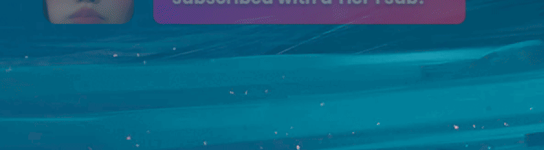
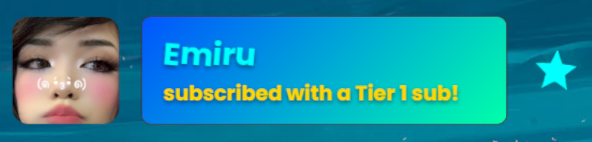
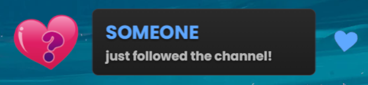

Twitch
{: .label .label-purple }

OBS
{: .label .label-yellow }

StreamerBot
{: .label .label-blue }


# Table of contents
{: .no_toc .text-delta }

1. TOC
{:toc}

---


## <span class="iconify" data-icon="material-symbols:description-outline-sharp" data-inline="false"></span> Description
A simple OBS overlay for your Twitch alerts.


And it's customizable!



Supported events are follows, raids, subs, resubs, giftsubs, giftbombs, cheers, watchstreaks and kofi donations.

- - - -

## <span class="iconify" data-icon="tabler:tool" data-inline="false"></span> Setup

1. Go into Streamerbot and head to the tab `Servers/Clients -> WebSocket Server` and start the websocket server. Leave the adress at `127.0.0.1` and the port at `8080`. Check `Auto Start` as well. You can set a password, but you don't have to. If you do, make sure `Enforce for All Requests` stays unchecked.

   [](https://tawmae.github.io/assets/media/notif_sb.png)
   
2. Copy the URL: 
   ```
   https://tawmae.github.io/overlays/BasicTwitchAlerts.html
   ```
   
3. Go into your OBS, create a browser source and paste the URL in there. Preferably set the resolution to your canvas size.
   
   [](https://tawmae.github.io/assets/media/notif_obs_1.png)
   
   [](https://tawmae.github.io/assets/media/basic_alerts_obs_2.png)
   
4. Done 🥳

{: .new }
To have the events in multiple scenes, don't create an individual browser source in every scene, but instead create a new **nested** scene and put just a single browser source in there. Then place that scene into all your other scenes. This way you won't have to create 20 browser sources for 20 scenes.

- - - -

## <span class="iconify" data-icon="material-symbols:dataset-linked-sharp" data-inline="false"></span> URL Parameters 

To customize the alert overlay, you can add URL parameters. The first parameter gets added with a `?`, every additional one with `&`.

Example:  
```
https://tawmae.github.io/overlays/BasicTwitchAlerts.html?sound=true&eventcolor=gold&color=linear-gradient(135deg,%230055FF,%2300FFAA)&usernamecolor=cyan&duration=12000&anonymousfollows=true
```




{: .new }
You can simulate events by creating a trigger (like a Twitch Follow trigger), then rightclick it and hit `Simulate Event`. 

---

### <span class="iconify" data-icon="ion:color-palette" data-inline="false"></span> Background Color

Changes the background color of the background box. Supports hex codes and even stuff like gradients.

`color=white`

`color=FFFFFF`

`color=linear-gradient(135deg,%23a800ff,%23ff0080)`


---

### <span class="iconify" data-icon="mdi:format-font" data-inline="false"></span> Font Family

Changes the font used for the event text. Supports standard fonts.

`font=Arial`

`font=Poppins`

---

### <span class="iconify" data-icon="mdi:account" data-inline="false"></span> Username Text Color

Changes the color of the username displayed in the event. The event icon left of the box will also have this color.

`usernamecolor=blue`

`usernamecolor=FF5733`

---

### <span class="iconify" data-icon="mdi:format-color-text" data-inline="false"></span> Event Text Color

Changes the color of the event description text.

`eventcolor=green`

`eventcolor=00FF00`

---

### <span class="iconify" data-icon="material-symbols:alarm" data-inline="false"></span> Duration

Changes the duration until the alert disappears. Number in milliseconds. The default is 7000.

`duration=5000`

---

### <span class="iconify" data-icon="material-symbols:volume-up-rounded" data-inline="false"></span> Sound

Toggles whether a sound is played when the overlay displays.

`sound=true`

---

### <span class="iconify" data-icon="mdi:account-circle-outline" data-inline="false"></span> Anonymous Follows

Replaces the username and avatar with placeholders for follow events.

`anonymousfollows=true`



---

### <span class="iconify" data-icon="mdi:fire" data-inline="false"></span> Watchstreaks

Disables watchstreaks from being displayed as an alert.

`watchstreaks=false`


---

<span class="iconify" data-icon="twemoji:flag-germany" data-inline="false"></span> German version: `https://tawmae.github.io/overlays/BasicTwitchAlerts_GER.html`

---


## <span class="iconify" data-icon="material-symbols:published-with-changes" data-inline="false"></span> Changelog

| Date        | Changes          | Version |
|:-------------|:------------------|:------------------|
| December 06, 2024           | Release | 1.0.0 |
