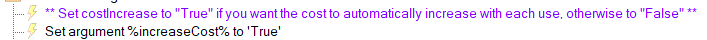
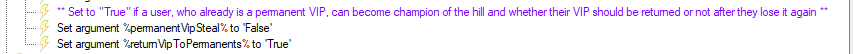

Twitch
{: .label .label-purple }

StreamerBot
{: .label .label-blue }


# Table of contents
{: .no_toc .text-delta }

1. TOC
{:toc}

---

## Description

Let your viewers become champion of the hill and earn a VIP badge by redeeming a channelpoint reward. But be aware! There can only be one champion at a time, so after another user redeems the reward, they'll steal the title and VIP badge from the former champion. 

The **description of the reward will automatically update** and have the current champion listed. You also have the option to **automatically increase the cost** upon each use.


---

## Import Code
```scss
U0JBRR+LCAAAAAAABADNW1tv4si2fj/S+Q9Wn9d22lfAI+2H4A63dOgA4eaT0ahuvjS+sLGBkK3573uVDQm2gRA6M9MtRS2qyrVqfev2Vbn8n//9H0H4tGKL2IvCT78J6ue0wQvm0SIZFZsDL/SCZfDa/km6Uq40EflzF11pn7ajWIKg7z/8B/wMUcD4UNNFwRweE77bwoPLhJbn+9kTMAgtEzda8GEJWgeIvXSs8rLUlw7KYrLw5sm2sx3GyWJJ+M/4N8FNknn825cv2WRXjpe4S3zlRV/IdhF/RPYficv+cGERV24S5FYS9ZfhNdnOHC59n3f9mSlHUU45lEmElv/PWoRdV9rtUb42oyapVVzTRVajsqgZTBaRblBRpjWVamqtoih0Jz997N9LtmRb2fvtLETYZ3xO0JXlep6Iv6SssYiClhcn0WIDg2zkx7lR55giHegsouX8rJHIX6NNDIAdkrdAIY2CFyhL/SQKyXKxYGFyqDdZeI4D5t8HtwBwJoWt0YK2U6hlQ2esUlFFTVcMUdPkqljTGRFrErFlvaIYVCb769+zEiMyU6SaIRImwfNVWRExlrBIK4puS7wP0dKjyWbOEZVlpdhz1Fav9op3rvP7fu+frz9+zyFddrVDaOxsXFpqIWBK/QtmMzAFYSURabf52+Pj2AN7ruPHxzuPLKI4spOr7s3D42NjAULX0WJW0R4fV9qVdKVKqmw8PgYxiRa+h68ouE1+yt+L8vEmYWZE08XTSXeOA+IMVf+ZNkfJ97V0+7U3X9NxJ0bjO2eqPLlEvXN6cr09GOvQpvvQX/3ai5y2ee2Q1sjDTf9Hu9lZYWXt9CeuP1VHkjVw5rsxDObk/2d/9Wfa6qQyYdyGBKMlbVidoXlttG+6vYGpt6xJv4WbhjcdP42nk3aNqP0NyA3vn7WoHXRlEnZ8HPbHg9G1982sSyQc+beD6y/3m/qSjp/i73l5HlaMuN3cf65uD5ujDR7kZA6p4ktTxR0RZbQZBY3NfabTl3vP/UEnnY011qXRzO99M6+93NobRs+adJK2t3ZAN9kazJz755pjBY2YKMMXrNK/TN6QhD6XWScBidrh6NmatLkuKzrpOTt92620fV7Q5+vwxlmOWh29r4yk3qQT3podma/5IWgk1qANuhoy3cMZbOyTme7i8fCcuTbWhLok6HcsszwX6KxOJ53ZYNw7b65x38eTuoTGxhKeOaBjx7fA70irP8eKDjJnb+MV+Mup2vGnoFdPMZ7pjezTprs6tF6Q8QPW7AI+X7HalR7GIwk1jdntQ9w1vesXOdy/v/n9DRtSn940NtbG8dCk28VK3ydBQ8Lqq32mgbHCZn1OJHkFa99MJ/0V8c5a9/Mo8NfcTzDEyC5mQM4YTa7PwRN06gKmjWdr2F0RtVdaU6H/nDnX3HenENc8NtCk/gB5wMWvWGbx06oDDrKLM5+fk0ZXAjnxOTgC/hLEz5LrPmpmsbKV91zE4tTYM2Wl/pn6xasOcxz2nHzfBX7W6EcwxzP4T7znazH4bdhunhh787QCXyzaIl1T0T9HTRfirxth5WnW/io5tzAvNf2CXftDBHFDFHeFm/07Lv/9vtMfYrXv4kZ9BWuQyOZNfVa02YiHTWPObfHQNJbWpoBhutaiDxblQM41Xa77vKy7IUHO72EF5ml1L9WL+8wPnqtffSvFv4Q1rwFTBfz5HfZ5ecY8rkdh3gJGgCPUVmtQwull3X0P5v5649xurqMT8lcwZn1nautiXKDxFPwmVyed+wcpVwdya2rln9+LhwdYzwxy5jNRGiHU9Fl7Vq+m84QS5AR/RQd1F4MvTsd9vd2EGBxArm8OX2u7Wf+Bmo2ENP0V9uory8v6UdOPsak547EhE6++zmx+51iKIaU1IRwtIbfOvnnF+peLfRVN+j9QI1dDvkK+ABzX0V6tit+sM5nNIfb6Mgm0w7W7JXVNJ+8jlgc2yteJD8SWcjzddnO/zgDeAeR7pbHsqDzvA9aK60KNBb00BytTB2qh326CbzbXy3YD5pm0HbKN23aTrijXc2zJOOj7lql5Rf/Zz4dbTjTYr+M9kA0+GN8CplQBm9/4s2/pnLlaf9Buu/zeblrgN12/EHMGYFf2ZbNxpEbNcmPZAXlZLGR197ZX7j/0zNk2ajYAzxvAFrjkuLFMc07KZdcOA78Gzgm20jneHtjxL4mDv9JWmf/Ccy3Qz6sHkJufrUO+wuNir83ulWOkyPXvBxlXz9ukno+3a38XXyk/KvQVx6a1YQh1YdSic9rsRiNuJ99yiefu8eO1k99D7PYCUP9a/Q0dD3f/FzHp2Af8J5eHbhozi3Mjc1/ewTyT1bFJfQYx7Q+3eWrYAg4ENinYKp2rbcZO2wPOuXlXfj0V2w+FfdahvVUOt+3e5pA+mZ0Ktepd8db0g7Se5mtiF9YIXKiX1q/27An6YX6vkGPPmf8E7hkfdPf2PesCV7xevMWHAKssPg7icygu9nUf8Vqzy1VH9jY8Zq492F9Djkjz4Hw6XnuHMD5ad/b+LOB60+DJb7/4Wor3d2tCHIjNLuATffM7wFX02a3pzoBHwT5/OL/Nje85t94pHjM7nlfeaY8tD961ZXs5GP934d4LDAmZF/tdGh8Fn6rdlzngHq/vHZV1jn334nxEmn0X6uVgH7tSPdjr47nmNDe/i3f1+2B+OQf7DBefz/HTer5y6pJ/8D3Uw7gBttMH4MNLy3Sine/fDtyC3tGJPcJ0/pau78M8zZfS7aQUfz+PbaEev7Q5x+pX1wcuCLm2+zwdU//W7Hm9VpLmfnuQ1pwlVskpnum2i+cf+/G9rccQ3zNrLK8pr1Uz4J9Niz/7Uzw9rUkFnAr8o+xjBZ8yx1ntITKv3XlOaU4KY4cvtbN0Xnibntd1vk/Hsv/2GeGRenrtG4c4UHt8iLOcXuueP+5xQ3lFgxHnUwVOdhBn4y2b9sb9Wcqt93T/mzjHP8uhDvKVQzm7frQunVN3HqAf5t9AfB3JBcfn/+drwCH/yf6stGYf5o27M1rI3Ubb7DRYq75Kzx2bPj+XvLQG7zhMntvd6D7lZ1I3MuAD+4fAgH1xL7p9qSmzYt3+d5kL8rPRLvfh5u0JHvL31YcPwd3Eaj+62O+y+Mj71Ne1cfKc1Dwm6xz77tez0dpqNiRrlOOqpTqT47Gbt84t17szobc47VHsM1xSzvnTev4a/P2dmG/PS8vx9/PYHuJCvM3szToUavPe+z+b8ncwwAvze3fq00Zawzo4sFa90L/DCp3jwru/k7Xt+FkR1JLGc7vF65DrW2b9min59QB+L/UTONfKCrb8qsXjw1jyc0B+7ocmd1vexXE7Vbdu3n2u1w9HsRXwZ0t74T3e5pfenaV/r+dE6fvYt871Xs4Bs7OWl1zCbWb3/vWv0kvz+YKRKJh7Pjtwg2H72t1Hm0GCFofuOKQjYrRifRYv/eQhGqGFx+8NnBqbG1V+j7+9zWBUVKxUKqJardVETWGGiJBERYKRLNu2TdCBixBr5jkuX6d0JR256WDwf8W+1+si/P39+25CeCFlT1xk7g7E51NXHFZb9bvbqw5eSBYMxcyM4qQkfYX89C7NIdn8rs9DptfBpaVI6gxrjCEsyoamiBqrVUVsI1skVaaTqlJTKJIvQVJW1KM4NlnIFsgXBixJvNCJL8RU/hhM71jiRuW7LztkP9WjxC31noVtTVIVWtH4TRsZsDVUImJKdFGyVcWo6lSqkcpHY8s1Etpb9f5BhOdsEaCQhcnImw8ShvyjAB/MBGfhi1W9WjWIIUoVm4kaYlXRoKouyraCZUoMcGH7F/Vd9WN898FdsNiN/OPuq0tSSc2zwK1IuqQZsibauqGLmmwjcF5bERlGhlKTmIbtstRfyXk/COJ7tiD8Ct8xgOXL4EXgm6puE1ExVBsqGCBbY0wWqwA71g1Wq8nGLw1v5YM8OEqQfx95YVJeyA5iRb8MY0i/io5VVcSyDvlXRlSsKRoSpSpDBpQ7jckfXts+FGP9PRhvyxWIFBKXCeUSJySR8Pjp5mke8bzsIf/x02do+OaFDC0ePwnRAn7xavdYpl0k8rMLzP8H+URqNI7wMsQqhixLQB8kBl7NbFusVbAMro2xTnVUxUy9CHFJOkXLPhDydxG1LeRtW4g56tELfp+FTbQUCAoF4qLQYalFEp6rebIWXLZggg14r10WCl6yHRUL9iIKBD81CJ+OvdpKIFzLnVEvtU8VMUNSVVm0iQy8GalUxFVsi8CYa6paVfSaVPu17aNcYB/z1QZpmxDZeTiFS/Gk2CaaijURgAV/r2BdrNUqFLK4YWNWU1kF/+J4ahemGI7fyxpSz38AKZBFPDv1/TUKszyUAg0DeMYOUOIR5PubV+TXXuIKDBFXWAILFCB62GLt7eZscG54Mh3VTplHVWBXoxMmKroM5pGJLaJqjYoK0jDSZFrB6OPN80EM8ZJENNhloVdbII7r4jNkGjCBD5hTAD+G5heCLoza95/TXIX5bp8Ju69IeJhwC/KvSAQUUp6tuHl4o7fgjwnAPZeQzzATFixZLkJGeRUJo0RAdpKN3Ah+BOaEJIcc5IWXmlInuqbKYDubaaqoUVsXkawzERs6UW0DwtAoZ8VfxJTvyll5qpTBCnuoh+h+Z7DjROnyU4CKVNOpTUVVrUiQx2Qg+0wzRBV2qBKSiaHol6H71++k8gns9ceBr0uaXPSbn5hkiGg6RtSWiYgU2xA1W1Jgb4mrnErqKiBFpAp6FyK7L1feVDv7rOjYxviC9LA1sW0rFYSA/do233DIDEqVIYuaRGVNqyAb9iAXKXRmOTpPrXecOGxPAjFWazYCjm/rkBewrQLjBGNJuAI6VqnMtPdtU1/VOnDYd54SyjkuCXnPR/OY0VevfPlQavvMbnz2xVw2ZNcEmRqyAc03rhmOIzJjyYAtVttvy8qdpu+lWWS/M/GC3XjeAgv4878fuQSfPTkAAA==
```

---

## Installation

1. Copy the import code from above and import the content

    

1. Create a channel point reward **inside** StreamerBot and not within Twitch itself. This will make sure that the reward is editable by StreamerBot.

   Go into `Platforms -> Twitch -> Channel Point Rewards` and add a new one. Give it any name you like. The description will automatically get updated after redemption, so you can just fill it with "There currently is no champion of the hill". If the reward is not greyed out and the settings are editable, you are good to go.

   
   


{: .highlight }
Make sure `Redemption Skips Queue` stays **unchecked**.


3. Assign the reward as the trigger in the `Champion Of The Hill` action

  
   


3. Already done! Continue with **Configuration** below.

---

## Configuration (Optional)


1. In the "General Settings" group, you can adjust two different things:

   * First, you can decide whether you want the cost of the reward to automatically increase upon each use. Therefore, doubleclick the "Set Argument" subaction and set its value for `increaseCost` to "True". Otherwise make it "False".

   

   *  Second, you can also decide whether a permanent VIP (that is not champion of the hill) can become champion of the hill. You can again set it to "True" if a permanent VIP should be able to steal, "False" if not. You can then also set whether the VIP status should be returned to the permanent VIP once he gets pushed off the throne.

   


3. In the "Cost Increase Settings" group, you can decide **how** the cost should increase and by **how much**.

   There are three different methods: costs can increase **linearly**, **exponentially** or have a combination of **both**. You can change the value to "Linear", "Exponential" or "Both".

   


   * If "Linear" is selected, the cost will increase by a fixed amount `increaseCostTotalPoints`. So if the cost is 1000 and the fixed amount set to 250, the next redemption will cost 1250 points.


     
 
    * If "Exponential" is selected, the cost will increase exponentially by the set percent value `increaseCostPercent`. So if the cost is 1000 and the percent set to 10, the next redemption will cost 1100 points.

   * If "Both" is selected, the cost will first increase linearly until it reaches a certain threshold `increaseCostThreshold`. 

     
   
     So in the example of the screenshots, the cost will increase linearly by 250 until it reaches 5000 points. From then on it will increase exponentionally by 10%. You can edit the treshold to your liking.


---

{: .note }
You don't have to delete the cost increase values from the "Set Argument" subactions if you don't want to utilize them. In that case, just leave them as it is.


