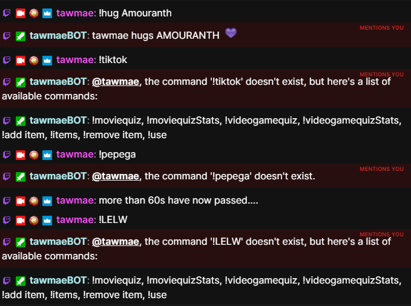

Twitch
{: .label .label-purple }

StreamerBot
{: .label .label-blue }


# Table of contents
{: .no_toc .text-delta }

1. TOC
{:toc}

---


## Description
Whenever a user types in a command (starting with an exclamation mark `!`) that does not exist, it will instead return a list of all your available commands. You can specify which commands to show (like groups, commands the user has permission for etc. pp.). To prevent spam, you can get a cooldown for the list to show in chat.


---

## Import Code
```scss
U0JBRR+LCAAAAAAABADNW1l34kiyfp9z7n9gfB9qZm7LndqlfjPYgOwyXQbMNu47JzcJFVoYJLF4Tv/3iZTYES4X3dXVdQ4FKFKZEfFFfBGZyP/5n79UKldzPkv8OLr6qaL+kF/ww2k8S3vHl0M/8sMs3F2/QtfKtSbhYDrG17J1tR7GUwzC/4gv8DXCIRdja3EY4ohVamNOJ3xWDAY5ztJxPBMjUrwIMd8KdmpdydfoWt4KGE/ozJ+ma6ETJekso+Jr8lNlnKbT5Kcffywmu/b8dJyRaz/+kRbr/4sW61+P0zDYVyJuZ9ENXU8aZUEgRL8WJjF8YBIuFoMr/yyuVDaiXOwzoRZTLVkzqCGZMuKSplFXIgqyJNfUqasoBjK5ulk/v+3fGc/4eu396zzCJOBiTjCTH0iWNMgYr8/isOknaTxblQz6gv/zMd4szqZfGoSDBV4l4CUY6OIgOVhlBnfF4dZ/J3IaRzSbzXiUlknTme95APe+R4+8up4lV8/JHYypCp60NYmYqixpTFYlWzM1SeWGrpqKzBXX3jdgDxtV0Q3sqq5kuDaVNKojiTBiS4Zi2brLABzZPLk1XU2FIzUkH0vOIrRDKdkEzC/70l93X345cPVpgJW54x3Q5uOOEuZEPuMuB2goP1kxF9d+ennp+4DvInl5efTpLE5iN71u3XVfXuoz0GERzyaG9vIy1yBPVaTK9stLmNB4FvjkmgXB1eGUvxyvT1Ypr8Ust4UNWlMSUu9ZDV5Zo5f+vEAPx9c+Tlpz0lgGQ7U9JYr++nHCAhL2Vrj/aN4+xa1aVJWH4XI6XFU/k0b9la6qt89343sC10j4DPKkVfNvPKdWXbD+fQL3ecPQnpNatc4bvc9s0A4eapPNGDEnvN8Ur7vWU6emP9MoaI4G7SoNaeyE9YTcgU59eUzC9mu3AXrWnMRp2DKrVR/xoIU+NVuIhkE2etW8YX+ZPCl2Svr1bNRs5fKH7kan4pXPcbt8Zc17Yfv/OQ0xv/jcmxTz39hOQw/Y6mT++Hgu3NeR0wBZo6c5t8h7PJIzZTwljWfvodlesf7z9MDe5uHY/NUIQqc2Bp96Wa95r7eVHnoa3EcPtSefKr1k1G+hUb99SxQ5Hfb1CVVT0Lsd8Kac6+r4C4+oPeTcLadUfbKo2gbs9OiTX30d9XNcg9GJPyeHetVKsKnt2zwEe1oBEXg2epNjfzu1O+E/mTQW3r0/9Er1Rrl+Gdwrk+jJ++TfLB6e0EPZeqV+2nsNYf2hwKffztf/OKlPRvV7sI8Fb+l5jOWe7fY528GHr6NL9Yzug2E/OetXt2TesmvndOCLM3o17lejfn32c4lczF+CfRFTteTontwvBzZu4stpsIDtxZXIhSe56nwM2iv+LGT11Wjl+ZAn4XDQS3Zjn/yPteqcDZ52czXbARlU3ZKxU+fW8gRP0bo9GfVHY9Zfoi2uwB0ELedM6a2AY7yf/Rvf6e/p9PkQnzL9YP0F6LLY5tEm91fgE+A+dnszPfLJ5rr3qQPrdRzvYTf2HfwWZLTZQ4+dLadteMlb67I85RzIv8bmvpvxp041Az8kTm0YOo0yvtSBe+G9+Rhj4F/SubGBD6YF3/eWrF9P6Gq8teNhBXbU9u24S5z62g8I5h5Ux/D5lSha1lXvJ6DnmNwFEQnt1ei5NabK8/ShcxPe+1s/ZL2G/UhUFlDfmxb8cBgvh7lfxj3VFfhMpqHmgX/k0ZFPDvOkGhDI+zWXjqGenfBOezCGd1i3EQAvIe9TV/MK3+h1OuiNifDVOhYgPrsFJkzMsxgO7qdUsbOPE7AXcICacz9S9DkNe7fDQSt46Exy3tveH7Tn3YatjgZO/FDgFYEtO51WkwNbyvIY5kZscJ85RR059E8THdx/yg+l/iypMfcycPWqJPbz66V8WRrTgKuynADe2XauxnIuYhq4GvqLNuSoNi3jo3ajjkY96D36z3tj9bshYLPllImIHZYQBTi+PhrTz8tc3msE6airFesXcXWLgfsx6D5AhzqNoK8QcVqmQz5Pr7UY9iHW8s8Q72orGIm+4K49hrx5xn05+DjR52x1k+b9w3ruXP8yP+18+RlwFzwDdVjEYtvthHbeewj7Nhz4cTKd4z7YArqK13GNK8WiiPdNznpOF3kk6iWkNjlX5/a4q/pW/pfFz3Tk38SH/gH+VduASSsAfaHOPnqfasJeOxlB/BP/t3DCF2pcEYfdEeRTt997pUo9GnW8iTOpmtDjBjRCCeROPOrk/s/zzqkxc5Ojbod6oGNAFS0CDg5yvqxp/hs9wpt8tM1L71TfA/4+qlkCs5HIx22v8ljSm+3XL+hvwnZrNGi9DvvQ70Cf+NRM83x1OwuI33FQ9Ld5/fTuRb+Y+79q36+qE6L0XonPID97Wt471aq+qMWQN6tRh706jTuP5L6ozkd+dczCOvSzdV/0tMOdjobjT8piJOfh36L/76RHwXVKfcpq3qrVPa7h+7gc7QXq9gNRRN49Zd1GLxup7di5XdjO7ZPe6pTk1dkesNDhWYE57uQA8mU8Up7j47weIJH3wA21UjtK+tJzPj7fv5/uf6DvaEJM1CGPo6J3e1arCdTDHS7n/ZIIXzyW6ruuR9AXFLwEcQW9hwN9kdOYCG6Avq8N+dd+gpqK6Eq/hVqRsdsExiWzS/cD5+KqD7Hv1BLvcYDmXDm0Wex7Gezl3B7yjmV9JWBuxymNma+NsbJ6/RZXbGw5qHe+529j/q4Vw95qNhrcu0+72ip66l1N7Og/E5VCfzkai1gp5bTmfcCavRXxq4hGvaCk788/7+8XoFZBLQw+l+w1u7SxnLK9ON/19lAHoZ7l++Zm7t8uHkyDLdbNL+zVm7sYhVhUT9f2jvvzkKhOzrfAHdN8j57H141V6KI/Qs2IWMPLY/LhFWpwo75i9daUh+/Yrzc38QN7ztoY9HSyZ7Xnb/R5aEwS504GP3lZtx9kD3s2f8x7fWfHKzUEek2mx/ic7NF2WC3yvHndnrkATtPTk7npjNM4nPoBLzkhXB9jBXjVSfGs7AwxH5HgOW/zJAvSbtzDM18cy7019mDU6blYcViomLJGZNmUiImppKkWkjBmXOKIKkxzqa5p2smtC+57Y6EnukZnDhJt8e9YtncSy/jJrG8fNPoR40uQKQdHjD+8dYKYL9daHyPeBMHJivO1fzZjcBCsTxuTU3dF+XG0mOaMgl4Uz0Du4yQ/aizFZYyTT3wW+klSfpS8h4wtGwhRmUiWotmSxl0uYRn+0y2Zq9xCRMP0EmRkJKvfAhj5QmAe47nPK0+Z//pFfBIecJpytgFJfhulcucewVRm0jFKpWbnIFHMOTJ0RZJlFUAyFF2yTFWRLEOnGuKWrmjsdwepw9PUj7zTGH0nUOj9SM1xkP9sc9Ud88qHBk8rG99/qCQZWR/lV/yoko79pJKrWKE4qhBe4cwHrCppXFnF2awS+BOhtPgeR8GqkozjBdzFK+vfPUAyxqkYW1ngKBXjxJATI2kcFL+o/a+FEKrXzxAbVjFRDEOWkG5xSWMEQHE1KlkyMU3TlhVmnEb6u5BB53ntNyJjXphCPZ/xuNKAb5flkfLd84jLLuaqSSWKbEPSZFuTMLMtSdYQY5jqumVfVIa+aR59BeNt82gI4S3yg2XTwKc45XkKvFztp9bL1S63KuKnLzrGkbcZeQzeP5e/wA0biEXaiHERX6aVMfiHzypRFpKSH87emUiWy20oOCawmwqJZEMiYdfQJG6phqkg4mId/dkSyboAmZPi8sNu1EnC7MlOhOpWwlN6fX39Q+VS12u6ISvUNCXb5kjSoDuTbM21JFXWsMEMy9aVC6vLt3O9fSGHPScQqU4051H+U//XUpj63SlMV2wExGVKqmozScOWJhEkcwALMSwrsqWYFxacb0hhX9FNbxOFxZUoTvPyDuy0gsIfeaIDAKrhlSwKeJLkVXwSQYFfbGo6i9/Ignod0uCURda1waLQZllYoppCgIW0vBGGKsERMwmRMbUurA1vZMFvaIQvaa8AxwqGTigOWLyIhDcT2DCKpsiNZzmhQznIcABdVJJWkrgCvmcxT6IPaWUawyUoFxPB/fn73wQ+4qYPQD9iWAHYEu79UAkBH+zxv38BDuscHJpFqC7DFpGZLpASMjDUA0YlxTJtS9UMZvPT/e93JqWvguSQaDaYlDBSgZ1xYpB43qpbGHWeLpCLKHiZS0DxKnA7sSRiiPg2FSwbLsLkQrpQvh1bXBDY/3gjzBB6I+tFbjPdQhKxGfgHUyTZKtLhP6yohNumfGlH+O3CTPsjHaSYRGVI1yVXNYAMXQVLRJVVSdE5BsY0iGuc7o+/s4P0P9JBXCeYYU4lmRNwEGEQS4rJJMZUmRmqDVsN/GdzkHGBg+bXB0+QlrhJAzY/y+eKK2sQMrBRdrkmaapiSrBzdiXdZDoxXYXr3Prd3fTH8zjjLs6CdN0vnmXzq7/ScyeA76J1rFkW0kxXIpoKQQc9n0S4TiVEZEXXZYvK1mmr+n1pXb0g5rritGftqcrCD4LK5wy6kBlPs1mUtx6bBn13vLPw03GciT7n5eqkL4Et7Loxub60MbE12BVRJgMhQtutGdiSsG7akmkbBtEMRbPcP91u6bD/3n0peWC2IZb84lOz65y2VUvH4AVZN6BHo8wG6tM12EcijhWN2lz7upzePYxb0hYXj0ef3WV9/cH9+mxVxxghmUo6NJlQ4GwiYSaIiWtEtTTV1pl7kRFnMXufIfJ7MIOYDfA04awctiuGFWiaTSSppupKmmyIzsa2Jc4US1d11WDHxr0P1D11Nh/XKm7UKx7FLx7X3lzact6Zh/6TOJuVPECNzhg/FTvmFJJfbOoPVjoU73xzIPcvegL+XX8LsMvKk8f01+cFpwl7FRZPb8uH+BZ1BNb7/78eLDHjHl/eLcXxnp/W8BQYsexnuqsgpnj90Do60CM/lajG6Q2lcZb/ScGxQsUQJ0r5LMJlxxvCxQmwak1MwGdvjBAIvTGK4oR3eJT4qT8vtcILYoKD2maTdGRLls9eLnvXn2V4kJLpuuiicwG94CSJ4da0w2fzo4DbCWuBz6P0UJj64Wa8uAIT//pfq29FtzY0AAA=
``` 

---


## Installation

1. Copy the import code from above and import the content

    

2. Move to the `Commands` tab and enable the imported commands

    

3. Done! 🥳

---

## Settings

You can set `cooldown` to a cooldown duration of your choice in **seconds**. That means, if it's on `60`, the first wrong command will show the command list, but the second won't. Only if 60 seconds have passed, it will show the entire list in chat again whenever someone types in a wrong command.

You can also set `defaultCommand` to a command of your choice, so it will just return the list without the `...does not exist` message. That one is not affected by the cooldown.





In the `Get Commands` subaction, you can choose whether you only want to show a specific command group or all of them. And then, whether you want to include command aliases and permission rights. If you want to show multiple command groups, you can duplicate the subaction and replace `selectedCommands[x]` with the next higher number.

--- 

So the first subaction shows all my commands in the "Movie Quiz" group.


---

The second subaction then shows the "Video Game Quiz" group. I changed `selectedCommands1` to `selectedCommands2`


---

The third subaction then shows the "User Inventory" group. I changed `selectedCommands2` to `selectedCommands3`


---

{: .note }
If your commands exceed Twitch's character limit, it will automatically split the messages

---

## Changelog

| Date        | Changes          | Version |
|:-------------|:------------------|:------------------|
| June 22, 2024           | Added a default command to just return the command list | 1.0.1 |
