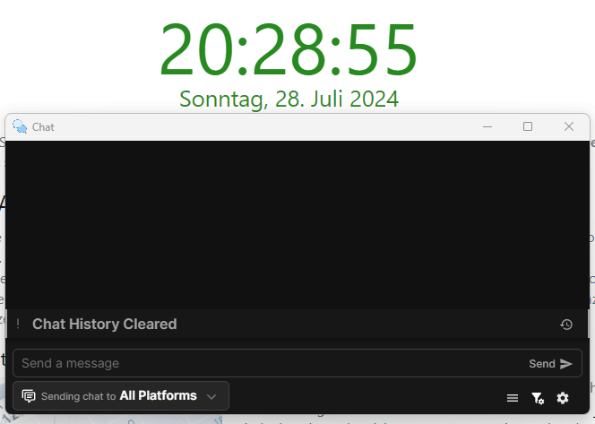
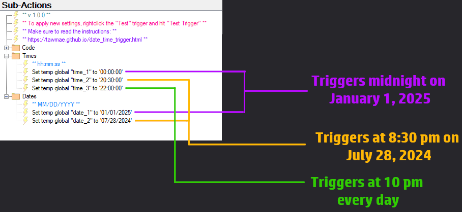
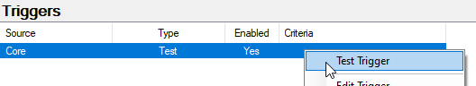
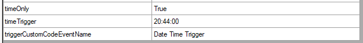
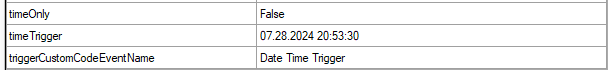

Twitch
{: .label .label-purple }

StreamerBot
{: .label .label-blue }


# Table of contents
{: .no_toc .text-delta }

1. TOC
{:toc}

---


## Description
Trigger actions at a specific time every day or at a specific time at a specific date. You can set up as many times as you want.



---

## Import Code
```scss
U0JBRR+LCAAAAAAABADtW1lz4ki2fp+I+x8I38dpuVK7VBH9YMCAsI2LTQKNOyaUi0BGC4MEGHf0f78nJcBglrLd5TvVE0NZLJmpzHO+s2eqfv+fv5VKFws2S4Mkvvhakn/JG4Jomswy+3VzFMRBNI9e2i/QpXQpX6x7WeZB2+/8B/yMvYjxIVUvY6VeEMHbLBiN2KwYDiO8eTZOZnxM5i0jj207Xui5EC/RJdp2UJaSWTDN1p1WnGazOeE/06+lcZZN069fvhSTXY6CbDzHl0HyhQIF/8yAgn9mBQWX4ywKd8lIOvP4iqynjedhyLv+KNiCu3fZ8orloOUfRUtp05V3B5QTppo+1kXFFyiivqDIVBEMomNBVRQq+6IumuKW2/y2f83ZnK3X3m1nsYdDxucERtlezxMJ55TVZknUCNIsma1gkO+F6d6ojRD+cSCF30qVhO4TMZol8+lZkRUIhEtvlQJixxaceTFNoi2WB/0kicl8NmNxdqx3LZ89dF8hvIMyVYjCVOQJhmdKgLKmCFglRNAlpkvUFBHW6S7lxRKrKUdER9rrnpNYv+CdbkT/227vHy8/ftsD6lBVjjGz8MJc9hc0KcVJVsqSORmX5nHI0rS0SualSZwsS8uxl+W/aHLAE0nCwo7+t1ZD8DoYUOAlq8ikhiEKJsAjKFjUBU/BkuDJiiJKiqeoVDy4dcmC0ZgLC+zwBJYiQubrrq0uvdayN0AdxJQ98RX3QP7lHIYbPT9Y6ZXHOOifMZ+BNhJ2IKa8u/L14cEBepJl+vBwF5BZkiZ+dtm67j081Gaw6DKZTTTl4WGhgKOSkSyaDw9RSpJZGOBLGoYX+1P+9np9vMpYDhGX/6A1xREZ9eXwmdbt7H6Jbl633U5oiqXmGNdDbTjoTLGk6NX2VCRSOHdX5R4btJDroLldH69cpzbxHDU+Pk9rgetP4VDmc6jPMG+II3vlOXcwX9KqxGVxGD1Nh6vyI67XnsmqXO1fj5sY2nDUh/60VQmuRlalvKROM4X7RjQyp26lDGNCdFOZbPr5fPB5VVzXrXa3onZdh06J3AnJpCXC5wLbHVibxu7ASqxJZ0zr/ZFdDzO3W+6TKIxdyV5ZwXJ0rg/olx0RjdjqKujUa4j3e44YWrXt3IHVQFOOR05LA7Uqo/X3OnjTur3CUS21Gi3EsQXeq0NHfXSdp7TAWu1jKQtx2FrQQfMR5vcBv2erivK1gbcxjloh4Ao0hgscdhaeZM/7kikSaAdMtliQhh2ADB+thrvwnPaoUw+fSd18druj6WYM29CZX8Va31bqmqZlctPbysDMZfZKHsPIXOBKucbq9iMddMLvyYQ6anmtDxXWDyc3Fevpvtd/ch9pNAzEaPjYRre9tnL3SLJhz5JbXaS4jrVsPQ7RfbUZtHpXwQtNxUWl8RSDvG4anRV1+tO9dRv7Y9dyiKzKOOf1dhI+t6XafCjZKegg8hxz3o/sJ+rYXIcnN+1dfK6OYLY7b5Pbw+z+SL8P8+zRVeB954EtfQNdAB2bu8/KyG10Cn3ayvsJdLhtgP6uuJ19C0bTY/NDH7IagKtjg210Qla5Mq3qtX5kzSmO2yPKdbtvZ6TRUdugO7ztW/dqeWzus/hWjsh659rQvaZtyPlqi2WL+wJ6vfYzNXdMHp+eaaPJ/cffbypNxDEYrKzRzaqcf+866sQdjFKr7o5xA/S8e/Xl26o8p2A3x2jekXN+v1O5Gn/rFuOPyfSkruxcG9ncTmoTdzvv5CTvxZy7MkmP6sbWTxxduxxyfk+tcVIXi3tzGjuOuKSNsIple07P0bDWDze4So7qxyMatbqTsxh9zw5O8rrrJ3euHvgsWn3RDaveQYXfBf2uqyFdHdhQ8to/bH1vpTwBH7vRJa7vTydtqc5jgF3DgzJiffDFvA109656ZO4GTTznKeS6RmI7fJfP2NC9KmhzuN0WvrLhDjoNXDeDofPkDAfWrg8IXI6BbQRWJR3l3/swR91WbivlCMaDjz+tl54zHN0U/A2tyjXHUcT15RG7fpOOTeh1Hi/nbacz2cx7VAa7trRD880qPUmrf8pW63ZKpP4pmzlvk0dke46Gtf5wX5LLaN+erv4OeiSe9Ck71zBuhkPnfbyeiBvXnI51fjLHMgFd3m1T76HtpO8fbv09yK7G/RPIrmg7dk+EZfDDhf1M1zYw8rpXhlUvsLtflaeA37viQq6Dud7YhU8NOytml8ckboWdwXg8lNvJxt86UkhBr+fugOJBt6xblabVrU4z3JtCzmil8Du5j8QMfC2ygrLJx3I/f7uLk91CDGyUrAAbSQ2hD/IrnhNxO8oxgJhYW0GehwoMJx+1h9x/FvhsfJW60ZWoGezJqU/isD0cNJ/B1ypDp4VuNvfY2XTQ5bmo2LqVOpNbOVTZYBIA3VXgDUFuyP1YhFdqE8cQP6NwjOPOtu+jvBf0nua98FnnbXvHXrhuzjf+GvQNct4m5MidnLbbdZ7dDIajngO5VwVyw/guuamrC7pSc9n3JBfGTka3L/du9IXH1W8uzMG6E6hFTAR+r+c6UHNEnWfIDwzu399il+fluXMVfrkHNJRJREVYH2Q6CopYac5xI5fPd/3v6yvPh8IW5EMgA9nOXO6P1jmQDXHPlWhIAq7n7YDJHZA1z50Knwt899axMfmortwMoJ7ZzLv2B/vzji1uX/dx65nXQG3ZTmnDXuX+OzLmMLcEsplCzYC2fd3QtIL3YkDH3qCd3PWulnffy6sO7t3UX80qlsBHD9wQ/NnZOg/4E98vpw2N/TfSmNdNZ2zpVN5XXC7XpbM6/J1Yt+OT/oNsrMizvpNj7PBf7V+PoEa2URv4o8Bbrhtxzt++TuzFAKjFxU1+Ngq61yMNO0gj8t3bbevD+vVfGzh331m7+E58KurPp4WLcv+VNCvN+tAJU9fhdbExIqADkFvyes/PMeslIyZ1Cp3gcXmA5ta1OPZgDJG5r4M6C/B1I3OFwcYg9j1Dfjql9TH47at4R29iq26urArd5ivNlXKwn3Ge/919mAO7GQAfkDBeL++qV6/2CQ7vI5HNdXRuFXX9Vo485/Tbv/56sJE5nTGSRNMgZEc21tdboaG36mbe7NjWez4i9Rasw9J5mPUS25sFfJP23Ni9UYd7q8Wus6LIGpZ9JvhM0QUFmb7gmbouqIyonuZLqm58aNfZ5K/P2HYW3763X+fLvfG0wld8ZhCmCYqOsKBgwxdMokqCoapENmSNaubhacU5HDZ73kdZLc5hTgnv+A77CVZJEobeNGX0OLdvY2xn7s3Xlx39wwM00VRFX/ex4GNFERRD0gVP0lXBYBhpGvzGKvq3H6B1WZYF8Sj9ix6iLda2ywf+/scJ42XcRBUsUE9FgkJMJmBRFMGCfUk0Jcljunb6iE36WY7Y/mOPh6rt6ct2v/Q0hjCWh1BIe6BNDaH/8Mih3lxgaTmCUj4cyjY6c+QApYM1cqWnxTCqpWR1avur6cCn6A7uEpePk/qvw1uEZb690kqg7Nybk2/9WfX1VnPj7q3HA3Gx9nJuRzVIq2rAl30/zLd/If2NO2Pg/Xlnq3pqNZ6M7ToV1SlKombq9tXxeotlDunlFEP6bUX51ocPJdLJUrtItew54WX5mhdOy83pNV62x1+lFDykV9phngbbUm0KKfXTkRRhBZiLJFKKtHDv6Gdq/nXSAR2JYAUqE1SiUggZEC0M5PkC9pGhGxLykGf8xOnA2VPo/7eTfMlQJEPEnqBB6BUUhiDayjoRqAofzKCqpkt/0ZP8LYaLy71nf45ApCAD/p2AyBQ9hHWCBeQjyCBEyRCwLhoC9X3MdFH2Ef3xEH0+PBCwIOfw1gHrgMhNTG+tA17+1NNhej3lD1ilWU7YcXNO5jOSs3u4wlo+CH3N/07gjwyiME0TBWR4KmRwhixgIoLGyoipokIlRN+X7m7wlw6yii38PNtKP9/MPyKDQ137ETKQ0Ff5jAyYRBUmiqrg+1QSFF/2BKz5nqCqSBV1UROJcnjrv1EG0ufKQP4cGUhn7YAylVAVm4KpSmAHGPy153tQDSNGmYZ0kWL1Z5KB/GkyyB/D/CRfJH6BPwlJh1AWUiBQODIP8afe+JuEZQiYEBKoJiqGauo+Ez+UdZyTAi8Afz5vlEvhc7wR0r9IBpeCcir3U33NVDwiSOCVoJrEmoARvBFDIb6ui9jUPvYA4idJ4R3+aAvCnTdhpXQ+Y5D9lWbMo6VszErB7pPKZ1IaA3K+Wu1USGXEl1SDCcT38mIc4AMQeSbtS7oqYpV9LKR+QkrzEeg++AD3e2GUPIXqWJPABStEUGTZF0wGWCrgHyTIoCVf//GPwX6+N97C2EtK3nQarkoxW5bS9R7VL6UZZ4CEAZnkGvlw0QPH8XBRWkNa8mJaGgfZumOzafVwSPl+jXIyAdd1oqkyVCaUiQCuJusC9kRFQKahIaZJIlb8nwXmj9R44/HXKPqaHvqWF3w4OifVUGQyYdSkAhMVsGbkeYKn6bKgq4Aakqikeod+9M/i82cyg48UcXd3X6rVL0N4fRQmXzUpYUQWVErAWkUo4UyfGILqibLqm4j5Kv7hMP2ZoPGmPfX3Hx8YmuoD32BEEmKCYvoYcNCQQDxKNR/eCX1fBvMDjg+Ut2tEwQQGIg2ozAVCZX5UABI1dUjDNNGUMPEUHyH9Q0wc1+u3caG+lwuPINmTNFkgmP/vHsMkggEVFmSUjFCiGZ4pkg9xcVzt3saF9ha1+95RzpuUbGfuzdf1epu1itOYYhd/00SSKAJG9huXDKcJmbCsy2aL9ZHFYWclDFic7XfybGD2ck4ABPzxf9zFbUXMNgAA
```

---


## Installation

1. Copy the import code from above and import the content

    

2. Restart StreamerBot or go into the `[Date Time Trigger] Code` action, rightclick the `Streamer.bot Started` trigger and click "Test Trigger".

3. Done! 🥳

{: .note }
You need to restart / test the trigger only after the import. It will automatically start the next time you open up StreamerBot :) 

---

## Settings

In the `[Date Time Trigger] Settings` action, you'll be able to set your times (and dates). You can have as many timers as you want. You can have it trigger on a certain time **each** day or at a certain time on a **specific** day.

Each `Global (Set)` subaction is one timer. So `time_1` set at `00:00:00` will trigger at midnight. Now if `time_1` has a corresponding `date_1`, it will only trigger at midnight at the date of `date_1`. If you delete `date_1`, it will trigger ad midnight of **every** day.

The format for times is the 24h format `hh:mm:ss` and dates is `MM/DD/YYYY`.

{: .new }
If `time_X` has a corresponding `date_X`, it will trigger at the specific date. If there's no correspondig `date_X`, `time_X` will trigger daily.



{: .highlight }
If you change times and/or dates, you need to rightclick the `Test` trigger and hit "Test Trigger"



---

## Custom Trigger

What you actually use to trigger other actions is the custom `Date Time Trigger` trigger.


This trigger triggers for **all** timers that you have set up. To narrow the trigger down to a specific one, you can use the variables that it populates

`%timeOnly%` is a bool that is either `True` or `False`. It indicates whether the trigger was set to a specific date (=`False`) or to every day (=`True`)

`%timeTrigger%` is the date and/or time of your timer. So if `%timeOnly%` was `True`, it will only show the time in the format `hh:mm:ss`. If `%timeOnly%` is `False`, it will show the entire datetime in the format `MM/DD/YYYY hh:mm:ss`.





---

## Changelog

| Date        | Changes          | Version |
|:-------------|:------------------|:------------------|
| June 28, 2024           | Release | 1.0.0 |
