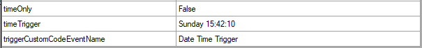
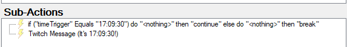
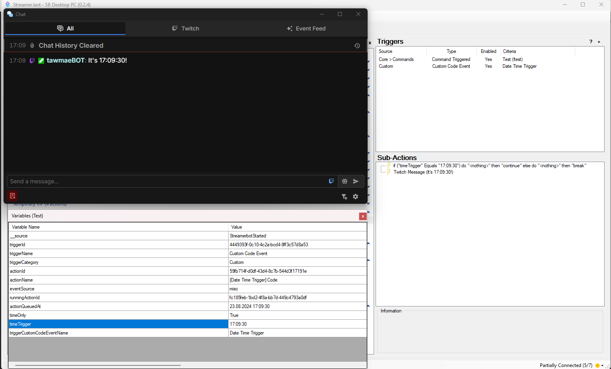

Twitch
{: .label .label-purple }

StreamerBot
{: .label .label-blue }


# Table of contents
{: .no_toc .text-delta }

1. TOC
{:toc}

---


## <span class="iconify" data-icon="material-symbols:description-outline-sharp" data-inline="false"></span> Description
Trigger actions at a specific time every day or at a specific time at a specific date. You can set up as many times as you want.


---

## <span class="iconify" data-icon="material-symbols:content-copy-outline-sharp" data-inline="false"></span> Import Code
```
U0JBRR+LCAAAAAAABADtPNly4kqW7xMx/0DUPHbLpRVJFTEPBhshNptNgNo3OpSZ2kBCNGK/cf99TkqA2YSNXb5bTFVQLpSpzLNvedK//vd/5XLfQntmffuR+5V+ga9jK7Th67cHa2bnOn4I/0x917Wn3/65nWHNZ140pXNm1jK07P3Awp7GfjSmI9wdd8fvB4gd46k/mW0H9XE8m84x/Rr/yHmz2ST+8f17utid68+8Obrzo+8EIPj3DCD49yyF4M6bhcEhGFFrPr7H22XH8yDYjYX+2A/nobEHiA7Ssd+SGd9g6UOcrRQWePKv9EluN5QM+4RCLakOkjnRYQhLHEYUiMgoWEaMJIpEcDiZU7k9KZLX/jO35/YxYMlze2yhwKZrAhXso5EVDubELk2jsOzHs2i6hkmOFcRHs3Yc+tcZi37J8TkmV4zIMSDuNJpPrvI0pUKwtNYxkPTSplNrTKJwT+yzcRyN8Xw6tcezS6NbBh5R+ITKh5Tm87wjKBwjKDZmROzwjMUKDsMqSFIlJKC8kz+EPN1iPaFUkdn86UgmvV9pHu/Y/8vh6G+vX345ItS5uFxCZmEFCf+/kSg3jma5WTTHXm4+Duw4zq2jeW40jpa5pWfNkm8kOsMJR0GqaP9TKrHw52xCSi9BYlWiAL1UmSeMiDiZsUQERBNEkeNFS5QId/bq0vZdjzKLvWMzaMmxrHo6tJelUyl7B6n9MbFXdMcjIv/zGg3ftEb7mSc25mx8ajs2iCe2z/iWDBd/vLz0AMBoGb+81H08jeLImd01HjsvL6UpQLGMpqO8+PKyEO/YO4EVOPXlJYxxNA18dEeC4Nvxkr+c7o/WMzuhGRWIfmOCQux2hWBDNGP2tGSrp89qIxIjvuIhLcgP+q0J4kX5oTnhMB/MzXWhY/cbrNlj54bmrc1eaWT1pPHFdYJWhEPDMzX6ntQd9BtTvIkbxbGxoe/opYaEhVaA2tID4lex2WuwVk+d47VUNntSgMNgSNeFvZekV4mtXt0d8CsPC3W3yRX0dk+CZ1IA4wBf5OrFexeXDR/gHurlBgvvU3hHpGQGeNygeLjP7Xu/3hZXtaHu07XpOzrAB/CuUViK6XsU58G68DDoSUOzt4pTGkhdxM8CFDQWpF8Zmu2CMxBaG/2BdVFoCPpjw0NhI0DayiNasEBBa2HxxrzLqxyG59Xi6ADGyoSEJRbWADqVWIpXSid1jsojF2j/H0oLvaQGtmYMSbp/HfGN6X4/TfWtEMaK91G1AzT1AY9iYQk48wBvcICHj3g1hrUmmKtwKJQSHj23C+Ggt9qYl97VKgvEL90+3wJcjBIeVxY4aERIIHO6vwl0wnz3Ej67vQAnLmj1K2skVDqWpgrIv1d1zfRQuRHs6V4ucINwRWHkER+M9MdgbvWbUbW5G9/Bln4oz2tBJTD5RL7WTcGAn+rMgP1NngTYd/2WlsDRpfvrpdba6pGx2df9WvH+ylhhbvYJ6rcLsl6sPCY0KAHNe133dW3dddqvPHSaVC5PZc5cWL2m29KCDdbUjdl2J7s59g7n5FOIE14WPcfse8FAMBK572jq0FqPjnA+fi/99HmQ7bW0lc/lAf8PPo+NZrtIZYZUUGguqsWm32MpPwEnLZhROgC/xyZvrPXyYG7zLdYIjTXo+AKNOaI/tiZYKCxSnRf90z2cPY/YRtHd83Nt9c1kD9B1CYV12Ku0sdaFWqs76w96AQt6sJO3PS1THVwtBnzsVi/I/F4eihfeS59NTP8+6oNcdMfGHCV6PzqnSfkCndL3H7qPLqX/GGxKiNbuSA9mGXJQ4Gvj2YFNkVSQm6y5IO+VYNBrSXp5r3tzsHtTq19YJjZQK82R0IpADl0qC2RrA2u+Pnm6wPsUj0pAymCvhhfwOeTHkcwc0gZ0sdxak173mJZn7xZYPH5bHhO9HK0WJgtrh0pUKVZQhq65xJdks9zqmf3KhuLpGKybNRd8g4fHrcAsnstfCi+JrN4q0Iuut9WJCmZP7XAlwH0joH7GLN4kEx7hSxNSLDRBhx4srTTDRfcKT1pru5k1lrVH+hn0iQd2b6sr0iP4HM9uu6v6w/0SbFPiZ2pbf1JNfKUUAo3ArxiFFEYvteUH9un042TBpjWATo0IbFHin5t8aT7gDfDFrZKtNQJcTvz/JGvdS/LwE/UqgUnXIEbQShKFNeWtMbquH+xlvbhkv1I4hwDT0AJf2up7Q7NfSHRQ1wzxHbbnsziW7IfItXlDrI04kNOGBzZZ1f3RuW4ewG+CHgPPY/tt+N7ta97QB8fqN9qkJ80Tu3UhDjiYq8Kzr/BJGXMbLBIKS7PXnGfT7RCmw1intLHBjwKvPAz+pwt8bPKeh/r3mXGI1RtQPzUk5fq83W+cxolts1/izCRGbh7rzSXafpome3uX+pZT/FN+rM1+C+yF+Ja9rwOP2edd7LwRXbDVqV0Gfu/sVJs1asba9QmFz1DObHMH4h/ysNoQkHuA6R+gv2xq42kMWBJoHKA/zkptDkd6mMSYzhncCa+NdG9NWhDqsw6e1UbwbHPKF4kFG7Eg9CeVzy3stVH67NheFEIk6G6Vxv4QP9D59YfYtdr3ym6Np3VhUl3Hb/NQC0KqX4mdHgWbnQ1FSWyvzruhsSI9Gqsao2qmHa7QXGp6yaYl8naIewC+xiiAb2xAjO15A6EZ7XDt8QE5iWf19sNkhjqTDV7rMXyPnkJuBv6K1f2CSucSkF34mdisROaMBmuDXwV/+gTyHMAY5DzN1E8bqU2DvGUNMsmmMjq64B8u2aIDfLSR+1yE3CzV6XkT8iQ0bn7Uz+xkzTUpjN1gDjH5TgYSvChdMv1FukYSQ7Z6Egf5aBePg+YAYhSz7Y3o+2Dbl0CDeBs3xZB/cSShWfBsBiQwe/GeJkAnqcObfbNnTKvtCzb23Xgd0ovqgHS033OHvbinXhyE+iMHdHXnzV5lUy16EGPiecKrrhrSuXqRPeGhlMgPrAF7jCY03oDxuMsbQ5CBEV4Dv6iOvIHPdR9yRvNPxwc72wi2FvyRCjaSzqHvGsgyOLA34Mfh2SsPW+rV2OH0k9rnDtjPAg4JB+uCvdjavm6Sr9P88c346/ST5rKNgDwCDwRjZoK9qRYrSd58kHOCvjZ9m6e2bjIytdbIAZ0+4ltn8qrfAns5Tr5M+118m8RYtVEaY1UfHpcQd9IcPvFvhqZOzZ44oTYU/NMEYF2b3dSGV7f5/A17Jvze4wdrmppRImFK0yv5OeQhxi37ZOHGfQlul+LNg09m7J3CGtB9tj7k1QYf2qCuIQ4gL6xqiQ+ooHEBbM/S1Udco8a3RjUhkOx+IocPYMtZ0q8EqT5JMNf0QEc8NG7txz5q61P+XLL1N+p+imtik3ZxwXO7wAKuwO/UXgPPkhio4g/cTg/8aFEqDMb1aGsHD22VW3t9d+cfqf4/m7CG3R5RPrOgnx2zR/nc2lTBxz+371eZvvhG+3xgJz4ex+3lvQJ5ahqbJHMSHs0m/T7r0vqlzR/IQJnNiPdutzkdXortNtibD+o0+Am2CTwgsBb48UgfJzx4xdlfupViRT6Spc6k0WmrI7OogvwG0v/btr+nbfs59oLWeM7r0X8qHX6EXAJyYloDNlN+gx5XZoN+M38egxSSunhaAwSbBjhavUZas/Iz6l1X9c9bEK61AJlgOyGtv5uTAZ/mH9XsmnYSX6R1ej2vlwKw/foOdvkwlgbdHCHe2CSwFgvRoG+Cz3p09/hC7IXATgNeTaQZkEt33QHvBbSmO+hB3tgT59QG6CMPZILWvIAmmseScmHz5Cs01hTg/aAWkgnRPG7gSxO0VkeQjw6BhqPk3fB1vskHrFU2/FoI8t0G+94ns0Gvm7WOjzTVr/EchYPSaAO+YgPfA1MLvBq/gvWUOdak8bNQ8ciGS3TyFtuadVYCeQlnfqWeZb53XffeyKeSXOiP8bvZeeOpzP/cvCF9D1E/2IlOfe87/exVX/iMwpVE5TiRiXflCu/3rae5HOJ255+u335086jH5rFQf3eMWH0ffL+vn03t8x7vJg+xQ9fgt3FMto1Lc/Z35XxZtfhG5+fV4t/QWzWjnvpO/X6j7lIsOWnuCn4L5D7xG39cfT+RPaQFo53+7fzIk1+QD2taTlt0U1iTM316ZjYxw2C47U94Wz+3eTz1uSCPHhZaTydrRPoow9ensWtq24eR2+upHOCTxM3n9YbWwuzXXQQ+GPybR0Lwg+0CDzIxSeP6JB6Y66VCbPZKICeFoaUZQ2td8EyQH+r76Vl1WzNiTPXrIXKtcovF5Xq+tt77ufmr/wsWkANOMN9Y4LCZvHswf2z1WxHp6fMBr85qAuAHPtBsZ61TiRGvL4D+AAelEeQK5Tp8N0ZW73EBPnQM9mKJQvwdhyXhuZ/o1ZuxSl9I6HOjb3yHHtxW21dO69LPfnouXX3tFYF3jdDqZ57bn9XHIf5ZY1qb1qSArM/Gz87m0xo1jGmGmNScL44bM1xuSduaKO1ZWZ7UrgVLC2LIm6OtL3nzjPbDZxaHtnFMz7LjS+cL+/orjQdBJmh/SWIbWjTXg/hqAM8NoNUhbWg+iMuQ74aB6PRn8H4rsMvsG/W0NDbR+zue0TNfiUPa6hmPUrpVy9SnGMHF2mv2+RZPay21UQnyUY/q61UfDXwamX13Wt1knMGfnREY9KzsFngC1C+wdjc9i6iuL9H9gLenMjNk3cYbtdor/Lx8frc7u0n1ad4CnCAOjOqdz/n6w16alCbb/gY/5clrv9BRr8mudyjtOXo0RIgzObDfmed2KDnzpH0iu7mQa42SvpN3n/EcnoFeimMz/eWnc8tSnPSIlUcu3vdxUJ84m+ByIdG91vZ812xfyx/3Z4EfPb+l+BcGQmI3inY3GFWL+uqp012ZQxIOfC4cDJtsrdMU60M8G3R0odFmgd76sjEcsE8PFR9iqcvwlRRqNw57ha6dZV70H0d9SWP2f8+aMSdTG0fhxA/sC93C23bOwFq3Z9b0Uj9xMiO2FnbLjufBrBMZ1tSnnafX5h7NOu8PTVtpRVHII8GxGccWZUZkVYexVFlmJBtLVt7hJVn5UCutSv98RS8t9/6GZY1u984WbEd0bAXbeUaUWcSISHEYFUs8o0gSFhQhT/IquYkOu0bei6imzeVZzLvcNpyBKo6CwJrENrmM7fsQO1h799/XNuXzmwGcKnGO7CDGQaLIiAovMxYvS4xiIzafh+9IYv/wmwFcjsm17dnMH7vxX/R2wGKrv3Tir79lKLBN1VREDLEklhGxajOI4zjQYofnVJ63bPnK3QH+z3J3YMfJv12b+4fayLet0K+uNTM1gFBFd81tqJukBKm7LIO7KtPyI4SUPQhneklo2a9HW/c7OW9LoWFZ0pJ3tCZNG3Rt25pfrr83ZBmney/nNPy2eiXAy3gabNti0LjlAe6b3TFQf61P9PJK2e9TlCjMkwHQzexKHqTotFVjTjRIEcf1w/adzLQhPXYy5vgkFahm75F5DHUWKqY0NtCYHmtt1yuZHm0FT8rXRtqKDino7njNoeUKCLNGfS4pOWSnG59ZOw3t3lo7DXNouew01HkNgZNS9FEI/JcKa2SWA02WbEbCEgHXB15PYS2HQQ6ryArPWqyl/InDmqtXhH63a1a8IvIKhywmDyEEI9osRA2CjBkiwQ9bIVJe5v+i16z2NFzcHd3cvEAikVXgbwaJVM5ikYwRwzosREIcrzBI5hSGOA6yZU5wWPLzSfT15AGnC3GTtXW6Z0Du4pLG1mknd1bP04QJvY0azxLALqtzNJ/iBN3zHbb84eQfAvsjU0RZBYt2Ps8xrGJJEIkqAoMwBxIrsLbEiYRnyW1h+47+/FlktCc/jRjj31HN69bIzsXzqQ2anpvaFsnNPDvnH94pviK+Cuh3qZRFPhtDiqfYDHasJHjMM0gEaQar6UBAzyHJ/hj5vkB8+Q+Q7oNXrW8lI2+JREZ5ngEjgBlRECDHsoGWogXqD9aSd+Sffx/1g2QUPkDGTpSzJpNgnRvby1y8zan+mZtSBHDg41EikS/fOmA2Xr7ltiTNQY6U8/zZdmCXZL2cQ37sjzKNrSzjvCSAFyI2B8TNCzKDLE5kWFXJs3ae55Do/FnI/BFF97wfYfgjPrctr/Sh1MkUQ84WsE1UwticCNrMWhZj5WWBkSWgGssTXrLEn06fz1jDjzjsev37w8P3AfzZjUXTg4kP1jr35OQ6II892x59lJSOpBJsY4GRCAaN5sClqw5WGMniBMlRWduR0E8nJa1H/A6k/Num2uc3yiHV1FbBtmq8qY1IgEID0qa6nFSax/tq/hBppQ1e09Mjr4JCequlC+Ovt5R3KTxO0i7aPXVQKae3jIv6qjZ8nNd9/TPp/NWbMOmN79UEC01lB8ezf3o7sDChJzHpafsbJ37l9IT08MRneyPlaC7hvQnSum5129HwZgng9WQzSVV7xayyhH6Ix/5mj16Mj+A/SGfd543iorERo4fM0sNuT++5nd4yuenERGvtulkKptaMUpiu3MD8dAcuPe0GPoRkQ29HpN0/qnyIv9OmJy0B4FWiJ6W0qy/FsXytOzWlffvrTwzTW/c9bknKwQMSaOdpfPFG0SmPjt+5/8dz+557o0vLp6dR1jtwOS/ZnOrN/hYQPf2Zm318doPs7CQovbW166ikdKWn5KtL+pd2Mf78E/UD+0NLYAOqr+lNaHJcLhoe4lFJYO6vdbe6PoL/eud1yqtk/mf0Ke1CTvUpLWH9fvqU3ihQ912lGfqU4nhdnw7p9pX6lOxzoz5deOeL9elvUypkFY7YEp+HUM8SGFEWOQbl8wKTJyJRWCLIlnNekPp0qbAeQT7/N6sXcgQRYlt5BstATlEFIloOERmVF0WB2CKx5Q9R8mrQ/FlCfnFV7Lz69zOqYjwtiWVXxWQZMmSsIMbBeYURFcIyKkdURpUdRSYSkhGL/0xVsRtKOx/hgfA1lUn+hyhl80BElpC3EWIEgSbjDmszlq1KSUbu8Fh28kj+M/HghrrQjTxIam1fUx3uePNpTKx1lkFSJAkhwWJkKU9/r56gMMiRRSbP25wkOIhzhHPZ+CQPPpPE32DUP8KDr7FFHP+dF7/zLH9eW9qdxTkKQipYI9UCa0QrdirHCbQDBTgAPCL4Y2W7L+LCsTV6/fLJDiMlLzkOVmQG8WALRNVBjOrkWQZbhOQd+BeT244kf0KHkfh+gUuRQACkonIWg4lAu4kwpr+DUWHynMojbIGZY2+zajskLpuu92Eh3YqFhVnB4iE8wYj+ZlNFxYziOIRRBBsTcJmWyt3mHw9/a+NHscjfigVhFUcVLdAmiwcsuDyIloQFRuAVcP6cRFD+Y7zIDqneh4n8HgV6q2/tdnV5H0EOwNn9dwviDry0Wy3tcNo9gtQlBNyPHy5tFEd4ZM/a9nSxbec6HywGvj2eHQ/SsGT62kO1/SW9r79OmEt5881eTaIpmGfaBpfkKnf83dbMnv/K33SUQfbMussDnr/9H5/vPODvWAAA
```

---


## <span class="iconify" data-icon="tabler:tool" data-inline="false"></span> Installation

1. Copy the import code from above and import the content

    

2. Restart StreamerBot or go into the `[Date Time Trigger] 2 - Code` action, rightclick the `Streamer.bot Started` trigger and click "Test Trigger".

3. Done! 🥳

{: .note }
You need to restart / test the trigger only after the import. It will automatically start the next time you open up StreamerBot :) 

---

## <span class="iconify" data-icon="material-symbols:settings-alert-rounded" data-inline="false"></span> Settings

In the `[Date Time Trigger] 1 - Settings` action, you'll be able to set your times (and dates). You can have as many timers as you want. You can have it trigger on a certain time **each** day or at a certain time on a **specific** day. This day can be a date like the 8th May of 2024 (`05/08/2024`) or a specific day of the week (`Sunday`).

Each `Global (Set)` subaction is one timer. So `time_1` set at `00:00:00` will trigger at midnight. Now if `time_1` has a corresponding `date_1`, it will only trigger at midnight at the date of `date_1`. If you delete `date_1`, it will trigger at midnight of **every** day.

The format for times is the 24h format `hh:mm:ss` and dates is `MM/DD/YYYY` or the day of the week `Wednesday`.

{: .new }
If `time_X` has a corresponding `date_X`, it will trigger at the specific date. If there's no correspondig `date_X`, `time_X` will trigger daily.


{: .highlight }
If you change times and/or dates, you need to rightclick the `Test` trigger and hit "Test Trigger"


---

## <span class="iconify" data-icon="material-symbols:notifications-unread-outline" data-inline="false"></span> Custom Trigger

What you actually use to trigger other actions is the custom `Date Time Trigger` trigger.


This trigger triggers for **all** timers that you have set up. To narrow the trigger down to a specific one, you can use the variables that it populates in an **if/else subaction** (`Core -> Logic -> If/Else).

`%timeOnly%` is a bool that is either `True` or `False`. It indicates whether the trigger was set to a specific date (=`False`) or to every day (=`True`)

`%timeTrigger%` is the date and/or time of your timer. So if `%timeOnly%` was `True`, it will only show the time in the format `hh:mm:ss`. If `%timeOnly%` is `False`, it will show the entire datetime in the format `MM/DD/YYYY hh:mm:ss` or `dddd hh:mm:ss` in case it was triggered on a specific day of the week.





### <span class="iconify" data-icon="material-symbols:family-star-outline" data-inline="false"></span> Example


*(rightclick -> Copy Image URL to make it the image bigger)*

---

## <span class="iconify" data-icon="material-symbols:published-with-changes" data-inline="false"></span> Changelog

| Date        | Changes          | Version |
|:-------------|:------------------|:------------------|
| November 14, 2024           | Code optimization | 1.1.2 |
| August 11, 2024           | Added debugging | 1.1.1 |
| August 04, 2024           | `date_1` ... `date_x` can now be a weekday (Monday to Sunday) to always trigger on a specific day of the week | 1.1.0 |
| June 28, 2024           | Release | 1.0.0 |
