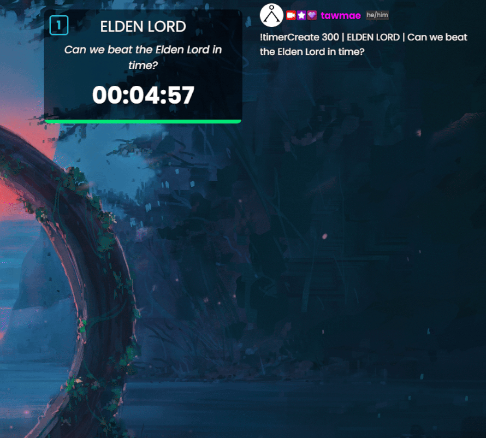
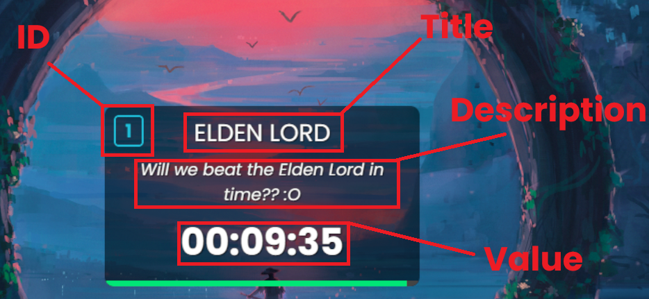
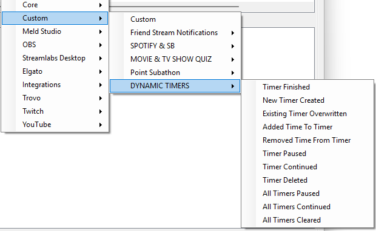
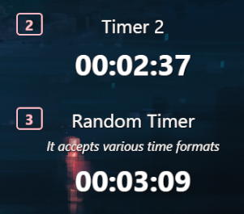

Twitch
{: .label .label-purple }

OBS
{: .label .label-yellow }

StreamerBot
{: .label .label-blue }


# Table of contents
{: .no_toc .text-delta }

1. TOC
{:toc}

---

## <span class="iconify" data-icon="material-symbols:description-outline-sharp" data-inline="false"></span> **Description**
Add as many timers as you want to your OBS overlay. With their own title, description and with custom triggers.



---

## <span class="iconify" data-icon="material-symbols:content-copy-outline-sharp" data-inline="false"></span> **Import Code**
```
U0JBRR+LCAAAAAAABADtfWlz4siW9veJmP/A7fnQMxGtupnasyPmQ4ENBttUGwwYbnW8kZtARiyXxTa+c//7ezIldgljV7nKVe2Kpg1aUplnec6SJ1P/+s//yOV+GcgZ/eX33L/UD/g5pAMJP385aVc/XpYLuevy5Wmt/stvyWk6n/VGE3XBjN4PqFyduJOTaTgaqjP4A/qAVieEnPJJOJ4lJ3uz2Xj6+9//Ht/+oRvOenP2IRz9XSzg0SH/f7NwAE196M0G0eZTR7X58CNPWhnOo2h5bhAOw8F80Fw9X51U5/6tr/hF0K3xUd3GFI78Iz6SW57Sp0OhOokIRUggx2CWsAybU98gjscNynwvcJHANhbLzunb/jmXc002J8AisF1scGFjw5bcMqgnqYEDmwrXkQQJvnWnHFIWSfXU2WQut8488GguZHEyGpyF09losjh80R9yKMJhFy4KaDTdumrJ1H9sc/XPHM4ZucJE0pnMXSu6b3WtOxnNx9myEJMzuqeLKfAmpW8TOhSjwYppe73ioyGfTyZyOEs7O5uE3S4wdZNTO9xKWhkM4EHlmHGuhSjyAoOZgQfkF47hB65veDQwRYA86ki02f8NnjtMWtINXMP1CTPswKQG8zzbwD61XI97zPbY3q2zxVgR1kZ490wmX9dsmy4F8c/Ns//+7dBo7+gkVA2r+/717/SR2BQFOLCE4VDuG7YlTIMhRA0PC5f5FAmf+Vkj8ZD59Uay/vHnlszsq2DaUOWD5POZLIyEjJnrOcKxLcoNIXzFXGoZxAQOSRu4xQML+0jujQvgrTfSt8dyvifm+qrJfPhp2Aive3CNSJFGfdGU3smanM6j2fWomfDh0LVbV/2SIXbYxL4pMTYEdk3DdnyAGmkSgwbIJDYlDiHB3q33Muz2lNYA0GYwksA/f/fcSqMVUfdaPczocCjkA5zDzxfWagI/Gtr1j93G72gU42d7NJ/EUAT/n0X7VypTcB0PMbWXmqiWK7jjMNPwkEdAUkBcSBBwg1BJKKc28Sl9CVGxaWWStLnSzJfRFX0hXU827Gwmea974TQH/9HcTE5nOXHgnqMIbftEuBbjBjJtAE3JpEGxhw3PIa7FHc8k3j7UfGdCf6kANzUxs0jsor0xHUVJRJAdeBYyfClBZDH3DEo5M7hpEmaaUgDIvTVKms+hZCKBYpQbjmY5KcJZjg4Xsx64LLn5EDoxzS1G81x/OLrP3ffoTP+iE5kTI+XV7PaBj6LYD/2vYhHBvwx4pdKX1AeJZFJyw0bSNijxBIiq6ZrCdLDp7t96DFkRIq+Brs9CgYSk5UDTaj6VoNeJO5SbjXI8duxA15XY/pYbR5LCNeq6WU/mglEUje4V+WdyMI7g0t8PUNkHGheLGVS2LEKklB74TihQbhcYsYAxcJ8dz3ak7XnyZTBwiMrfkMK5nX9/42tfIvcP9SenUeHP3P/FPxPrtfF7A57/fEKY/SxhJr7HZOAyg1g2iDC1iEEQdw1k2SDnNudw8q2Q+Vkou7ROQKnfYsrllAxv0EwjwVSO5QToLnJsAWI9DsdwbDFgoyj3fy8VXZdZEjk+N7BtScP2IejzfQLupeOywGGc+ZZ4KzS1XkDTX9fS+WuO02GOKUQYzgcMhPK//3cqIQoT0//5LcfmAMjRdJTgxXRGB+Ncr/f7YPA7QPNoklt9kXdymJuOlGet0CMK+zL3qwNx+K8vZoJPbIIhYpEWA9JT7BvMB+NnCu5iInwHE/JWmGB/bfywEAKYuFb+WHwAfig3TaO2ctZu53AqAMIrn01RfDyfjEfTFLN9JI64LqEBg0hDsAAZNpOOwVzTNiBicG2H+9z29u3XdyL3S3yMItAKfIvcCMwcUC1OJIDNA+lPzOP07xN5Tydi+tvKHK4ia9AQsIsvtoUQYSAb+eBxeIDUtqCmQSWG0I47zHGI5RH8Zmyh+yKQzoLnkf5Kow+5xlS7FUDVKXjOIMnqlvswinKjOzm5n4SzmOaxiN+Hs976YpWr+vBS4vMAMY/jANw9G7xoHxwRihk1TOoih3JAesTfCvGd43MlJfWoJxMmMQl8jIMAggnDoZYDHi+VBgsIeApMIpMgikznefK3TB6merVxji8rC7Icqn+8nCVZEUY9R8rA8LkJSgTsM6gvfQO8edMl4P5w03vRILJDnuNG4h3DNBDWiI6nUqTz7TgWbbS9/Lqm3H7K2pUe92xMDO4L8A1NYhmUmdRAQC4b7GiAvS0T+sOmrP9L5axrEro/nW1x8Q3lq1+S7swccNpY9R07Myv7Ei0DCb3lcu/Z+nTh98+fWyDXo/vp58+XIZ+MpqNg9qF6ev35c3ECvbkfTfqu/fnznf0BfbCQhcnnz4MpH02ikH0QUbT7wJe2WV9MIQLNaPHD589VeT8DAqqGKtPR8BUeXRhN5Cs0W5WzD2ez2Th7aOsGr0ejqB/OPjTuxx+qo1kYhJxqudE3b9/75y6n2SLOk+sEy011zAa827CiR1Fqzj7do/PdYxf9hzEbnnonV2PMzWjeWeSv5U0VdVpofmWSKSs1b0UpumPDy3nNbM47N5Vx+3FaLQybj7TlDMvFqsOtWsTqzqfOzdW8flZD/CT1fIOeVaJ2q6aeP2+Wio/Uutx8LtwvEDOdR2Z20EV/DH/tp87Pr0vRnF+nPu+UtopDNiAwzuiWp/e5cp09ls1nV2mrumBW9a4zvIK+kztWmo1FwWkK6+P8egBI3eqM22YR/pK5flYXnfOzZsjg2eVSddq+qT6WT6tX9dNoDsfmnSt0LoEf5cLHbvksj9uDh3F7kX8UZxXNn85ND3jgPKr2rgfFWaf+kZQLldNWw8lfN6KTcrFWuW40641FGfo56qp2Vs87qyI+0P2O5BmMZwg8N50W8E63Vz5B3fLt6fyyYN+Xb6GvIfShkL8XrcqUti677QGMr5AvSsX7m1p0Xugvr1k9K+53JRJnzQUL84gPm9Gn1XiQHv/O2EIG8gQ0WHRaRdRpghy0mgtou3ux8LtXuFK8ataKy/ZXtNGf/FnnppbnA/F4ZYEMxX3a7kspGpQLPZBl4M9ZxWmUigtuNkbA+xmM+1O7haOLQv5O3Fx1gdeoXFQ8wxHvOz3WaozPrzafF38279U0i+I+lwvl7vkiH2ye/7Td3/Nrs/LPTquKymfxPbVSEbUVD0tOJBbr89v0XPLi4+Fj8SdMnl/v3BRxB3S2HN5nXrukW7m7P86gnnLf0889BZ70aOvhMfu5ecAL3q33SUgHIEsf95/9xLNSZCHjM4zpHOtKebpF19RPfpP/B5+fSp8X9q9Waj62rcqYK7kw7fAiiyb7cgj0rt6CXt9rPE7h48bYyOF2d/Q4/bPkc6vdesDPomlUjdommXfOLg/TNUXnYnlAKfK4fSy43paZhrJNxUrEb5oRt66Wen8KMt+7iGp3Dau2UBgPuDHe0dUFyDHmA7sL2Is7q3bzBMabhY1X7Zvm4y6GNU6LzQZqpGPlqYjEaXHRsS5H5zt9X+nHSiZrPVE67f5RP6Q/aTw8wNdE/hqD5oNoNR9F4QA/o3wP/ISfHivqravn6F+lc1invqbOxTYnG8836LGBe1n6VFjJ89F6uH0sT3Z05hp8k/5alnqbcqv8o+vEjxmd1/tfw2cA/xPGCdc3NX3K0O7Hu4tF/uQaOY16w2nWlv3dkQ/wWdHVTWXIF91dvX97NhowE66fi1YjTNHtVPnKlvfKkieRKBXH7OwyW9YPjfdo3XqWfFc6h/Bn3WYyhqh/8NozdLitJzBjm17aH3gOLmhdfaJ/WZiXopM7x87QNl2L1YgNait5Ot+SXafB8NL374537QwfNJG4qcxB3hcgY6t2la7vxRClyh0z77tXrVpf61y9Oy4X/LvyafG0VsiDzuEnffXL8AfQudX4ymk+R4pcPW1jwcdD7VY05YtsGWeDplU+Hf/RHoyjtnWVJR+HdepZch31n2NPwDZ+M5/4rfvszUFxKp6HCWAfwWYNao8/Ky6A7Z8xqxNtYUOxUrxukFat/vPgw/Y43zEibvMdI3b7944R+xgBMj4FXd/12U9rjYdi8/QniJPBt2agx++4sGzzJ8GFHz0v1ShOWTGmj4p7Y9uczzeb1SL475fXH3/8WLlRKmJuNvOsdJ8aK78lHFzH9aq/Dw0th8PL/RxGPZ+/Pr3/CXBxna+5aj1MU/OIbyu/NO20igvV19hWVR5X81LooXjVLHevGg+XT/mze3NSa4zubuq9mks6hOFp+PdknidaYcwBH6RyAvaqx8NUe/VdcQz0zdTzU2edO9q6WmMRSuYLIcbIoP+4E34clRvVq3rBafBhlPCDj8rDSk+gaA76qLCkyyz4u54bXbRvRIUN81hAn5/ErdO09jfyyMnc4jq/1U/Tr5PGaVfPTy7Hd76bd9puR+eWdvX9qf7szTFtt7k9jxQ+s59Rp8fOmlEKPbfOp/a5mL/jVq3B0MMdYGu/3F9iWvUEcBV0u9GN/ejm46cQ+Hoy6kprSeMa0XaspOnkls9mG3RrJudqETerC7jXSx3rEGmdFrGvvm4j6XNQL+/IbvyhrXb3XOF3TG+wsZXHTr23de/W3PLZav4rdV45U5cTOwS6dstMp88XYF/XbaXxKS0GiBjck8yHb/cxxuUe9BGwquyWwx25f8IG8ETHWxjFstTM9/iw9qjwbHuu0LnmpYexKHSHn0KeSlP92eijmq8XZ5fz6xLgjFUbQZukfFJO6d8T9Ir5tMWjuO0quywi8IVG3ertRzV/r2sFtuoEkvG0HosiVX4z6Jve98tX6fvlY/v+svBxcvDa5rHjrKSPM83PhVgO7o914Wwr5p3XwFZzLMai1AUMugzBJj/D79ubM1Z+y36f17LVAH2eqWeeF8RjZbFrb9L8i/jTaT0ArWJ7sdNmUcXhTTNCtNANWSuaP1c3dmN6pRMKCy4iRetqtEuzpvJfGiAvoCOszqflghhXFvfdimkPgX7d8/CjeXnylXkz6H5L3owUb1Yy+7yxPKePV8yqIvAJL5nJR5VCBWw64F0JYlZNi0a3MyALBj7Ehl2I+3uDwmPkf8dX1fr/pL9whK3jg6JVbzn3YDeULVr7I2dZ/UpsLZ4J8GFX2LvRzrxh5af05mpUse6HB9vYsdcNaEO3tcabWEbru7HglryvaqP4Hgba3cv6x78v+6kwFfxEsB9IxT0u2HEMsVuaTVvNWypbTm/yaFmzlvqMcPMZlWOfoTEg1s/aQjbTdLRZb9+AXpYI+Ida5rt8hdVfjg2rth6/VMd1P+dxjFmEfl6Oyrej5+p5Unco2E09v2nTlL7vyclFVL0H/ULnBe6CjmeOe6Ovyk4hvnAuIa4bAhZ1/7hGwLuUPj4fU+O28fT+ZombR9jHbJ9kj87pfV+8St8fwWbflwvTQ9c+HD3OKH2cz7KNTYihFtv2kS/KX+7XpvR7W8aUHmN4rsKyy+FenB/L7bP8X91uH7DjrHpDb2ojiGlmtGW/rk2M6bdpF2exne8PLwofhwz8Y8Cqf5ZP2vevwSta+Ma8MrtL/0XL8rPG9Jx+7tlX6CPgocodaJrU8wNmVWZtHZPZz7e1Ma91HKxzH6cwZqva6wB/wce40nkUwAldJ1c67WY9W/ke4Nt5e3yy0PAizBeVHHZuyt12PT8XLRyq7yrW3IwhIbbsJXx5BIyf8QLYrlLXZS3kcusS4vByN/k+Bnu1UP2Be/vQD+jTLCoX+EL5tJVFeny7m4tLz2lWxjBGBG2azATfap2PXGTWh2sd7PaucL6s7WwjuWcBGLLmxyo/sYwvy2frvM2ubqbJQ1r7m3VGiQ1fzWU8N5+ynGPYbieuG0+j54H+7ORedtvc9nme28/VHOQePbfOp/a5USKPoli7uy6R4XnhKlzl3x7L7zmZ95zMe07mPSfznpN5z8kc28cfLCdzudj0OVSf1v4J2Lj0OZLNmPk+jhGVbVi3s46ThZ8eJ6/X++378aqtJSbk13mNVAwEOwv4BnHpV/kc0U+wJc3bzTWPXzkHdDA/07DyIPvRgLaqvdiPSuaiNP6u1uWpObhMvF9fA3RerQWM+mm4lRWbbNqM1RrNrD7efhe+vee5snX2Pc/1nud6z3O957ne81zvea5j8lyj84w1hhpDC8W0mpmNGqNVrmflS23wakd2U2vzDtQO6frcpB5nVZP03NzUcs3pVjuxX5OKSbs+/qoOrlyMdYY/joA2Vxt5oagfxDWPc71nwtr318/ez/Xs4F5KHJKmN5m5rM2aL53HWvvqz8wzbfD1LfmeGzFMBh03ZV3l3b6W7/msz0qPVnWY2u9c0WUVl67rm3dzmXrM109ft1MLt79XSsy3XVvnvSEaLehNR9cLiAEZdwAHNCZHCe1wp6driTOwaUvWTj7u1MruyE9aPJZOR11bLFoP0x05S/EZNmzjdg3u7rh2a353Y05da5o1zhjXRNQeVu/a5gywrbJgZrEP8emjONV7BW3VrO7awm3MqOi+JHMRy5rX+UVod8sh+KJb9eK7Nb9xLXEjkS+IXRZb9fTpdciJrYnmqnbj8BgrUcfUezctrixlJ8lM5a06poh42A2TtTbd2kC1VR11dG3qqrY+6GwdV/XhOhbyMvYW6gb741PzD/VOS4zVXkm8X8Xw9441ld6JoVrnU+7rNQFxnXuYT+pdmtpGLecqbsykrvdV+9G0Yawo3tsp2bvnlJhABwv8VAR9mm/1yWred0qv3adiv6NoUYzzYM2S3014tsWndqvW77RqsT3Rc09AU133M1XrjjrX/WK13rjsNk+jaq1ZuS6HebIr08fIy3J9I+if5lf5tAN6g1L7xJfXJjZL+wqDpqXmHuTiY1grRp+uGrhytYjXfzaiyxDkfdemx77moDlUvIF2T8C3RMzEKnYYdky1n0plKTvxepYdGebx2o/+N3j+CcQGSn7wbh/a6zUd36Ifp+AHRPs6lKw/e115nbJENsDOdBsbtC8P1DqjxH8ZVr8FX9R6n+5yjcbmviB6nrdQ6bHSw9IHewSM2T7/Sjqk17is1lsl9nmQTqO2+RCBD/ni/uzYqQoDHKMtiMluxkqHb2OaIbXWIu7f8HK+n7/+unnHb/nZXse1ExtHVaRyRzHedxS9ta9yZfbAH5kq+70XA+t9CBdOXbTsUfum6rDBZVet/fnj2n4yzoAYoAf2utscAN/N6I71lV2tTvbWAYGsg2/S07b9qfUv0B/Zcm5BniDunqa1nV5rcQYx3dMx5NqnuqlMV22Hem/BkTir3UPMdndh6fzKUMXs4FcrnV7EeNdUcdAtyNcdxOcWaxWjC6vWEybuderL68tz2vLvQP4HfEGgz8U+/J21IS6/AF8M2kLw21zuRQjf+zDeHsTttzdJXQHH6/MXw5oNsXPaWMqqv4AXj7wE7ZjNauem+thuiUj7bFYedL8abY0R+gz9QGo/RtrSY4ljViuatxc9zAcPqz0S0+eg0tp1ivAb7m1ei1b1VvWhoWhy1ny80rmJ9PrZVZxS0hgVwWdrf8albPH1+Fbnk5qBSOfiwLfqnBYfl+uvrmIZTp8nytgjccXbtc6san+3aigUXpmAf2er656Xc9vT1z0ddcunyTMK+ZUMlEsdsH3aZ1W5BGXngA+11fms2D3m2dZemC1F2829NVd8TJ2f0XK2dV8zBHt5k5+2W9XovFCO/cfwwPMzaJ60pfOloNNb8y8QZ82fonFafLD72c2DrGU2f0LV/N3jqAv2bAEyNj9A71s+cJBY3js8lEeMP3HOZE9Wun+E+e22npgXOWYd+Dreby7YaXXUhu+dGx13hlTtRXt26V4syELNHXVUrhjiMpXL5IO1DoH8z9Y4RsCGCMCrxur6i0GkMDHqDC/vgG49iGvvAPvGLCQ9blUjAb/X9Lm865xFcL8Dsfmm3e/12ADkduEgeXYVZsrLxkfvpVtcY841xMXcLA47dbWmsnqv9sLtNDbHnIcxFMfAy1uIPfXY4txXjAkK869W/ciez9qQ/bTnqPqFR2graljN2zbwmGNld2uYo+pdp9TImKPO1EuVf1f6iNZ928DqDcxdn3dOlvco3wxipTxfrtlGsf3cs8Hp41vZwxszRV7rq/Pz+oAAv7vhRZj4bdvX7qxJdgDjgF43lTwfVnqyvr+OPB0fqyNmiU8M7CDE6bdAU9W2yq0yaTZthdGxLxDX14Gv3+Slms6htG86an/FXnvwEJXrH0cSkxSc7KsYpl8ezvZpbiEd3zRv8n3th2jftYfEWf7xU+iv7f1A1a30cDt0xizNdi+ckSjhaXmBx+wG8H54NYtz9AcwsrDyh1LPZe7HkFWX8kwMbMIYNN3OandxrYKa6wCbPqxEOi+5shGjruZDsZNVE5I5T5c1tpf3b99Oqnz6vi139vu6M++uajjaZrd7ftq0QZ+T2lSwe4Wna2+P6X/tpgd+UVzTqvrYuenOV1iWUu+z4nd6rkzNDSGV613mDWmJWLt7cJ9vrnO6qU079fvN3DDY9KvpBgaBTaipvcUbe9eWKhj8zDsWgX3J9L1X7UyZWe2xU4X/Qs1PI6ryrqe1O2E6U5WPrLewnlvb1K21nQGbtLY/WToXshIJL8BW0ZZ9p/YVBx/2EX5HnVLUuzDBtzIJ2JtooWLNi2F+3nnU9o/o9ff7cyx6jwjAL7BltRWuXg2bY6Zqd0PwAVXO6rR4z091239ofRhEoNO9+N6byvi89HAHtJ/G41Nz+DW1N8M83l8PdEbNUWvabh9TfhDgZb5TqhViHtgjvTcCyBSMTfUDQbw9BzxX85PoahWH9HZ4Frer5nkE2FzQW6Bx8XZVZ12o3HG4D/o6BX3Yv3ao+KuwfYvfydiTY2Fvk1ZJf51TelOdwUft/wBxnsJwvmcDk3t2sN2pgk1V9FrAuGYc5OWiT6BvVRTnxpv9cmEKtrBxVDwqBsUF2E01V6lsV4Pp3Lf63ZwpngI2L+evIhjX6viBWKGn5vO2a5QrvbYV7ytwXv84qIR5fU1rsT5+U/9IlP/FLMA+Tce0muEDdURqHMqfK2g/QK2ZZDF/KiLThhTzC9A9sGOXcxV/gd1J5Gh5vHotVL3IKejpwNe+0LnKlRXVPs7K132YAk5FbUvt56TruNT+Lvs5szSc39hfJmMueYVZK1xJwYQtX/ZprBmAvV9jTBF8v1JX1UfN2up8vad18ELVOBbBz73JxzqpYo1CZb4jhwFgypAtnHvwX/bwGOxMeGU+jLW/1V/3uzaIQO9U3HwPetMBvEj0PmvPnI1rnpoT4sof1+8y0P7dHRs8OOVTjZkniW8Ldivu03o/la3z6fSL83Q6plU6ouuIrHwP4vgSH5DZuh6k+3C55sF6f5qn+lgUUbu/zC/krU6rsurvcj+e5gY9M/Y0KbKB8qUVnxVv1+/QUHipanuUT6Vk5SJqNmq33bR+7swt1cbKj1axZ9b80pKefyw0pt0zq7r/noWzjfGd+PNaKVL5icetPMehOa6tHMB6jk/J38F5rz5cj2LdzfKHy2ft+dbxaO0Dqby4esZWrkD1c4j+d+91OeOJ5KPBOIyyXtQrZEQX9RmdpL3/R1/xKm8If9Frz498Q/irvMP2Ja/+/MavBQ6QGXCBHMNF6rXAjnpBsO8RI3ACx5YcYwe97AXh3+S1wF/vXXHcciUhvoEwEYYtAglkEAgkzSLM80xpBfhbvyvuqKE++Ya1Ywb2zDesUca4L6ljcGqBzAhomGApDJeY3PGdAJ5i/RxvWEM5I3dCZzR3BhyLdtTsZ33N2nrAcvL2XrX2hS8AO7karzeNNB96qrBSGdh6y4FjTgTnv3/x08ZE3xMvtVq/nCltAjXl5VbrwD7NUbB14viybt9f3H7cSNJ+xwnT/WK5ZNPCpt1pVbEoZTt034l/KRPoqQWn+WXAmLVgWQfCKZNxxxex7mx2k7po+8jC2s1CwZRF5IcWoS8n6WsQ2CVJ3cwxgx6O4b4eO1WbJhafO35NUzFoXtJ4A9UMOujEiNlpPEBQsFsovJkUT65LXnR0Dc6+KOgF0El7ThECSySvUwui18nzm+onVSx4bVXi65fF9Tv9SJvoyuxD4SpstQjmYb4Xj7mxLBR81EmD6/VC9SShEul7z9Du5MvdBQRZ302vY5rvL5hUycBWjHdCTdCdjLo7etOtWLNNOqrJuaHGqu3CzuGSDvr3zfY19dbVRjuqQJvHC/KzZXfz+jmFY+3WwykE+L20PmzRHsaw0+eE9zWSUrT/FvjyKMwoTo7vYJLa9PS6RKx4Y/OnE+WqEBV4MSoP1oWP59ejrEnnEr2pRJtFRqvCs+RFfp3CoUnninrGJO38qh/DdbHjS/ohkomiL+9H/LIx3U7WS+1OO2M+aG4WgiWFxuR+WSB4YHFLqApQadoCxFJVL26B9m43C/1exJetgsDsycf2UCWLpmlJxdu2WmRT6IadZOP8F9Kkvy4W/LJ+6LG1koLVsO9mtVUbRIvOZtHgqkAxvjeeHGx8KY/i8a0KVl9EG5BHrCbrv1afBiAzY272Xtqf7fu/RI8GulBzQx+Ol2HA7+lG8dXX0qmeKtbc0YvjZWivcPLr6VdchFn+Ehrdros8v6wvENvMkkKvXvtJOTqwSVGraF/HbYXbG9/snc+Ws73FhrqoQBWWIrZQxTvxxpUiWWTQHjRvtayoxdNwfDkWWiqCD1aJOnpB4nJcH0crP2TVlxo5r9vdpY+wKqJ9zPbdDsik9qHWRTIv7z8z2920vi5pyRf5UftGvXShGbEwr3TzlgLObS50XOIU+KKxn7NcYD6MFzICb3R/9OLKUg+ue4C2I3QBY5OYJD5tMy687sc+0hfblZvKglmVXqdUSwr4s/VxbxHdoKgmb/q6CKEEuJ7EQjDmZZF6pbazOdRFYXXu03EL/vZkcVXU+UQfVgtVGeCknnAD/YUYX02cx30DnYC/euFhuYR7qsAN7vNS44vDcnYM9gGfK3e6gKSlilmXtiYTb3b9/5J6CUxHL7T117IUb54yXy9miU43aFrpnKHp+lzGplwHZEjzfHsB8BP9yKvFTkp/Zm21APdMFcI2uh2QY9AH3b94oa7ui+KN8qXn0Kegneh1Usyv49WD8nCUDVSFCWSxYSuUDXox3dftNLoK/0Gew47a0EMvhnbuNvCgp8a9HNPFwYLQ48eRLKj4ojHEbXzP/n+B3Cd91/iY9PW74c1Z8lLkM8D3JZaHNuiM8iWqGlOoqSaFmws4Hy3tQL1xFS9c17E46MlN7ZYW8j02UGPs9XROacMmUWVXgA8CYm521u/yYXPOdK7Ffm27sI6B6gd8kCd8hHUbW+P6bpi1qcM7cvQimwF2Z67tDsTO5bMI/KzycjOEsdIj4A9WuibrecxWse2r8y6J+V6ua8uYc1e+lwtKQY53FvLfr87Fi7HXupjkmb7EV1uO56vw7OvbeYjNB0XMzq6O9J8qTTZQhbY1Te8OYCwbqgJEMWImueeL/YVJT/Vjs9Ao/nyXOYr0Qp+DL8fa3WBjJzbeyFUvjyWbUGQU9Ozh0Xj3/k+hzoEmseXSFuwXOi3z6sl1J8ysRbWYV6PVgrp4DmGajPHHLHo53M+1DdzghS7UzNwARS0Owj15+hCxgYgL0k6urOoOfeNNYvRimC6txxsSlEv97h+FuH0Yb3z/yVSdn/yh7WVvuSHV0y9pWvd3thyD3iRKz1noot95w2qGyzmX81J/Wj7FunDuuhXNz7fGcA/Yo4pU1xtiXQDGZ2zQlLqBDlvim9547dCGLPHiwMvrxv3BYugni5VS6ym+U7WSwJ7tCUsaTApk2JIhw+eWb0iKHMYcJF3pvVcrJQ0eWa1kE0fa2LcMZvvCsHHgGsykluEJylwiAmRi8+1WKx1H0rsP+AP0NJtEGbShDpCAOa4hbClVpY8wfMd2DddhkklCTcd6UXXcIdoM51H0puq4pM84oyIwTF+VCDoYBARL00CeMBF3sem55FvXceFjhvpUHddRA3tmHZcXWJzZPDAcynzVpmkQbjNQqYASGrgB29amH7aOy8wZuT/ofCpz1+Fgu6jpDRVxHZJuMHEDeFA5RkGfYOGCanOfgaZj4RnM8h0DsNH0kC8c7jlZ5Z4Bx65tOwa3gwBYLn3gNlNGyXGQw5HEzr5RSoDARvh5uq65Nl3Wov25pQZPYGFsXdV9//p3+kiYsAUzJTaE5EAEkzCDMsA8RME80oB7MK6skXjI/HojOYhdTzJWPkg+j0vWyi8vch7IWW+kb9divifl+qLJfPhp2AivexNJxTd1hWxbEscC38f3sG2A6Q4MYjPPsDzgkhCmbdN9Xh3pCvnf3RWKh19NwGemaK9/7Da+svDt0XwSIxH8fxbtX0nns9F1PMTUXsamjhDpWVwYnFPAYCyJQX0XGcQPUOBS27E88SJ7b1qZJG2uFPP70LW8P6IlVfew6SgiWtSiNqIBeJAIiOjYtsFcQBFum8K2SOAyz35rRHyJU/mN/XQibASgRY0gYNywKQXZlMpbQY7leh7FAHE/up8OWpzjdJiT4awHmqy8C/iS03KaK5/kRhP9WzkluVGwPvchVw5ybDTraTJD+DoF3+A3fR7umtG+nMLRcDQJZ4sPBxjgA/mLxQwGmAIwwHbBJzAl2Hnw/g3mg2vnciZNKwAD6Xz1YGAf/b/vkg6Mg4AgG7xbyzFAySESDwgxCJPIJIgi0/G/dShgHi9n8SAwo54jgYU+Nxl4OdQFkAenTfrSdAmxbG4+L4mwHEQ2CH3DoOYoFj0zqBHScqUE54IJYRk2d7BBAwYEJIEH3i+3he/8FEGNBUFNYTSchcP5TxLXSOx7xBW+4TkMAeuAidRFroEdHzjnOQ4jQRbeucImls8MzhgxIMBhhh8wC/6HhC+IL5C/f+ubjGs8z7ID4ruGa3EIysEBMXxqBoaUxATfX8nwfgbj549rlpL+1kIbk3jClg7wx/OpgjABAC0c4J7LEfKlcMXzFg6+hzZAVD/wMBLC8H1HgNWzLEBzyQ1kcs+Sjg9h43to8xQRBQNF87FryMAGhaMQH4ILaBrY9z0TB9g38X6W6D20eSq08QPftwPXM0w7AC+B+77hux5YGo+ZHgL9x/aLchnvoc2RoQ0T1MYcDDwBkkNo44C/SKzAcBFYRh4g27Wfl+J/D23eQ5vNkbzZ0MZzkHQ86RqOYyG1V4NjMNeWGtYDbDGfbZvFHza0sSG0+SiEdiR+9KAGB74rMTJBEFBg2B6IBBNuYJhYepQy5IGjl7XfCTdNi4NHiT3AN9sC8WGujwxBAhE4hDmB5f4YQQ32pB1AZG5Q4WltMOEb6EXATU4dhxAp9u3tzx/UgIzviri+4vuFM64E4fIxMRxXqilhJg1fAmRgzFzX4QKJgL+HM+srj/LEMfc55ggbiBGQfo5cgzgqusEBAdC2iIVe5jL+lcIZji1OPJUS4qqcynNdw2cmMcCgeZ7LTOyzfQj5kcKZFCI2NcWy6GjtDekoQiIzYJy41GC2ZRq2D9JITc80AoF9h3GPW/zNEfIZzuX3iguFabrg1YF35fsqb2f6YOcRN7hlOwJCcNfi+xnI97jw68WFPkUupoIYHvcl+BjgbTACKMtN4gP9ESH2y5JGrxAXWi8gPpBQCaoiOs0lLmZuNspRcJQVlX/LjSNJ4eySLQGEKKN7JfUzORhHdCZ/fyltbWl5jGAI06gL4EttBvGDycGCERdOmQ51v75wf0PBzu38+xuNPbPcP/T/NQ7/mfu/+Ockp0D6TyXtye/yyZ9PwIafBRumzylGgMaBxVfTVWoeA2ObYdcNHL7v438nyr6kQDiTshYCeu6nxo8kGw0oNomUBkCua9gCQxTsWK7h2q4QngCXSnz9bQu/ofH6dS13v2rIZUrrh/MBA3H77/+dSohUxfR/fsuxOVi3aAowoEFgOqODca7X+30w+B3sHIjo6ou8k8PcdKSiD4UJUdiXuV+dQTj89aWoIAKEibR8A4IC8GutgBnMgiA3wL7lINsHxHiZJ/EKTLCPDwN/9Eyce7y8vfFMnHMM075HJs63gWCcSAN71IZgxLYM3/SxYQZOgDGxCCZbEd0Pm4lzckauJgejO/lTJOMCGRBMLWq4gQuyYAPfiFBLJqSDbeI4VpBSiJrEny4GgIMgHjPwfmxsq9lJjA2XQlAvWOCY6AdJxnkQRgcW+MiWyyEA5GA7qWkDbBPJPeLblKWUj//8ybhYzN9YPk4tdwpcYhuetFVdC4CXz4QEqXMBa1wX4vX38oKNK4/KgFA7IK5DkUoggSpbcS6EGdJTi2uQlIi/5+OeIqLys02LYQMh6gMeQnDoEw88ByR9h1PuuujN1Wi8yXwcF64nmGMaYH9AxYNAGMw3McAxcxxm+ZiyNyeNP0A+jhMbIQnENDGiYA3cwCDYBuPgmNyhIsAM//B1GlkpoUnssb12VsgJPJcRhgzwm1wV/6m4ARztgEDAwCzi4ZT4/UfOCk1WLsLrJ4YYJ9SzLHAwiafyydIE4kK04IAfatrIF/4zg7K3nhjaIO6X5YYsiSFkRSo7icC/pcRVM+6m4QTgHHLCQTLfTErtJUD6prPwalEmCZhQa1PduDyOIkEAdsFbtZCPnRf6Vm8kC/9DJOaY70vThrhOmioSwh5EDYGlQgdHBtQyXdCOt8KE98Rc9iDeE3PPTcxhYVPsYG64vgMU4xRCO59Z8JM6lAnuYLFFsR82MeeqN9PISM5+krU/mHPTdGxmEKp2dvEQMXzHpAZxXeL7vm3ZeH/FaBKJcp8K6oCWmOAu2RSiKAaio3bbEdyzfYTd/VvfZGYu4MzHagGTdJmSQQKhIIzecBwuPGyChy3/insaxHL+1lb+eAxZAC3MCMC2AnxhkFhCA8P0INYMiHQt+qIpyL90ak5YmHIJNgEJD4hKEAYUdqlhmRYhpmmCZ/myqOevlJrjqoYTTBZEjare0EGAqjxAhokkRWoJPniEb42IP8DKH4eoZahEGgI0HxReOAaxIDa3TOYT04b/7K+f7niv8FozgLjUdKUdGIKrfJNvQ0SDlaEPBMT3WHqO9WYqvN5X/mQP4s2GNW925Q8TyAwcFBgSq+DE8jnQjnEDEaomCBAJPPpThDXeaqe2j1EUuxPTHz20YRx7WGAKQaggwALPMSi4vAYPCBbgMrrwK8vHdMCoeJZlQNyqNAVYTmXADExE4PhcBp67r7VvMrQhnsO4JU3D4jB0m9gQ2nBHqHlt6lEHIWb9FVcAaVkHUd+XdH3h94tuGEIuC9SLoJkZgK0Fzvk+RNaO5cvAFI5vui/aafVtRDffaem46zsA1AoIVDGHR6hBpKqXdHzP9LzAT8txvBkH8qf2Yb7Ou7ZfwfIHFuEqYW+YllpWIiwEsZzac0DtZORBlCwC/6ew/P7mdkY/j/GXUlqIWsII1FbgtgesYIEJgYvwAseFn4JkVRxSRqVNODaoUOEO8kzwG0xPxTyeB8eJb+/P4rxJ448pcyXyqOH5EL1BmOwb4ACAbeEC2QS7noX3A7ef3/gvxf0t2n8sAa4CixlM+oBlagt7FiBkSBbAwGwTgOUHLjz8XksE7UAHAg5xOGCBBQrt+YGBfOJxy3IwTtmk7N3+P0mGn9n+IxUqqeYE5uAzCgkaSbE0TGZKxxXSD4j8Kew/UfY/knTyExl/4gvw1TgybMZUxtgVSiDUFJHnARb42Lf3dxdOjL+FJbaA2ybh1LAtWxokoMgAKaCMYJ9x8wcx/g6iNidM7dfkeCpryw0YgKeWYPiWcClyrL/icgMt62/R8vuSBo5nqj2w1fIQ5jqGTzkDo4UtgpBvO/6Lsux/Zcvv2IEnpYsMSlxPrfIlhq/Mg02k8Cw/sOXLlnG8W/4f3PLHX5bPio33VvP7HsGz7TqLRrwfm+Ndm7ik345JzepeYtwyOzgdzSdc7pEHZVB1LCeDcDaTojFNLGv66QyiXwLTJxS8kekvGQ9IXCgXInDkBeq9NgqoBQAa2B7Do4EpAghLHbmlt9k+SgHAOLXgaq1Ve45DONRuUQrxByN9GG0LmqawevrfuH6aftjnyefh3/REa9yFrYdPZFc+nD6Mo5CHswIdz+aTNCvwC4gBTZyfrWeG3eFoIvOj2UfOR/N09ye+pjycycmQRmlXALem4BsWVAtycuAKxewDV3E6lXU5nIaz8C51GN1oxGhUGI0iMbrfG8xct55+7hgPsguoMUsqLFZym+6gv01pf+7LgbKlPeuNSa8i7Fq49RO1rI9TX2PzGqK+29E9Sd+94F3Qk3/fWdCfu1v8AVjP3kX/9WR9+VAt7jxrd/N3iX+X+JXEP3cr0WyJT91c9dVkHZ6mpZzub3f5Lt/v8r2S7+fuzpEt31lblryKiK8XLq7c9Pj574L+LujpQP7MxS7Zgp65BOj1HJf4kVrURfrCjHdZf5f1law/t/rxqXg0Y3boVeR9vFWdt07CLKv23oX+XejTY9NnVv0cEZt+S7nnu4UpG/nH9al36X+X/lTpf+609wHpP1QQ8Iq5mWRuNs7NZE7Uvgv9awt9/GU1/3Qv2XTE+3JWl5O7HQlenyxEoRzOtk/OYuYtawJibfpFtRGzBccVE7/Ih/FoAhqgqlhUj9EH80OyWcwvg3AYDuaD5uomfdY2mJxRuOg//+Pf/x+CtQKOSCwBAA==
```

---

## <span class="iconify" data-icon="material-symbols:settings-alert-rounded" data-inline="false"></span> **Setup**

1. Go into StreamerBot, copy the import code from above and import the content
   
   

2. Move to the `Commands` tab and enable the imported commands

   

3. Then head to the tab `Servers/Clients -> WebSocket Server` and start the websocket server. Leave the adress at `127.0.0.1` and the port at `8080`. Check `Auto Start` as well. You can set a password, but you don't have to. If you do, make sure `Enforce for All Requests` stays unchecked.

   [](https://tawmae.github.io/assets/media/notif_sb.png)
   
4. Copy the URL
   
    ```
    https://tawmae.github.io/overlays/DynamicTimers.html
    ```
   
5. Go into your OBS, create a browser source and paste the URL in there. Set it to your canvas size.
   
   [](https://tawmae.github.io/assets/media/notif_obs_1.png)
   
   [](https://tawmae.github.io/assets/media/notif_obs_2.png)
   
6. Done 🥳

{: .highlight }
If you want to have the timers in multiple scenes, don't create a second browser source. Instead, use nested scenes or source clones.

---

{: .new }
If you want to use any other trigger than a command or channel point reward, you can use the variables that you see in the respective actions, like `timerId`, `timerName` or `timerValue`. If both, the variables as well as `rawInput` are available, `rawInput` will always take priority. `timerId` will always take priority over `timerName` if both are available.




## <span class="iconify" data-icon="rivet-icons:exclamation-mark-circle-solid" data-inline="false"></span> **Commands**

- `!createTimer [Time Value] | [Timer Title] | [Timer Description]`
 
   Create the timer. Title and description are optional. Elements are seperated by a pipe symbol `|`. The Time Value can be a number `300` (in seconds), a timestamp `hh:mm:ss` or `mm:ss` or a timecode like `10s`, `10min`, `10h`.

- `!pauseTimer [Timer ID] or [Timer Title]`
 
   Pause the timer. You can specify the timer ID or its title.

- `!continueTimer [Timer ID] or [Timer Title]`
 
   Continue the timer. You can specify the timer ID or its title.

- `!addTime [Time Value] | [Timer ID] or [Timer Title]`
 
   Add time to the timer. You can specify the timer ID or its title. Elements are seperated by a pipe symbol `|`. The Time Value can be a number `300` (in seconds), a timestamp `hh:mm:ss` or `mm:ss` or a timecode like `10s`, `10min`, `10h`.

- `!removeTime [Time Value] | [Timer ID] or [Timer Title]`
 
   Remove time from the timer. You can specify the timer ID or its title. Elements are seperated by a pipe symbol `|`. The Time Value can be a number `300` (in seconds), a timestamp `hh:mm:ss` or `mm:ss` or a timecode like `10s`, `10min`, `10h`.

- `!deleteTimer [Timer ID] or [Timer Title]`
 
   Delete the timer. You can specify the timer ID or its title.

- `!pauseAllTimers`
 
   Pauses all timers.

- `!continueAllTimers`
 
   Continues all timers.

- `!clearAllTimers`
 
   Clears all timers.
  
---

## <span class="iconify" data-icon="material-symbols:notifications-unread-outline" data-inline="false"></span> **Custom Triggers**

Under `Custom -> DYNAMIC TIMERS` you will be able to find various triggers that populate variables with the timers info.



Available variables:
- `timerName` *(string)* - the name of the timer
- `timerId` *(int)* - the ID of the timer
- `timerInitialDuration` *(string)* - A timestamp in a `hh:mm:ss` format of the starting duration.
- `timeStartedAt` *(datetime)* - Date and time of when the timer initially started.


---

## <span class="iconify" data-icon="material-symbols:dataset-linked-sharp" data-inline="false"></span> **URL Parameters** 

You can customize the timers with URL parameters. The first parameter gets added with a `?`, every additional one with `&`.

**Example:**
`https://tawmae.github.io/overlays/DynamicTimers.html?hideBackground=true&font=Segoe+UI&idColor=pink`



---

### <span class="iconify" data-icon="material-symbols:background-grid-small-sharp" data-inline="false"></span> Hide Background

Hide the background. This also removes the progress bar.

`hideBackground=true`

---

### <span class="iconify" data-icon="mdi:circle-opacity" data-inline="false"></span> Background Opacity

Changes the opacity of the background. The default opacity is set to `80`.

`backgroundOpacity=69`

---

### <span class="iconify" data-icon="ion:color-palette" data-inline="false"></span> Background Color

Changes the background color of the background. Supports hex colors, but then you need to replace the `#` with `%23`

`backgroundColor=pink`

`backgroundColor=%23ffc0cb`

---

### <span class="iconify" data-icon="mdi:format-font" data-inline="false"></span> Font

Changes the font used for the text. Supports standard and google fonts. Spaces are replaced with a `+`.

`font=Arial`

`font=Comic+Sans+MS`

---

### <span class="iconify" data-icon="ion:color-palette" data-inline="false"></span> Font Color

Changes the font color. Supports hex colors, but then you need to replace the `#` with `%23`

`fontColor=pink`

`fontColor=%23ffc0cb`

---

### <span class="iconify" data-icon="material-symbols:format-size" data-inline="false"></span> Font Size

Changes the font size and also scales all other elements according to it. The default size is set to `40`.

`fontsize=30`

---

### <span class="iconify" data-icon="ion:color-palette" data-inline="false"></span> ID Color

Changes the ID color. Supports hex colors, but then you need to replace the `#` with `%23`

`idColor=pink`

`idColor=%23ffc0cb`

---

### <span class="iconify" data-icon="mdi:alarm-multiple" data-inline="false"></span> Max. Timers

Changes the max. limit of timers you can have at the same time. Default is set to `7`

`maxTimers=5`

---


## <span class="iconify" data-icon="streamline:interface-help-question-circle-circle-faq-frame-help-info-mark-more-query-question" data-inline="false"></span> **FAQ**


### 1. Can I run the HTML locally?
   - Yes, just save the HTML to your PC and use the local file in your browser source.

---

## <span class="iconify" data-icon="material-symbols:published-with-changes" data-inline="false"></span> **Changelog**

| Date        | Changes          | Version |
|:-------------|:------------------|:------------------|:-----|
| January 17, 2025           | Beta-Release | 0.1.0 |
