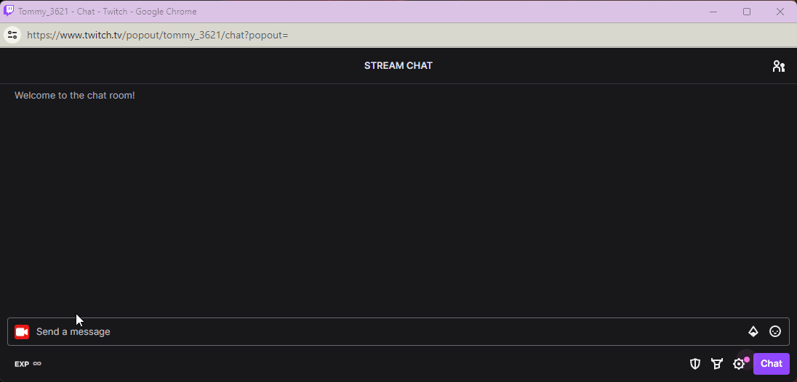
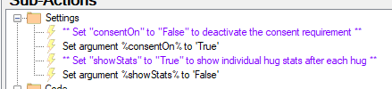
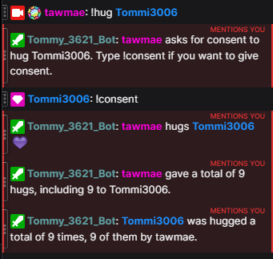

Twitch
{: .label .label-purple }

StreamerBot
{: .label .label-blue }


# Table of contents
{: .no_toc .text-delta }

1. TOC
{:toc}

---

## <span class="iconify" data-icon="material-symbols:description-outline-sharp" data-inline="false"></span> Description

Let your viewers hug other viewers if they have given their consent (optional). Consent can be given to all, to none, to specific users and for individual hug requests. 

Stats for hugs given and received are saved in user variables (total hugs and individual hugs given/received to/from specific users). Those can be displayed in a leaderboard for example.



---

## <span class="iconify" data-icon="material-symbols:content-copy-outline-sharp" data-inline="false"></span> Import Code
```
U0JBRR+LCAAAAAAABADtXUlz48hyvjvC/0GWDz6MocFKAhPhg0iJmyR2ixQ3jDocQAEgIWKhuVMv3n93VgEksQOkqGmN3R2hGQlLLVmZXy6VWfjHv/7L1dW1rS+V6z+u/oH/gD8dxdbhz+v77VJ3NF27aqzGi+v/9O8qq+XEneP7S2VjK/rhxlqfL0zXwXfYG/qGOdzQ9AWam7Olf7PpLJbzFcJ/Lv64miyXs8Ufv//uNXYzNpeTlXpjur/rfu//PYHebyZL2woOwe2snFvkN+msLGt/zzYd017Z/cNg8E1875/kiWtNCc1V8cYBV/70rlztb5HbpoZHrCBGUnWdpgzd0Cge/0cxVIVixTLiS4zC6Ya6Hxx57X9W+koPD4xc1x1FtXTcJlBAD93ZImul6bW5azfMxdKd7+AhQ7EWoaf2K/NnaGl+4P+G+h/P3dUsdQm9iVsbZbcAKib1M1cczbUP9I3dR66DVvO57iyT7i7n5ngM9A8SNUJYvxXbho6ahMYGX5YErsxTepktUzyt8JRU0nhKZGgBSaLAMawYnEBgeXhaosscw1GGyCOKlxCiJEEoUyqrcppgKIpWlmKvLnczTEqeZqJ3UhfpuFCLPc/8CN795/GPHyFSx3ksiRz7xY0NNSI/sftz3dBhLZAe64Lcrv7x+jowYUE3i9fXJxPN3YVrLG/a9y+vr7U5dLpx59MS//q65kFsOZpjpNdXe4HcuWWqN5plXYeb/BHtX90t9aqrkcFrw/ZMtdG4x1nvWr2//LahH6LXHqfttVrfWiOuM1NZ4f1xqlmq3d8pg6fy3bPbrjoVZmRvZ6Nd5U2t197RrnLXu5+0VLim2j24v2hXzdtxs1rZaIPWAt4bj2xprVYrNb3ef9OGHeuhOt0/g9uE/996P/ft525V6CHHasjDTgXZyG06/Xd52DQfq5W1NnweI64DYxGcZoNcn+E5HN6v4rGMV/1GS+iwffp52HIeqi0Gsf1dd/Cc0karJVen4XE02jSyrZW8q+xGQ62lwpy16q2UPL7WRKOtFWr06aa5Gasc/P/4Pi0PmM1Tdzr+fvhd6Kn0dq3BmIAO429mZaUNtovIPN61RousC4xzA2PeNO/o8TNTaT5anZ3e0yztvraTd2PzcD+tbzPQt3lW39ucvrepfe8Cfe/O6nuX0/cure929dh3u3pa3yNWWqqD2kpOW3MbZGTATFQ7iac6ljq8ZR66t7/vf4exr1/qEgf86sL1UrMuMGp9k8/7uB+nbalO57tqNhfNugR8WDFVVoLfg/emBeSo7QLivmj1Go12kbYawXuRtuqttcpuME1WIEcroP9CxXSpyxO10bYiNIyO7RtgiIXXULZrC8T2stuuEZkef+9W7NFg+y6/7LHE+wnQeIJs4IXj85nrCfPayYAH/WHbQlNrisejOv2FehduXxmMxg91T5afqreT791bE8axaJq3dsuszAgO3MGzL/S4afdZwA6BzC/xftsdDZ/NZnVkNyNtqra0krvNccscHeW7ei81faxKbM9szsIYFR67t+7bGeKexU7detPq1lq1azv9ZbunA15zU7EBg+/435qNyk4ekjUaKIM+8Gbr/SBrUyxn2kJlWxO1Jk/Q2/ZJGbbp7/edma8XJsiZivv1wDIwsmegM55/+/7GA9/2edAlK7nen3YbfQcstH0fC9wOllmfH2bNO/F3kAdL21WK92GOI7jv/fh6xtLrtTftnplo9babynsej9gq17JGA3iuOmFHwEuabVkYJ/CaJdHo4Tner54wFo+/LRu3673bXD0DnwMvwrq2H+Xh1NdtrW+jAQM8NCX8sO9/sPN44cWuLeVuS8MY0vNpARi26telJ5BZCwEtYI7Skcemcb6oJuja2Fj7PNCBfhnU6BE7xjJFI6dvJdE50CY9Ah0LGNMnfAu0Dox/Cuu5ARtBaFo0Hu+Lz4fuw0sC7wZ+kuQ10O5MrsbokTO3Ax4dxnng81qHU4adN4VgSWsA86nqPWv63cOm37+bk739sAD5fMM2kTwQ6OGuOX7YhedPnml0dtpgz9dJGBmj4aHNZ4w1p40t3n9gjKQ9kDWgOyNjG+RdzJCFRHod8PtSY3rxsO8cOpnI7k+U9zTeqUgJ8i0RmzX6PJHL8UQeTiaANe0Rnk+S3CRh7AVxI7uPgE5qyDN5iGVduAM60qMByDq9tPTu2NSIjAgTddAzwbbAesPHm5YawpeoDIbt0AA2Pbl7nfTQTcOSHNxLk2UT7Ib9XKyFKdetd1TfTvQ4vmXzZwL2AJ9hzDrO3QbcOBF3vj5W+Houaot59h629XoaawF+T0gffdD/z47Vku+2xC77/s67UWx9rIKNE2rvHNmMjksA26OH14P4Y9gX6ze0GdbHpF8LbIppSwAaiERn34m/PYRsOuyTbcYB+9fDoXOwzOOVmE1A2inED62dPKjNc7ApAXu8HyNB7vG1BKyayeat2xyE9PAs4bnU+Wqw3nufVrXldcB38vj2Htt1R9vM54GVbEvAx9u1zFqro/2bLoMeJgX6wbar59MkjLcIViTYEYexiav+EeOy1zrGQxhvjuN8tPzrd9nrnuCPnMDHifxrgE0/j4/vQ7q5AvS+pIzh9rA/S+w+7L+C/5zoh311uU+SOY92ffzeefaxh7EvgOfTl0H/HbE1R+6Op81ppUx41aExbrpyt+L5cFWtvNejRheN5bpkIZZ3NIJF1rtW5c08fQT2Dq0NWysfj0+abxbGaEe7Worz5El2EFnnHqy9fM9YiGtPZLbntqqtAE2stdatvI0GZO6uNkBjfSAxCK9vfTR+ti1Trfd7SqO/RNVoPC84hpalNfo71czgyQYduhamS8XCeizXh/6QfF1Arj5meyfaH8Vt7ri97MVEDvGu8XcSi6itVHY/zmczbNsmyZHv2+9jdO98AGNrjDzsF5unH9/YxwS+v6XSvKMN+gyZsz9Pn+4reYjGL1j+7g5xkd+S7U1PVqLjxPFxDWhKdN7d7Un6+RC/qk8YmWlZCNqDawcfN9rX4L2ipcsD8J+J5UnrykP8fJvO1Pu1ox4kNmF1Ens3FgcvMnZs08fnU1hvx+hrtSx1ILFyrwYAdpuOB3s8TrN5q8my0IM+QAawPEavHXklFZdT8e5W5wh9JWh3pe6ObTfrgBl2fwVtr2G9yoBzTs/ub4E/8X7Lzuhm6QHsR3YYZPPp9moE8zL13EdwvC6sm3WMI3hMPs+Az6XVxTGek4/zgjx8PgfTU2NNEQwP29nePNMw6rgGZlinJdmink0b2MvBurHaNE+K90XxyYzxWCF9EsUn4rcl+Wt77MyKpx4xN8P/PRfrcujhtX3c04nwvu+zR2jUV59qdI6d/9din9fnYX8p8i7xDxLH4vsbJP6S4z/eK+DzKQNpBbpOOKzZboP3B+jv3lzfgXZv8sBiZY9uuXyUvg9grbQ7PmovRPuI2ixEd+a0mRtjyXmf8AiifcwsZBOk7hfMwDYhspPAd4f5dlg8V/5T5kowpVqL0jW+D2B11vD3AnAqVcYCvBJpr6Me3rdo4IvbTQ6v+XEG0NlcuysP2pYylC25Go0tJsrIWeOL07+j4bV9yqGfjG3kNF8uSGeyx9SyRmwf8810wMbtq2F3kRfDyaLr/CE17hxfa5+nLrLOXlvCR9a4gddXjcWOD7I/S41NR2nsy+WA823uGhnLNmcscb+rwHz3+q7ouiXQKXfNPD3RTsWWsG8RlRfsW0SvHeIUxWIJ6bZrguwdxuCv56F//+8T+47GMZxltE/Prueexnvbtnm3eW9m2XPeeng5OGxtplXH26csGz7Aq4idrDWmTY+GnfS9Eu/5IvFejP0hnu3XJeD9zV5XF5FRnD+SKoPfzDwZ3OMC9gEC6wRtHPZC6sXkE2y6VPk7YxxHfq358wEsjmIoyQNzOhN4773L9oWHaquncp2JCut/GE8Qc3f7+y3Adnf8lBNjJT9Yj8Zxt45saRnUF4XGl+BTkxyc2JxjfH4SHfeYodqdNrz/Phpo1kP12dSjOsehxzJbY8FfmjQbPp3rkt1sLIM85dGs4c/Ps/fe1EZ/6uW5RJ5lfDmE9uAe4Y9s/zEm90PgL/Cr7zdZ8f2oLGf4hWONrb0TGrMa4F/yXANre5gv2FVLefi0SHgmtv5Gt7KWwUdU6v1ls94S/HdCWPVo5uJS8l5w4OfsWESYVmn2eK4PF+u/6scJ8zC9gB/tPZcQK/DGnqmjc/y7nxM78PrOj48c177INUIHP28nlPt5zAU7KT4e9qvJ/uqZ+TnpetvHgQ2Jq4MsTjS7N4ax4n3Lqd6tOJ5+CcSkMH7U8VgqDCJxk4Nf+/5oVloga4LK9bBsY3ym1R2ms7xWWLhWn1jHGDXZwxZQvVdqVgPxFq/t/Tufus/h6ZEL7OucGEcM59ZczO7Ljt/78cmDr5pD11RddYxVknVW6kRPvWuD9ht+Tsa5kY0p6C9iIx1xieS9NMdEDhr9Dc6TPcSEwU78Zk4/fU8reo34iF3fhrRrXNfbc/NigHaED0/P3Qut97k5PKf5GbF9I18HfNi+T8QJxPXfwKaC52RGrW8FoktsaY7xmezTBXCjgI79AB4H1vODdM7jdxl0UYt73vP9Hh8nqjMN8jrWR6tmDWOlADTBuV3Y/sbYKgj5GEj2wr+YPPhj+oAceFj02TqstsC5fjJgEMiI5dGd6KiVumMC/FhEVwnrx0GhtcJrwarsEufi/h3srdPszH1u15k65ETsiuRtXBq7hLW2q3Cql09B5Bd4ZqV3g/tuZL8twb75WjalVwtwGR11Edn8m9gme1mVyXMYm0NyvvqbyHDRvJkDpvk6OYSD4BNbI7bGIP/+XrcDb+G6KEtLphE82/9knZ4rD4caF6Kf/Fq/UM1MF9fMePU98eu3ZgCzT/HLDrQ7xOJOyaFN9ONFGPciVrtwWj5dxcslP+Y+Hvb59liP9/s6wwmNMVIe7HOJBVulW8JLXXKUAb/P397m7fcG+8E1RqQm6lz/NF6TxRzGthP6h1qWc2o/Yrmg1vRnyCumrzefsXlcg+cxqXF6d8cvQEcyVly7hfei9zkf/noY3axcCBj3OBPnozmyH825LYBBifmM2w/nM+bllOfTIiK/Py2mUg7xq0Mn+EyVXoH4ybgZwGWfhw7v+PF+7f+ITnNH2F5rtJkR28bP2Rjbs2gajT9oQ0xf5pBTgna3pYcs2QqP78T4bDauF7V3PtPPC9SIp9SQ3vv61fftu82T8hZDdbEmtls9ffzReEie7afafWzfYZ/uHdX7b8pABr/73pOPN/evl5lUTPqiNUNenlRADx/r2X0bB9s7NR3XqdsdSw7nST2prDZTzb2NliFfHiYH+5l8lEfidWOxOo4ieVVJNWIxuwSu/4yYM6Yvmc9DtXVcg2qlif3Ub2blG/C9J8t1z0aTbWnXbCz99WhJWbydnP8fkOeovfZR++/8+ojdz7Unvqjs+jWqkVqkS9t6t4n+9uAYVyli44Betz67nuVCMpfDn5n2ia9b+lPyHMhM1C7RuVAtTZE96UvbJKftFXzEXrxM3vnfsC4kgKH1aLvCncphfiCxvc2l7aPnxtEvUUEfkBgr+CZod8mc/E/xDYL18sFzdvzYNPj5uG4+Rs8L1J/jmthju6fkiB/wDedgFcuxCp0fIwVz20NxEC9OUyQHtECOjo+tRWuL7gvGUWJ8kZn/njzPAvGewFz/3+TAnzpnP1fxUvMtllsaslVIPUnOWJPP5En88W2bU3IOi+QoB+j6wRz5M8aamH+YjV8x/CiUxw6+0N19YVwomkOfRbuk/P2H3aLwGLJyRU9q5+I59sF1DuboLkw/X9j06H170THubbqz+OOsHPzgPLNs6JP6zc2vj/LUOTn6gTZOspWjPIf3omMyXDB2d8oYCtYaBf8+YG3hNfz0HP5YXyfmDQdkIXy2YFE6F+7D4+ljHnkor7qal2M/Psh5IFc8CQNKp2BA6piYw95YQXyIjmnp2yqd4jn2ofX4gjUAeeO7l3cqyyTVW2bW1CXIYfKYk3Xs6et9kkxq3n5St0J79CL57eV4vcp2L7/EfhuxW0auExs8+mzf8wtJrHwfz8jPgbigrOfQwPdbK9xo+ETWQMZxFBzL9+tyVHY0JjUUCbyJ56UMGAvXR8SeifEHpi+uPei48gD8Hmc6TqjNOIk2WbHU6E9qDUF3kugjFfUtQ/T9S888CPykxgaCuFfQvsiJgQR0QYHY5a2js77f3aAdPyayUrlnHHPcY8DUy3sHXth5sc5i+S/BMRc4g+ZEmqXGOrNi1pc5N6HYmQiheMa+BqIiGtVKOHcndB5u0n3/PNzGVmwmtHnqnuTPqCOP2Zf79iPnU6l2n2vmtJcbW7yUn3OmXxOy+Qv6a2fU055dy5ofI/VsBOD1I196MUbMh2ONnaybDW0C9s07sYkz9EH+vsXpeZ8n5qsV3r/Z75nrw4oF83PVXSw/Gp/BVWpWEYlpNGsevYZd9Fnn0CTuN2bmm31W3l7W2Zf7PZVT8/Y+9/yd4PrSSr3n5zlE9V1nDTJAahrk4QTvhWTaNwX5OfXc3GMsWVqddj5ONibG6+kLrW92XPIt7YzBhHr+S8Y8i83Vx7tLzTMDXy85t4vHbz8Qry06luO3Poroy2C9eMDnzjqzpMA5FxltZ+nVc+OnX8KOKBIPjeByXlw0HI+MyHZePLSAf5LTfkbM8pw4Z4G4ZoLeukx884yYasDmDf59Ql+pZwl4uZzxfJPvd0/jLH3m2YLaRBk+u08vt5u8vPdCZ43knsseP9cjFEfb06VIDC3Bzi4SP/vA2SLR3KSEM0bicpV/Rkbg3JUAH0bPXil4Ftbh/JU0vXDueDpOa632E86wzD4PK34eSxCTTzqTJV8WPvnskND6FzlDpLiMBZ9PyvEN50hhHwx56+zgPf3EmGiMl7Z4HjN10H8H3Ik9E1tfoCeOL+Lce7VbMfVusRhpVtzvAj5hbm35Lzu68Fx/2dEB++OXHf3Ljv5lR/+yo3/Z0b/s6F929C87+v+LHZ1aC5wed/9ZOcdJ38j75Nzjn5JrHMut/pzztoueaR3M9ypgG6XmNtEZOqXw+doFz1+OY/fxbOTsXOD83N+stjPOXY7Z30E7Nuu9gI9RQK8XocvJ52MXGUP8m0gn2PTLiGxfzN9JbT/X57n4Pn7BOMAZ52N/hRyCQ67sIXc2omvzcmhPyKMrniOb9/3eL5AD+5Gc15jvGst9TZCrk2z7L5Hzeskc14Q84ZR4S/648mXhk3NWw75qfn7mqbmq6bmpERv+J+Wo7vM8svIRL5oT6P0EzxGJfMfxpHy8IjWrCT7LDLETa5+rietWR8Bje9pn0+ID8z0p1p6b0zxB7PLdP+spcsYyyTWN83YtfuYPrh9vDoT1saY850ybz/zWVGae1Gd/c6rP4zbQbsIDPv/WbIxJ/mh+zdSF6/8DZ5Cm5BAnrCvx6/1zOrBsWzvMp4irkHUGHJ6dcB5N3llx552h670b5ZXV86ATsK0+Yp9lfs81UH8fvXbkp8/4Xhy+bjz/139d/+e//stV4N/1bK4j156Zln79x5WhWAs9+oSmW8quu1Tmy7QnFspa7+iLlbV8cfvK3FTU9Nbws6GnrmNDMjV8WaF1li2VShQv0CzFM4JKKaiEKEkxOI2neV5EWuzVjW6OJ3ic9A0dvbfczXB/Ev4XvTeeu6sZ7rXqanqsVd3BY8WjWs5XsRmZjqZv4R4TvP7P0FP/iLyy9qffVmxCAuQ6C91ZfnNiXa8Va5VKS2W1dF+8WSUOjNCRE0qcRHMcJZR4oKMmqZSqCmXKEDVJQoKollTmHDoyLJdKxa6+XJrOePHXU3IxcTfAq8t41x+nJJKQitQyomhNFCleZDRKVBWVoiVaMhiF4Rj6q1GSO4WSHn1wl1evR5Z8vb5aunChhunm/aHpClqaa2WpXy0n+pX/6NVc/5+VOddt+D02XORa7hy3/u8iTdO1WorQ63QZ8YZGg9BrGsVLIPkiV+KpsigaakkBKrPqWSSm6XSZ/yCN6bNpfGDWPY1foBvvd3zrCnow16a2UqyryWp8tcCPXinGUp9fwQpM8MVzCU0rTEniSmVKYnie4ksljZL0kkgxTKlc0lSklfnzePkTCc2eQej1DXtD38SnciBTmvZhFdFgQNYZhFSQdUmiFEwpRuTLBm2IpRLHXpw+fyED/htmqD97C33+I4OFajWaFuk0EomIKRmiQrG8DiRiWYmSeKVElZCiaUpJVQyh9FVIdJJG2ZNoj2sF/1FXVf8FDIqGOV8sidhiWNQXWZCYSWZGNBAtaAzFKpJB8QoHkqoBTxplsURzoiTwKP7qTyLzORJ6ILPHjQVJrFwtZjoyDRNdreC1/1hcgtRlieHKvK5RNI10AEWJoSSRoSmRZlnASgYMUv6rkPoczf5vjlucp6mrjm4AbQ/q3XDnl+VsFUx8DvFAbgNJFJj0BiVJikSB/pF0VSuBMfBlOJv/GLlzeDuR1p/C4khHfJmRNErTDQEMLI6lFAGWwFA0QVMMgwcB+Co0Fz6CJphkWWSnrurmWgcikwdn+txWHPye//7ZEAKuaZkBdmYZBAYs+FfgI7AlCpXFMlvmRQ3crq9C39KH6TvX1+5Uj5IZczO5ruwZ92Lk1Q1D1RmjTGnY3OB1kaOUcpmjdAnBDY6HV8tfhbzlj5BXsayr/H8+E8fIS/BDX+vznevEwxkFaS2IyACy6JSODGBlEcgMxgcDypHleRbjh/hlTGDxI7R2gEgn0tlxqUuSWtTZklCmgbYq1oSsAqiMDQ9E63RJ5ISyyH0ZTcic5W4E+dpHjYKkviSdS4bEMiXaoBQDxxTLUplSDVUAr1dVaYExkMGjr0Jn6cMsnUrnz2Zn8JtVVQfPsCxKCpBZRZTIAmOXdI2hwerjaFr5KmRmznENNRdIBn6eu0KTq5Vj6YvF1c5dXU0dd3O1mShL8pfm5hCQTrWMOU0vCaoIAKBiR6RUAjxABnb8aNFgWE7ULx8G+0DoOwwJxz9+BF64xjFD16nj7hbwzp9ZlPZhUZCYkqbpFEcbwEcGJ1ISDXwEKEkrolQqlQXhJDI4fpQ4capzxdFc+zolQnzglxMcL28WmiaBYa0B6JRFGmwWBQfgFQFHlpCID+YolaSzZpEaTis4E7bIqgHHWspsoWvJC1dsjQJt7389Ui5AtT1+CCWOK9OI0kq8SvEC/EeVtBIliiyrlRRVQXxo+a7BJSKC6awsK3g9lXuv9S2yVppem7t2w1ws3fkugVwHSv95v13qQDbtqrEaL35cPeqKps9VV5mHjPmjLIWeDz2iWBtlt+isnKT+vIW7JYKSdB9AGq3mc2xAJ9xdzs3xWJ/nChdybcB9reltD/FI0ngOKCyyBpgeOgcOCwA2wwiIKTO6CEoxBaVYnWFKiOEouoxK2BhnKBGVwaukwWQpqajEMvFXfSTiaeY0qCELtgC6kOn9KMK6HuDkkmO/yLGhavoCzc2Zvxjx+3Pd0GEtkB7rgtyu/vH6OgBhczeL19cnE83dhWssb9r3L6+vtTl0unHn0xL/+rrmb+gbjuYY6fXVXiB3bpnqjWZZ0Q7PbbO7Wyx1+6bqznXSbLjVH9FpqbulTgASY9ewTY4q73EW3v5f4i3n6DWSMlbfWn6Z4js+Zkq1+ztl8FS+e54xiCXpTy86OZ6dXr3g46/wtr7TfyclBrW2gNPr1a7Qk4cTGvcB7220QWsBbYxH7HaCuCey9d4dCHBNsOD+YYseNfqmWrfemt5nKcad4QTG0qfl7viQwhNOb/HTNI5b97MR9CX38VFwfSv3KKw33kvHcNrNQinjThv6aOali//2kJYiHkmB8FNWDmWdyqCGj7YfjAZbRn7JK+/kf/M/JfPejZZ+pR8T9o77yaWLOU4sJ0tMQw18MgfRkfRM7xMCvzXvbsctcxSidSQdkMGpQ9/N6KcGklJhKsdj920p9Hk9cgxTUnqg9/kgE6dmJX2G8BnaST7GzE/twZ+fLPCZuuh4mtNlrcsgMym9IzO1Bfj/mHaC017h72rWJ368zy2OnNZ6NOi8jY6pl/G5hp9JTmvy5Q9kmJQPyT3ov/GE20tP5fE/x4QcC5csV5CN3P1nMIGv1vjTzYej/RstS673LXXQ3yX2n9oWpgdOuZEYLcAHCPhTHvSX6Sk/uSUjXirofawEe6LW27DmNVrue+mRRNZ2SfweoxeMs7VT2dp0xNbI0a3+555IKlGQV5JpkFMu3giMJyr7bG0BuLkYDTuWn8pKZO4hBS8eyaeK2gtt0LGwLODUzwgvrY4pdFiOOplHfobL2Pp1lWs94c8NQt8m0GMnV0mq9qZ51yOfnGzek1TaHdqRsvTjvI6lpDsZxibjtFRvDBl4k7j+4XS5nrxGU9Bz0CayYZ7D1tRLj74dt7v4s1WgE/f4BPQi2BegYwC7FkFe9j6NlEJj0K0a8Fp0rSNpXvESiqSSr+QUQPPFlsjnv5V67Z2k9rEaPkJvojoWuZ58TGj8iLS0UrZg+RsC2dNskIturmzdAd3etMF2AjLQO8rZk3sh/UdsAMKXrAQy1+e9VO1+FfrC5YBHfRHi6Vbgc1aHT4KEeDvF5jgBSwhmnlUShlMvQWbelOqtSz794s216R0Faa2Ccz9FZ2oB/eT9TsaZ+RkV7/jUMF3JJ4yPx/SS1NYU+o6NxibYrxTWb+klSSNSJgD0SS6nDJTyHssgQnOyawuSEppdUuzNgeC64PFev0i5SEhnhEvZvBIGj9fv4vIelu9jKmiAb/JkjlVZoGUtnKbeAZ55qfcnsEY70C8TZD+7R53bARtgiz/zmce/ixBW33dAbu+DMhLFYrIOPj72PVz2sW7PlxEM8/i5vUbO4VON78R+C429cw/6a/I4BTmAa8+OdQ/zfMOYh+fz0OgBz4H93vXXLGqX1vzx0i1GGWyn2B4C/UDjoyZJX/ho2/gzMTncv/M4rW1QHeu1LciRX5pdt2gYs/QtjqmEJsiurZRdQmmjV150pKPVmqj2IqHcL/S5qeMntfHnUM3KO9yj95/OBt7tjQZL6+GuNyuAB6QtJf1TmqHPcR+OfTAFLD+JOj9GpyopLdiNBsLc6PJjfMzn8XNNwgT0pQRzKvvtems4pFPSygOf+fbGQPAmYvedUi6dQPsKGWtaKnbamPw1FrEtg32cw98R/j7o/wy8S6Ch2azSKUddYJu6gz87uXoeVjbEFsDlSd3kY3q8cUVLWuO635PNoE1TnEcy7XD/+OAY3Yv5fGlzBb8U7N3GMohJMT7zjhTu43mRPpUhLoU8zrGHacPRsSMPzrLNPF8zMB6wSRstAWMOYqUdLr3wYglPq45t7QCfv6MpPGvXGLUBcgb6AzCYeZzikkby6bUQ3ib7axHa+n36bWR+wja1XCgRo5bfYR3elQHxKzZtrOuifA66ldh11fHsEa8F2A0v7CjIGzXV6ez07nT8sMs6lgd8vAY+ZlqooEYF67knHC/CpViP3cptcP1in2ob+iUwgHEe31dm+BiZwBi6WNZfsLyBHsW+Hbrrp3yGNv3YhmJlZZH3Y6VvyUd/HLAA6NnzdTjGjgO9cDsO/XcqAxEkSeRYlVI0XqB4TmApxZAESlQ4g0c0y5S1s7bGv0YZyF+0nyiWREk0aLznhGtABGRQolHmKJorayUOlTjeuHzW19fbT+SZMqMphkhJDMNRvCoZlKpzKqWzkgLMVFJodFrS+wX2EwtNNW8TrtDETtyE42gOsQrPURpHMxSPQOYUBpUp3eAETdT4si4yn7EJF30obQ+upi9BWPqmvtHnlhnOiPybbMT5wslygsBrBkWLjEQBXXVKFFVYS6nMcwxTxhvEadtoDMt/lW00TV8sTUfxKRYTlWihlu4vDF6X/05eRfLeDOgI18mEkjWJu5ojPblLH15xFmJ8l9zHhBJoF0ECrSIJGsUbgoT3mnVK0hi+LCqSxgrnpQSxbCoy3nlwr2tmfL4/FSAZzcDFPyyl8yzIPIAHqN1SiRJRSQVxVzmNP62kYy+8WTP+C3Gy0PyScNL7Zd+XB3WeBO0v+ZvqoT6DoOqxaWxIdMpMcG6WuQS27y18IEm+fZxo6L63nAZflgSuzFN6mS1TPK3wlFTSeEpkaAFJosAxrHhdBGsb4UKzAJPGsM90CKYnALnt7SnT4QUjVLv2K5Je56/OPoeN/H7IoA91P9fH+vZ+O7NMZC6rymy5micZmteWi5Lw6NocO+5cr7jLW4TcFcHw6GC9R5rOUp87ipXwgI9LVfy+Pk/q3X8CL2DGU0hZ6F3dWZhLc504ibHlqopVdV1LczexqaxI68n3CijBMQjf0i98PbBislXwMxj41OSUkxN2PouRA/0RPraOf0dl6RczH+5+CjNHoHujqwsXTfVlV5+vI5x5vFm1TACd8M2lae+fx1c8KbnGbXirwnjjBctm5s6Bs7FZiwdM37A3vnd1bZuOaa/s/uEl7y5Y60vlBquef/4vexxkzfbOAAA=
```

---

## <span class="iconify" data-icon="tabler:tool" data-inline="false"></span> Installation

1. Copy the import code from above and import the content

    

2. Move to the `Commands` tab and enable the imported commands

    

3. Done! 🥳 

---

## <span class="iconify" data-icon="material-symbols:settings-alert-rounded" data-inline="false"></span> Configuration

1. You can set `consentOn` to `True` if you want to activate the requirement for consent in total 

    


2.  `showStats` can be set to `True` if you want individual user stats shown after each hug (these get saved nontheless) 

    


---

## <span class="iconify" data-icon="rivet-icons:exclamation-mark-circle-solid" data-inline="false"></span> Commands

- ## `!HUG [USERNAME]`
  {: .no_toc }

   (Request to) Hug a user. The username does not have to be exact. The command will first go through your Twitch viewer list. So if you typed "!hug tommy" and a person in your viewerlist is called "Tommy_123", that user will get hugged. A precise name is of course always the best way to ensure to hug the correct person :)

---

- ## `!HUG ALL`
  {: .no_toc }

   Hugs everyone in chat.

---

- ## `!CONSENT` or `!CONSENT [USER]`
  {: .no_toc }

   If you type "!consent" without a specified user, you will give consent to the first hug request in your queue.

---

- ## `!NOCONSENT` or `!NOCONSENT [USER]`
  {: .no_toc }

   If you type "!noconsent" without a specified user, you will refuse consent to the first hug request in your queue.

---

- ## `!CONSENT ALL`
  {: .no_toc }

   Give consent for all upcoming hug requests.

---

- ## `!CONSENT ALL REVOKE`
  {: .no_toc }

   Revoke the consent-for-all hug requests.

---

- ## `!CONSENT NONE`
  {: .no_toc }

   Give no-consent for all upcoming hug requests.

---

- ## `!CONSENT NONE REVOKE`
  {: .no_toc }

   Revoke the no-consent for all hug requests.

---

- ## `!CONSENT USER [USERNAME]`
  {: .no_toc }

   Give consent for all upcoming hug requests to a specified user.

---

- ## `!CONSENT USER REVOKE [USERNAME]`
  {: .no_toc }

  Revoke the consent for all upcoming hug requests for a specified user.

---

- ## `!HUGLEADERBOARD`
  {: .no_toc }

   Shows the top 5 leaderboard of all hug givers and receivers.

---

{: .note }
You can give "no-consent" to everyone (`!consent none`) while at the same time whitelist specified users (`!consent user [Username]`). 

---

## <span class="iconify" data-icon="material-symbols:published-with-changes" data-inline="false"></span> Changelog


{: .warning }
Extended Hugs update 2.0.0 received a complete overhaul. It will not work natively with older versions. If you happened to run an older version and want to upgrade, please feel free to DM me and I'll work something out to transfer the user stats

| Date        | Changes          | Version |
|:-------------|:------------------|:------------------|
| October 06, 2024 | Fixed an issue that caused no response if no present viewers variable was available | 2.0.1 |
| June 29, 2024 | Using user IDs instead of user names // added viewer list to allow for not 100% precise user name inputs for hugs // added a consent queue, consent requests now stack // added !noconsent // added the possibility to give (no) consent to a specific user's request if you have multiple requests up | 2.0.0 |

