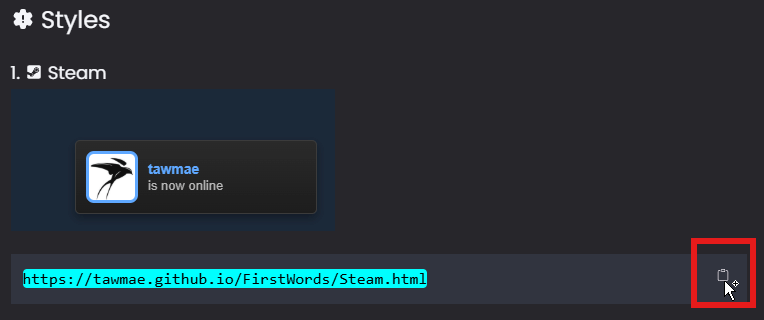
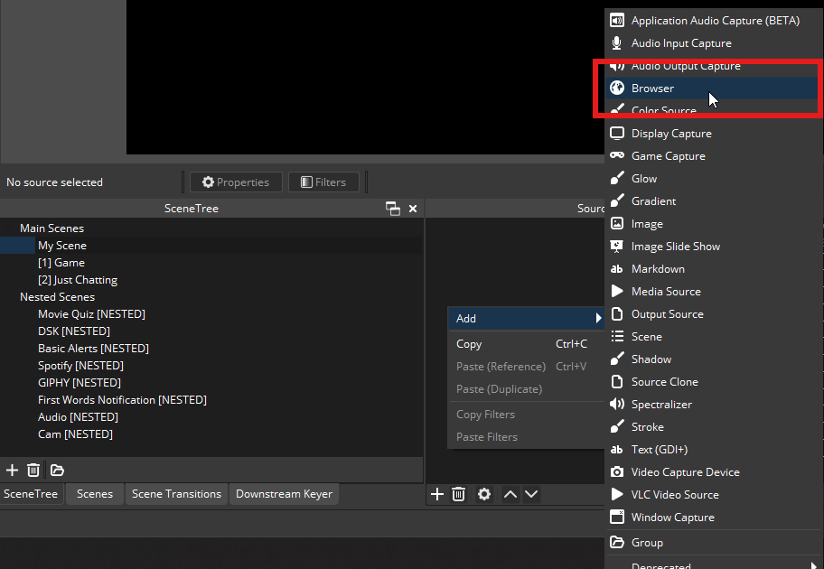
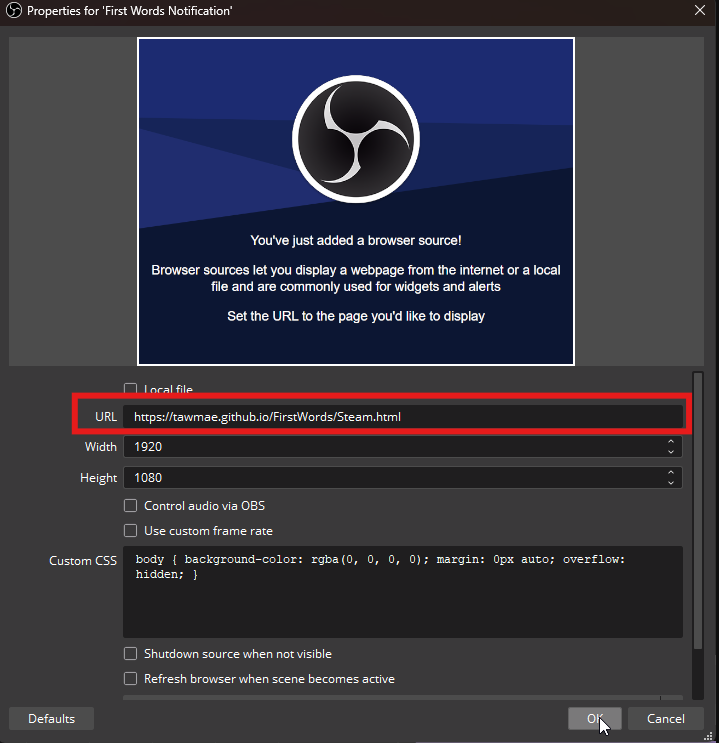
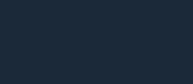

Twitch
{: .label .label-purple }

OBS
{: .label .label-yellow }

StreamerBot
{: .label .label-blue }


# Table of contents
{: .no_toc .text-delta }

1. TOC
{:toc}

---


## <span class="iconify" data-icon="material-symbols:description-outline-sharp" data-inline="false"></span> Description
A collection of different first word notifications to use for your OBS overlay.


- - - -

## <span class="iconify" data-icon="tabler:tool" data-inline="false"></span> Setup

1. Choose the notification style of your choice here.
2. Copy the URL
   
   [](https://tawmae.github.io/assets/media/notif_obs_3.png)
   
3. Go into your OBS, create a browser source and paste the URL in there. Preferably set the resolution to your canvas size.
   
   [](https://tawmae.github.io/assets/media/notif_obs_1.png)
   
   [](https://tawmae.github.io/assets/media/notif_obs_2.png)
   
4. Done 🥳


- - - -

## <span class="iconify" data-icon="streamline:travel-places-painting-painting-entertainment-display-museum-event-hobby-exhibit" data-inline="false"></span> Styles 

### 1. <span class="iconify" data-icon="mdi:steam-box" data-inline="false"></span> Steam



```
https://tawmae.github.io/FirstWords/Steam.html
```

- - - -

## <span class="iconify" data-icon="material-symbols:published-with-changes" data-inline="false"></span> Changelog

| Date        | Changes          | Version |
|:-------------|:------------------|:------------------|
| December 01, 2024           | Release | 1.0.0 |
