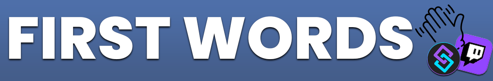

Twitch
{: .label .label-purple }

OBS
{: .label .label-yellow }

StreamerBot
{: .label .label-blue }


# Table of contents
{: .no_toc .text-delta }

1. TOC
{:toc}

---


## <span class="iconify" data-icon="material-symbols:description-outline-sharp" data-inline="false"></span> Description
A collection of different first word notifications to use for your OBS overlay.


- - - -

## <span class="iconify" data-icon="tabler:tool" data-inline="false"></span> Setup

1. Go into Streamerbot and head to the tab `Servers/Clients -> WebSocket Server` and start the websocket server. Leave the adress at `127.0.0.1` and the port at `8080`. Check `Auto Start` as well. You can set a password, but you don't have to. If you do, make sure `Enforce for All Requests` stays unchecked.

   [](https://tawmae.github.io/assets/media/notif_sb.png)
   
2. Choose the notification style of your choice [here](https://tawmae.github.io/first_words.html#-styles).
3. Copy the URL
   
   [](https://tawmae.github.io/assets/media/notif_obs_3.png)
   
4. Go into your OBS, create a browser source and paste the URL in there. Preferably set the resolution to your canvas size.
   
   [](https://tawmae.github.io/assets/media/notif_obs_1.png)
   
   [](https://tawmae.github.io/assets/media/notif_obs_2.png)
   
5. Done 🥳

{: .new }
To have the notification in multiple scenes, don't create an individual browser source in every scene, but instead create a new **nested** scene and put just a single browser source in there. Then place that scene into all your other scenes. This way you won't have to create 20 browser sources for 20 scenes.

- - - -

## <span class="iconify" data-icon="streamline:travel-places-painting-painting-entertainment-display-museum-event-hobby-exhibit" data-inline="false"></span> Styles 

All styles are playing a notification sound.

{: .new }
You can add `?excludedaccounts=streamelements+tawmaebot+sery_bot` at the end of the URL to not trigger for certain accounts. Each account is seperated by a `+` symbol.

---

### 1. <span class="iconify" data-icon="mdi:steam-box" data-inline="false"></span> Steam


```
https://tawmae.github.io/FirstWords/Steam.html
```

---

### 2. <span class="iconify" data-icon="mdi:minecraft" data-inline="false"></span> Minecraft


```
https://tawmae.github.io/FirstWords/Minecraft.html
```

---

### 3. <span class="iconify" data-icon="game-icons:fairy-wand" data-inline="false"></span> Zelda Navi


```
https://tawmae.github.io/FirstWords/Zelda.html
```

---

### 4. <span class="iconify" data-icon="material-symbols:android" data-inline="false"></span> Streamerbot


```
https://tawmae.github.io/FirstWords/Streamerbot.html
```

---

- - - -

## <span class="iconify" data-icon="material-symbols:published-with-changes" data-inline="false"></span> Changelog

| Date        | Changes          | Version |
|:-------------|:------------------|:------------------|
| December 01, 2024           | Release | 1.0.0 |
