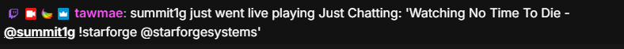
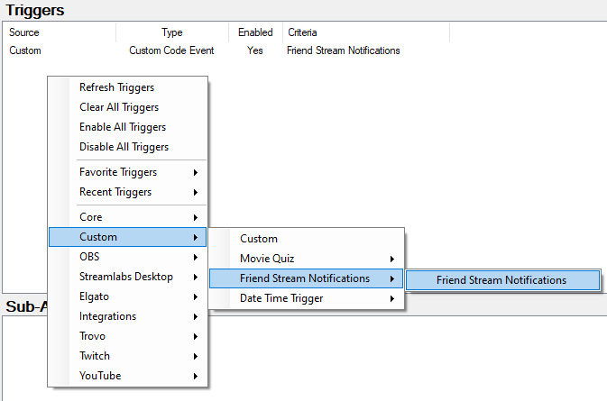
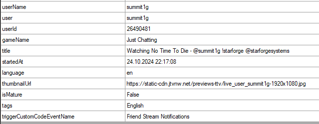

Twitch
{: .label .label-purple }

StreamerBot
{: .label .label-blue }


# Table of contents
{: .no_toc .text-delta }

1. TOC
{:toc}

---


## <span class="iconify" data-icon="material-symbols:description-outline-sharp" data-inline="false"></span> Description
Get a custom trigger whenever a streamer you follow goes live.



---

## <span class="iconify" data-icon="material-symbols:content-copy-outline-sharp" data-inline="false"></span> Import Code
```
U0JBRR+LCAAAAAAABADVPFtzqkq671M1/yG1zuMesxAlCbvqPEQjiiaseAPlrF1TQCMSG3AEVJza/32+bkRBwZDbnnVWFZUl3XR/91tf/v33v11dfXPMQPv2+9W/yQ/46WqOCT+/CSvbdNHVMFiZmnMleYE9sw0tsD3X//aPfV8tDObeivQOtI2jmYeGtbnyoSdpqV4z19yhAZm+sbKXwb5xHgRL//fv3+PPry07mIf6te19n9HZ/+nT2f/ppme/ngcOToPgDUL33tgP6YYYJ22O7dpO6MgHYEgjafuT9viGtAzmmhFj9/vV/8VvrpIm2mwjAjFn3LC8NjMqfB0ZlbrBMZU7xjQrNePGNKs3/J2pawlw9LN/hWZoZgGj701X07FJxgxWoZlp2Ro4RKaw8pyO7QfeKoJOMw37Rb2egVS2a+X1egM3aX9r5YXLt3yg4Y0W+cCBvNlXmos858Cbs3bDc41wtTLdIK81WNmWBbxLM+SEKSnGsNyNiarotlKf1ZlKnbtlKhpjcJU7ZOi32l0NftTTkMdTREtCnupt7bSlkD1H4vuJtPyRbv3z+OOPDKHOpSsPmTcyjH5zolRn7StzZgKRDfNsdtrc/P3nT8UGTm38nz+fbGPl+d4suJZao58/hRXAs/FWi5v6z5/rOuhyjalV+Z8/Hd/wVtjWrxHGpxO+d8xh5Aemc930VuYXDPv5I0pm8EWjdsAuFgx9nR6wYeDrez9yDdENzNVMAxYXf7YffzQHkSL24nqk+Qv/urUNTJfKcvGnkrkJoAOZsut7bhnQmh4y710NR779OkxND2MzVpBr0XHCgCjfF9BWMb9CYMH6BbZjXg/Nla1he0fV9HU+mNvguuUaHuGFfwAt+8Ufp7qsR4FJSEsUHU2kpe4Y1riGd6gtBz82TO/03eNCWuvtLZ7WBkud5XaPC4R1R4405en2ob+sGiwO1agxMicSoypMOGrj0Bj5UtOVd5rCuWKLw6g2WOuutFbdfjiEv/rLK+029wRt23x4oH+TE1FnsHmt/XExx1NlgA03H1a5PY9URVgQOB7xYG6wwS53TDzwDEeeq4CbugPYLaZndGRbb+MXsS3504m0E1tSf9jCoU769JmeCeOIzXtL7DSqU2e7nEaNHep06bjqZA7zc4A/H44cIVCH97zY7LYNBwNt+zDvgMAVAG3WqI0dTZHm8Bdo9GT/KDmuDDwCfIGWZGxx+/hyH0pDEejgWeT7I/zdtc5urMEEaFWTGXVoLZM+Bxzo0/B1VlqJzflM3fel8Lf5Fy1aSE076Xf6XfxoytTqCfzSqHarusMReA/zpOa4PX8XP+M2v0PCYA3zub1m3+4rW8o7c9iIkMKFlId2Y6SxeGMQHkT18NEWlz9yYInp18WoI0e63XCmynanEpm1T/swlNen305YvBu7cqg7ZB6gb2cAMIyzsJ9922AM93U6neIJsjA33AGhF+BTt3u5cKpzw27YhsODjEpzowYyT/hOZLLJjRGLmSk776iTQTPbx8qlD7RFVDdBtjVFDlELL8QHxupXGyLoQk2bDF601rEtb4wJoUtL9tUxWqos8tXh/AXkDevuoKs2N9bU7a5BN1+mRBcnYihPJGws8OIUv1k/Q0PoD3M37z2Q1xd10qAyKLblei/bL0eOGn29JjFym3/SWcPrNruC+eBZJivXHxdVbNSkucrKvGgv8r4tLfsxP3J4FI8z0ybSMJFXQlPVEXyDHefNyb8iTxHws2o4dQv0v3qUX/pd8v8NUrrApycLOfxSbTa6ILNMr5nAfEKnWF6GqoKWVD4WUtUgtlkm8oBc4JMnLtSI8B3GGsG8YF8Za+TwQA91OWUFShcjEv2y9uyx2QjVCdInw8Zt2W+AFke5TdPlaBNZnQWZbQ0Aj8Ya6Osd5OOENxNWYozdXdhnhXDKyj7QJksTAb6vDcY6s12rkbUQF8mYOTYmC0ukTVSAeWyBjHO682TJbWGnRQ1Bb8sdQk+9PfbydA1ocrDpKNGLAvihH5eVkzz7gDxN2WKxac0pvhE31tkAg5/tGow01x0Jg4+P6Yu72JjImPBfbb5JtueIFZao2XhUFXmjR1l9RwX6fck+lvEL9GkLtamCGVEgPtwPB20ZfPLCk0b3myeYO4tznn7n2Zr0+ET2JA/0fwy8XCWyoioDwWwDXh0SG9Vz/Fmxnb9gl+gcYnsAPBE4MnfMH3lx0Z/FY9kkTtF2hTTmS9mZ1LdEp6esZfVach1w3lAZsRvYbL7dl2VtNg4z/mFUwhafwKaC/wXf7Zuv2/7/lv0+H+fUnmCJ0WuNTRy/1MNinLN2HewkC74Qg+zvTIV72cv+3QBiOsojR4jM0TaxIz6xhfsYHuKJxV1id8DWrKfOEmjS/+35pW6NFLBrzBaDvz7aoDa/UpW6L3ZAj2jM08jo9sGGdeSdOul21SL/AnFSCV6lbF/XJzQGnfBIPG/svPUjK2y0IcfEMY0Vos50rYG+axOL0JX6DCPiHZ3d+noNYfWBh7hfjiBmWzxPAvr/oTLgxZccHic2uMm1VAVst7Jlxo68RYq8Q61DLgG+AvIh8IW5tqzsGBOQwTYPPmIZ210Sr7Uhd4kaDTQZeBDHMwefl+QxWJ3rHRn3mt0m4An+XyT+kym2awmf+sQmOtOJ7CPhYN9FEj8DvyCng79Nywa8lmTexzH4ThtitP3vodLPtTvDzoAxyHjgDyF/wyPA0WAFVx2S2ETakHyR5jaJfT7ShsSiDaMG+hvNIYbZ+KLAv6DOE+RkVNZy56M5ROc43yPozpTEQAzkjuBnn0dMbh5IYmiI9Xd9ll+oQ04G3aii9nwNsnyjAm5vyUOOst6do+oRFiKn0wmaa5O+BTZ4Z7QhDmLHICt8CPAQnIeE3v2JNIrlG+3xz4/B822FHE6PcgP+OUVnYj9rWZhmw1L5T+K3JYLXqA3y1RmsNVYOH5uN8j68IFc649kCcqea/AK+ZGdUM/x7Hx/ayx3gP8yVt8y8EvwdUF0Yk1y+JezG+zH6cXyWr88xHL0R2/2XqkggwyBL7Zb1PDy+e8QNsKkS7p3BUhxrDBdCZDjg36lNlef65AnGvPeS9z2FzCPookPnsyfFsIEfEK3E9lH73zzYkhbYEOrrppMu93yw35DvF/mJNm9rjvyCHuq/ncXCqUd1eDIfzcUQjHHAY9hYgkzt4tyguhMf7r7vYen1J92IxGW94TvjvKP/ScYHuST5935u2bc1pQ+0uiN2ZK9nxgW+xk8M/2Cu1qSG4Xbn5jA7JvDBNaIuIr5WbC3jPq+MebQTZFzC2wYzVdBuTwNLBFulu7KvN++/H/HiepC3hL0myZ/gycDEjVSF1OH6HoEH7M1vtJ3EtdXke2sJtLV+2Pd2rn87ge8gL0JwpKfAEFghJzPKyMjFOS7HveX7xE+X+u64Xib6F+UkB08l6u7jALClQGMRM98f8WCd2ACQdet5d2eJtngRp72tKzH/K7KcflwSN4Evvy9Ji7RsEpuMQb+VKv71cCKx4Ed4BXHIr4STg+a6Iv+gtLY3r88fj5/olr7/fqZTGe6i5xPdpbayKdolYObLyMobdIvRJgP/nXq1//aXwgdiQCGCuAvirf679MqI665YFfg5av5SuPlT0AOkkDj7XfxKff9L4cVoHTmYOtxcU7Yy5ATl+dacH3XMHXhIqdqgY0td4ElucR4PDO+/P0fgI+0FiQU3elt4UYeWbdbQUu0MPIibif/d/hiJm7M+7BxrCoJ8lIHc695+Gt3Xn5piYe3nC+m1NJgqyWuid8rB0qjyAY2/nXFCo+d9LeBu6vBr/aG+p9V+jaSoPpZ6ZsMSdrGwvnL27GOv8vjR/iVoWFjr2/OqOG/Kz3PitkNOlcgjjb/zxsqbXy2gcaFMnNWmhf4wk3sTvmEfctwbsROk3nMjoBMDscODzg7K5omXY8Iy9aWC9aaTNZ5sPfJYe03XWi11YmV1Lk+m2tj5lJp3DNf5+tERHkJfbDY5CWi8gzi/kKbgX4Du3fBL8rO31QqtIQs4t+/+ojWIQ+62r1edrU8+05qYENce8mhH8zRCt2o6Z/6s+sUBPqCXzCbrTwZDcvo6medh3LLCASszA8ghpo7gywDPgWe7uic6+7UxgU/0H2K9k7WxKr8gPCf1tX3teO9zu7ez1Pp8Su7i/J7oIc7g3TNYPq4vOXJE640EPwfPAecbdZzIyfZDMvZsz/PosUzl9V9QY2gsVfveE8dUPkitsKPDN+CDFKDFwTeVpDf4SRxCjLoEusxNR16kad/7kL2NxwW4lmYsO8e6c7PhaxMVH2vSBWv3Mb4HXQMZXgLN5rqQ8FqifCb1Rbo3htaxYFxSx2LJPhzBJ7XApBbVy+pHsV2PdW90Qts3y3ARvKB7ccxwoQYW7yeQMGohX2e7MAbZx2DZqtsldefFpJbE43yog29RHUzW/+k+JLIHYxjPDTZLIHVcWgs3XBmXmTuxw0X+KEcmHb1G6EF9UabmRteyTuj+llomrZE2hayeRRz4Zo4B/x0aDPiWYRLjMiHYbe7dNbSY7+DDUFd31HWvKfLPI+Yve/L3V/w/gu/MBlAbSHmjKjLRF2zYECuw6PnH6+u1ZzKl1dQNladDPZVTQJaraiG/X7FZufomRGpNDsjaDlmXNdmANZrcozrBPNVpgOExWWt6pc6ZSxM3WCH3nsrpjK7r0vFjPCbMBTt4Sf9yffUs8enEPib6mMCe1JGG760Jk31kzt3B98sdtCSxKI0B4r12C1UZyPEcnKMzXQ7m8ia1wzroK/sWSHw6XxI5F5stUrOv6u3N5VyyTO4Uj5v4lHA4kX4gZeuPal1BnzSYtC2BGMZHiqwnNcjzXHlRJrctXUPLl8GYT3t/4ugRJx9rva/QMPVk9xvsx+yguRE1cIz3K3sC3yKDMd40TjnkOgu8G5GafouPBkp1gzoLr0gmRwU1wGK7/kYZiOGjcgtxAtOfdF0Etkl3+96+NpvUMbM0B9ppBeuvJXQ/rkcvuLmujC2Iy3diWw4gR+Jy9zbkw5y/b+JTZJyuxfy3ZJyu/xB6H+VluQZae+Rdig9j0q/3frmn34PcQy4wttRYDov3jp7J1oX6xus4kprUWm3LEcRpa8MW/b0NJfyRSK3BcARGr5XTwdP9Q1p2DJJzU9tJ9U7hyV4GyOf56GI9owwOVak6daUX0El7H1ce5hnXZNtgJeBfF79q32O5Oa0bnI6fwSMzfud1X0mfYyzfMBxU1ekeC4vQq73PR4icZ/AYOLwPcX+Nrqm8x8c72TF+2I3bvfx2DUYlZwbWiOyRrH0MB8h71xD3++oYB6SuIpM9QUdd6RsO75C9jUOlSvaMkbrxu2Qrb54UTjnzbF+PFS/ZYEfypgoXqsqW5O1EFvZ76446M2jLu2kN5GW/v/A9eE3Z+Vx3OKy3QG+IXO3336Vwy87vfljm+tNJlyFnRFJ86hpVskdiEEKM8V7dP4ybkbXDuN0P8gPv+opKeLyktbI07IzgENmAPJMpF4/k6Hx6DBoTH+xiQ3VUWptA7aL95yf2+QJvimrIKdjeDL9IzsY4CCO6fxxi1XaXE1u49d7Y6lBvFPhULJTac5HkPMn6dhxPvDmGp8/HYngaI5Wc5+2xfGl+xE+8l+qwVwTkksyxfTYWcYzVK6Kf/c44843wXbILMRxH2yYf+Vo+1syTzThveWesGT/lYv0P8qBIhkvFnvFTfm2Q0unrY/9CfuzHf6d9oE/JODSle39hLvCZ/IjhSK23hEOHX+q2RdeXDzEbpv2WpWxR6vnU3CDGo1x+dglnJxuvZ31tOn94bw70+bkCfYpjnhFSujRWm+7XF47xSSbWf29eTePtTG7wkIkhMvN/Ek6flzvk2Ik4JkrlCbsMPqm5Ucm4Ln4KcrpNTp6Q0q1GpLMkBpO7OtkXI8uRXiq3y5e9r8slLuL4orWFEOJj/yRvSPEumwN8gHdFc6X0LDvXJ8nkp+QWhfpF94xx2HjJyOJhzk/CIRXvjzN6lc4/PqZXn5RrxOPnnBlLPa/66STu7pJzXuRMKbHvAnJiegz2a31isn44bPw4XesjvKZnXF/LvX71taNfGL68/UgF66CpfSGNBZFV9QvXqj+2Rkz2JNH6XdWg5zbkxck+BshHSF1eOtO3Lz13ntrHBPF2sg+nxB6ioy6meQP+ZokcUptokH2vDDnvHd9XATTpLOJzWsl5/eOZsMM+/0x7skfxZI1BbmPwM3yVni0RAHZFHhngAx4XKvjO6gj4udadwa730Koe9wkxt2Vh1JPzNQKPzbb8gmIePtFzmyBPYH9rh30jwIcjv1L7mzr0PBE5/23rLE/OlKXvmyD4ntz1ALbXJTEi5GbNI1zJ+V69He93iM+kcSO9BnEpO96fJz6csXmYKtyLCvnGXu7ifWZYWqNJl+wZTZ0PPzmfnvFBx/OWOokjCvZaUX1YQH+G2nQiTzo5N0vOmNH7PmieCba9Mw0z7zHRQ4nAx5Oz9mSOjHwRO+4y/3t2+dNyZRqes7SxWXCXFTKxFg0DbZV3CRft4Wtrc2D6IQ5GnqytbHI5z6W+mV7n11HF93Xd3NywGndTrdS5mlGpa9pthZ9xd5X6jWHOajNTvzX1s083pm3NCZzMNVNwlxdP/p22Ha41o1fnvO2uL9tF5pZcEpa55esfly7xWmuY3vn2bX2duf7u0MHwcHxvXgFxGHTH3zI1VNFuWCCJznMV3ajylRuzfqfzrGnWtZv3EKfKMIW0Obmg7g2UYd5BGeRduV5wFXihMb8KXWz6/lXkhVcL19tcbeZaQH8hr5h0/yMIDPwroKCumybiZmaFrd7WKvU7hCp8zUAVhtFm5m2V1Wvm7WdT8CPSlaXhxTvk2mS6krfi3aBbg9ERW5kZLFOp12/4Cn8zu6kw2i3itNv6nYnOKXiJDMn9dLmoxvf9FZmGfEUqQBXYjLWlb6J8bMshlho7+e9+vmSu+HrG+Ba/5BWYSwcQyb7cmLrvGQszGJqr9f5SwvPGJrZNN8g2kqvBVsd7Avd3Tx5vyKxW4zfmdumtAhORGx2pDbhmr/dKfn6TJW2tV3Qz0KDT3//2538A4PpIp8xTAAA=
```

---


## <span class="iconify" data-icon="tabler:tool" data-inline="false"></span> Installation

1. Copy the import code from above and import the content

    

2. Restart Streamer.bot (or rightclick the trigger and hit "Test Trigger". *The action will automatically start once your Twitch account connects to Streamer.bot, so you will only have to do this on the initial import*.

3. Done! 🥳

---

## <span class="iconify" data-icon="material-symbols:family-star-outline" data-inline="false"></span> Variables

After setting the action up, you'll have a custom trigger called "Friend Stream Notifications" that will fire once one of your followed streamers goes live. You will have a bunch of variables available for use:





- `%user%`
 
   The user's display name.

- `%userName%`
 
   The user's login name.

- `%userId%`
 
   The user's ID.

- `%profileImageUrl%`
 
   The user's profile image URL.

- `%title%`
 
   The stream's title.

- `%channelDescription%`
 
   The user's channel description.

- `%gameName%`
 
   The stream's category.

- `%startedAt%`
 
   Date and time of the stream start.

- `%language%`
 
   Language code of the stream, e.g. `en`.

- `%thumbnailUrl%`
 
   URL of the thumbnail in 1920x1080. Note: might not be populated right after stream start.

- `%isMature%`
 
   Bool whether the stream is set to "mature".

- `%tags%`
 
   The stream tags.

- `%isModerator%`
 
   Bool whether the user is a moderator in your channel.

- `%isFollowing%`
 
   Bool whether the user is following your channel.

- `%isSubscribed%`
 
   Bool whether the user is subscribed to your channel.

- `%isAffiliate%`
 
   Bool whether the user is an affiliate.

- `%isPartner%`
 
   Bool whether the user is a partner.


---

## <span class="iconify" data-icon="material-symbols:published-with-changes" data-inline="false"></span> Changelog

| Date        | Changes          | Version |
|:-------------|:------------------|:------------------|
| January 28, 2025           | Fixed a bug where the display name variable happened to be empty on occasion | 1.0.5 |
| November 19, 2024           | Code optimization | 1.0.4 |
| November 17, 2024           | Code optimization | 1.0.3 |
| November 14, 2024           | Code optimization | 1.0.2 |
| October 26, 2024           | Added more variables | 1.0.1 |
| October 25, 2024           | Release | 1.0.0 |
