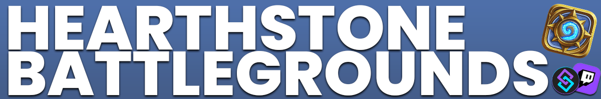
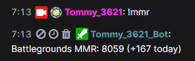

Twitch
{: .label .label-purple }

StreamerBot
{: .label .label-blue }


# Table of contents
{: .no_toc .text-delta }

1. TOC
{:toc}

---

## <span class="iconify" data-icon="material-symbols:description-outline-sharp" data-inline="false"></span> Description

Display your current MMR and your today's MMR progress in chat.



---

## <span class="iconify" data-icon="material-symbols:cloud-download" data-inline="false"></span> Required Plugin

-  [Hearthstone Decktracker](https://hsreplay.net/downloads/)


{: .highlight }
You need the decktracker installed and running for the MMR to update properly.

---

## <span class="iconify" data-icon="material-symbols:content-copy-outline-sharp" data-inline="false"></span> Import Code
```
U0JBRR+LCAAAAAAABAC9Wltz4jgWft+q/Q9s9nWcyDeCu2oeAh0cA003NwPeTG3JkmwcZJu1ZYIzNf99JQMJBkPSmanpKldjnaNz+845kqX8/s9/1GpXIWHw6kvtd/HCXyMYEv569UBgwhYpiyNSa0LGKPGTOItwWvv2bXj1y44bZmwRJ4KfwecQklfCmiRpEEeCIl+Da/mVgEmKkmDFdkQrSlmSIfGafqktGFulX25utsKu/YAtMvc6iG8Wb9b81z205nrBQnpoTjzMoju0Ex9llO5pYRAFYRbar4YJoqD9UXBcYViKA9zaxEf+sx2p7UkFOcDCeuIqDQVhLEHZwJJGDEOChoIlXUXEAxrWPKTtjSum/S8jGSkbVoyTCLqUCJk8GqRE2SCaYdJO4vAh4AFIcs7kQZqWuA5Qexe0YoIYX12aUeKG9BnmKY9sle4ERjgOX2N+QkdxhLIkIRGrorIk8H2OyWGgj4K9kxKGXJFVxF02VGKQuiJCXpc0uQ4kFxFZ8jzPrcse9nS9fujAAWR1r67XPahLrgY1PlXVOWSuJxmKXFchkW8JQCdTWb4S4dWAfEw5C9wbeOk+j347pP7x9vJbKdSneVcVjvfL1CTsGPVi5lEBntAT4hEOFiInNhTk1pfHx2nAEX9OHx+/BSiJ09hj1/378eNjO+FWPcfJsq49Pq41XvcqUGXj8TFMUZzQwL3GlB4r/KzMUZ4yEl7PvvUKqWWhvx175eaMtGJcxAzP+is3RP5EpS/YtNn3Z9A9HuvRBXO/pv2WD7rowQ5ckz5ZZj+dz/ov1n1/MLqnGR/LnAHoEj7fat351kNTnoeb1TxvBq5ipNa9rTnTvozNSdwd7Hm4zID/39o++KGjfx3Er+/H9O1YH6CQ68qbmjvdmHC6oROzDWDrzrDMdu6ofdcKnZVr2oP5bBhbFGS2aYy5bOFT3B1XyGxz/+6H67lqM2eqA8vkv3MhT6c4b865nntX6cvu1M5wy1993/t48Dim8dRbbtbz6SAmppwOQ5o6dnOBzWr+IbfZsYcrdzrxsWks57Ol/2PUvOc2U9ukzBnpE1cZLkiVvW8xAAWPvX/nNj8M147Z1nt0uJ6owxxO9ajb6uhkRvXeRO73psOlFSxvS3EunsLP71weHZsc91Yzmk9lOg6NpTP7Jmxbusq3bKLYKccR7MZjK2ish0qbOTZ7chUdzKc0Q/nijuteoGg4gVxGr3UXWcFdsrdtb5fVSn0rQKvZyKqMEdrzmc4KRX0wCTnO4v0r8N3IToucPB8bkZ8fm2M6axTai7ni+90iF3Ru58R3hF+T7W841Q7e7ZfXHD54SIUPW/k0tFqLt3iO9CZ+EL51eD3YL1brXuSa7JrPq1Nc3pG9xe5ll98iZq9xFz4f+JANZkMRmwDzHENyGhxixOvkpkedhftg0yosDnStnOAuPsjfzOZ1y2swR8okRiXcm2s8G5Ry/ZBejI+WZ30+2wOq48t7VTvHbaHHLuqotxzy+pv4P8ZgX2OXdW39q6iN6gdO5373NDffxfLnsD2xL4Szzgtud7hvu5o38YL7XNRub9kGIhfmkQ2cGe+FdM/XwT9yfTqfbmSnqqdU6zI+EK/LPA+gWDcuzD+p04s5u+MbTB3unxXMxo3MDtspnk7O4uZV1KoYq+iBRW7v+05vSV/GomfcG/lwKj/jh2XshDTn9BHPL1Fvq5/qAwe9xTXbL/j+DbfCb7GG0D7la9cTbos1GKe7OPA+6697QPBPVlNls0DqIO7aIKhczw58OdbDc+Cv7j2nffZI59mcBO2Q25B/qPeIPDrp9dW5VdRlq73vidlo1v+Op5t0rHba7qwJyGhxVENLvxPMfWu2Xzv0DgIiJpsfaGkz9DDUu6aI+Sdx5zrwcd3KW39FvHjcQI82eV/s0+N+cglfNxpsY/2uzLLtZ2O8tXMJp07ozDrUDfv0Fc9jHS2er6VawO/0lsM1irJ5yPeERc7T0AntnO+7npzRXcP6euf/yO8Cvl+oWy0rsZ7Oyvs6uffFfiRz7mWK1P7C4etPp9VpcXsAr6EIhYbshkO+R5X7k6fYJ8phHLDB14zbvS3ejJX89ka7vdVoWV1jVflo2ilfAyt4z/rwuueythg9vO0RRF8X+1B97PA97lwdjkU+cL8K/m7Linu5UfB3bVbUYLdFcfXe7qAujvXw/lnqsfndgu/1MlEvVTl+2Z/tU8qXYn069q3cg6Z5Z49J04m4DcHH16oP1HqpP3VHy4vyPrIWD+SmVfTpcNjn/exlPsUcj0Ew4DqwuaGO2lnjqb5EebM/tq269cBKNnhn9rsHeXF5TT2XZ5/xg3+zOMDOea3k/DuhjaLOGgVNXgfDJ2huvzEgX6/Qvr9fyK+zdXHWp6Oxo7lzpQ2KPTn/dpwr9jPPp7UbNClplTGs8vXUN46P2MPPOrmrWj7/nnvC/LczHQh8uEz9FctTfAo7Szr59wLg8zP+TZMf7j3EvsIb/PrryVHCKiEoDlcBJRUnP7vDCArzEYNJ1dlQwZHCNRmSNKNsHNswCcRxyyXeEtfp6cb2EAggiMBtA0gauoWSVjcMyTAwlGRANFeFmNzqtydTn0ngL4Sd4BqcOSAyxL9j2utRW3H+8HMHSEGEyYbT5NLR0S+XTobWO/f7uxMij4f/B2SLE81rSIuzyKvWl5tJSpL0ZryIQ3hzt1p9hQzeDGMYBpF/c3DE9JWg5TiBaEmSm6af9mDKTK4mvd6EJ+c6xWHseBuXStcKJJCmqYZG6lIdaIakuVpDMmQNS7qiKRASxVCx9xkkZEU9i8OIMMYdS/8OLHYhHhFKEKuxBak9Xh1H7vGqJkBacZB+qT0vArSoBWlNJDOuBVEtj7OkdgRKDQe8torT4GMzUUy3J/L/bgAA2u0zJaAhDXk64iUAAC8BFahSw/DqkufeurIh65ruKZ8KPADnK+BPRh58IvLr69L9w2mYzsQHNqALFBdIxAUabxHIlRquy+MD64QodZXUZfUvj8/fGBcc16KY1QgOtmmJeHOqZRElaSoyrraM4meejJAVbzi+kGftNk80cCaOng6Ji1RXcmVN9Ft0K7kawtItRg0daUDT9dPz9j8bxz/RacuxvHhIbwp1757U78pNRwSAhiLpt5j3OeB5EgR8AVIbqqrVoQE18nN9bn8BUOnq9krm3DK5d1X5eNpsnbhVlIZiGIpUdwmSNJljaeBbIpFGg7dpgnUPNz7lxNm+8DFH5I9gxvOVwlVKcDVsH0PoQPb+507fXtf2im9737Mf2t1dnb1MTHmHr7hvAWc8WZEkDBgjuFi1DzWVyW+OlujBp67Qfu5iuJjxVnAnt35BVNxqVtx3httLGlCGroif0P6vMExKShLik839ZkUDFLAWXLEsqdofXtEYwd2dV0l24EdxQpoxu0OIu8EqTNqyWBEjSQRplfCVuFROWUsIIMkFDoHYBS4EUzIiURqwYF3phU9jF9JWHFMcP5/4khXSq2mHF77V+B3dD8OI7XZv4FyqPxM3jflmkI1Isj5KxTdiiwYkYmUiC8I9vxjZXcG//dGAvLX9imxWccJTWVx/Fxv3a+V6d6N+eqG/pUouYfC6zkv1j/8Dx1/0ZOEgAAA=
```

---

## <span class="iconify" data-icon="tabler:tool" data-inline="false"></span> Installation

1. Download and install Hearthstone Decktracker.

2. Copy the import code from above and import the content

    

3. Move to the `Commands` tab and enable the imported commands

    

4. On your keyboard, press `Windows Key + S` and type `%appdata%` into the input field. Go to `/AppData/Roaming/HearthstoneDeckTracker/BgsLastGames.xml` and make sure the file is there. Copy the entire path and paste it into the `Set Argument` subaction.

5. Done! 🥳

---

## <span class="iconify" data-icon="material-symbols:notifications-unread-outline" data-inline="false"></span> Commands


- ## `!MMR`
  {: .no_toc }
  
  Displays the MMR in chat.

---


## <span class="iconify" data-icon="material-symbols:published-with-changes" data-inline="false"></span> Changelog

| Date        | Changes          | Version |
|:-------------|:------------------|:------------------|
| June 22, 2024           | Fixed an issue not returning MMR before the first game of the day | 1.0.1 
