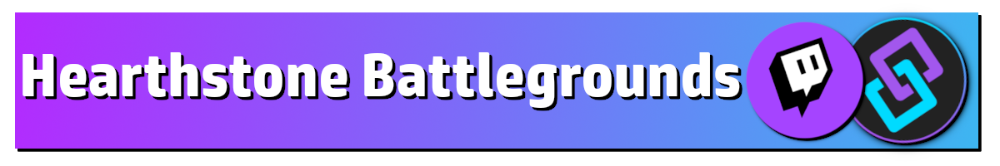

Twitch
{: .label .label-purple }

StreamerBot
{: .label .label-blue }


# Table of contents
{: .no_toc .text-delta }

1. TOC
{:toc}

---

## Description

Display your current MMR and your today's MMR progress in chat.


---

## Required Plugin

-  [Hearthstone Decktracker](https://hsreplay.net/downloads/)


{: .highlight }
You need the decktracker installed and running for the MMR to update properly.

---

## Import Code
```scss
U0JBRR+LCAAAAAAABAC9WVtz4jgWft+q/Q9s9nVM5BvBXTUPgQTHQNPNzYA3U1uyJBsH2WZtGXCm5r+vbCCxwdDpzNSkyhWsc3Ru3zlHsvT7P/9Rq91sSBR7YXDzpSb/kg94/jqMmHk67HuB5yf++/gNqEt1RYB0vYR1sXlzYCMMcuLv2Qt/DaBPMt4nAiO2jFkYkFoLMkaJG4VJgOOaTljt69fRfjqfARO2DKNsDoNbH5I3wruhN2Id1MU3AiYxirw1OxCNIGZRgrLX+Ettydg6/nJ7uxdWdz22TOy6F94u3y36r120qL5kPi2aE46S4B4dxAcJpRnpj727GJbchXu1fOQ/+5HakZSTPZwZSGypKSGMBShqWFCIpglQk7Cgyog4QMGKg5Sj/nza/xKSkIPu4jgJoE1JJpM7TEqUHaIJJp0o9J887mOUciYH0rjEVQCnGpsCLvmEbHx9bUaJG9ItTGMevCrdEQxw6L+F9YyOwgAlUUQCVkVlkee6PB+KgT4J9kGK73NFRh53UZOJRhpSFvKGoIgNINiIiILjOHZDdLCjqo2iAwXIGk5DbThQFWwFKnyqrHLIbEfQJLEhQyLeEYDOprJ0nYVXAeIp5SJw7+DFxzz6rUj94/3lt1Koz/OuKhw/XY1vM09q7IweEYdwsBA5syEnt788P888jvg2fn7+6qEojEOH1QePk+fnTsSt2obRqqE8P28UXtoykEXt+dmPURhRz65jSk8VflbmOI0Z8evzr/1calnob6de2Skj7RDnMcPzwdr2kTuV6SvWTfZtC3qnY326ZPZDPGi7oIeeTM/W6YuhD+LFfPBqPA6G40ea8LHEGoIe4fON9r1rPLXEhb9bL9KWZ0tabDyaijUbiFifhr3hkYfL9Pj/9v7BT131YRi+vZ/S92MDgHyuK20p9mynw9mOTvUOgO17zdA7qSUPbMO31rZuDhfzUWhQkJi6NuGyM5/C3qRCZof79zjaLGSTWTMVGDr/nWbyVIrT1oLrebSlgWjPzAS33fW3o4+Fx9K1l/5qt1nMhiHRxXjk09gyW0usV/OPuM2WOVrbs6mLdW21mK/c7+PWI7eZmjpl1lid2tJoSarsfY8ByHnM4zu3+Wm0sfSO2qejzVQepXCmBr12VyVzqvan4qA/G60Mb3VXinP+5H5+4/LoROe4t1vBYibSia+trPnXzLaVLX1NppIZcxzBYTw0vOZmJHWYZbIXW1LBYkYTlC7vue4lCkZTyGX02/eB4d1HR9uOdhnt2DU8tJ6PjcoYoSOfbq1RMABTn+OcvT8A1w7MOM/Jy7HJ8vNjc3Rrg3xzuZBct5fngsrtnLpW5td0/xvOlMK7+fqWw4WHVPiwl099o718j+dYbeGnzLcurwfz1Wg/Zrkm2vp2fY7LD2TvsXs95HcWs7e4Zz4XfEiG81EWGw/zHENi7BUx4nVy26fW0n4yaRUWBV1ry7sPC/mbmLxueQ2mSJqGqIR7a4Pnw1KuF+n5+Hh10eeLPaA6vrxXdVLcyfSYeR31VyNef1P3+wQca+y6rr1/FbVR/cDZwu2d5+YPsfw5bM/s8+G8+4o7Xe7boeZ1vOQ+57XbX3VAlguLwATWnPdCeuTr4u+pOlvMdqJV1VOqdWkfiNd1nieQrxtX5p/V6dWcPfANZxb3z/Dmk2Zi+p0Yz6YXcXMqajUbq+iBeW4f+05/RV8nWc941NLRTNzip1Vo+TTl9DHPr6ze1j/VBwq9xdY7r/jxHbfc72wNoQPK164X3MnWYBwf4sD7rLvpg4x/up5JuyWSh2HPBF7lelbw5VQPz4G/uvec99kTnRdzEnR8bkP6od6T5dFZr6/Orbwu251jT0zG88E3PNvFE7nbsectQMbLkxpauV1v4Rrz49qhdhHIYrL7jlYmQ08jtadnMf8k7lwHPq1bce9vFi8eN9CnLd4XB/S0n1zD1w6G+1j/UGbZ9osx3tu5gjPLt+ZdavsD+obnqY42z9dSLeAf9JbiGkXZwud7wjznqW/5Zsr3XS/W+L5pPNy739N7j+8XGkbbiIyXi/Iepo9uth9JrEeRInmwtPj6021329wewGsoQL4m2v6I71HFwfQldIlUjAPW+Jpxd7TFmbOS3874sLcar6prrCofdTPma2AF70Uf3vZcxh6jp/c9QtbXs32oOrH4HnchjyZZPnC/cv5e2wj7qZbz90yW12CvTXH13q5QF6d6eP8s9dj0fsn3eklWL1U5ft2f/VPKl3x9OvWt3INmafeIScsKuA3ex9eqD9R6qT/1xqur8j6yFg/FlpH3aX804P3sdTHDHI+hN+Q6sL6jltzd4Jm6QmlrMDGNhvHESjY4F/a7hby4vqZeyrPP+MG/WSxgprxWUv6d0EFBd4O8Fq+D0QvU998YkK9X6Njfr+TXxbq46NPJ2MnchdQB+Z6cfzsuJHPL82ljey1K2mUMq3w9943jk+3h593Ulg2Xf8+9YP7bmg0zfLhM9Q3Lc3xyO0s6+fcC4PMT/k2TFvce2b7CGf7669lRwjoiKPTXHiUVJz+HwwgK0zGDUdXZUM4Rww0ZkTihbBKaMPKy45ZrvCWu89ON/SEQQBCBuyYQFHQHBaWhaYKmYSiIgCi2DDG5U+/Opm6J5y4zO0EdXDgg0rK/U9rbUVt+/vBzB0hegMmO08TS0dEv106GNgf3B4cTIoeH/ztkyzPNG0jzs8ib9pfbaUyi+HayDH14e79eP0AGb0ch9L3AvS0cMT0QtJpEEK1IdNty4z6Mmc7VxPWdf3auk5+3TvZxqXQtRwIpiqwppCE0gKIJiq00BU1UsKBKigQhkTQZO59BQpTkiziMCWPcsfjvwOIQ4jGhBLEaW5La881p5J5vahlIaw7SL7Xt0kPLmhfXsmTGNS+opWES1U5AqWGP11Z+GnxqJgrp/tD9300AQKdzoQQUpCBHRbwEAOAlIANZaGpOQ3DsO1vURFVRHelTgQfgcgX8yciDT0R+Uy9dMZyH6UJ8YBPaQLKBQGyg8BaBbKFp2zw+sEGI1JBJQ5T/8vj8jXHBYS0IWY1gb5+WiDenWhJQEsdZxtVWQbjlyQhZ/obDK3nW6fBEAxfi6KiQ2Ei2BVtUsn6L7gRbQVi4w6ipIgUoqnp+3v5n4/gnOm05llcP6fVM3Q9P6g/lpiICQFMS1DvM+xxwHAECvgDJTVlWGlCDCvm5Pne8AKh0dX8lc2mZPLoqfTxt9k7cSVJT0jRJaNgECYrIsdTwHRFIs8nbNMGqg5ufcuJiX/iYI+JHMOP5SuE6Jrgato8hVJB9/HnQd9S1v+Lb3/cchw53VxcvE2Pe4SvuW8AFT9Yk8j3GCM5X7aKmMvnd0RLd+9QV2gdunE7vGN8L7uzWzwvyW82K+05/f0kDytDl8cu0/8v3o5KSiLhk97hbUw95rA3XLImq9oc3NETwcOdVku25QRiRVsjuEeJusAqT9ixGwEgUQFolfJ1daMesnQkg0RWODLErXAjGZEyC2GPeptILl4Y2pO0wpDjcnvmS5NKracUL32r8Tu6HYcAOuzdwKdW3xI5DvhlkYxJtTlLxndimHglYmcg8/8ifjXDBf/wfJrx15cQgAAA=
```

---

## Installation

1. Download and install Hearthstone Decktracker.

2. Copy the import code from above and import the content

    

3. Move to the `Commands` tab and enable the imported commands

    

4. On your keyboard, press `Windows Key + S` and type `%appdata%` into the input field. Go to `/AppData/Roaming/HearthstoneDeckTracker/BgsLastGames.xml` and make sure the file is there. Copy the entire path and paste it into the `Set Argument` subaction.

5. Done! 🥳

---

## Commands


- ## `!MMR`
  {: .no_toc }
  
  Displays the MMR in chat.

---


## Changelog

| Date        | Changes          | Version |
|:-------------|:------------------|:------------------|
| June 22, 2024           | Fixed an issue not returning MMR before the first game of the day | 1.0.1 
