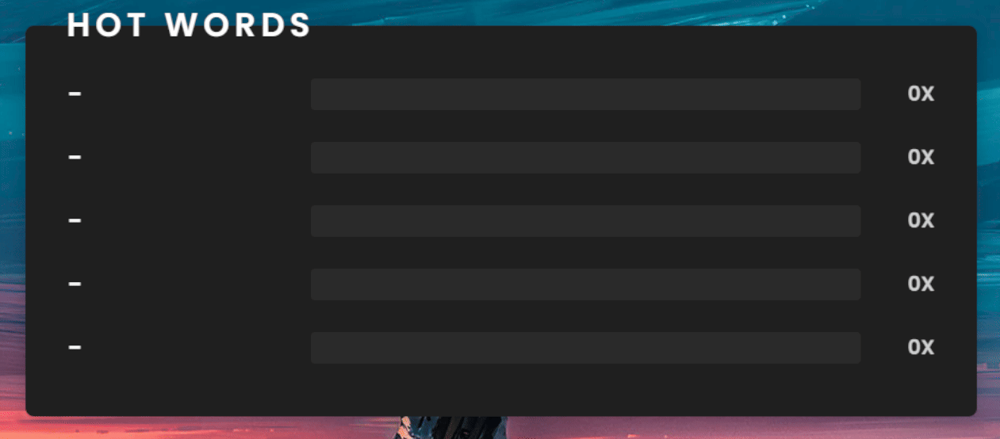
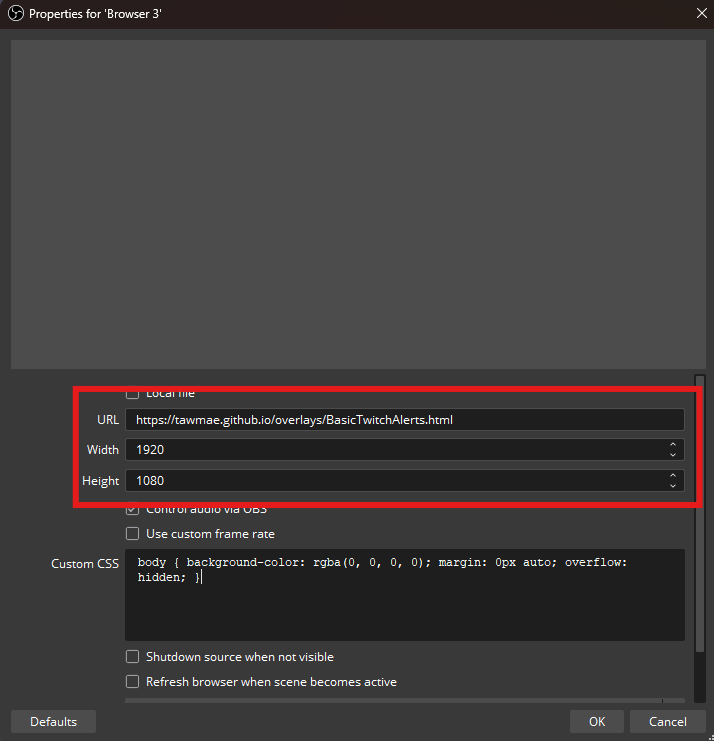

Twitch
{: .label .label-purple }

OBS
{: .label .label-yellow }

StreamerBot
{: .label .label-blue }


# Table of contents
{: .no_toc .text-delta }

1. TOC
{:toc}

---


## <span class="iconify" data-icon="material-symbols:description-outline-sharp" data-inline="false"></span> Description
An OBS overlay that displays the top words used in your chat in a dynamic leaderboard.



{: .note }
Duplicates within a single message count as a single word.

- - - -

## <span class="iconify" data-icon="tabler:tool" data-inline="false"></span> Setup

1. Go into Streamerbot and head to the tab `Servers/Clients -> WebSocket Server` and start the websocket server. Leave the adress at `127.0.0.1` and the port at `8080`. Check `Auto Start` as well. You can set a password, but you don't have to. If you do, make sure `Enforce for All Requests` stays unchecked.

   [](https://tawmae.github.io/assets/media/notif_sb.png)
   
2. Copy the URL: 
   ```
   https://tawmae.github.io/overlays/HotWords.html
   ```
   
3. Go into your OBS, create a browser source and paste the URL in there. Preferably set the resolution to your canvas size. Also I'd recommend to check `Shutdown source when not visible` and `Refresh browser when scene becomes active`.
   
   [](https://tawmae.github.io/assets/media/notif_obs_1.png)
   
   [](https://tawmae.github.io/assets/media/hot_words_obs_2.png)
   
4. Done 🥳 Once you make the source visible (and it loads), it will start tracking chat. Refreshing the source (i.e. hiding it) resets it.

{: .new }
To have the events in multiple scenes, don't create an individual browser source in every scene, but instead create a new **nested** scene and put just a single browser source in there. Then place that scene into all your other scenes. This way you won't have to create 20 browser sources for 20 scenes.

- - - -

## <span class="iconify" data-icon="material-symbols:dataset-linked-sharp" data-inline="false"></span> URL Parameters 

To customize the overlay, you can add URL parameters. The first parameter gets added with a `?`, every additional one with `&`.

Example:  
```
https://tawmae.github.io/overlays/HotWords.html?top=8&font=Outfit
```

---

### <span class="iconify" data-icon="ion:color-palette" data-inline="false"></span> Leaderboard Count

Changes the count of the displayed leaderboard. Leaving it empty defauls to 5.

`top=10`

---

### <span class="iconify" data-icon="mdi:format-font" data-inline="false"></span> Font Family

Changes the font used for the overlay. Supports standard fonts.

`font=Arial`

`font=Poppins`

---

### <span class="iconify" data-icon="mdi:format-font" data-inline="false"></span> Font Size

Changes the font size.

`fontsize=24`

---

## <span class="iconify" data-icon="material-symbols:published-with-changes" data-inline="false"></span> Changelog

| Date        | Changes          | Version |
|:-------------|:------------------|:------------------|
| December 06, 2024           | Release | 1.0.0 |
