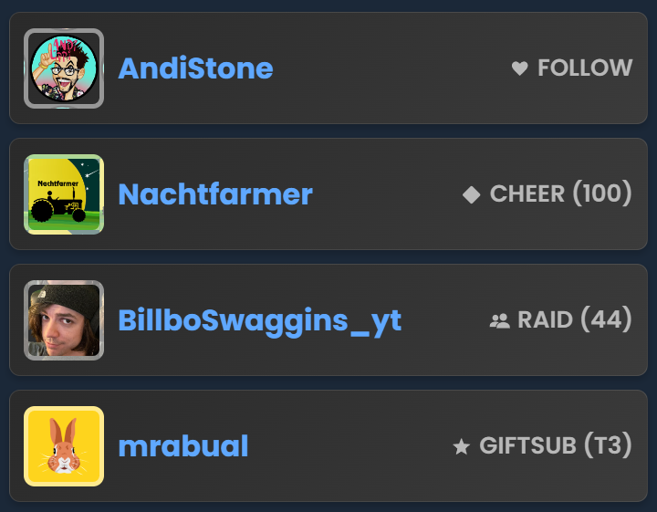

Twitch
{: .label .label-purple }

OBS
{: .label .label-yellow }

StreamerBot
{: .label .label-blue }

# Table of contents
{: .no_toc .text-delta }

1. TOC
{:toc}

---

##  Description
Display the four recent Twitch events in your OBS overlay.

Supported events are follows, raids, subs, resubs, giftsubs, giftbombs, cheers and kofi donations.

- - - -

##  Setup

1. Go into Streamerbot and head to the tab `Servers/Clients -> WebSocket Server` and start the websocket server. Leave the adress at `127.0.0.1` and the port at `8080`. Check `Auto Start` as well. You can set a password, but you don't have to. If you do, make sure `Enforce for All Requests` stays unchecked.

   
   
2. Copy the URL: `https://tawmae.github.io/overlays/RecentEvents.html`
   
3. Go into your OBS, create a browser source and paste the URL in there. Preferably set the resolution to your canvas size.
   
   
   
   
   
4. Done 🥳

{: .new }
To have the events in multiple scenes, don't create an individual browser source into any scene, but instead create a new **nested** scene and put just a single browser source in there. Then place that scene into all your other scenes. This way you won't have to create 20 browser sources for 20 scenes.

- - - -

##  URL Parameters 

To customize the event list, you can add URL parameters. The first parameter gets added with a `?`, every next one with `&`.

Example:  
`https://tawmae.github.io/overlays/RecentEvents.html?color=red&font=Arial&usernamesize=36px`

---

###  Background Color

Changes the background color of the individual event bars. Supports hex codes.

`color=white`

`color=FFFFFF`

---

###  Font Family

Changes the font used for the event text. Supports standard fonts.

`font=Arial`

`font=Poppins`

---

###  Username Text Color

Changes the color of the username displayed in the event.

`usernamecolor=blue`

`usernamecolor=FF5733`

---

###  Event Text Color

Changes the color of the event description.

`eventcolor=green`

`eventcolor=00FF00`

---

###  Username Text Size

Changes the font size of the username text.

`usernamesize=26px`

`usernamesize=32px`

---

###  Event Text Size

Changes the font size of the event description text.

`eventsize=20px`

`eventsize=24px`

---

###  Container Width

Changes the width of the event container.

`width=700px`

`width=50%`

---

###  Anonymous Follows

Replaces the username and avatar with placeholders for follow events.

`anonymousfollows=true`

---

{: .new }
To clear the event list, you can hit the "Interact" button on the browser source and then press the `Escape` button on your keyboard.

---

##  Changelog

| Date        | Changes          | Version |
|:-------------|:------------------|:------------------|
| December 01, 2024           | Release | 1.0.0 |
