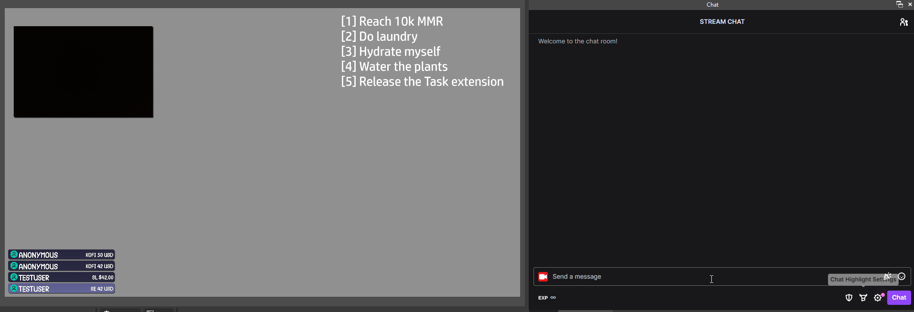
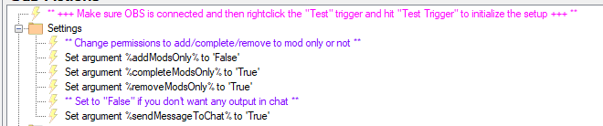

Twitch
{: .label .label-purple }

OBS
{: .label .label-yellow }

StreamerBot
{: .label .label-blue }


# Table of contents
{: .no_toc .text-delta }

1. TOC
{:toc}

---


## <span class="iconify" data-icon="material-symbols:description-outline-sharp" data-inline="false"></span> Description
Add, complete and remove tasks from your OBS overlay vía chat commands.



---

## <span class="iconify" data-icon="material-symbols:content-copy-outline-sharp" data-inline="false"></span> Import Code
```
U0JBRR+LCAAAAAAABADtXVuTosqWfp+I+Q9Oz8M87GNtLqJyIs6DWoWiVXZ5Q2X6xAQkCJRcPAJaeOL891mZgIKipVXVvXvP9N5BdElCXtb1WyszyX/++7+VSl8cPVC+/LX0T/wDfrqKo8PPLyPLWdl6aaz4S//LX5JCJQxMb42LA2XrKPq+YKOvfctzcQl9B//vCzTdR2trFSSFZhCs/L/+/nv8+p1hBWao3lne7z5p7n8C3NydGTh2tk1vGLoNlNThhradljmWazmhI+1bx4W47F/kiS+akhubQurw4c5/x3dKaREptjTcxcWiWuEXHFPWdU0pV+psvazQOl+mNBppUFRVq1zaOfLaP0I91PMdI/d1V1FtHdcZrEM9V/KK7FDThbXndCw/8NYRPLRQbD/31CVOkAeMtReuLj6h2Fsl8oF6RfWvFVfznD1dT8qR56JwvdbdoKg0WFuGAXTPEvOIoLFkKGsL0wE/+M9//eWoNCa5VuWrerXClWscT5cr+qJS5lmaKSNeoaqKslhQixzJ4w5EK0yeGsUcl5wl/IH4fioHf8+W5rt3PBLkOQ6QTCRdrioaRVO8Vq5SarVcqVW1sspRTLmma3WtTitIrVMnXY5Hq1Bctb7gK+XqosqUKwzPlXm6QpVpVUEgaVxdZdG50VYo+vNGe/jx95zQnGpJETlS8TyROlJ6pPcn5Wt9oYNoIf2kHVLc+uu3b1ML5HPrf/v2ZKG153uL4K7/MP72TVhDy1tvvaxWvn3bVO6oO5Ziaf7bN8dH3tq21DvNto8bfG+do8gPdOeu5a3171AtrjFf4d+PCaVGgd7yNEJqbdZfqQ4yJqy909pS8HVL9Y7vPS77G7X9as/Z4UpluN3jUrNVR4qU6VPtfrCiEWOHctQc67M+JU+pcNy2QzT2+y1X2ilTzhWFPofYoa2OuIk8M6lHu2vLrOTPZ11B7zQjedaH5/gQ7XLvUMiRTHUqRY9Od6O1uHuVoQOVqYTDmWyr7nCX7evYkVitDXUwvAPP9uDf8HH5ulLdB+ijB/U26bnzuppHzRe1LexQ1LyfPJhdFe6pzgTKoW2rYYit5labdn0YmzF3+I3aagp6W3rRZkO711qmz+A64d9GfHVwXwkNdnNGCuVRgxdb3bEypbdqe2JI0J7CPhlTihMm9FAYCpSF+75/v9XcaZ0uGQf0m0ZO3xbvKUO0hyZigp0oBEd19TXxJe1vfAHNKLENfHK4hE8V43nU2B61s5KthjegmyLmofYgMTK8J3XsrTwyVtAmL+buYX71qd4gV0d+7Jl6xUl/MGpxz3O330XUvi+23DJfQG5CedqnMJ97o2Wu7zEN/dN7xXXfp3X18uNd5ft5Td3xRehh9z2V1SYqI+y0B26jtW1HmfZN+HejWoY1YewAgQ6IQsITa2t0W10Bud0NevGMAfBNbQ8M1eEzfBgYWrtujKnuGD8vLk1b7TSM+WxQFdsmpXWau69WHdoSWHUq2I+OttLaJj23uJUa8Utl1n9R2e6SvOscnpcZm1I6kvXoQDsjnprPtGA+nZyrx1LbvPXI0KYyrWzmoGvybLiD37bcts1H5hXqq4eozbnPbNfUdjSFXMkWrWUBn7M07dpaR4pUq+nMp687eXyWf3yBvPBEJ09kYK9H/8D6O3GkHSI6PQFZxvpqhGOmu5tgHROgr5FhDdiuPQfdnDB9sEkT67HVsHR6ayHyW/o6n9L2rCVW4bLElm/E9ydGL2pYs1aXx7SdQ1vw7EvM66JxN3vQ7j+wzInt1S7WrcO9R7tpIrdv90gZNwKd2WI7KY8K64rH0ebd0ZRzVBjDlI5lagZjxDYPbO44tiPENiZ1NUj/FRd4DvYTsc2NitssojvIrtgyTPKshe0mR82nYJOpwNZHRkobSZvaIFvLVUEfz/L+M3Rl6AgrtS0txc5wA7oSyVOBgrFSCti3hD/h/yV9AZ5S2qwbim3ZVDt9O2+T42sBtuucrEiMsNJaBv1031gVvQu+NSI+81j+xuKbegMyuNVmgxv1RvRBd8C3NmngP/bRSHxZIXgSyps7lZWiOVP0bAA+bhg/6w5tvTNcyMxwBbJCI5pnnqD9R2FrKaRPwzHQncLjQnD/qxsg0ZFB5sn7NagT7E4/6WNXnLSaiY/Esigtk3Yd8PXx+y8N/HunzFbknadxY4vbAtpxIItxnw64BPpH86Q8pkcX46DhlDMBQ9iygPszjLSp9F77EWH/PlryloLfa3EDaBN03Dy2e1Ghfj8QX/ikMhrgF3nTa3XVPS54SPRpAvrekShRONiKr1axDXkq7nPsd6dxfwkGdIegE9xuxEhcL+WpINHKdGDd6NOJTE4Yc6PRQ6xj1Bj8pjKVV3NGiDHCKX7CMroUl1KEHD76ajXbYNN8eRr72Hkiz2BTPLAlqQz+siMfpTfBoFj/cdvY1kgv4Jt2iJFptVUhdmPUlnzUapravWconSGFOk/Vx2hPn/BAN3vziPWd6W+QE9uczPOuMht62lQMQZ+CR3ZoakA7eXSunq6vMuIG6L5SLd5EbB/wyBP8lpbK9AHiFd5VI24LmPp35Ajs8wzr68Qq1KcDliE8OMLMJ1gF4puddv+aYvbfnqMm9LG/JvdbgP1j/ewAvztYBgAfTeczsX7y3q7igR3EPvIJZI7C8gZlNOAG43lXBywpseLD6wqxg3pq458tY3Uudojt5mCLbUvsp4eRPsE4X4hksPn7cmgH9IPK4C2I2+htb9T4HfTHVmeNUGrzT+DjbWThuMAzVFfy1fs87Q5+J7Y1T6P92CfItfH4m8hBnuik5aIvtnlay/QZ21V0L0Ib9fTvq9ouGh/EgvBOQRvk/pFeFfXTBT2kErt5SqMI5LBLbF7rmrqw3xj2cWw7n2o2jOleaQuHetvdjcpssV6F8gMNtrhvyow0Uam+B3bqmMcxDuh0uSHo4WDWdbH9RRS9kdtg52bDTWbclsrw8Le9G0/5pTyDMbX5Ez9SRL/5dLjE7yAK/FlnCfrZ3IC8pHGwKbeHfZUZ7sYM5+vH2LaQ72AnZ00fftsX6oXYENsdCXwWjKfTf4aYnLumv2APA5WVL9UNvpDeaI50vt8H/obyTBvNZwhjpgyvMZ5q+hhr9FqPOw9eIn7BEs/ooaYCjmex/wA+QT1LXF9adzhhm74yG3jdqOEejxHbqQSP5d6RcL2jc3p/aA9FoH+dgwwDTsd4iOq1kNGNjsZNYgQzM84G/4xjDCvvx/UCH5PEADn57rUGls5K4OO6PPCAxjGbOIt9RxLfaDHeF5YyyBL8jct8sSUQ24ltsDrlGfDdMZahKeLXUx6DbEM8hHVH3NeL/QSOMzTwWfk2aBM5vgEYGN4TdiQeT+RQBp/1hg8ojGcX+RyIjf3vKQ050N/XjcZIUa8FfB9TBtgUG/vOa+iqTOdG71hvC3IaRe/GYzj4EsBrgI0E3I+3YjnQJw18addUBdkEm2tpmP4U8TtYnzK+be+fzmOUvU/A7w9J7InzSdgnpWWPy9UGMJEHeJpRZmAHHdpW3UGIc3g4d4j5nOkD4BbJJ/melkn6An3CcYStExpXcGyp6jgH2ZYqGN8+zWiQg4A8uxiJq0J+Z+xqEhtRQ8AmEtShtcwkj7fd5+OgTR/TdQD4HPxUiGnxNu7P8LVT7A8+mLM60cFJFp+1Xzks10T+Ylwc61o7puslrLko6FfRPRnryi0yGvuJMcgE+BrcT8GVRwbg+maN+GmXwn4M23JDzegBipov82kF2wOwMRjzm3ZiQwyVyOYZvY75HIHuAx8rhuwIPtimongnn6fqULm6yDhHcUyUsdNHWIXCed8Q57iv1ve8zm60WFd4EWL9d+RlTuRh0AnAFkvRguiUaSOI4SHWBNvFbRJ7scP4LZEPIuOPJ77teju5p51xIU/RIfmjkNh54rMONJjumlpR2+fGl9TxCvFgDeH4huEmqd4X5krSGKpD4oHamzy/MvetMXwkd57CMdgGmR164n3FeHpHnjuD4c/K0jXyQK7YP62wbcXYcdIWIpD9tI3XFCvFcwccrU67GCcXyN31dinTbqhNaUueicazlfUh3D3gX7Cf58Z0Y1sxHZL4NoulJx74hUYGk5D8IvErUSzngAtoBP5ZdYeAC5sbjDvFtmmCrall/Q/J7bvDVE53F/XjPfpy8k6x/rxLn5iUr41AvBcKdes2XWvWUvlZjD1DZzNts9QFG1xIk4J4+4S3BfMHWVmTsD2/2OZZX3TFmLP2E2NNkGPwO/ZGS/PVne4GQQwmtuUNcmiSA+lGKabFtEF43i/mgU25b86rxGO+wl8dycv5uZdb7E0SL02s9+KS2KclWD4Tz4mtOdgE4ShmvWwDPotvKon7mgHEgOD/BApiJRwTmCB/6Xhju8A+XcREH+LPRX3e84IiMa6UzieleZM0Z2CD3WymdvX8fGdc5zXjiH3Xia0bkNjl6eez0d589mSoTv1GfsXXNfnT46s4n1pMR9WVgrkDtgB8fwFNL/vVq3l2vdyfYuTmC4w/wvEYwdexXhCa6uwpDl0k8QKKLmHrD+pG/M4FO5W5jnHFHyijsmNHiMzvE1klNCT03uOoBsZXoQrPPF2MTX4g/TK5zCQvtvwszJCL15OczWA2OOhEi8J4+Jqx7PO2RGYfyLyTTWzSaF8Wjhx+pVqmoLryCjkQL04xpuS+yjPtCeyonc9b4HgTr18aeL0079SO8wW9UYN/tvA8R4BxDcSbBp63fF1IVKoTPJ4jvxo3LXkL0SSnslQkPMc58JK5Ux/oD3i7+0LyWPmx+Udrd65v75PzN8c27Vx++kfYsqJcBsEV04HRZYO8DLOArdpypDLUjbmBrH5cibsvxZA319nM5WAPOsr1VMYOey3RIPNCSXw5YYIVahmvvbd4mMlrA94JIPZY6UCrTH55JAOd9Wx+O5s7bjUbov261an+boHnbQ79EtRZk9JHyzN56WI5inO2qX8RQn1k7gBz/ibiMTnSVm0LoBeGVVlFQppfx1hImVJeb8QJaCaBz37yVIeP1Kng43l8+WHf13GSC8drBLfzWXcVr/8DmoGew9i7MsMBPpfuMX4H2n08xr0mj9UZegrxC8RHrFAU+wNlWkl8RZKHe+h78hTHC/HcNcQTvort07V+98YYsyiPl+EXyW1/mD7ZvJadxgOCr7b+UL7/8j+//M/Zcdzofwrs6pDvRk0H5CG4Nd+e6fflfMflWL/wnWzu+ijeP8y9jsSzNL0ch8f1HubisnOtDadrNUywAf1D7H2+nU+1vRfmELLzhr/i/l9xf9H1K+7/Fff/H4z7D/Z+OiTzZHhe/iCzQzUXr0vUTXgprme/1iLZg5Lx/0Kw5+HjqPE6GzXWIsQ3BPu93IYpj3MUh3Hk2r+m/ynvqSHzupkD7SUHr5voZnALjn8yetKK5y2uw+Z72h+tHyiI9R7gPsgX6GeAdfVxydkaRfYn5dvH+o/3JLWM2IZHWyPBjiuCrcEeTNkgWSMBNL4X+NkomdPCczTX4a8fsjbi2Jb+VHgvt26o4epM5ne8twHw3v/D3EJsj/Nzuukekyi7HmprTJI5ygHBXALYODEcs90l3DPVB9vFcZ086QMtJ5+CazCGSeOonO1pcW18fxSXeXit3LPV3D0upVcN4sq3+g3yjffSPCMH7ArYiNFUw/jfHjAC3udzVbyUrO9K1ik9AP6mXi+POb6umQc7sjVk3IM9zsU6eJzjjftxsw2O6Zy16bGdEag9vXPtXl/n97XDcRt/2tieXA/7PZB4b0xHbttkP22v03+R436l+x784/V3j2SdbWYP5vU0+6BdvlGG87JwjMfG2hTGivdS4DXhgGUzcedSbGm1w9qs4fW2OW7zctx9zTNnY/P4OrdW7kYbdyVWtXdpDKCQ2ImnTtd5Ne8VwBGAY+O1DGwTcMUr0YE/YJ3CeZoV5y5oNbO+/INrpArXoP+kaxby475xTdJtsfDb8UXq07R47X+6jy3eG3b/kO5JIH45jS0K94rdSMPb106+R9eu59dbMbdC1qEf1lz+LGvIYv7tY6nfxAKafipGuXLe5Ch3asxZvO8P/DDB5XFuj9A0WeedW1vYoX7yPNEfKKNtwDRun9r7BkJDQu99bE7yjthf3Dd+Fvrlcwz0cCNNuUzu+uPrF4geJHtRpDYvZW1sdu9rr/VoueKkeL/riQ5+dv6pyKfjvS6BjffUoFx+59r5hh/IuyzPjvNPJzzN7rtK4pPCfVfF14WcFsb6OR8ax/L+r1zRr1zR1Xb1dG5QCo9jkSJ5X4yuxtZX5nZvXkt9sc6jPYhHMbFhiUS+tQ1yhjugy1qZNbynN/MfBfNNU47rdZ7I/i0UHeb5s+3j70eIX3vIxOtPhET+4/wu2Dwbf5fgfC7pUzAmR6WxfD5PPgiHuC8PSZz/Pcdxjd1I93nEOmw+jxpB4d6TE9m5PW9y0YYn9ja2L6aG132APphz8GWidU/8Jt7zf4tfKqqXtFfQjxvzKOOj/fmne/EP/PaTfOwNmP3Passzdu8HriXJyPEuFxtIw82AMc2r9gvFsnr1GHOycByP2H16DmMF3+Jo01cci+cxA54PYA/r5a636/F1eQ3WNc/8PPtiIK7Aa9uSeM0mcS7Ev8F81l3jtTJ4jjTrG/80eaeP7IHB+9wffvpckim3Bz/FGpijdRNgK4WV6ub8aIHvlKILa/3+INkHmjiSKeP8xPE6zz+Gvtn8SBP4naXpW7jtu8U7f67vBGTk4Yf4xA/ENx9ZP3fq8/A3X4p8Hfk2x3vW2Z/1aUU2uujeOb/2xr7qo2/bGF1rbojTt7+1cQ1Nf6gNvu27m7fs/cyuBSX0Sff5knKcI25v37tG9Jr8Fm4bxzzke01JTnKLHH6Lc5JyvP6b+mo13Evff+lGb+WHrrevl/Jb6bwHWaeZfDsnF5P8SWiY7/P+2ztv71P+fnK434NMMFPm22LPJEf96n9PPT3s8ZZ28lV7vE++W/SjaVe8drh149rhT6Bd1h/MGSHs4r0uroTnwiygj3lYI7k15I7k/Ug6/Th8+Ub8+b59Q6YKtAAfxt30rZZPtHf53N1wmd0r9tb3lT4XP/7J1vD8kDU778OL7/Q3p2twQB7SPZn7NXQdsIP4W2yf/t2pU10/t2YSv7cY/O1vJydFrNY68pyVZesFx5AkZ03YSjQKlHXRQSXkCV/Z6EPdD+1g7EnJgSSXns09dXp4RXJQTAUxLFdVy5UFq5criK+VVb7OlBlFYxheRwxNnZ5astUtw8T9pO6oM2d88Pi/47L9WS/kLIjbzgCxXE1/hTL6+rNO0lNb+skhH4qmPXma/9W1o5PGN4odnqUmPr1nHI+rsGuEkmyVV2lUX5TpGl0pV1SFLvMLhStXeZavUSqvUvXaeyhJM+xZOo70ILBc4/Tkku9OSyzNth7obxK0qP0r6UnpvEbzZa5aB8ms1mplHjFaeVGjFBrVqipDaT8ZPZn303OtO97mO1JTo/SqrvBATdDscqWiAzXrOldGdUah61qVqlPKT0ZN9hZqxuT50jIV19BLK33tWD45MagUeCVQ/N9Tgf09pjS+7XhayQNql7x1yfWCk24iz47PCfvPOkVRgnDGhKoUolWmXi+rGl0tVxQEpK3xXFnXeV1jFIZjaqfG7hrSUtR5C/pB2lLvl1Rfd7Un3fcVAzwM0PuUbh8WVgZpFb2iM+UF0oCidLVSVqpVuqwoC1ZVKZ7j+PpPJqzcO4QVmsRi+O2LgJ3Oty8la1GKvLCkee5/BaWt4gYlxQXpDINVGJQst4SKqH2llLIIIZqtc2VNozmgqVYvKzV1UeapBV9DHKfWef5nk9LKO4j622+/lZ6UpV7yw7Ve+toclSy/hDzX1VGga0BQrRSYulta45Eh20JL/BuYMNb9AHiQHAlHHjStICkojePb+AEPWGEFlmJbO5286+tBuCpBwxd4IwgXeFPXFaqiAAir0iwCV7fQyvVarVquavD/olqp1fn3QYdLvPkRmCHhyeYud57iKXnOgVOmxvDKYlGuVvkFIFSwrKrCUGWVUjidYlQNcZ8vsz/CoiZ00Tzsd0CiQmSWQtcGq0oMwNL1tqUtKHtiDt6QK+rcIX0gPhQNqLRcq6hMuVJTFAD3i1qZAWVnNEVnqvXFp9PvA9g+T8OLJ/u1cXNvHu+XkIEDvLioKmWtjgCZcxRX5tlqvVytAIhkuBpTL6DgJTLsD7U8Z97iUynPhRPvgIuJnaiztF6rVsssVoWKwiplXquoEGewlL6o8tpCY981kEKeXTcI9hqegbzaysrXtWK2XTewTN3pn0l7aVvxKabxIZHpreTAy7PnpfpeuC44wJE6MxKCLAPwJBM/OTe0uPgw0Fy59a5zN98+RfWgXydnnFouOaf1VPW+OPGJjFSeU4RcuLH/wOfY5lpZ64b++vC6Aq9pBS1lFYCLLWrS9pCSHJqZq9wyXG+tN72ggZAXkiNZj/sUPyK6gb52FbvggRU+JtcPWvh9fV3UevIEZtCFp5Di6yPd9cGTbwoHYdieqtgtz7M1b3sylJDUXlz29pG2BuhWkMBg6pwwb3XV99BSD0b6enMkbIfClm3pbpAvDCwnfR7fSc4RPhxvTMfd/aK/rrw1CCs+wxf3l7pj7ipxR09PJY5Ly6oeKHdVUMZ//S/zLBzHenkAAA==
```

---

## <span class="iconify" data-icon="tabler:tool" data-inline="false"></span> Installation

1. Copy the import code from above and import the content

    

2. Move to the `Commands` tab and enable the imported commands

    

{: .hightlight }
Make sure you have OBS on version `30.1.1` or newer

3. Go into the `Simple Tasks` action and rightclick the "Test" trigger and hit "Test trigger".

   This will create a nested scene and a textsource in your OBS that you can use in your other scenes. It will say "Task setup successful" in chat afterwards.
   
5. Done! 🥳

---

## <span class="iconify" data-icon="rivet-icons:exclamation-mark-circle-solid" data-inline="false"></span> Commands

- ## `!TASK [TASK]`
  {: .no_toc }
  
  Adds commands to the list.

---

- ## `!TASK COMPLETE [TASK]`
  {: .no_toc }

  Creates a checkmark behind the task. The task can be a number, too.

---

- ## `!TASK UNCOMPLETE [TASK]`
  {: .no_toc }

  Removes the checkmark behind the task. The task can be a number, too.

---

- ## `!TASK REMOVE [TASK]`
  {: .no_toc }
  
  Removes a task from the list. The task can be a number, too.

---

- ## `!TASK NEXT`
  {: .no_toc }

  Shows the first task in chat.

---

- ## `!TASK NEXT [NUMBER]`
  {: .no_toc }
  
  Shows the specified task in chat. 

---

- ## `!TASK RESET`
  {: .no_toc }

  Resets the entire list.

---

{: .note }
You can also use the line number to complete or remove tasks, e.g. `!task remove 1` to remove the first task of the list.

---

## <span class="iconify" data-icon="material-symbols:settings-alert-rounded" data-inline="false"></span> Settings

In the `Tasks` action, you can set the individual parameters to `True` or `False`. This will change whether only moderators are allowed to perform the commands. The default setting is that everyone can add tasks, but only moderators can remove and complete them. Reset is for moderators only.

You can also change whether you want to have chat message responses whenever you use a command.



---

## <span class="iconify" data-icon="material-symbols:published-with-changes" data-inline="false"></span> Changelog

| Date        | Changes          | Version |
|:-------------|:------------------|:------------------|
| October 23, 2024           | Added a method to 'uncomplete' a task | 1.1.1 |
| August 02, 2024           | Fixed the text source creation for OBS 30.2.2 | 1.1.0 |
