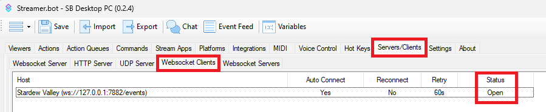

Twitch
{: .label .label-purple }

StreamerBot
{: .label .label-blue }


# Table of contents
{: .no_toc .text-delta }

1. TOC
{:toc}

---

## **Description**
Receive game events through custom triggers and interact with the game.


---

## **Import Code**
```scss
U0JBRR+LCAAAAAAABADtvdly28iWKPp+I+4/6FRHRXfH3qjKAQkgd8R5sFQSJdlWWRMl8dSOHTmBpMWpRVIydaK/6HzCfTtfdtcCOIEEKRCmbdpWRagsEWAOK9eca/jf/+//s7f3S9sN1C//2Pvf+Af82VFtB3/+cjlQD9Y97VVVq+VGv/x9/FgNB43uA74wUE9t5aYPHt1Dv9nt4BP6G/mNTR9Y1zcPzd5g/PCk0x88DA3+2f/HXmMw6PX/8fvv6WC/1ZuDxlD/1uz+3k+n/9djMv1vjUG7Nb+G7sWw88aMx+wMW63Js3az02wP29XpavAhPvvv5I1frMrsVqULgU/+V/rJ3uRR8rhpcckkihkRgnuRpcTznQo9HcvIi6jSgfNjwW0wWVzytf8auqHLLiz53HWUbjkcE0DgMk8+mdbQuqOHbvu42R90H0Y5L02O5n9lz+afe2zP2zt8dJ1BP7OM+kN32Ft9likAWk9q1AdownuxavUzEz6oju22p3Beem66HTN8eICJ854OHpr1OpzDPHAXAJyO0mrCCCcpqOPQ+ppQj0sReb7SytME/sd4ZJ0MDQ98Ob/+uVMSPLQiCpjHqQ09n2rtSaFiL/RlHMU8khH1l746GPUQpBERi09WntXsvPoT1Pnn/NP/nv3xzwykl1EtDxorD/nCAVr1s0ecfGOBwJaeP7jYwRkZtzR38vjgH3/9ddOEg37q//XX+6Z56Pa78eC3s8Orv/46eoDVPHUf7gP/r78efaBrTjiVf/3V7pvuQ6upf7Ot1i/ZIf+5OL8eDdxB1ya7srdnPd029WveeraV6uDPJ/J28tlVu8ptRQ4Nk217IN7Cv8N39596unMY/nHePTvo7NO79qfe3Wj/o64cPZvR/h/Xh41TDZ/p9jU8758dNN/UTw72n+zNaV/dvK/fteWjPtg/cpXqR3t70Xp7cD95B8eEf9+kP4dn55cH4tp0Wse124t90zbdkzZtGX7WqLHr5ruD/Ud7e143/GKkbkTnpDJ91sM9TMc52H97xU7/q3ZzRk4qvWfNxFnt9uz57sa2Tv4g9ct72VRtWMuBOL+7PX2uXTYGk+dvrybrT3+mcx2fsVtSZbUbQXCMt8dnxLRbw9qo9V8Io6ub6rNhR51atd+s3dZaunPevF0Y690oql+w6rB2e9rQbzLr7dWab7qG1+KL9Lv1D1ekfnJ/9qjbonXHL1q1g5NeBlbH2bEz8Gu3OjVWHZ0zeV+7Ttf89uD0ylaORrVKlZ8c1Rq68qnlLvf/ANgMEU61m3OELzGd6hIM4vP5tb55fDfaP767oa2Tw0+Pmr/JvFu7+QTwXLGf1lnDtqvvNTu6x/neZsZdwIX0M8Ct+vCaVcn57WnHwpwwFuBErWHa9M9kDc2n9WdROSJ3l6f2ZnTahrMeXLWPBjX4e3GPc/C7SnHPUn1THdqDetNUPjXcTXWUfvekf3LQeLbHp0gvPdWBM7qf4GFVn7QvGrZy2LyFubPfWzvnJmd2dQcwRdjf3SR40T85vhjZmyUakBl4Vqp9w67r6uYO4TWPy/IE5sExN8CxJRjV2kcjfS0a+gbpFM8+pZu3N1n6g3O4v7u9aJy0qM6cY4ssrD/9Oaf7J+9aZy17CHDg1cEYLk/AewTQ0aY4kP3e2jlx/bYD7wKNXLTGeNwFHCaAR/e1W1Ovto/6ulIVJ0cJXt/jOgAvaO3yPovLx2QDGjlt2ePqSMN41Yq8VrcXfcC5L0H7l3CG1AB/qR3sX+vR/nguwC9+2qrd+AX5wX5LH5+1TiqtdkIXLXkEsACceCM/XL5pXgC8r/lFw3SK8rDeh7t2D3jeeR3PrXb5BvCzMeXn6/EJae96ie+upW1WbSC+LOAQjoljP9dujmA+v3m7eKZr+dNFw6V8AuTmeS/ZR4qHYkM8FzD/KFlbBVTTg+m60s83Gwu+2/pQa1k42/4CjSLcUt7lrmW7yqotNdqQR7LGI5zx4YtzdM66mp8SxIsrBpLypvqw4T447J2oSnW0Ad3PvrMtmj/EM95P6Ar2tR3av0f4g35Qwf280sorrfxQtHKk2xeoM21FrlQrrUHt+qx7B/D6PF1S9mtHsK6x3qIQbmvpZvb+ZnguWpZuMs/s/XXzVEEPrTHbMmArgHwfw6jeTGRu+6JlR/s3dzef+rXb+3oCM9D5VeVoCDrClvSV/T7gMcwPNIdzV+TIbeNcOpNxN9QpF763AnbIa+qgP4MdcnGKNjDoSzTZ0+Wbpzycx/M6OT5t6RvJNvpOZQKLYt+5vD8amTbwvgrYSCBXLoGH6dv3+H538mw93qTfA9rN23db85Mxf9zvoR37/o9+XV2+iRbmG47XGZ5U7h/eju6XeVuePErnmLO9W2BXkvHaJzZ3q1GrgC54iM/o8w1r2Tw4rOGf95M9JmutylDd0ljh79et+wU+10OYA3ySfy8BH/PxYR0PPW/O48ktH/TiqkzGy7UHkzX1m3qdzbcG708PTufhEzvWkrcs+f1Q3Z4l9su6eUF3eE7szut1+F9uv9e3VbAdWmReXk/mNdNnW93zHyjDawx4Ss6cdwx0hRsLsvR+W/t8Bn3uo6JnPdee59PJWlAek7ubs4dr1gpeONv5/fyhOeJt/yEPz1Hm5dDpW4DP6A54tmlXB5rXpvSS+J4Oe/umcwoyda0cH8H7j4lduikvWOBzZiTSPSTP+w9Znp7+uJU0PNNRk3Nb1FFvF+aig16uTroef6Z7/Vo8YeFc5nE2zycxmXO4zu+wlud1snCap8uLBZrPysox7oLuZXgiG9f6Psqu4QvyhjVne4Z6cgd0ZDGn909g/XHGO7Y3L8C1cccGV+q218qZM8M/1uHVAv58Ho9A+HYueva4NdPtivOJT/bmCPQ2OJ85vS2XBiu1R9NMeSLoBakOM0Le8ZS7hnegk1p4F995O+r3cvawEj4zfWE/ge14PxNe0subr5Qu0TmisGcC+CTOWaOh22CPHX0F/pGz/q+gW+Sc9cU30THW7P9RVy4upuvM4Seafbq/nn6/nOxfM/+wdmvXz9+u8qLz301wqjydr7An53Tg65TOEE9zbJpN/AVZnjc3bj6/2sT+zbWD0BfwcQL/+Tm3dFdynvr7T+qXNyJ5L5EVhzM+tw1fxPXknqeCa/k0Z19n7aY8Henb3W8szfmsWKuvDza432KDnq48begHkf3a4acWwK8/Jz/X7Qn5wfvkTvVgMz8b0ml6Jk/FfS5kvLat3Q2N/RHN/fEevpD/pWUbprP/WXd4X+Gec/mMgJdfVSTqaj30HRe/O0zw6BFtQHUjhxviOvL495qh/th61M3ie01xarbebfnmJjzk5Gh6jsXudQ+ix5Mj0MsrKRwMa/TMmw3u5zqwxhtxn3zvsDXEu7+727ON7+p0Z//joo62Fo74fr5dusp/+nRH8uwb+Jy+oBOtwj1YQ/W49VSbk/H4GeAZcbf7G99Jg4xkcAbU0P1H5DVmNKc7rKMfsLdtu/Vob8/ONQN+ePy+hG95szkTHaYi4b2L59L7JA3AldMy+zzBO5lS+9xwTtznZaWK988v7HOT+4wavFsd1o7Puur2DeoWHwEmDbMtnn5PqT4Gex10mAx9Hp+d6vbZCO/ZCvrWpzYi4rUZpb6X8Wer4bah7ZeOvR0fUR4fScYv5xcamspZYsvpHJk2pvXyPhnkSanNkPKLmT6D8+qTzoUwlXL2Ea4tscv4/gj0hh7A9nlKr0vz5LzzeftB+TjlRTPdacJrX+YdBedZy0vG55PzTinbdw4X5njCIiwzPGbFPEjL9eK6Bow7tpdgbxXc+/R+ZUv8aMYvsrxp//kkK9O3EStWATukpdsXz6rSerqoVOd438v2zpxfB+DyfvFuaJ0dgO9vFK+A+JOnyxah+zVneb05ra/RaWh1tGhzjddHTXtD2yqPDxSzsXJ0l81trQ3nzPCYsvvMoeNi+3yJxtfsc8M5cZ+F9J1N7IWMXnCwf1i7mekF2/BpXIHyBLbRE/CXDL0bctHa0EYY+6CR3s8K31/l0WStLUdj2YD3VPLkjzdhooscpGNvyd+cx5eS8cvdVc9kao4vZyJzSvtRZ3pCyn8WZbVN7JvPk5d59sniPMVtmIL7Yfk2zYR3v8w7NtevVuoEefzm8/WrKU/I069emmczXzHazjNfbkZfX+PD3YQfzfjFdZY3Hb+vZ3WEbfq8El2I1G4wli6NLStiE83iUwAuo01iJvH9fN60Rl/I8+EWoPt1OkMJWv8M3/ksfnt/Cudt+s1h/EdzvN+qHaL9uXns68/neyrlf4YzBnsLY8NmcN6GPTDGk9Mj3baNovceP7MdUMovfAg2HcJi23dWbfke+F3n9fy+9PmJxyRfrm2RFudgvc0YXAp8GmVvMd/gTywHl3BM3Z5daiYH+gbzKBI8a8Lf/fVwaD1fY27rDU1zKbaOM7Pz3CbNX1RaTPPTj694sjmeWHaUOXMcM81vXp9TcZfBr+3raPNnukEebwXOjajb2mI+8vo7w3b1GfQHBvg6l/9UOtahPV3D4cb5o6DfXfQs6DpbzrGdweVg2zleszVfgI30mXnQC/svfo9dm53hdnNhD2drSnSWl+CW8aOjnY05qX76/vQsE310qa6Abcse2CSnut0iK2sK4P34oW2BTT26u3nKnFO6t9NWjSV1EEbnHGEiB1Ne3aw3AVeGGnWa8T4WcvLRn9+ydGDBRqnnwiP5znT+Jux5Ec5r8+mLrPGaHTHAt2lePdBPvlzB967n8saLrR1psn5VkY/m4KQeL55hSluXtRvbg3NH+Ubh30ddneDMSXec95/C74X8afR93FBSd6PcPSR7u2CI67hf+XTS3JeLNF8IZu0qsbenQ4BXvVqJMDeKoO/imqEftTpcvdZZfvbJ0cUj/PQs3rscnaGPo5XEknwtuN4v56AWzVX9WnDG3MWUD4ztzXx+e4h31MgPk1obX3F9eTlx+eee5OLVpzHCX5V+pjb8qe4g773AnJfsWsrHP6IvUt9e7of5YyRjz/OnHB42lk/tagf0aIJywsK/mtGpzH079ROc1McxecXXDzSa+52vD/9bmONpLY/Ni+PaxjpfjvMqcgaZu5ylu+EVutDa7xTZW2th3aX53ap77uUYnM3uyZe/X4T/AKz7aRygSGFTlkeuvcvLx7MX7v+K0DTA+lMa/9hJYFCWrs/szSfQlfexdkj2rnBUbC+b3B18zXOZ0fLknuEc1oN4nMqol/2tY3k772/9mvTSesH3+7LfP/XLZ/3+XxO3ZvYtwBztvyKyLvPut4H3n3q0P/arbrb2q3aEMgB1kUWf7zeB+9UN5py3iq19/t1vA/dDsNkfTXutPFvlM9kSfNf6VQrJ6FW+hxft7RmfKrqfubnKyuR8e38T30AhXX/qr1iwodGH0CH/c6ngYu/BmW6712y5FdUjrWupEdZ3zKubmbzRV4/uwvWHrcFVt6oemliLct27mbeWS0CmFTJd5LSvIudJqqTnB5p4mtDI44rEceR8Zblb+uqTa9YbuE7yG1lRPVPif4vPpsVHk9KPm1XXbHas+wTPaKau5t/Xlc18VK1hWmGyu9fpDvacbQ72Bg23Z2D6vWGn5fr9vVF3uHff6T7tPTXUIPlLPbg922126ksrNN1WWuf2346OCPy3AqZ+6ELleOyFSgNMrYm9SFHphYQoTblvmDFlYEoJ+SIgJSVA+qbV2jPD/qDb3pvUdN1THYvgbT7sPY4Rb8Nqvv+WjuhNq8SuPgBCInKw8gAiIhkLAy9mLvZ8wgIvEi7yIuOHimjDI822fQALdX1Lg39tpdgKTvZiudgUCMoFURDL2GOh1Z4fGe0pIbUnuGBaSGcDoTYCwqQKbS6mpWWBV7GjfOJdsVU45Jbq9Z3N322xjc2NPfl1htnL5ZzjMBB+4AvPj0ML/3MwpguJZ4XzgWpNbLjILef8C7xKg8BQz0mfej61AbDSUHgUKF1bYSI/zFQn3rTg81IJ5ZXFgOmel1sQeJdqPpepfjzlOY+/ZaqIzyNMyhVWsIPQjwNqJQi1QMMR+TzyFIuop2JGQsojGnO7q+xgJwUcZSQQkjgPoAckYzn3tKahp0PGfU24cGrrAP1KAu6lUtu7V2n779sZ83LUH7j2b2du8NsxiOwvMPT2RzzoPrhtVhuffIaR22iV3PHUa/NufGOmbt6DRdKjhqHHYv/KodV0Q4ZXldbQoEenU31OvDFHZwItFH0p/qzdng8vjy+I+eOF5wcCI3DBQjl9zl1T66Lljs9z569WGujVSm4r4L2GYYPMGNusog6WIcNKNifHaFFd4HeSuQFOfbBmT+zxxdM5+9SrpdXm+uomvalPLPBR9vnEusvezu9fK7xR5tWksnlyI1I9e7q78YcXnVOw9s5ad7D+2vH77vvnN9PIzPgqf41pxMZ+phLBzFrbH6G1aSvXc1XcZ1WT1r53jJahbdm0AsVp7Y/p/Fh1h+CNMHr1Lm8EwECsrjI/hZE4QC/2+c3FvQHrMsmOTGFWNe377km7Qezxm+DdSPYxU1xXGo+Gnwdnz3X/fTNqLnoU78Ywfnd/0aq1j9DTfFm7PaJoYWM0N1i7IzMS+3fsrGWOz4dwJq07sKA/exxY/9t03We1G8CPKka7VG/V7UV3WpXputHCW1/TAkv/uAqwOW2Y432AwyQDXv5XWtn1PmtZ16fnMcHXJCoKrHe/dnNG4Xy60+iF4zwP68XIXds04mNUbwJ9tExyQyqpxXNLIxXq6ee53odsN4DOacvcVtGLMI3eS/B2hnejCazS6NqFMdOIloV3xlEtrMVq1wluHUwq2xSIzMC1jauk1XvvWrahbs+XznQpWj+308GsmsE0mmMBTnpaeUAk9JLv1c7CPK1iNImsSTsozH2W6x2sHp+Ki3G0CeDKtNLRcgeGMS0uZhHk7u9oMMuCTPY1rsJJcyu+5O7luHo/jbDKgU/2eRF82m+ht3BciSaFTVLpc/r5InzSqB6gwTuW8NkGZkIXjeBZgGvX3lxMI5vev7Sfq8O1ETor4XR1knNuDVo7nHbPGOVGTaW08gQ8/GMa7e3X3x/kVAJN95fZC8qRhbXnwSSJMluVuZM9S+TN2TXnRKy/iD93nWq7dp+lhRlMTmmtXStMV8lYY3465UNpNcWmvam10euZE1mfhwf39vZ0VolkjjZqx4BnaaWRIuN8RN5cq0iu7+nzwpoyz4rsT6PHmFVPMue6zG/7dzB37TpzNkXW+oy8oHawjPMGM6PbS3SXN8YA9a27UQ6fvEW97/3iGNcg7x8+VECnYU9/S/QJ1q9/uFyUGTAOa5E7Vn8xohEjuwBeH1WlhVWDkohGMzqpf7jy68k6b866oGuwWhKxd/EMOkk/B9+b+O6sqoyAswOZ1Exky6xKTed99+3lUw79nWbfu4dzaUdNoMG/YeSbnauSA7pRW8PZnrc/YRXDZ33TIurgpPfuzaq9jauOztYzk3XrvwMyFCvnZb933mmBrMAK6HIwlrWntQLzw/fG8n5hHeRUpGeWGXP87mpYp5XGxt+9PhrWDnPXmoxzfiPuQfaBrAAb5aaaPJtl7gAeM9q6nFYKXHO+N/J+HjfSv9fBkT7CuhbOcvrZZD1nml28AMOk4sDcGMnf63DpT1M5m+pAme8BvFPdZALvWWbUS+Op21OiKkm1/xkMOvsfz9utka007u9u73FPVAOtJDriH4d0zZjn43HncXP62To6m9zqp7QwW0v28zXncpRT8fwyd5xpxNWq9VyDlFA3nzASGPQNK8Z7uazd1HpgDx+hDVzj96vO6hz42fMV8uP0e9O/V+6/U+3r4xbavf3xdyoW5k/tg6dV87zTbflREeSx6T4vmQCeMvhgUdddcUZgv7UAx4d4gzfGoR7AC/BVtNxlA3AmrYCxAs747oQOxxkB6TnjuBP6Rbq0qZwiExpct565782vaY43NSa6bv660iprkxvkdIyjzGfdJR19xdkBrlawIxXwl56encfS52/HPGby99g2WLE+7BhhF2R2Mu6VAtl/mdGpEjnQMp03q2h3+TtVgFelkcBr5bhz7+Btdirn9xu6Oa7kusQ31/KP5fGvPyV+gJXzj5+/raT/Zve8gg5Z49GSsy6cWy7cMOrQzvSb7sl9owX0+ZhEUt6eN9bx/SqTI125ONXt2uMcr7oFvtCf8PJVOII4dZ3qQ2NcS3jPVQrTxliHWrGnpEIrRd/VR9CbQN7358c4S3QnejHCiuZvK+l7q84Ao4euEp3q7Nq0Qd8Z880kQugwM8eqvUwibCc8bUx/40jU66QrXgf4wtTeeGGchIfZSn1hHORjn0CneXGcffR/uGvU+e/GYxw9mconcY56fbOR6PAprT3N6+H9sZ2A0Qk0H5/24xTOiX459qGdAu5U+/ag0b5LskNackE3JaibrvIfpJm36XjXGAkBeyxqc4Je2RnLtPuT1mA5EqRK6jDmJws0AvZsx/GsjyW+NPXaLcAV5ApGwME+PoLtC/RUo/B98a55kmuXJms+OJro5MPL27M/UdZc8dMjfbtP4KwzNuPby426TCTyfuxjTGgLZN6wyo569qC+ujJDYf9PaymjaT2s534OZ3proTUtZA/NzTOfhZW75jwaz6u8th6W6c8sO8v2NTttaMAPjII0k4gcOsEX+RHs1RHSVoYn0HEmBNqIqf0FtIL28dmSPb31ucnFOBsviVRspVH94k/NTYE1LFbUnP1kMrkmNHKUZBOOM28X9IGDu/ZJZdGPl57V+8VqOXM/Kyvjpevrz2y7RFZitnXzDuxW4Hn3mpE5v6Df/BJ4Nom6R/+zPr7onjT3o/hg0W7OvjvTaVfR0ZhPrPfzIL/Du4SPqK+8S3SHkyXf+9xe1vuhLsVl7Rbk3w3gwwGcXuJ3TvAGaKg6Ovkj+n2im6CeCmvPzH96O4k0TL6TrbacfhdsnOv6pCLu0veTbgwkoZE5H2z9w3NUP+lUhwr0agtn+HZhnXPnm9LXgo45nhv0hMEQ9D/046/kUamuk4Fxd63fNI9G8jIev6Y8ah+BfVS9X5Y9q/yAqVy9Y0l1eYCxODOjxWzEcWZXM82eXXEPMr2XAnktdPt9vVo5elbPn5J7kcR2G9PE+e1+7yLJAJ5mZNaTyPakStr5lBcs3MXB3AWqL+D95RHqFPsYidqanR3S5NkT+pBSWjrid4Bzc3deqe+bt4Z3owZG6j8lVZTyqwDNjSWOYB4KPPDK3px9RPrCSE2A13OSTXuZL99md3eztZ635b2bX9vcs+QeuHOBfnekm0bt8AjnScY4T+G9pBvNyfW5/aS86B07elKXkr2/lBNafX7HaEPd+LlyciUfPtoHPn/WyvoIGjP4XJ8+1o7vV1ZqWidX5nAilSlN2TCV+0f78fBxwkfMSA4AVsN3LONz2KjC2TXQGfC4uQyyVqo3LZ1NAfpflhvrYN9LfYabrTfPJ70gg5d9+MdZXrFGTqyW6feLPoHScns7d2mLPzP9MuH9Y7/FIi72i4yXh5spPc1X/Fm4c02r/mT8KROfxLbhtOoedCY7q/E18u018m4Ks6OF+IHDybpXwi6B7y1FPni3mf6+rkLs/afHGhn7cFfLv2eTxI9c1xOavIK9Nd88LPPRVXw7L4s+78z3UY/4qA7edKcyJT3rI1fB+IJE56jXLgtWd5jb2+nBqV6O5m/Zk+kc52BXno40PwlOjgfA+6eVCmS+/jLbF8h/xM8VVRiy1QJmsSm1R4UZXFNfYYI/ia03qzSyn8RBvJuPTRj7F8exFG2Qo/dTX+OK2IdZF8fx/cW4CveHy2lF7mHKj0H3Qj/+4n6x2jbIvztWn69qNu6gtt+b+NIMGXeEfFn3mt2v5ewj0ZOz3bqyz1vkd+DFjxNZ/DZfX5jpOdkOQbjvSdek+2yHoVP7YSSuNZ3AP1+PSPkQdmr61KthhtGEhhNZg76T0w7gBnbtAT2n1pt0mUE/7iYyJ6OTX+5n17palqBcaqjnFZWi82hvhU45rmiBOtr1eE/jfVxM7mO6M3mBlVH8/txd7AQOC12cVsRBzSqzZnAJcWGCv+9aqd7zNp1rUddua8wEvjnrzlcEmnT9BB0rheft2Xiel3nITI7nn/WYnnTatWvxeTFcmsFvoSPeHA0sdbi6iobVirwa4/c6HXQBvzP4ueJc5vFlJY6RLD5gB9n9Tzn4vroTVQfPqr+Bbbeej471yawPboGPruaP0+pxT7AvzA5OeOMEh17AuwW7m4C9nazlfq4a3Hp+tbK681jfOE7nrx3Nqjsu4lZ+DMVyJ/GljmpzY7+IZ/kxTEvrBnk4movxGsP0Aiskgfylf66ASX5m6FKVIfqo22nG5hycB+k9Xmm4YMzmANbRWBh39nn59TYcZkLeUIDh4QI8ss/KwltN/WCZtXcndxJlx9U3R/5l/tiDu9vGyWePn+m0NA+XTCelknC/ALv6k7g6ruL90AKeH/X0ceu9vTl72Mr45KJl2BnIzf10zVlY3YOt3HfXn+gdGxyCbv8RcPMpja96GV+nutvx2QPezS92TZnH1aRj2vFyNctxpdTJ9xvA24Z491FAT1vTlXcy3nY6rYy7ty1W7hzv6Uyral6F3HU0fT7uCJdWFMPq2sm5pJ/Nqve9hLvF50k7qh0PenHCV1P4wLn0J93iXjrrObjPuqkegw2I9hdLYq6ynddvp3OAPJRYue45yV5fUeVwTi9YeH8VThTRBQrB5jwzH5/CaAwL8RZ9NW+TLPmEVkeaYXb2WZp/AePqCuJD4ym5yzzeX3d+6+Ca5zda1jeyVeDmu19nKnmsocVRNjN//3mpwvPkfmPxvYNDjPunQAsvV50+xnup/fu0GoZNYuyRRjGD/eTwE+iT59FEv/zQzNc/Lcjqk8qkssPFtZ7lHbzHqgAfJmf07OfrmekaQB6cYgWbe6xehriEmfZXoE/YPz5N7LC/rbDTQI87AdhOqlhWP2MfmM0vMRa6zDry7YfjxaoQib27dG7b7DC1iGdrqxSna5/Fmk6rEyfnmKkIXsQeSXEziUkF++NsUmkl4TvjyqKLe08qz04r0eRWMk9/0u/v9wyZVhJ5edxptZJ1PG263rMJHiYwTT/PgyesYVbNdg1c0/ySSqay7otrzlThLTD2XOWPAnCeVQlZM3biT547v7K+0AxveXd/dF87aEyr4r7AZ19a27TqdFmZU5vgxtHF45bXNsWjsmvTk+oz21/bXOXekjEhx0gXdJDEJjCMuRb7tcp5d8Y71vvoV/qrUM/M4nNpvJtWztkcfsVgusp2HfOxFC5rdJTKuHIVxfjCFbrcqjnm8DbRScey7d1971Hd+ImthT/z7+XrpattzpS3oTxft4f59/LvC1d15p7iYBJfWW/O+aiHl20JMrKeVMqBzxff3QxWU1x6aS8Z2b80R0Ff53lig17P3Wtep/cHC37OVfflU11RzcVbL8bWFblTn//+Bj7QhU4ZGKeT6DPZ+5PbetGuzO81s+N4tvPmRXo/MrZtE79ab74C6GXr7MPVx27dsaq/wf3JS1WYE/0w9YVf9MY52Q2cb6LfAb/5mMhJ0AHd1VTPm3QymdwxEHf5NM6nQ5/L2cM1awXA65b1wTXdRefPZW2Hrxe6xKR3J4kPeYZr1UHv9hLOdzTzPa68fxj7tfGOWGMcfV4u3Gr/7XLsy3063l2ac3gPOFJPbGbg56BHPoL935hb/9qYHszPRt5ob65X+Xdz1jr11c7dtc752NsL/vFid0Bpd7bEj5766O1xcp7J2X4Yvekt3DMR9CEm8Ut/vHlhvHkcSuxAfPb7yUFrcreEvsOPip71XBu7BLz5HeZ7Ks5jz9Nc2VuwlWe+1DnYFJcHp+P7azzPaQ52co+dwDa9p7q9EOv9YAXXmoHLdI6rOVgU8LdMdJ3Z/ddJOTxP9p3hD0BjUxhWSYoLWfzIW3OBWJplvJ6/25nxrVZSfwF5en5dhqTDwB/ww2q3pwRhDXSBZxbUrid+scbyvor6ipf5KOLVvQJegzYuyD9xuXAHPK/zmeNqE9bycRxPHiW2yh8r8wvTuPxJXMvh0ZO6Tqr+d+fjitLOFLJxB/Z14ivDtR6/n4urnFXZX4hvy8lJHOcsLcW91edjgJKuDe/YzM+M8UBz9R4m9QWyOZq5+YuzeLrUzl6959ODk8c7WM87fvfpHUs+e5yLnXx+xwfJfVF8WXQt07juQnBOabQwXOfzkBZiXTCvaSWc73PmxDu6R+A/6d3oMdloDbO8yoV1JLUlrntpfsM0VmTfVFpo9zaQLy3HfaXdsQHWvWnu5O1m61nMxVyImUqevVuKD9ocZmlHGBnO9lqV71jrfrL2y5uLjG61jjYn+Z2rYTWPm/SxVpz+kpzPhfvWQZoHWpQWkvkAP5J80vvi+D/JHS1E82nH16LwwlzQca7f3L6GaQ5dsXNMO1umnVY3p+0kv7VnOhdd4I9ibg3PWME6zf1J7mUwV7UoDaSdadlsXFjXeDwh4XcYq1UYp64rKZyK41VyXo+Ax6Qwv53Lb01z0wqd9XJ8bTFcnsUPzOyasnM+Zmy4AjBdzL8tyteX43KPPo7lIcZtLeT0FlgH1oBK8msLnisfnxHMB3Y+2P4gyye1szjYM/wMc3OLnMFC/m85uN+NdRmAR3tuvCLzz+UWb2HvbDAE3eQhzYkuQlOY85XGN4zvXKd5yQXpex0sOnM50MBrx/VvCsri5fjaRZ0grd+zrXUmc11OeedMZy8oqxfzsnPimovJprXnO4vNLiOXq+xoZKYV+hs5dZX8bcCTY5eQSa4ArHGWv9UpBMvlHPCS8nAtnwKZcJHEDR0N1Q1t6AMZ6uLnnZNPPgfPWS5RwTOv9jJrW85R+n065hUNq7envXf31WewC55qyXhHU/t2NncxubqcD5Xeh6b0kLenp9zadUXPxN7cz+PK8zIcU735A5vuXTpaHalLcWQAj+DcEnyc+g0qs7o78WVtRrcvwGmehxTSkY6WawtcJbHR8zGps7UUpCOqLudl1/IcYDMmcfvl4FF4X5hXTr4cLmdrC3yxvST6mwUd5NP9pI5JMZmafqeYrgI8pZr4Ye/L8iWb1EQ4n6eDp7laByArk9j8YvS7nAM9w8fjtL7B1SZ+gjEssrxyaY5Hx+fGLsgzl+sobHY+mTUt114osobFOgzdxXp3W5B/HxfmAFhNxi8mpxfzjce62VxNh8+Xf3cLc4Ccno5fjNYy9SKm/GKuxtzUXpzVdxvfh2RrSGxBL5pfiwxna6gmNuZ0/g4B2pqbe4K3L3bQyK0y/41aaDBiJTcu9pQJI89ngfGAbRBPO+mHTFihQvrdt9A46fRhyLRge9LowXbNsO06A4UfbdbmoWxbhygQEZXEelQx5/mB8D0dB9Sz2pCYyDiI9PbLjn9FGP/50Kw3O6q1l609vtfu2j092nsewtgPWPrbzeA9BjRQxu9zz38fj3Dj9Jtesyy8mfT9MA6E5xNCPd/G1pMxZZ6UUSwiFgoRL3/1G8GbfZkmGoRzJbgAEIS+9fxIRZ4CbcEzRgVcKUu42Yy2t9BEg2+jiUahjW3YREPHRLtYWU8HTns+FdqLaCw8Lrmgxsog1GbXm2hUmo9u7323s9AeY4daaKxnJeO+O/DiwjN4Ouy7hOo/dO+bbdVxC2Xz/zufC9AoUJpRDsfomOfHRACmOOmRIOYyigx1ZLklx5jSQ8I2I+fk9PqTriD/LILpBbuIuE/ODNM2ACflxXbbDRrd5OuH6XjLNDzs/Nm5bl41HrAJxtfUQ2IDlKIcNq3BtlNaK09aEnoMqJJp6mIp/LJ6SPQl9JAsI3tBRqbbPxvT7UPajeMKV7g4/FSeIi0vkXLyihoOulfp7nIXOOb9THHmS4+F2DaGR8LD9kLALEUYhkwBQDdroDQRf4zvilY33zfmy7WLAZPAhTZQniUEwMc09zRn2L/JWaJlFBLHv9N2MYt4qdrdYWe5ScwE4MHSeothos98p4FBCatAsMY8AEwUQNmBH8N/FmRrOcV3DSZeusEAzny5B9uXw8ZKt2X33uRDMItq0SpUA7UmthSwTAuOvcGQqXNOQFhRqg2YDNLJraPaZ4LqM9CtMbTvgWhVfQ0X/BXF/q97dRAje7/2wELGv35NERU+Bpj/Vo4/Ot9gJ8PQI0olbQ5DL5KowwkpmROBVL7eMazcSOKM4Xd8/cfeKiAXxEpKY8d4iP0149DzjWBeBKzPI6FTjBtCRRDsGlay8lhpuoBU3afO++W5J1DlIC1KIZ0koU+0th5IEQAlBVkSgXHhUSGDWAbCgKzZIaH8hcxS5oLQOq6A6nzQXQNQYDVo6R4TsZVCGdBT4m/b23EtwozdOdaCkRcbTzENhgXIMDhK7nuchswPmO8Ls5l7YbKJlZhfbCOF+nG+ZF8XOqG5sSe/rrOvXURsIJn1Yq5jUEiN8hR2v3S+ZWCESStIho3spH3tBnsfEiG0d9KJuz+ukf3m/Z/XF2/Oro6LWdmE+UIzUOxiygToyJR6ShE4JiOJIiJWfo7x9mplf30rm3OgYA28Kgy5gQ2B1iOjIPRCbaNQ8MASGv5cVrYbpAS9SM/Ja4WEehzEvmDAzgAjQKhrsA11CNzKOK59G/OQ+mKHhPruWtpcR5Egins2jEFCCB/ojgruUUmwATaRIdu++fNtLO0CSiYtq2RqGXPKrfECYkEzoYCKILGZZ6ivwpBpIkv2t31VMj9TydxZ3SyODDFBLIBxhTAwIIgXRZTDmDIUggrmU/5d6WaPoCXhAD+sgrbZLQiTzgmiHQj7CJ3rfgBmi2IeD4TSznIW+8tM+VU/+/r6mTXAokkE+pmmwLtVyD3JlPIo4cRRGUohSzmbfwT9LIemk3cLCcWARTp2jnhh7GugADBOIhlxD7QKRX0agU5cLhrgZ1PSpA4kGHt4jcoAkCoA8cOA4QMMLSCoAfkTvSppL+KjT6UEhVZ7sUOLWUvlSRJKL+AUNF1GmfPLOVVflbQfVUmLnGSBIMQjeJnm84iieQSaGg91YJ1wyo93XUn7oIArjbW0P4eDV/1sTAfcRsSXYOrGzkf9TMHR+tYjhAlKwojFapmpvupnX18/C0jgC+sj/VALlKRCMJkUqBHwgIUsUtb/ufQzJOgFQk5eKCQEQZ0V3PiglClOPN9x4ynHYi+illITOMpUqdjjn04pi42lMZAX6mMgc4gFSy/WqOxGcUAUADYod5m9C0rZ9m6yYz/UJmA+qP6gb/lcAidSGBLMSRDGgQwEK+ep/e7jK3pAxs7OIiy6w0HJuAoWagE6LfMYjzmoP9aiNzz0HBB7KGPuy6icfbAj0T6bmwiirI1giAlD3wd+GDOL/nDQ9QxQtYkMNZRqTajZIfb4E9kIG0cL+HFIfSUCjwYxWM0E7OcoJLEnQEMSOlZEBOU28aNGC3DnE+k491yA4VmxAImmfelFUWiMdbEIsm6GXTR2joat1mjvwsXNVqs1tnr+vb932HEP9VfX9EQHVBzsV+e8OPYd6IAOTB8N+ouJpZGUOcWDZR3w1fT5+qZP6EB6E7BRnTFA6joyXuRr6lkiJVAcKKC6lDT6bk2flLCXqTl5q5CAp1EURFZwQAqK8b4RiPpIArZY0J2YjXyfLyenvNo/y4A0wgbcZ8qzAQFpEWHoUQgSKAisCEMVqzAupyn9WPZPEBBAq5B4YGRj+Kmlnox45KnYWmUxITIolWPz/ds/cSKqHxKKnrODQFq7z6Dv2LDYCYA3DVAViePA0wbsTY03rrFV6gtEBu20LVQ6cNro0FcOLHcWEwaWO5C6DNByd05IGoWC+eUw99UU+tqmUEhDn/PYeaFCoggY9VREuEdpLIwU1rfhZg6CH90UAvuQR3EsvTgC7Qs0SeVFBpQGE0gftGPLwzijJeyuKXTs1MQO+nHNnw1Dp2M4BZ8QH0wfNHQjsIQiRbkXu9CAYaRCpV4TlGdvfDv7hzhJjBPKc5yiY5NEoDwZ35Mq9pk0VIfxz3X1k9A0knQ55Ug54YNJKT3mHCCIYNxTDOS6iwFvZGwjkA87JNJ31/gJfKO4D+gIYAMOgnUOlNAObCGgOhZwwtz3G5GzPePHdzEB8Wu8gBoHKqQTIEZD0MgpJz6Nmbb+ZsrTD2b8NICS50yfckTtWKislMwzvi8AyFjkyBAQAr4viQRlxG7/RvfHtHi4FIY4HoCtHoFyEMoIQ0KEp1xAAs4jCZrzDrHHV4tn9SaIJD4oDdITiXdKaONFLjZeHAPj1tYay18vf+YBJsM48KmTYOLEAVYsAZ1Y+6EXSMsNV74OTaZ2yS5aPG87XXPfHQ5e7Z3s2WoWOGao9ZiP1UCURLXPUY9rJawOmC9zIqhe7Z1vkCrKlPJF4HsqkECEjkZYkMkH9YnQWOB/pJTz8ru1dxKKLh3rhsVbrM8JwA/NxyCUAE4H4LRcUZDmzkSvWaKFskQZiX0wdTxnLChGsbagGFG88KGBiQJLSxYK2wlzp7QOf4/IuZ0ILq6YCQloniZWINaZD+qKIswjAHgduSDmJasQ7YgOvz2TEsFCDVg70vfRgQfWJNg+kUfDEEQcA0mQk1b3/ZqUXzTYDcwZAsglPCyCA8pkCDpfQGPQ/kIrXGDh963XY3q1d76IvUMdkZhP5wUO7H8fGDIwEON76NgDhUJJONJXe2cOYFzEgQC894wTYCASRzwlwF7k1AmuMK3A7X5pHCw9ezJw7b390V7CMX5Yi2ezALfI+sRqMPcDLHnkUx3g9Z3zQqeBrTHgenSZpF8Nnm9QgZYJP3KxAz6FlC0CoCVuJYih0EkpnKRxKT/6d2vwIEkjRe+PFuk5ea9YOkBsFYmd8kQkGAhz7rAAO8EyaQFjMlLh9tMBfkizR4JKKQ3I0xgjiHywvr1IxH4SHy3AeuS6ZD3fXTB7tqqS0wig4xninOcrwDfta+kxCZo6aOt+pLefCfU163puqYSq2vu//+fXJhD3r//3/ytH2QDNmNjIeCYUwC5drDwV+twDNShkknNQ2bdey/IzAe2XwMlEpfmj2UfALek1yasFMVOHIBGN1J6JQgMEbGMv0pJ6kSQkcNbQSG7/mvbbGYuIW7ngmkL2nXpUe2/VQHWWGVexQlfGALGDMKERGBt+GMUemBbcoyxmzMHflGw9guDHrEvrKHEm8MHkpjLEQFUMMXORF4jI55HRlMSlygJ+FeO7GB1jtEpqn7wD66Zwy59/4eX4v1rwlaT5z78hWi8fQMGWNLENKchrBWiKt+MR5jMR5mNzGkNCH4BfMh74C7KArEa01ob46Rwdr6Gsc2NPfl3n6CBSqTjUsccUk2AzOnQtm8gznEZOU/jAZmzGnXd0nGQcWT+Wm2PDi11mMM8bhIbEyiV+EqsSitijsSZwSgpY32uNudkb3zCRTygO9KY9m9QH9UPfU45SzL2MwMIMeFBOCv0Afo6TZb90sUQfHbmYgxkUxBrEuQAtX1FjvMBi/UwVOh6Viy382bwcfuCI1sL3OFMRZkSC0FEh82IW2VhTRsh3fLm7PS+H0REwWOC1VmIZIgk8CaCkPBH4RBnrc8l2LpHv+/RyOBEQrQyGCStMmVTC05rGngXTKFROET/cet3Ib+DlOB+qVjNuOptqNid/lMXMAFQ4YHdYU4cCvBSG7hElPReDMqyJcFrunInzmV6OHKExhet//Pmfy1G6xaIwGBM6osQL0haXkntRbEHCOImRRIrYYNfq6Oyoc8NI7ri1wmNJln1AASWBQ2JzCukYKENkp+rzf6/ODWIjEgNX9CIeEeCUAYA5NAz+FwrfUcIjV84f/OrceHVufBfOjcAanzHiURtyzzex9FQsfY/EoZYObALiZ10UO+jcuFEPvdeI9ey5CgN2sQ18j9kw9nzCQk8JC8q2Vk77koeCLsdDvjo2vr5jw1DrGJEKWBQmQhJgVlLrCEyjMJKOCurUz1WhCKl5mZiTdwppTkKSUFjNPCoVYL4JQhDuxHhBIKMwMCZ0JVMmfza3BmVBRJUPkHNYeEc4H6mMeBGToQmEYEFY7n5tF9waWcRsdY1CfrT+7ncfSLFRDikj5jjVgJQBdmH2I2vBwhTAnYNAaIdhwuXqkO2KYTS5HR/DMYk52PuPv34hf/2y9z/3Ujn6n2XNc+EI58xYvHtx2IvZeJENqGc4GEmCSat+qCCEDRxHT8Ar5/MnBl30HU2wubT/SFEZcR+4Zxxi93AZxx7oEklzZ2xAHINo+hH8R9soTsat4ZpxjzvD0X70PSkM4KdRiofcRaJkPYhd8WmOQfW3v/0N44lMSzXb7mEP/iwrVUwI5rb1AWJUJ7GV6HULYi8IXYTdVKmJtt8v7ys6yu9A9BrVSUgT6RFMjr0JQfb/vtfsoKkDp7c3aLi9bsf1p8IaRXp/2Ot1sag1fPOx2Qf5rkf4wsPe2NDYqyNn7T106w+AucvJUgVPIdQh9mqwYBRgleYALD7pG+fRSIegU4PqKcqVPPgCp1BGQ7rs7mn3hFB9arjOnur3m/UOQn3YQS2pMzsSOIexwtRWo+QMGuiNB7UqyU373QLWdx/dA5zJyOVkpxW9IwoDib4JjzNU8xmY7RKbkktGQKoBRxVhqUI8XwLgX9YlGpR1iYYBOnUiYBUa3R8Oa0Aaxz3iAkV07EJCdqnxQmmXaFaJ+izf6BTLy/pHfQCzNTbyIucrtAECwFgwBFwYMC41Cyzbucjkn8g/uoHWs9sN4HmRM/sW/lHjO/iy0WD6OuH5hhhQ8Cw604AWnJLGxpl7mF30j142uk9779RD3e2tUHl/LFfpZqluYONEyoLuE3ENKjzHs2YiiU2IpOMSRPWym+PVU/oN2ljRQBtHJQgf67CziACdlRuPGj+OiTLUhaVsre/WU4p0fTx1FiQEXs7eZ5QwgXopFwSYnA90oEUEJEB8rYF5Wmte892KaPmKMAmsxHpJX2rf+RIAKZWnFXM65iYIy3XC3QmX6TQDZo0gyQHWarceAQ7FXOTFDLEOC2oC4/U95QvLAq4EmEq7plt+jo8Z4XZc3LfXdx2L1qlrPuw9uDqI5f7/KHkj4qSkTimArMUqPkmgJ/O9UKNTnzPG3Wt9w2ImqNIu1Mp4UeKJZiz0ZOSYJ5wL44ApYcku3S291vtYvYnXSJENLaEwiJ2PfTj8iAZYsRcApqzvCcOtYzFWP975+oZ4r7x32R12fuAMmM2sH2u0MyJinrKhxZy+CKREBAIi8LlToSLSvnaymr3xDeNEtCQMM5VAs8SY7oB70nIBByWo5oZqWy56/ru1fpCWl0g5eaWQKCc+8Y1kqAoRLNeqmRe5gHmBdYYBLLUflVPVfzqbJzBcYaFbGWKXGx+7S1PlPMIDGoY+0SA3vlubJ4uX/Vx0m8LbqJJlNq0LTKAxBizEyyEsmx0RbT0bsjiSgZU62Kz22G5GhyTU+lnlKLjCqBlggqEBhu6zCOPkWOyF1BeUm0gIsf16Mt9FJEgSAWKTS+UESzEOJPmldBAIc0JxH+zxUDGMusE4OhZqwEzuYgNcs2zf6R8uCEQgnbrA97iO0TEZ4d2uD39GILQNUZHS279M/3aJbUUqapbtHxByn6pQgimGXaOwYVSEgUdhzP2AcCJ0SfresSveGSf8vPvdhMJLX+4yp5BhgtgJjMGixCC5ozj2rODURtTG1O5c8NJPdLm7sUtjVy93d9alobgVxAXUoxYsRT/A4GbjB1jzVRsRhjFxO5/8krg03oNVnYkf/rFcGpsW9bAarBAlPRsJ7fkcrGQtuPMiSXVIgoBFObcwrz6Nr+/TiOKQS0oN7gCoSAsBKibRnmCBdtpRIWlQRgB91z6NhJavHpS5L5lq4BsSEsu9OACV1OcK+/cCCdg4BmxxkaZil8qi7a5jA6ubccNQj8dCM4HiYGwS4rnQCRIyKl3JnI3dc2y0F+VHFt4fTi7eXB3+6+r48P1hOaTUEVYFFwBGg3nWSbwxNh0wVoJMt9byDaurf3ljskyYfEK7e/nEW9CYlIwzwSMQWSEF8mUkxvqGwhPEBIQKw2y44xnpX8HFkeArLAngjI6O5M/Sjg5uANzCWk9jXyc/oMAwWag8JWPf8sgSS3ct20WUwM0tODqoViZSJPCsCThWz0XdA69QCQMIho4F4fY54tf0CW3s6CjdOYQIhgkXkSfA1PB8yWNPY4tPwcCMiGRMSUky3x1Px1l34P6xd9Xd6z24R0xd6T81B6aBWRhjZQioeY6S+2muBrzpHvAltdcBuwXEuPr7Xt+5wj4SzLz5VzJu4iRZg+wRnN7R0QpkJ1IYwRnxCJad8wX2uPa19kLgyQGnxKclg+J2xdc875CaE1yf55FK4O6l51nWLxWEYHtjoz0Xc7yaCwIQgQYTui3R1oRUiJ0rx/QaarN6E69+qbmxJ7+u80sxw0PBLZZcJpgtzvFyNRAe5ywgkfZ9KXe+tc5BQ3XqblyW5d/7e4cd91AfYfnZTJfmn9pRZUhMYwY8zioJSgCJsceuBjmjOKXK+TLKUcVeHVVf31HlaxFaxrQXhVHo+SH2zKMYqkyt0jJWoCb8XME3KXWnNF3O6jLEt2FIQ49bia3CHWZzCOMRZoTkxAWuZELsz+amYhr4fcylZ30Mow9834tioD3CnbaRdFrnRPB9n26qnnswyMdXoSUTpVBRBCaSIfE9E+E9aEgiLzJSeoHiGFhiZbD9xOJv0Dt0IpFTICr49T9iEO57Hpw01huAf/7z72Bz1dUAq8V3hm0NghGfPDg7NA4ss1xyLxolISUoRI573FjEU+wi44M+6BQhVFgTU7tcdfR7sqdWObaWcWfRs/Xg4iYoPbNCLqAvpcDG8g+/jtH+11/LcdogihSTWNnSaYlJSaB++8p5OuaUg4rqR64c4HfL9zrn31pnea7F0TgKuGGUeyrGVg++kp72I+mBHmYkV4wZtXORPF+2WgMt6+BCv5YRIvAY587zeRB5CmOkTMiVDVlkv0DS0ddycK2i9GUyWqZ05KRfiNA550DMIunWjk3GQ7C40YoEXstjGxPqy11rLZX1zq41Q17dJq9uk/Vuk4hEToUxljv1A2yjqDASHROaIyaI8mmcbdv5PbhNjp1qDRo/uNtks5QlHliqnCF4g4xNRTX3IhkwOLGYUhPFyievBRtmb3zD3sSUO2sVUJXSGIcVOswyCz2rSBBE1Eimfq7exClxpyRdMo6CCepH3HjWYAKyscSLAgd8TgMLDZxQRL16TYp4TawW1GgVekYpkBUaAUli6wWMMJ9jTnxUKvTs5/GaKBpZamjkyYhxD68kPMlAR3E0kIRxRWKza2blN/GaNPLJvWjIhSIawCw8qX3goZL4nsLCwdxJEbFY04h937fQ5b0mCNj54rdbsKCcNSwKifFYjOXuwOIHDRIYrXLCYSKKoGG5kiQ/nqskYFRoX4ZeHFICWhiIeYmJYkSqKKY+jURO58RXV0muoccjpXnIPecHoPgJo7woFNxjxglG4Qh8tktC/Su5Sqxqw3vbpW8S+ZFQGkw8K0B90oC+0gdyFz41XChfsu3Xb3n1kLx6SMb/fXMPCdckBkmmvFAFJG1lrKUwnqHcUh34VPBsGtEOekje9Hqt0d7+MM7g54/lENkwjoTGLjacor/AZ5O4XIGy2Bc2dNJaspw2++oR+foeEREGmhljPU0U9kfUsRdFQFQsgL3pkEY8KKU0fbcekYSYF2k5eaWYvk4pCdATwi3RWBIc9HVfBx7AUVAeEWvkLkVR7647hFLrjMIKjAEm6XCQMzq2FAiPKKkjkKTB9i/nv407RAO2re/zc9lzrmRVoUCCrh4LTKnHfikC6wsRFntSEryCiEzgb12V/waVXJBiP6uQS0hAC8cuSGBE0rRlthIE/nSxtqG0KnLlFPFdd2u8aPYo4IjY0vhXxNMqPvw1/R3HKmv2cBtLAcZ5UqfJt6Aig0RlHgmNJJEL47BkgZIvh5VRCazcQoaTYgQ0JzDFoygEzTuKrYdJBx4XvglVDEbFFyhm9ZmgCsvj5ZeslRoRX1JOlRfRyGBcIuYhA4kTSQOC1VxMjlL6nXg15lNnprzw8xJnkMRLZ8woy7UMtfOcAdnjEzCEdQygd5bLyETcL5vCuJtJo1PWuPpOoxTKUs6kwPLIEjvigsnNPBVY4QnfGhIK4Udq6yj7DUpeJRibwG/vP+Luw577pNq9loPT3ktUn7/vvQezp4ly6KGf6JYIvbYaNA2g7mivni55zzYfmxZElR4lBZ/2+ngbsvfUBKLQ8J299nSUvW4M4KGlOwAqpwSnfuSBRRhiLTIJokyEHmUhViOLgEXvXEZYGcd8cjJ/DB/S/j8nnb1LZ7rrKzythRuxigiWFMgDK9OXjgNqC+fZkLOQ89hqtnNq1ka5zVm+YMeQW+OiL8UXWMRDp0PnCUPwriM0nhYMYBlS3/qa01jv2rVQkIHi7I9Xt/Gr2zjfbZz+Mpkr9fxmhl92J2/sFNbYVA/dFMte4SkMs+7bVcsz3XZbIWdEH+Tkwyen+9i1b3DpHh7HztjlhwcgkTqDF7ZG4hAom1CPSwFgVFp5msD/GI+sk6HhgZ/d2or1z7/iOrbXbSb+41+eUEUE8fUboNNv9B9hFLHfkyz5DPL8Mmj1Pzx0B104dVwwlSxDv8C8DrqdjjO5PukHFB748M8O9u5c9+LgYXSCeffAKJF5zGP4L+3UpDofXwUk3151LANsDzpzDKfU+AueRepVHzPgX9ynXvdh4CxeAiTg/o39No5N/qXd7DTbw3Z1+qX0qafdQP0WAEb89/8PWH8fmDK3AQA=
```

--- 

## **Mod Download**

{: .highlight }
You will need to install [SMAPI](https://smapi.io/) in order to use mods and then the actual `StardewWebApi (Streamer.bot)` mod, a slightly modified mod by the original creator [zunderscore](https://github.com/zunderscore/StardewWebApi).
 

- [StardewWebApi for StreamerBot.rar](assets/dlls/StardewWebApi_For_Streamer.bot_(v1.0.2).rar)


 
---

## **Setup**

1. Download [**SMAPI**](https://stardewvalleywiki.com/Modding:Player_Guide/Getting_Started#Install_SMAPI) and install it. Detailed install instructions [here](https://stardewvalleywiki.com/Modding:Player_Guide/Getting_Started#Install_SMAPI).

{: .highlight }
Make sure to read the install instructions. SMAPI is required to load mods into Stardew Valley.

2. Download `StardewWebApi (Streamer.bot).rar` from above and unzip the folder into your `\Stardew Valley\Mods` directory.
   
   

3. Go into Streamer.bot, copy the import code from above and import the content
   
   

4. Done! 🥳 The import also included a websocket client. It is set to auto-connect, but once you've started the game, make sure it's connected and set to `Open`.

   

---

## **Custom Triggers**

The mod comes with a bunch of events that can be used a custom trigger under `Custom -> Stardew Valley`.


### Connected
Triggers when the mod connects.

Variables: `none`

---

### SaveLoaded
Triggers when a save has been loaded.

Variables:
- `farmName` *(string)* - the name of the farm
- `playerName` *(string)* - the name of the player

---

### Saved
Triggers when the game saves.

Variables:
- `farmName` *(string)* - the name of the farm
- `playerName` *(string)* - the name of the player

---

### Return To Title
Triggers when the game returns to title screen.

Variables: `none`

---

### Day Started
Triggers when a new day starts.

Variables:
- `season` *(string)* - the current season
- `day` *(int)* - the current day
- `year` *(int)* - the current year
- `dayOfWeek` *(string)* - the current day of the week
- `shortDayOfWeek` *(string)* - a shortened version of the current day of the week
- `weather` *(string)* - the current weather

---

### Day Ending
Triggers when a day is ending.

Variables:
- `season` *(string)* - the current season
- `day` *(int)* - the current day
- `year` *(int)* - the current year
- `dayOfWeek` *(string)* - the current day of the week
- `shortDayOfWeek` *(string)* - a shortened version of the current day of the week
- `weather` *(string)* - the current weather

---

### Time Changed
Triggers when the time updates (e.g. 06:30 AM to 06:40 AM).

Variables:
- `oldTime` *(int)* - the old time value
- `newTime` *(int)* - the new time value

---

### Player Inventory Changed
Triggers when the players get a new item, loses an item or gets more items to an already existing stack.

Variables:
- `playerName` *(string)* - the name of the player
- `addedItemCount` *(int)* - count of newly added unique items (e.g. +1 Diamond, +1 Stone that the player did not have in their inventory before makes an `addedItemCount` of `2`)
- `removedItemCount` *(int)* - same as above but for removed items
- `changedItemCount` *(int)* - same as above but for items that changed in quantity
- `addedItem_[i]_itemId` *(string)* - indexed added item id (starting with i=0, like input0 etc.)
- `addedItem_[i]_itemName` *(string)* - indexed added item name
- `addedItem_[i]_itemDisplayName` *(string)* - indexed added item display name
- `addedItem_[i]_itemQuality` *(int)* - indexed added item quality value
- `addedItem_[i]_itemCategory` *(int)* - indexed added item category value
- `addedItem_[i]_stackSize` *(int)* - indexed added item stack size
- `removedItem_[i]_itemId` *(string)* - indexed removed item id (starting with i=0, like input0 etc.)
- `removedItem_[i]_itemName` *(string)* - indexed removed item name
- `removedItem_[i]_itemDisplayName` *(string)* - indexed removed item display name
- `removedItem_[i]_itemQuality` *(int)* - indexed removed item quality value
- `removedItem_[i]_itemCategory` *(int)* - indexed removed item category value
- `removedItem_[i]_stackSize` *(int)* - indexed removed item stack size
- `quantityChangedItem_[i]_itemId` *(string)* - indexed quantity changed item id (starting with i=0, like input0 etc.)
- `quantityChangedItem_[i]_itemName` *(string)* - indexed quantity changed item name
- `quantityChangedItem_[i]_itemDisplayName` *(string)* - indexed quantity changed item display name
- `quantityChangedItem_[i]_oldQuantity` *(int)* - indexed quantity changed item previous stack size
- `quantityChangedItem_[i]_newQuantity` *(int)* - indexed quantity changed item new stack size

---

### Player Level Changed
Triggers when the player's level changes.

Variables:
- `playerName` *(string)* - the name of the player
- `skill` *(string)* - the player's skill
- `oldLevel` *(int)* - the old level
- `newLevel` *(int)* - the new level

---

### Player Warped
Triggers when the player gets warped (changes location).

Variables:
- `playerName` *(string)* - the name of the player
- `oldLocation` *(string)* - the old location
- `newLocation` *(string)* - the new location

---

### Friendship Increased
Triggers when the player's friendship with an NPC increases.

Variables:
- `npcName` *(string)* - the name of the NPC
- `npcType` *(int)* - the type of NPC
- `previousPoints` *(int)* - the previous friendship points
- `newPoints` *(int)* - the new friendship points
- `previousHearts` *(int)* - the previous heart count
- `newHearts` *(int)* - the new heart count

---

### Multiple Friendships Increased
Triggers when the player's friendship with multiple NPCs increases.

Variables:
- `npcCount` *(int)* - the number of NPCs whose friendship increased
- `npc_[i]_name` *(string)* - indexed NPC name
- `npc_[i]_type` *(int)* - indexed NPC type
- `npc_[i]_previousPoints` *(int)* - indexed previous friendship points
- `npc_[i]_newPoints` *(int)* - indexed new friendship points
- `npc_[i]_previousHearts` *(int)* - indexed previous heart count
- `npc_[i]_newHearts` *(int)* - indexed new heart count

---

### Friendship Decreased
Triggers when the player's friendship with an NPC decreases.

Variables:
- `npcName` *(string)* - the name of the NPC
- `npcType` *(int)* - the type of NPC
- `npcUrl` *(string)* - the URL of the NPC
- `previousPoints` *(int)* - the previous friendship points
- `newPoints` *(int)* - the new friendship points
- `previousHearts` *(int)* - the previous heart count
- `newHearts` *(int)* - the new heart count

---

### Multiple Friendships Decreased
Triggers when the player's friendship with multiple NPCs decreases.

Variables:
- `npcCount` *(int)* - the number of NPCs whose friendship decreased
- `npc_[i]_name` *(string)* - indexed NPC name
- `npc_[i]_type` *(int)* - indexed NPC type
- `npc_[i]_previousPoints` *(int)* - indexed previous friendship points
- `npc_[i]_newPoints` *(int)* - indexed new friendship points
- `npc_[i]_previousHearts` *(int)* - indexed previous heart count
- `npc_[i]_newHearts` *(int)* - indexed new heart count

---

### Player Started Dating
Triggers when the player starts dating an NPC.

Variables:
- `npcName` *(string)* - the name of the NPC
- `npcType` *(int)* - the type of NPC

---

### Player Stopped Dating
Triggers when the player stops dating an NPC.

Variables:
- `npcName` *(string)* - the name of the NPC
- `npcType` *(int)* - the type of NPC

---

### Player Engaged
Triggers when the player gets engaged to an NPC.

Variables:
- `npcName` *(string)* - the name of the NPC
- `npcType` *(int)* - the type of NPC

---

### Player No Longer Engaged
Triggers when the player is no longer engaged to an NPC.

Variables:
- `npcName` *(string)* - the name of the NPC
- `npcType` *(int)* - the type of NPC

---

### Player Married
Triggers when the player marries an NPC.

Variables:
- `npcName` *(string)* - the name of the NPC
- `npcType` *(int)* - the type of NPC
- `isRoommate` *(bool)* - whether the NPC is a roommate

---

### Player Divorced
Triggers when the player divorces an NPC.

Variables:
- `npcName` *(string)* - the name of the NPC
- `npcType` *(int)* - the type of NPC
- `wasRoommate` *(bool)* - whether the NPC was a roommate

---

### Festival Started
Triggers when a festival starts.

Variables:
- `festivalName` *(string)* - the name of the festival

---

### Festival Ended
Triggers when a festival ends.

Variables:
- `festivalName` *(string)* - the name of the festival

---

## **Requests**

The extension also comes with a bunch of requests

### Apply Buff
Applies a buff to the player..


Parameters:
- `buffName` *(string)* - the name of the buff
- `buffValue` *(int)* - the value of the buff (e.g. `10` speed; multiplier buffs are automatically getting divided by 100, so 10 equals a 0.1 multiplier)
- `duration` *(int)* - the buff duration in seconds
- `hudMessage` *(string)* - a notification message that shows which user redeemed which request

Full List of Buff Names here: [**All Buff Names**](https://tawmae.github.io/stardew_valley_full_list.html#buffs)

*Note: Some of the buffs don't have an icon indicator (like CombatLevel or all the Multiplier buffs)*

---

### Change Player's Energy By %
Changes the player's energy by a specified percent value (-100 to 100). Uses the max stamina to adjust.


Parameters:
- `percent` *(int)* - the percentage (can be negative, from -100 to 100)
- `hudMessage1` *(string)* - a notification message that shows which user redeemed which request (for adding stamina)
- `hudMessage2` *(string)* - a notification message that shows which user redeemed which request (for reducing stamina)


---

### Change Player's Health By %
Changes the player's health by a specified percent value (-100 to 100). Uses the max health to adjust.


Parameters:
- `percent` *(int)* - the percentage (can be negative, from -100 to 100)
- `hudMessage1` *(string)* - a notification message that shows which user redeemed which request (for healing)
- `hudMessage2` *(string)* - a notification message that shows which user redeemed which request (for damaging)

---

### Fully Heal Player
Fully heals the player.


Parameters:
- `hudMessage` *(string)* - a notification message that shows which user redeemed which request

Variables: `none`

---

### Fully Refill Player's Energy
Fully refills the player's energy.


Parameters:
- `largeHudMessage` *(string)* - shows a large text on screen with a specified message

Variables: `none`

---

### Get Player Info
Fetches various player info.

Variables:
- `name` *(string)* - the name of the player
- `displayName` *(string)* - the display name of the player
- `farmName` *(string)* - the name of the farm
- `money` *(string)* - the amount of money the player has
- `stamina` *(string)* - the current stamina of the player
- `maxStamina` *(string)* - the maximum stamina of the player
- `health` *(string)* - the current health of the player
- `maxHealth` *(string)* - the maximum health of the player
- `location` *(string)* - the current location of the player
- `dailyLuck` *(string)* - the daily luck value
- `dailyLuckDescription` *(string)* - the description of the daily luck value
- `skillName[i]` *(string)* - indexed name of the player's skill
- `skillLevel[i]` *(string)* - indexed level of the player's skill
- `skillProfessions[i]` *(string)* - indexed professions of the player's skill (comma-separated list)
- `datingWith` *(string)* - comma-separated list of NPCs the player is dating
- `engagedTo` *(string)* - comma-separated list of NPCs the player is engaged to
- `marriedTo` *(string)* - comma-separated list of NPCs the player is married to
- `roommateWith` *(string)* - comma-separated list of NPCs the player is a roommate with
- `divorcedTo` *(string)* - comma-separated list of NPCs the player is divorced from

---

### Get Player Inventory
Fetches inventory info.

Variables:
- `item[i]Name` *(string)* - indexed name of the item in the inventory
- `item[i]Quality` *(string)* - indexed quality of the item in the inventory
- `item[i]StackSize` *(string)* - indexed stack size of the item in the inventory
- `itemDictionary` *(string)* - JSON string representing the item dictionary, where the key is the item name and the value is a tuple of quality and stack size

---

### Give Item By ID
Gives the player one item of the specified ID.


Parameters:
- `hudMessage` *(string)* - a notification message that shows which user redeemed which request

Variables: `none`

Full List of Items here: [**All Items**](https://tawmae.github.io/stardew_valley_full_list.html#items)

---

### Give Item By Name
Gives the player one item of the specified display name.


Parameters:
- `hudMessage` *(string)* - a notification message that shows which user redeemed which request

Variables: `none`
Full List of Items here: [**All Items**](https://tawmae.github.io/stardew_valley_full_list.html#items)

---

### Give Money
Gives the player gold of the specified amount.


Parameters:
- `hudMessage` *(string)* - a notification message that shows which user redeemed which request
- `amount` *(int)* - the amount of gold to give (can also be a negative value)

Variables: `none`

---

### Knockout Player
Knocks the player out (essentially "kills" them).


Parameters:
- `hudMessage` *(string)* - a notification message that shows which user redeemed which request

Variables: `none`

---

### Pass Player Out
Fully drains the player's energy, causing them to pass out.


Parameters:
- `hudMessage` *(string)* - a notification message that shows which user redeemed which request

Variables: `none`

---

### Play Music Track
Plays a specified music track.


Parameters:
- `hudMessage` *(string)* - a notification message that shows which user redeemed which request
- `music` *(string)* - the music track

Variables: `none`

Full List of Music Tracks here: [**All Music Tracks**](https://tawmae.github.io/stardew_valley_full_list.html#music-tracks)

---

### Play Sound
Plays a specified sound.


Parameters:
- `hudMessage` *(string)* - a notification message that shows which user redeemed which request
- `sound` *(string)* - the sound name

Variables: `none`
Full List of Sounds here: [**All Sounds**](https://tawmae.github.io/stardew_valley_full_list.html#sounds)

---

### Show Large HUD Message
Shows a large HUD message by a specifiec input.


Parameters:
- `largeHudMessage` *(string)* - message to show

Variables: `none`

---

###  Warp Player
Warps the player to a specified location (**Note: Can cause spoilers if you teleport yourself to a location you haven't unlocked or discovered yet**)


Parameters:
- `hudMessage` *(string)* - a notification message that shows which user redeemed which request
- `locationName` *(string)* - the name of the location

Variables: `none`

Full List of Locations here: [**All Locations**](https://tawmae.github.io/stardew_valley_full_list.html#locations)

---

## **Changelog**

| Date        | Changes          | Version | Requires Mod-Update?
|:-------------|:------------------|:------------------|:-----|
| August 22, 2024           | Added a "Apply Buffs" request | 1.0.2 | Yes |
| August 22, 2024           | Added "Change Player's Health By %" and "Change Player's Energy By %" requests | 1.0.1 | Yes |
| August 21, 2024           | Release | 1.0.0 | - |
