Twitch
{: .label .label-purple }

StreamerBot
{: .label .label-blue }

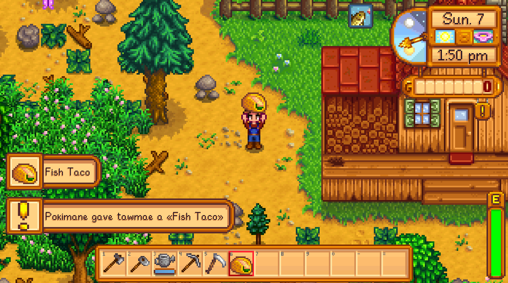

# Table of contents
{: .no_toc .text-delta }

1. TOC
{:toc}

---

## <span class="iconify" data-icon="material-symbols:description-outline-sharp" data-inline="false"></span> **Description**
Receive game events through custom triggers and interact with the game.


---

## <span class="iconify" data-icon="material-symbols:content-copy-outline-sharp" data-inline="false"></span> **Import Code**
```
U0JBRR+LCAAAAAAABADsvdly28iWKPp+Is4/8FRHRXfHLlQlEkgM+8Z5sGSRomzJFiWRErt27MgJJE1waJGURHX0F90fuBH37dwfu2slOIAkSIGQbMsuObZqSySQw8o15xr+63/+j1Lpl54e81/+Xvov/AP+7POehj9/uRjzW6XvS3Uex3r6y2+zr/lk3B7c4gNjft/jevHFnb4ddQZ9/Mb+nfweLL5QeiRvO8Px7MtqfzS+nUj8c/T3Uns8Ho7+/scfyWC/tzrj9kT83hn8MUqm/+edmf739rgXp9cwqE367+RszP4kjuff9Tr9Tm/Sqy9Wg1/id/9tnvhF8ZXd8mQh8Ml/JJ+U5l+ZrzsKlxy63PNkyK1AS89yGY2sIGLSipQjooBwT7Fwvjjz2n9O9MQAMdLChldtS4eubbm28qzQ9pllC9sRisnA9Vff1H0uYo2zApD0yjcPMp4oXb4d9I47o/HgdgoPRTwerTw1P73/WD2+f5QO27zf0qVj3rkdjaexXpm1dTuYDLcfegKp+J5PRwD2rGlveV8NeosD2fheDvpycnur++Osb8e3nVYLDix9CmsnkaAYv+0geEbLA0x9Oxlpg5cHndbnTqw/RQ09wk2sPvjfv60NmhyxpzULAxFZInJ8y3WdyOIsEJZ2tdRMMp955Jf1V8fTIQLbJ3T9m63HuDzK0Rzv/pH+9r+Xf/xjBfqbeJoFIf2g5WSsDwdKV82+KFGhIzXsRvqB5VJPAgIKYglASJ8yxbhvb+wLOEJ7YF4/SsbbeOJ20v/Uv+pctm81VxlHah4a8Ttd06NJPL4c1GdHt+vZlad+2ZgzOSjih8oNHGGRKGJAi7a0AimZRYRrM4d6oavdjVfvdafVRtQjv5MthxjCv2D9uwVdIEA3Rt19yJ2+0g/wnbNyvL/lwe+zGRHfamAko/ElrnB9eOCLCYtJCDuTrs2DyCwvkz1mLjOBKvdcm4bEYr4tLFdGtiUC5VhMKREJ4SgPjrkAVG3qfA2Y2vvAdAYnNSj1B+OSVp1xadIHJjIqTQeTUrc/uC/dt/nY/MVvdUkNOv3WxsLkIE7E3r+UywT+bUNPRh2HhsBCKAd6Y1JYXHjaErbgfshD6dhBIUASEn4NSJLi2Nmeo1x1EzXmUN/YTi5s1MLhylXcAuQDeSuVtgBy3AJhGnqe77tRKF8aGy/0eAznPvqGGLmg2VL1fenfbMt3/69SiZSiwW2JlxKJWloA+d+fwMhgG0YGjHiuB8gIukpouQBSK1Q0tIhHbe5pP7Ij/uIY+UxoPgcrJ+oUaJu3drDMX1FV+BVgOypJwz1V6ddhzKfw4b+OliAvxkqDSHLiaWGFXIGA0rYDmoQilg3aBbdVENjOa0NerwjyXr0vbQN0TsxUUsvQ8x1LBxR4pdY+KNgEeKV0FcBQOcACXhtmsuKYKQeDWA3u+6ebc8+hykgxhukGgkc+2BW+ZJHlOiFgn9aexSiBTzVzQ8VekfimBZll6RARq/RvsQZtsSRi3u+WxolYT+i4NG7rksG+30p/zoySP38xHDX5ozAXjULlg1hyLW0ToGpOAivwqbI83wb2qgOP2K8OV4uAmd/xToyDJ2AEC13Eg776rSRuAXV/Q6DL7m+lW40fwTu/lVq3WsMXw8ntMIY/h51+Fz/k099AreqM4aPBLZ7Nb6WpjuPB/Y4TCAD+5fKWE6CaByzwmMWkjZaMVFYQqtByItBNHRUKqcVrO4Fn6P4ohQy6bxdjCUoXVfgBnMILLBbCf1wwcC1uB9pSkmpBAwewvZie+vWklJvfTq7glE8ay3O88nylHQ6qkQuQ8MBMFh4XFmWRChmXgoXRXpCYu2AyGeTszLZYwQW0yZnSoVRo+5G0OBUUdhICcTDgVo7tU9ejLhgim5wtzya2nlm+jZA8ZwYMIObDkVbZx5bvhFJjz39dAm7TpRf5HnM9F1h55Cv4D+hrXPvEUky7hHAZSWdFYr5Gl55dskq1xEWwcj6vyZ1XxIm1YHB3v694ktMIk0iMLaICDETPViGYPJ6w0ZkXAF0EtsUj0IdsJ7Ajp5g3Y4eoSPmgnz75ZK1FjJ0MZ0ai8yj9Fb0aNiUeC0E1B+gBySjHsYSwfUv41HEFcZgu6B76/l6NrdQ1o6yNFaxdZ2wyRh1poAypN/DcfH349z//bMA6B/ejP/887cjbwWgQjX8/O7r888/yLSzmfnDb9dw//7xzAfcd4tjhn3/2RnJwG3fE7yqO1ycsOubFdDTWvd/P9Pj34/F4+BWGfvkRDwe32gy7Ouo/1s9ATBMfuCGV67Oh6MnWlRM/qkp9/OmefFj/7GP37E5UHuIbpzYUlD1+7KpY9OpT3jj1358PbUnjSXN6cKmvz0izQSaXlXgiL0dnh/36I2+wfrV8xqRTi8UF+9S8Pp9cHNeIfP/E94es2myUu83rk8fMNcW1WB+fZ85fr7Sn+C6ODc+1JR2vjHHZqzuqEk4kDXvqkH2A/5987D4MRf8IxhvAug7sm97D8GZ68EVUyo9yevD+6qh9IuAz0buC72HtnXet6uHBvezF9Oa6FlePzwj8P75j5gY4jfTFQVUd1+7P6cOw2WCkWjkb8UZ9og7fhdUKi9V09XuYG8Z819KwVvz/5OfgijfsWDh1Un1PWvVKPG7Wz+5vGu6k1j+5E/Wz+AbW3zw+HZw+vhvOx4gus9cIvyOs7mFfDGD76QbG/jSf7/hgyq+bbVW5asF5TM3ZVGKAqf30c8cA556K1ZF5/qT5fuf8QzzDeiW8gGfvVO/Kn69bHp8MVa9MmhcHjwp+x/Pi8K6o1+7OG7Xucg0LeKfPZvDhfP79fP7k52YG44/dE8CH+kGzUps2r88eEaaAy061DPh80epwg5uDu4/04e6Glke8Ej6q9wPn0/vW9OO0Ovy0ejaAH3Es+ueTWqXeu7muj1T5JJbX9RjgssDfj93ylxtavwdcey8q9bbstJ47Dqz/fGDWfWTHzUrcrh/H9826Ari2a6oB676usQuYq1mpT+u98kg1rgbVXvleVgCvaZnwBuA8HT4K6nY+XHQX8I8AfsuzqHdgXV+qFcAzet+qXbeBB9ThbFrDLbgKZ9Ga1I9PWI3Wyfn1Sf/D4QnQZ31a7dy3DA4vccB8/uFy9ZzO7YMq0OxUXyEulafNaasje/UH1ag/qnKNycpV5+PhwZ26Pk/h3gJWV/r6IF4fkzduWh/WnoFzD6uHJ8eAx/EF4tfVCbvslcfNi+pib1l4ZH6OFnj++OGwO6nT8lAdbpxpuDJOpT6S9GrXWuqyoqY3jVoMdHEnDqut6Pi+tbb31udL0qp2a3eKsr7sAV4AXcDZdBZ4n8ztr8ydfHbcvK6dz+j+RPSbgG+1O9nvDj5csOubRkxgL6vvHZOzw9aT5zsS9Ax4QXwnuqwtGhnnUzG0ZHAugfHaPEdn5xeH7Er2Y1zjgexJwNUl31ngTooX5cEbwzeu4m4G7hn+c9E4Xz+zrP3BnkIbaHOxL254eXkMYwIvz7OXtt0EOpXOWbtJs+Cz8n2eNd3DGX4xMmUJG1jLweLzbBo4iGXvDPlMqwp4dHrYXXlmlZZ3wPW43r0EnJS03G9eHj21n4f1teSEUxbPGKhG7Qz59k1DxaedbhaeD5uddwMJfA94Jcrav1XfvxtuPjeDS3ovFyiXV9f+KQMmzcbDY/N88/OEzlfeb32+WFvzl1VYpPntdrjYd6IPus1MXmfAZYx6GeD0ND99ndjNXnPbeB3VaPb2HKtx03iwgX+OqpXQBlwcIp7d9Ou9Ztxsi+N6LpptHsO5XaOe6a7RW80Gfmd4SJ5xQCcCndXwyTM5XVvTynd59vdgdJuLFVxZjLnQU4C3Tpu0Xk2fdy75RoG/9M4z5NrZnWqwbp4xxDXq0qcZtGijfvwlF+xRF6vUt+FEDHyQNK8Mj8/DowYgU6awDgY6z0nzcPUMeKU8lIDTuvEQ5+TDZrxzGo6EU83iOW1+ffJegN4m1/lCGW2AUXDTg3N/77YU6PR8CrS+LoePzxyQGV/4u6dk6buOWVfjbAD6PG2ift6vPVY778LPHSNnD25oe9gE3UKgvg+6+YeL+00eCPoHPHu6kJ/90w7oAn9L9IulzJTT1vDjuwx+01197qLBemJaBR3BbeH6Livhl4SWGOjHzTuA4SHg6BfunI1hn4NqpzvatjejE12n17PQd3a/A3oUnOf6e4ca5DDMD/qmPdO3UC4/Nf/Zoa4nOt/6Os77caLrpcecPbsD1ico9+fvngNtZa7VjFM/EL0a4K2hz3HzynyX4AnQRrUPNnGjfjLTI3bNeSboCm6Yv3fB8bIRdjfOcvHZfD32XfNoNwwv+wdfZHoM8/cuXGL3N2ShB6+8BzBL9K4ZvPGzub78xHhA57VBE/TOFAw+ycrZIdAr4ZVaW4PdJZ36GOBpZP7p5dX2McsHybhOCjeXn+2is6XuC7SQWsvK57vO5ary0NawRjgHijqWcE5Y5jgrunXmesDubQ5F5aGMfpSm0032AjZfsxePxFF9AuP0AS7ZcIgP2qBffAb+N3tv8fe2+Sqq8TDSV2C/Ne5ncGvaML+xEcXhNpwYT4A33V6iHEj2+VH0wi+cIB/fikdgv9cBx1msFzgUU8RX2Cv7sNSbt8AZn53zjMSemJ0zjjunX6DLNtj/J/05TaMM2bGe1HvpNaV4U2Xmt9iyLrDxprJ8MLq5jmPZScZY/ay9bgdtOzvA1SboEzbwl3i8OI/yxueDGY+Z/f0wk8vZ67ui7TtFVu2MZNyzgXDUqk5i5EB9Kg+30G68+U6dxoQb/ki2jpt6ZlDtNo3uAnbSJLHbSHudb+7kHxlruDT61fZ9zb4fZOph2XRxySuhc07bbZUNt/egp5ClztfqAL2MRCVomXcOj3bx/WvgDyPg0ZNmL0jxKnUnew9zXr4NRxCnLpFO5vhqeE99pg/O9cLsuQ0fujT64NkV6Mxf+DQ1xlWiD4Ju1b6ho8FMb9x2BsDjDs7Qb3pj16Y3jbPbGR+4VJXwfnWObfzgDPQ21m9ezXlashaEnwCdutZgYJMqlrJNnxgHedgD4Yer4xg+dlwbPD2O8YGxc7RLZnR8fn1wL47jQ7R5PlSWdhHomF11fZLQNODuii2zBZ9kpeyI7txeq85x6f7mWk0uUZdzasgr1u21bJ5zfbDi40nGqt83nRP0610J0IVnfOtK2Ceon9Pmxf2Kv3TLOo8AtyfpcWbnuvF5wfGRbiZIg0sbYM7HF+eI+jrYTvGoedFesxXuE/vA3DuE0y1zAN7FfZhjWjN2y5xu0R5QIBdOysZeuWiv2C1ZOHE9NXu/urk+u/3YbU5Bv7kAvmGL4/NBs1dGv90wWrOfEhtii9+sEveqRj7BeDHYGE59pPL6WroPd01ieMbg5PBEXDnoV6/hXQHa16PmdayqC9/weevEGU+b12Ub1kuMD/iagC1Ud5uNMxvwqws2jX1Dz5C39YwOcOF2Mv0xZs2t9tye+tiNHy/7wOuOQoTvvTruDlZ9Jd0Mn0qmrWR+1vSnhPfFCnAAdJas9STjJb6cTB/ohlzf6uPJgnVqjoVdIPOtKdw2j/ELXexYc8LX1/hpd9s8W2FpfhI/xSWs/RhopAO40bi5rqLOgHpRt3mt5vgS3Tgg63ugcx2lef/4Cuh4lPgxks+B3/VuzB6y/GovOveRuQ8CnloD+Qr8bQi0ObnshU6eNURbfW9P+tivYX33czwEntc76Rys623JWX15t+ZTT/1k3QmkfsTS7k50tvcwXu+oBbx80qyE47Q/vPrlK+BZhqzcfpewIZ+30lEC493+TcPvAL43oIdVO6TzEeRYNdNPm/w84X+dXPXqeFf5BXWvE9A3QKYavAEaAjn67o/P03eJPQywNLrkyvz12T1n8o6cnXsic5N3VaUdV48Xev36++ae4MTQSOo+4n3wB+CSLXpgH4G8hP2trrOxPN/k3fX7j9ncDXYL9pQjOuv3iqmfLP19531BFo1k3kV9Q3nUbPPGQ9w83CJ70O7to66beYeW4bdMePROPy7QvzquT0XngMh+PXV3nbrTSt1jg6xmonfaqqNcf3zooO4DOsHFfC+gIw6RV91ctBf+3ibo4LISoj9z230ozP203DfxDghD5wD1xnhJDwd4R32PumJCG2UH9Y1lHAFLfNROPLmZgp7Tq8Gz8eadVLKW1FisDPPYwA8uVePsC+IVnivA6/Gchl28383CqZX71tlaz3thV6fXlvrOxI30a+ZeG+ij3Twq4zxmjPME3tlyNssH31/j55v+6VW8y5Qfz7+fTujH6HcpeIP+ePGu85GW7/lFSE8vwnl8xeNHagPuu5myZKtegv4cgN+qvtRent/VyV3zuJuD7jflRQpnE/7fCduy0r1TX47u5vxRTsMxnOXkI+4NZTfo4NlyYbuOYmTwYXvtTBI4bdg1xw/Bhi8+kdcZdkqW3vkEPLefPUnG3Dh78/l2HXC2x5QdZOJIUF9+n+8doIexcJpx3vcuK/Gjev8w5z1/qx4j7B5OOcAWx8A9mbiBo4ch8OEd+mvqfFJjIK0qvGdDuO+4L0345u6xUzR8Kqia3z1ky44jxLEy8LNzsKkw7gHvhw5sdbhDJqZ+AI494wvJ5HkbOAD4iPeIbmtm1+1+ZyP+YWO8pSzo4R1eLcFROI9zCroXHZ80YwPjEwkyNO03/rDBQ++T/Sfn98TeZ7rfDlstvZ4PF9tsjDx0k/ys6wLVeHyp0M9WwdipZhvjA3WdtC57wfwce4n/Cs6zg2e68IlPdumD6/R6RWGMpa6DOsg77aAeeBKCrUB4pT5F3ianBxMxPfDN3McE8Bvv+UC3q6R52Bb9Y4P/btNHsn9AjhJ1fTJBPUccn8VPnN1Wvd78ZOhm+ejrvNOw5/aXbGHMl6jU2fXFQWV2Doanfeoc+GnciC6eorPZfS3QWPO6hfq+Gcfwo0O8V6zF+ijsfagk/t4kdumJ813yWbA52gnfSmIibVG5z/vuPcCdgk5tS9vIEVzbBH0ceWhnsZ/Ou/utdl7yfB5czVrLEk7l8dDA6fDduPq+rHLgx9O8G/AaaM+tvl/hG5NzamKVWh8v3j28wL5WzyclLxp0Nv/hqHVaJ8/lo4bWLythf37HeTW3VQ8PjD7wqQN2JMy1ZsM+m09KtBN68R3YkzNeaXwCmXpLrQK2Wm8lRu+l5OQl6mWpe4ZutQu8DG3cPhkB3AfA45a87fq0BfLTxBnri4M2xlSo41P0Ozi4Znh+CDYvPIP3L2dt0VFgM5wAL0zFDTbO9+LDqbPpbuP9VwtYoh2FsRaDlnYQls0h8KDHerL+H4UHz3TY8lzGTy6uzz4hf7l0Tsri+oDoi/Y63Q+rhze9PXTZp+Ew978TODNDg2vwfErfNHrenGcy0EOQxz58lt36WB7X2IcKi/Vx7UncX9fZX4C35JTvV4BDhu+AfIgfwc4cSbQlj7tgs5+jPg2ftYdN0LfQ/6Aq6Mc5aIsexnmVJyfw2U3vqqXm6/8KeH/Zq7vIp+byVeDf5dma882F8QAYA/ak3p7wlYVvI/GVPvHOVn9pMneM9JLH/7/c1048X49j3s0jZ3x6lg+Ace1Gji/kTgF7Kq3fPMEHcp/x+jx4zuufRRfv7j5OV/biVY/Hqb9rO/FhIxY09XMFa5K0nootiRO9b8OOyPR7ZPC79Lnv9GUMk7uRAvZ/jph7EztV0M/+MjHfGzixuA8yvtpkjehnf5QmZ6h+KGiNfTzMMR7qPdm+/TTss3WNjDiYl4fTtnj9pa/72kZ5cJMHZler8Ti1+bq3ws7Atx6eowzd775ti468icvtIn4585PXf5Hy21aPjF/Oqx5WWx+mB7n8dQu95bg2VY01f8Qa/uAdwg1ttT4ctYk6Xvqma9ftL03QR8x9EujET+ev5LYdF3NUMV6oF06N/XjBFncR2+zH3X6ZJ/wwi32nzzmdR9a8Q3/RMuYU8ayexHEt6f0/TV5fykejkrggcnVdB74e93ij3p3Hom7LG7voAt/tldmMJh7Pr0+mN9ddlFEfZr9PEt58NeAY27TO38EuRn0lObfh55veML5xzhN5cpH4Rgx/Jck8OfJ4FvuRGftA+ZfIpVEn8/uY/AG84G7uh99yPku/Fuhcxi98NbsbvUjW25iedDniN8YamTutE/V5yq6EPYd/tt6eyIWyDfQzbPbiuDnPFzRy52Ae05fksDWaw2ZjGd+3l/xZ8jdc8+pat/MazDVr88eM79docaFTbblPUr1w2HyKLy74rcnDG6X9z7N3jlZhPLcX1vZ9NDyQ/ZO2vljFJcSFOf5+jJM7hQ/JXOv3bD3hnMQ3jbMB8M8Pl/TkP5uNs1m+VeJL40k89myep++0lndF2Wc9oydR7Wd9nw+XlvCrDYEH4x3u4r59TgNr+Nu5vgwmoItdzvA7W99O5Mgafq/g55ZzySOTD9bjVhE/HzLwfStu3/TxrEZP63k5+ehMt1yNg17jo9v5Y9jhvfoXzD2DfT02k/0scOgJvFvJQ8Zzk8lausBfJuazp/jVMhblQPaUbfItDlsdkcSWAk0l8zfLo9lnm7iVnRtzluhKTn1s8ukO1/nd6thP4ll2HtXGukEeTlN62QymNVHtmdjgT1tgkpk/czW751ImP+U8ySPr1VkSC7GA8ziJ1S4Ml0eQq2NYR3tt3OXnxdfb1mXQSxo2wPBoDR6r3xWFN5/Fja6tfdAEelSVVuFxRaPsXmSPPb65blefPf4ixshdg0sqtqgw3GsYr8Euj+sYO7yG5+WhOI5PFcauvcT4pBZLegZyc6a/rsKqe9OIR/rqwcaYMdA5vwBu3ifxuE/j60J3Oz67hflGEnO+QL7N9LZhGlc5jUfi+BTOIytvdvF+e37HkENPA5laNX569M8ibzt9P2rxi3fBcj3svcmFMJ+PbveKEUjpkpKOh6KCdw7vBkt+HM/2dCb4Dv98Nk2fd5Ixk5wDTePQnEvyGeBYTh6Xf55Tkyt3PB5Ghq8m8IFzGZnPM/SBHfbi/HyxlsRdE21PanLrZvCZ6dnXizlAHoY9tGeSXLuT7fcziV6w9vw2nMijC+SCzfnKfM4CRnOf7ge0dT9gfuWhodWpoE30pya1WmBcsOUAH9r3Jj76+GDX+e2C6zY7fFXfWK0XsDyLXn00i4l85JX4fgctTpuNh1k+5NkA+MIj8Jms+OrN5w6P5neIT9vAxyBPOwdds6aeujb5kPNaIMldWjDXLz9v1OtIfhTIarCLJ028s2nUrsR0UdfF3JF9np/Ro5utZyZrAHlwMkUbrV4JZr5PuRHvscVOAz2uCrAN70TDBljUn7GP2hBsFsyZL7KObPvh+ARwb5bDSttDmcQCbJxbUb4n+gdfcK8pu3q4jmeoR8rKJl9PrX2Zv73IaTTneH9jb9cZt/OIpFYKnP9RglvS8B2Te3wYr+8daDF+rBkYgR2zjuepn+T9g6Ekc3w7f3pcGBN9NGhP5Vjv2RwPDUyTz7PgCWuwQR84AVvlfBdcTQwl3tlcLfDz6sk1p57NNXatElPAvS+54LF8dtfYSXzA8vyKxput8JaPXby/awMunmXWL1njqU+trQzjtptAq0VlTnOOG+Xa3QuvbYFHhePnGyij46+xtgvAmzGMTzJt9uTZJ2IZkC7sMdrPJt9xXotpwTuK3e/MYjrSOFoY7/g1+hzPisAvH0y32a4zPpbAZYeOUqkhbU6aNtar2qLLbZsjhbdGJ13cVw7veMM1thb+pJ/L1ku325wJb0N5vmsP6eeyfftb7OXpAgdNva5WJ+Wjnlz0QpCRLZM3AZ+vP7sfrBa49NReVmT/xhw5fZ3nxga9SsXbXSWxgmt+zm2x8gtdkafiJNfsyVzx9On39/CBruVIYE6Q0WfKunIWy2Nja7ea161C9ys12Bvag4mem9xHpmIiWxfx2efLL4OWpnX3Y3ceD1Hfcl+8uD95ql6X0Q8TX3htOKvf2Mb55vod8JsvRk6CDqgvF3oe4EXbxP3N7hAIxqeaOjxYdw9s/ysae8DrNvVBvO9I4utItYLzvLv/NEX7937lXObxxvjdh+koB0zX706MD3mJa/Xx8PoCzne69D1uvX+Y+bUx/t3EXh/u5b/djBnoJuPdXC/jJI3NbOJV2B3Y/+3U+nfGn2AtR+SNG3eBu/jx2h33Uoed+dh7a/7xfHdASdyn8aMnPnp1bM7TnO3n6bvh2j0TQR+iyY16/+6J8dI4ZOxA/O6P6mE8v1tC3+EXbp8NdQ/0wCRf6j4/jz1P7revwVZe+lJTsMkvD04OT8x7eJ5Xi30u8sEWtRZ3+8FyrnUFLos5LlOwyOFvmes6y/uvajE8N/te4Q/1cereniS4sIofWWvOm5+2so703c6Sb8WmVivy9OwarsjX2Xv4oc3rE4KwBrrAM/OaV3O/WHtzX3l9xZt8FPGqy4HXoI0L8o9drN0BZ9bT3LDLk3vCZVz11vqaqbvsWUxuZq5UEqO3EddRDskszu+P+e+It5cmbrQK+PTOy4zB3lxvKgY8v89DOqjDGJmarONpH+qXm+uzuHp4MhD0qvNpWwzxSh4L6rutzofy+fCiEsa7eO1K3DTWMjisDuqH8XvhmDqKVZxzh76cjoM3NkC10776UMcaxPVRwbmPYR/dgu+eANxB96+Pn3p/x/3hHN73gNO3N9ftuPplq021Zf8Hwxs6butKAdhdnd1JrN8RP2OMGfyvgM44LbvNXfkNW/CmBuM2y8/ZRwx0Ajp1wz5fwPF552HWsS/+nz8x7xP4f/Ac+Bec2+B/wXcX+P/U+zng7aB9P9Opvtw03L1hX6dlrNeJ/p/3+H5xWlDo101yZml5p+64BS4gi+uxKD97HHM2z9/XgjauFzAmmKOwg04reCdQvs36/oaWMTe6A3KxLWnLxHzvzbMWsK6B/Xk2eB6cnzVGAmOzl/Zz4Yt1mR750fNh2+zF6Ps1OdaCnu9PC7AfwDvEmQt8f/89YQ3mkzthH9yJQvy4ObzBOnv0AevkFVzDAq4F3y93Va88QR/LBdBPsxLbon5y19yV55rjbGSlAL7XD3bjxJZzBPsmbjYezovhpcJaDQXfXcrTJ97fHr9XOWtjTk+1f+YI56S7J8yuP1y+w3lbH6dB66pff0Rb+MrBWm7ne45zNEW+UD0M7qplgAkFm6JzgHVZu1trSmeehxyeXh4t12TO5r51RW3MWXhUNJw2s+qf7Rjv7P3pcrxKjHWY4xPntOg+l2PReKSA/qrlszbS4V48cdolZ0gjU5Nb8V5d10bAXx/3HOPh7GIxRgXvKjFXqNi+bhb7AjoGW++g3KyoeN/1nE4X6znB2HH0a5l+Dfue2XJfhxjHBTA2+L33elIwxhg30QD82RsfzxewAfv8Xh3XJ80L9Vg9UqObRkz3He9sCaOrZsPG2Lsp4uN576HdrGzLkd52bq3l2ujJI/IT4CWtWqPW33tdX5a84NLBuAyM2zwvuK4lzYHdhj1jCvGCs8vqYpw6xgBjXjyuqX9yd9OoFeQHS5g1GnXCL0yOG+H7jpPmnTM+VeuVR1gjW1B3T3gt91kDfODTg8sie/u0pJvTm+tmu3o0Bv0Y5PPecJfL9YCe0zT+2/BOVVqtc6dOTP+gveQsjnmeGlO1Ze+mIK9KjUMB3tdtVpA/0NNOil/1mqDLoR/0CVzNo1tWyqaG4/7y+Igu5CjouLLfNH6xC8qGzd6+NHjkLMeKp3jPUwP5x/c8t9MvKRrEO57Dg0sJ4+zNR1P8pdZ46FWPTkaYT7kvT/+05OmH6vqkP+efV6Zm6l46GNLdQwreU+y1ddMw9fvM+e29tiX9XXLAIeHIomPZpykZKHvhbRP4OtgcoGPXJ2pvnneVPsMvHPR14A1Tfn26L7wel/BSoJOVXaCXoxtTm7S651hXKVyvOTfXJ4ATNeA1KpZ72WLIW7pb+RXgxVDtO96Xo7Q+lNg1Fwefmo16V+wtC29Iig4nYHdO8G7lyb3m4DM39MG+6VS9PXHrMYVbFdBB7H3hffrlPIVPIdh7oF8d1zt7rmOa0oWuAXaAk0bPj/fF79MvS/31EvXNwwO0Z/eVKyl8HNuo/4q919FK6Stt1FuBx9nj/WmjyjLorFpsrCt7k86AVzbsAnTW2q4XIC7uTWcpPbHBeuhPQRsU5DoFfaqAPQx6WK+MNY630kTu+o+HtZXaJKIXkmrlqLVW14sIrKk3qw3wkaZqkeysy7TMFc2qk7YRU5Wq+7g442Uvwi15UIv78/e8gjkJcS+ppRY/AqxX+jls5OztvBv7Jvl6yxiPYvmky/vipI7WWv6f/fmmN2iddG7W6wwBPpeHon86u2sOOzzOnXM63Cvmd3mmyf0zrK8xPcnKmcuX35eRy7kFh1brSe2Of1rW8NiSK2diT5L7WryrLZvYlaSOEd69Yn5h+rNJ/Ti5L73q1ZEXdeH/u2gHJ/kvxXq3ydlYCKusPoqKwnNH8UbPqQRvs+tyNiumlozpM5Tq87TMU06vu7t7bEVjAnYhwBJjIpKcIPSl39D66ENqfRgbl34mo4fUIp4r8w5+rSdUVj8nwNOkb8K85tRR+Z5fYezi0SBdN7Np6sKG7bWeTymednCvGieAqxv1Zdf7PyV4kFl3tpWuY4Cxxe1Zj9JZj6iUP/d40b/W1LT/nMRyb/SVmtUVXca/J7ExW/d8cli9u4H1fHRuHoB/42d3qVrXjx+dscnZXKkJsHMti55SueDMZz2pcsI13StmtZcs5vtvh3M3Y07Mk73TdJafvFLD6uk1SHLCktoe7fWetqaG2bz3z6xWygHYjBh73sbYoM06LCHBWioA66SuTFJjeV+YpPtfDdbqfpjv0nUTisJMmT2H/nKv9fAjBdqdrf2isVoPZxdtYv8rrM+/HVZp3LTvmvnpD/txrec8j/Gz5g68PNmcD/Aj6cmVH//nPaty0TzGcD/mhle6Z1eq3qL5O+c5CtMvLDTv7E/bq72/Umt4BFst0Z2S3Mgu5n/lpAEDg490OS6sazYeC+F3GCvOjVNXlWVPtHx4Zc7rDvCY5Oa38/5Q3USHznnWm3Vq8uHylh5khea8W4mjzgFTrPmCOZWLnj45+fpm3enyl5k8xNopK2PmWgf6XGc9ynKdqzM7I5hPNECnhbUtet07y15rOc4g3WetMNxvZvGEAI9eum9bjvlX+rM9e+803f8tD02l+7wZ2p73Ts5L37tg0ce6YdhDqXndBV476yOXUxZv9vle1wmS/kAvtU4z18WCdy7jZnPK6rUaaesyOr9s2nm+yx46ReTyWv+7VB/cRW2Cl4Cnk+7ZAmtc9mvp54LlOfDFCowxPscYFLAZi8rDnXwKZELN1O4oT3jDbovD0Bf5z9v0oVvtL5yC57LnUs4zrw9X1rbZG/CPxZiXtl+/Phl+7NYfwS64b5rxygv7eTl3Prm62YcwyUlO6CFrT/eZdefynolqdNO48rgJx0Rv/kwXew+1XZ/yC1aWgEdwbgYfF76JyrKvSnTRXNLtE3BK85BcOtKO/oWp3s2LteSkI5tfpGXX5hwfadLLuhg8cu9rrW/iS+Py2QDWuNjTV9tLRr/GfDI1eSefrrLS17EQX8L7b1E5T9OB4adXSV9xkJWmPl4++s3oEbn0DyU9yy738RPMYLHKKzfmuNNOauycPDOrB+U+57OyJgd05ZUeZaM8a5j3OZz38U3y3lI9KF9A/n1ZmwNgNR8/n5ze6JGZ6GYY4/3F5CC9gPy7WZsD5PRi/Hy0lu7LueQXpudm0pdtYS+me3ImeYamZyfeR9j58XKXXpReS+gv11A3NuZi/j4B2krNnRNv13qEpvn97LOTvWTgTr0E7BfsjzXvNwrrX+09mm/NazWdN/xYixrIG36jRZ/Q5+9FrdYgn/vjlr1Jr8nyM6yXns822Ox5upZPCXu+aGKP0d7VaD3Xclbn+SXovLu+joWPbzG/wb+t9aSfpv/yUAJ+6cZDPOMBG31Xl7ho+rO+F/ThTnZegqay+r6GPk+tCe0O2J9Z0znsXzgn+ewQjPXA+IAu4mAt7e9a6f36AmdE1nrOAr4lc67QUp/8719++5//o5T698vwVstBb9iJ9S9/L0U8Hun1J5SO+fRizG/H254Y8Ttd06NJPL4c1Plth4vto+GzK0/9srGkjsKPKVGhI3VkcekHlks9aYHaQCyhQ9enTDHu2xuv3utOq43rJL+T9e/G0yHOF+K/9e9at4PJEGc9HCi9Maru41pxVePbycaOOn2lH+A7O/35f6889V9rr9zxeGL2Xu2PYEg57gz6oxLvq5IayElP98ccP/p7qT0eD0d//+OPMb/vcf17qzNuT8TvncEfIzgPpe//CSPFevp7e9yLN5YtB/HgFmf5F0ICcki2ADrwWGCHRFk2p9pyPeZaIvJsSwlJIhJGXiBUEUDbhGyH8zeE8afbTqvT53HpIoFZqW5gVuoNVElMS48TGPt2JAe3egnvGaCBMv5Iff/HbISGFu+GnaLwpqHr+pHHLJcQ23JVpKwwsqkVhkHEAuozFm2++p3gTVfgvfzjH6kXfuEGfys41Qje+Y9dp5KAgDgOZw4DEPiustyABxYHa8GSknsO54o4cj/a7vOe3kq+t0BYg942hjTfqpNnq3DEMR+OtMrebb6Npcae/7pE5RTA5sAKIkoYc6xA2cRyNfeBPsPACmwuPO1GzFFees+//OdEJ5gfua50GCeWQzWsxlPMCgPbtojrMyUjLZi3gmnbkeIX/SBBMOvy7aB33BmNB7fTjIfmp/Afq5T2jxItWaWjO2Bro5XpFti5+vzKMzy+59NRbdLPOL/Zyb4z+Jf1vRz05eT2FibO+nYMjKEFpP0Uzsq4AyNUk8OIfOUKoFsnZCCVuOCWIPAf6gRKh750PDfcQvfM8RULPGo5tvIt1xbCChmPLN8NoyByAjgad+PVGW0HhO1HwOa8RihWcHf/yE/GT0Jj6yFvHrB5XumRvO0MZ0e0yYhudaThhKTemNl8ffj3P/9sAI0O7kd//nnakbeD0SAa/352dPnnn+VbWMv94LbruX/+eef+Tn53iGOHf/7ZQ3Ydd8TvKo5/WR3yH+vzi+lYG7YBi8MO6GghXDkxWiJjtA7nn2VXdngYiv4RaIJDe1Y95xIjkJsNMjGaIla4TKyESY2aTtbDG4x6a5EPC62xcmYyh0ykyVE8EZjReE4+6E3LNKkud1R3m40zW2F0zpaInqwIm6WHazMSJuX9Wo8IW1a3wQoS3ZUO2xnVtLd1f05F3TjNqIbRKP2kMt5cs//QMFUyFt6zxhS7dmGFi40qgRhtetw0N2/lUUYFzkcVh0nE0qxrDEaFCayyUal317tb7YpQ4iYqGq2NWjxb86Aab3akgLO7Ez0GcKrFJtIo6Zqxu5LTPDK0cdW6BOtVrkSqrnRi2djPFUZXXj1gBg3Ol7fy0xNVvXeehYnsqcb2esXvfSqMrVZV79ynOoDFppr7wjNrKuSjFX6isBLuyns759zjzMpnbbCcEfZo2ZrOPICj9gYNrEXlrXS5T+Mydi2Occx8OIZehmYdrFA4f3OejVoEvGLcNBkM9r3p1moiXZGG1UjQk7YoA+y/PByZKn/47KU7qPbne1PzyNdoPl69YrozDzB721SfS7qaZMLPjFc/u8fss+V6Uu9jN9/lmieXvdCpHpLMtW+tcFVO4HPt1Ez3HV4JR81DdgWWKuztLMYqU83jU+x+uWf11W+L37vmnHuKFtX4l16p4SoPrWMFLPRWdK6xWtXKeydqR+TxvGP0zLtwdgf4O+MPrc5mJHR3dkYmstJ0nX9qbKw2VcMoPsAXoJfprJq+6T626MJjz87STp8l7PcI91S/4njD3GV3arob7zIqLqX4earj4fEZvSZ1E/kx69h1kURgM1NNEfCXmCz8pyOL94ffrBsSZi5iFeLZXADXs2kTzv1FeEe3hjcuSMukudF9LHMfSz5wgdFKsekQhzLuGr1b6BGrlMdyWY0JI3GORSXswL4aN9fVIEXPf8s8Y5JeU3F+ghFRBq59kFflkHDswEbbdyLpqpfaB/uEGVcfd+0nq/PerDPK2jtP8Ri7aIVnlE2zCnELHWg3T6k9VTk4u+onZmBfY+WuVT5i5keeQettU3msAJ/CMzEy2HhcY1zrbM3dzvXeFfNPWLNRnmaMl3xecH2XtHkN9HW7piuk1hp/bsYqbjZGRdaMuDFVwK/0Vdir03psukpkwrl9B7h79Mz5HICF6Qy+h+6zfGcnDBeZGx0OtMorsKfrtc4CO/FzGbm4s9PAZlbJcr6k29njvlXeE/rdXp3zphcDPRvaftxZnTMPDSe0lsokWe77MqNqe3ruBo2f6pC9pWL76hy5OwhtwMjwuEXF5K1dBdZ/8nR7Tq/R3BicJll+WG2eJLcURTsX76ouvbzVAXlzlMZB7CicURW4s4IPBg5yujcdpmkEdSLMWDxMffYUr7qa37aAXdltXiU6CYy72aHVyDasyDKTfVttw0x+mJbVmXp+bVWuXqXkKu5rXa6O5l2o82Yfpc53pz2K66g1WNec5Z62TzP17ovqLVf1SdNU896AS9KdOLtKqdFbrxysRGR0kLLomWr5uWyhrXvZrbNkzoG8Ad4dgU7wBfh2F2jib9X3V3t1G0x1QTMyc52/7bJHEh1nlyzYYv/MdZJsmT2Psi8iP41ugnYcyokPDWNnmDXrHPbSpm4Vg25V3Rxv9nmx9S31g1V7M7XWha5RZM0YxXZCak/rRhm6TZH5FMACePIMTrns59Q7T8NwHx8bnvPBjFbky9qyu/nFN+OjZo6rWURCPhtwS7cArBRqeFMKv3fpf8vns89s2zwsVvY+8yyf3zXPPrb5zP6dR7y9kB9vmR2z7BrwAufSn4+7p09q7b0tsDOVzG9Ab5tnHp9Tk+WQ6NPZHQmSbkgYpbTPO5U5LPK9s+xWXO6ir/UiycTbwz5J3svuRLSjo93qfJPZOn2wMW4/TPeqOr7RfXatq127iZULZpmjO22FbLnZne/RrLWO2Yl2lO4an+Lx82r0w0V2eYEOd2k8ucbubfUwVYl+zW85q6gvcvomM6rVp+ETYdX66yQibq1jbfa8G11MX3C/K9Xzk4r/mR0EXnDP71GeNCnwlIw5MQu62VCYIfdS+1zpWrDk0/NOx+nq/jv3md5P0iHycJRZ3Sbb5lvpumeiMuf0MtNLZz6Mnf6Q6SzicH9esMbnXqrL5aLrR9oXeL02lz0e7uv7A/xZ7PVb8YS1c0njbNad3XzOScG7ki5WaUjDKU2XtTWaX5WVWzuIvOgaviJv2HG2mEVW7yfZrQt/6hzWX5a84+XmBbi2b+j4kl8P44w517qebMerNfx5Ho9A+PZrQ3UcL3W7/HwCq7BgxxqS1tsyaXCH7zFrDU/7IHPZ4wa2G10iM+YrpEuY7vWMYJWyeZR1s/wN+EfG+r+BbpFx1rXvomPs2D9Wma4t1pnBT9Dnc7V4v5js3zH/pHmtds/fqzt5559n1TyDzrfYkykd+CqhM+Pz3bRp9upst8LzUuNm86t97N9MOwh9BvPsqJU5d1Yvyu9TnlVTqGLFtWUlhKMln9vmG9nHFzHPbL6s4FoeUvZ13vip7xH/k3HHh93GD/eIw0i6lu/pBwlHzaMHjFcbpeTnrj0hPziddxHfp3si0mlyJvf5fS5ktrYXi52aZ9cfzPbwlfwvsWrL/sGzYty+ajzOtjMCXn65rDawR+yRwaNFJaw9cR15/LJqVyf/XhOcWq73pXxzcx5SLS/OMX9sZHmtS/ce8ZE10wGVdc17R/HkBqsSXp/lxKPdnbx3whGfz7ZLt/lP5/eraziy2uV7L9yDNSRVvZYyXiT3zqZC174xmyAjKZyBLe0DrLyDFYaWusMu+sGqeL34Tl2fneP9LVae29+3vN+cRoephEOskld4n6QdY7xTgX1WMdal0D73nBP3iRnN8sl97nO/0sTu2JPmMXYmf4e6xRes0iqf4umrnV23xLbZtjgGWx30lxXaPD47ajYwhq78mNOvvrAPkypgid9l9tl2mO1p9yVjv4x/KIuHmPF3+4TWqh+aboYrPOHzlF0Je64/7YqtAdp7H7SSqnfLcZK/Z+OQmV36/sF0PN0dq5OMl0HfpnuvrJzhfcUU9IIhwO8xRY8m3mXuI/ucjLPZqTf1k3R0xY7AanOOFf7wIvuY02/mPlL09px9bM6xQv+F9mHigvLGBD0RG7XNxsa1Gv+BmOtRlSfigjZ4w8aak4qR3XZb2nifCvbK1o4Eu2OYttnDSGfGD+CYipbGLjJzxrP5dned39qB1vC4TfyfXFTKj8hPUb/5WvDPkqsfTdXodTnN5pUntuLlrtispCN1msZYFXSo+ZjbYLM7hm3r3RdWMFz4KdL7Sv89mcP2GTiXIee/yb6y9YvjTf7yEriZ1g++CX3RNR2mkv47Hx7mw81devTSr7Miv3f4c/axZS5B8QK76h7j/ld1mNNWrVLPpyvlzgVI62IHe+tIy7tqgMt0nzh1fD475mubzbmIR13158xl2654he1nac/59dy/saqz7G0PXZ+MMtfXr0/39b9k898cfphsnWhf+36/Odd0pIL7XNg1++4zn42Suc/95lzToV7Iz1qBZ2PRq2GX0fvqUS1O+RHy+TF25y+dqcYDAfoeNa9W6P1xlZ887W9dxteYSsA542r2jaUxY79QDE0WX8LxzwSvZ60rtxwq5kvZwY/Supcq4FfZWz/I8HnM5sl45nn7WfGXLP3WmfbVc+bZzUuS88nvRymok6zCcoXHbJFP2XrWDjmTuv9JKoJ3X/TeZ8kv1niTnK7qCC95/7PILzB5nSg733yoX+EeZZG3WF3C+SVkzLzyuqlKKWH8mvGp58vTSMUrAD6frsc87rrfwuez/W47YJ51RyNWc6b20iOABk3XiA3e1k/0y5e/5zgjwjm4xzzhJZxfMh4ZdASE9Zsd8JQdUOg+vQbnhbB4If1uTnufBHm4w3iJt/P7uud32cPugeHEdG49WsL6ReMhGqhXx293ifvfJQ6ljVV17bHJRTM82VTZ3QkHfn12IWg4Fo0kH+3FcWZ5ni9J80f8unmH1ZDf8GRvPHFuVs7cjGlqXz2Rd9Zewa+X19HSZ7pHjacmVnUdqo1aVTvxqIK1dLCTnyjvVRNky5kv17BvHEyzhzmsMQVd52XrL6XgUk3t8SV4dW25ZswXfGaNrLX9549b6y3O8Ohp+bmPvrnc3z3qLN2n4LatEyk+v6WL5LzmHBU07mLXY369vYNk0snd1Ldrr3bcneFjr97HzrGIF2DfE6DRBa8GegdcYRPUaZJ9rNdruzf1JBo2aenpuyx4mHcW8x9WW9EGnHfWWsuzxssbwOXq0aLmGtBPplzZfM7coY0VwKyVSQewv2o3tbas9Se4edFsqCHQDOKIjZ0BRH1Ob9XBsvbYffY85eX3+eCJfOLgFPjufbVzEK7jVULvJ3GTmlqJ03MHcTIcL/C4A7ibo25S9lpnOIrrLdfu4GeoAL6wB/SLxia27VvBtWvyjpf2+bY1H20+963gjPngRt+d+w121KJY1mn4duvLytHNPvekJsQiZ+Gb0s9Czqe71K2upXg8NvobxfXFgZ89hhn72MgX4B3CedcBfryuW+ThU0u9NokRzr9+oNHMd749/K+xs9ZcFuSOK32JdT4dd5rnDNbujVbiT7edwe538uwtXlt3YX63jNV7KiYwmw/mfz8P/wFYj+adfA1sivLI9J394bq/PBvPdr+Ti6YB1g+zriwGBkXpeg/ff/Ze9olf+JbnkvadzmyAFd9pIb/5t6SXOL2WxMe+spYnZMYVdng6Rh5m6ozMa5t8S9zK9n/u4yv9PvD+JKaol7D+vmvf4Sf8LnBf8UHt46/6PnBf9YM8hSdgp4I+9OVl4WtqgC99JAVk9OLdwzy6/VZfRZ79pOYqKpNT8xs9P+daU8/m0vWXfoVVmKNv4MnuQVl9CL5T8yAdaOHyQFuhzUPL9bBvELEDy+EkigLtcuVs9gn50ZoHqUGpPxiXtOqMS+O2LkmYvjTpx3o0Kk0Hk1K3P7gv3bf52PzFb3VJDTr91o6+NeUygX9bYOr62ufaiSyfC4CpkpEVcDu0fEK4sB1XUilfvG/NM0BKCoD0XRyX5GQ0HvRK8+4gpi0TgLdzW7qbId5ov8ZM/5KMaC36jRRsHOQGJKTU96yI6shyCfWsgOnACqTrcyKkEwj60gfQn8TxS4D/xVoHce0FXhRGFvWVsNxACouzUFjMYVSwUCuP8W/dOsjOs9WM1kG52v+IiAgdcWUJT8OGbSaswI6Y5YQOs6UKPV/ILe1/tLA9T9qWDl0b3lQesEOfWTZQq1BMBq4fPqf9z0ZDna2tYSqdO106HfTXevv8IP1/FmQPD659B99ORtrQ7gXvlS4mse6uNZz572xitgOPg0riwDlqarkRYRZXOrSIFzlhEEhbk01inhGsT+hr6QakH7ScJA10qsXb9vX0uD0wrx8l420S4qT/qX/VuWzfaq6+qSoRSSAVromlGIo9IbgVKuJbFMiSCltHIdts25RTlQi+htxbbWT2hNxLtn82I9xbDcxjNL7EFa4Pv5CRSMwbtGwe4ZPx4DLZXeYCZ73fKHeoGwIDF8CVnIBZyLeBlTPf9ykHgO7HwOdSjDqvUTH7evoYGL7aVx63FCEAPjCyLOFQFIxaEREGPtHOD6uPreIl7w0mwMO3oaS3sd58mOhSVwtgUExxkKyR4wEmMqBsz43gnwLhWqzx5Q5MvNDjMZz5pg749bCxMohV6V02BFdRLdiGasRxImUDlgnmoNKFTN1xCAgr2xbS9YB+N7vePRfVngmqZ6Bbe6JOgWh5awcX/BXl/q+lFoiR0q9DMHLxr18TRIWPAea/F+OP2pVoSfkW4dyYWb4VhKjEsTCkmnkhd8Urw8q9JM4MfsdX70vbgJwTK20sUOj4aN9HvuVKRq0AWJ9FfM2pI4nNPO+1YSUtjpVyAEg1uO+fbs49h6oD0qIQ0oXEd4kQygIpYnpTOmBa2tKyWQjGlsckyJpXJJS/Ultaqj1faYcD1bmgu3qgwArQ0i3KIhUyLkFPib6vbbkTYWbtnJUCKy+SFqcCDAuQYXCUjms5tk9dj7ouk/u1F55vYivm59tILn/AU/11c51Qauz5r7sMbB0Q5YVUWZEjIlBIJbc4uhW0qygYYaFiZFt/3ddjYOtx6bMRQqVqPxr8vFb2iY6i0llnOISt5DO0CXWZoKDbRTZloCbbtsU5gZOSIeGERdzNsN/eDO1vb2g7DhCxAHbl+46EDYHiEwaeb/lCBT5zPEVs/69laOtxQtPrJG0eyyXXIy9yGQWOBhgBcl2AeSh8YFhSO8JVkePbLntFcv31GtuOCAJGuGMpPwIhwVygO5s5lh0S9MGT0KcvbwF9H2M7h55pF9UzRRg5tqOk5REFyokNqAhCm1rSdrnvU0FC/uIm95ue+TXVs1wqVhRIIr2IAfPxYddwyFYQ2A5sOPQZsxl1beeHUrGw1T0O8NPqWVJMevn0KxpqzYjQIKwD9I+7HlgenFqOx7jQyqGRu8lU3/Srb69fKQkslgSgXwkbeC/3HSuknFs2cYi2Qz9kYSF/8c+gX2XQs3k2l1DzaCAirYnlR64ACgDjIggDxwKtgNuuHYBOu5/F/VdVskLhhWCs4U0oBUByD+QiBWYPMFSAoBIEY/CmZD2Jj64dhqCQCivSaPGKkFsh8UPLc2zQVKlNtVvML/qmZH0nJSv92lfxgQU6pB4jxCJ4H+Y6gY3mDWhpji88pZnmbvTaFbTPHLjSTEP7NBn/vLrZkVIdXTqGHeTU0BwVEDcEYzXSLmpoHA7XVRYhlNnED2jEN9nqm4b27TU0j3guUy5SkK2AlrgPBhMHRQK+oD4NuHL/WhoakvQaKZsHcolBUGiZI11Qy7hDLFc70uKaRlZgK9uWnrYp30SPN7VsE5CRVHYE5IUaGUgdosDWiwSqu0HkEQ6A9YrdSL8GtezlrqMj1xfSoy4o/6BxuU4InIiDpRU6xPMjL/QYLeZr/eGDJIZAxlotwyQGk3HB4AjqCwZaLbWoEzmgACmF/mzf0kDsfhg5bhgUsxBeScjO/kYCK2olSCJ933WBH0ZUoUcbtD0JVC0DaUvbFoLYxcL536yEZ1oJe1/5u5Fvu5x5lu1FYDcTsKADn0QWAw2JiYgT5hXbxM965e9ol4TacSztYYxVxECiCTe0gsCXUumIeauOhtdo7pQncTwt1XTUieN4Zvf866h01Ne3rZ/YMd2A7ZYudb8/HcFictk/oP+BGau1FUWuBkVQg/0jQImRUShDm2rueJuK4Jv98+3tH1+DCCdgqGopgd5FIK3AFbalSBgC2YEWKgqJpB/W/kmoe5OkzVO5pLwdBF6gmANIYWPkbgDyPggBWxQoUFQFrusUyxn7qxlBkinPcSm3lEdAZAQYQeSDGPI8xXyfR9yPfvjsxxcwgjyPAFr5xAJLGwNJlW2FgRNYPFKKK8Yi4hXKlvnxjaDIyOtbjZI+ZQyByNbPoO9I0kgzgLftoT4SRZ4lJBidAi9eI8X5VwjwedUGUeEQaCl8l2sw32lEKJjvQOqhh+a71iy0A59RtxjmvtlD39oe8m3fdZxIWz5HovCobfGAOJZtR0yGTLnK389L8LPbQ2AkOkEUhVYUgPYFmiS3AglKg/RCF7Rj5fjRipbweu2hY83nxtDPawN97ujxRQ/+k8/+ieAUXEJcMH3Q2g3AEgq47ViR9iUYRtzn/C3VePnE97N/iA6J1Ixb2rHRu0kCUJ6ka4U8cmkobeFHf637H0PTSNLFlCOumQsmZWhRrQFBGHUsTkGu6wjwJoxUAPLhFYn012v8eK7kjgvoCGADDoIVCzgTGmwhoDrqOYTqHzcw5+WMH1dHBMSvtDxbalAhNQMx6oNGbjvEtSMqlLuf8vSTGT9toOSU6VOMqDX1uQpDaknXZQBk5oLFQ0AIuG5IQlBG1Mtf6/6cFo8TMkm044GtHoBy4IcBxoUwi2uPeI4ThKA5vyL2+GbxbN8ECYkLSkNoMeOdYkJagY6kFUXAuIVSUjlvN0BpgIV+5Lm2DsHEiTysPQI6sXB9ywuVIx3uCl+uVCF5jRbPh/5AdgeT8U9v75zyVn8yKp121Fj8f/9PPqNHUE9TaSuLuljcg4eo+2nbcgRnSnjUDTNiqd6Mnu+Q9kk5d5nnWtwLgRK1HWB9JRd0KGJHDP+RQh7MH9boMWRdOOoNa7Eo1yEAP7QhPT8EcGoAp3K4DSJdy+At4zNXxiclkQv2jqWlAu0oEgq0IxtvfWxPBp6yC9b9ehU2T2FFvovI+TKxXA6n0iegfsqIg2ynLugsnFCLAOBFoL3IKVhU6JUo8i9nVyJYbAkmT+i66MUDkxIMoMCyfR9EHAVJkJFi9+PalV817A1sGgLIxSysaQMapQ+Kn2dHoAL6imlPwe8vXl7pzej5KkaPrUmIuXWWpxmQBTBkYCDStdC7BwoFD+FI34yeFMAcFnkM8N6SmoGVSDSxOAOj0bE1czgmGOjXX+kGS8lWx7pXOpiWDMf4ac2ePh9rm4JUyGXwBMolSoDN72EFI9cWHt7hacvXAtgaBa5nb5L0m8HzHQrKUuYGOtLAp5CymQe05KgQxJCvw5Dp0I4KOdN/WIMHSRop+mC6Ts/muXyJAZHiJNLcYgGjIMwdDSpSQLDqmUdpGHD/5RMDfkqzJwSVMpQgTyMMI3LB+rYCFrkmUpqB9eiIguV5X4PZ86IquR0AdCxJtLZcDvgmXBFaNARNHbR1NxAvnxP1Lct0vlBFVF76P//3rx0g7l//z/9bjLIBmhFRgbSkz4Bd6ohb3HcdC9Qgn4aOAyr7i5emfCag3QI4aVSa950RAm5DrzGP5sRM4YNElKGwZOBLIGAVWYEIbSsICfG0knYQvvxd7fczFhG3MsG1gOzhYNDt6M2l5StYJSUQOggSOwBDw/WDyAKzwrFsGlGq4W+bvHgIwc9ZYlbbREvPBXPbDn2MVMUYMx1YHgtcJ5DCJlGh8n7fxPDOR8MYrpLYJh/BssndJOafeDv+zxheSdrFIEoXbhITKd8GWc0BTfF6PMCsJkLBPFaRJL4LwC8YEPwVyT9X/5S/qJPjLZY1Nfb8111ODhJyHvkisiinIdiLGt3KMrCkYwda2PCBWrEXX72To7rixPq5XBwHnVgMLu55q9Xpj3JWM5GY8Q2CI8QaJq4JWPFZZNmRIHBSHNjfW7255RPfMZuPcQdoTljK1Pp0fdfi2rYxATMAC9NzvGKS6Cfwc1Q3/dL5sn1EoCMHzCAvEiDSse8Zt6W0PIV1NLmvnaBYgOFfzcvhepoIwVzLoTzAtEgQPNynVkQDFQmbEvIDX+6+nJdDigAYLPBaFWJBohB4EkCJW8xzCZfKdUL66rL5fkwvh2YeEVxirDDHvEnOLCHsyFJgHvlcc+L6L15D8jt4Oc4nPO5EHa0S7ab6vihmeqDGAbvD6jo2wItj/B7hoaUjUIgFYVqEr87MeaaXI0NoLOD6b5/+ndqb8Wz54jAoZSKwieX5qFBhBlgQKZAxOsRYIk6U99pq6rxSF4cMHe0oxSxqku09G5ASeCS2mgg1BXWIvKpq+z+qi4OogETAF63ACQjwSg/A7EsK//GZq23iBLqYR/jNxfHm4vghXByeki6lxLKV71iujEKLR6FrkcgXoQargLirjopX6OJo8NvhTx+43mh3hqNxR3ZbA4DQMJ+Dg0mwj5XnWlT5ps23b3GmQOkWXAs3dHxmb8ZFvjk4vr2DQ9pKUxJyYFSYFUmAZYVCBGAi+UGobWZr/tcqV4Q0vUnS5plc+hMLic+UoJYdcsB86fkg4om0PC8MfE9KXxfMn/yruTds6gU2dwFyGqvwMO0ilREroKEvPcao5xe7a3sN7o1VxIwHkiM/2n0HfACk2C6GlAHVji0AKT1sruwGSoGlyYA7ex4TGsOFixUley3m0QxCH2dwNLEHpX/78xfy5y+l/11KpOm/FzXTmSaOQ6XCexiNLZalFSjPtqQDphKjoeI/VTDCHg6ke+CV6TyK8QB9SHNsLuxH4nYYOC5wz8jHpuBhFFmgS5iezdhXOALR9DP4kV6iUpmjpCOoYzlaOmhFulbIJOCn5NzxHR2wgsUhXotvcwaqv/3tbxhXJGPe6enbEvxZVKpIH4xu5QLEbGFiLNH75kWW5+sAm6TaMnj5Hnjf0GF+A6JX8r4hTaRHMDxKc4Ic/Vbq9NHggdMrjdu6NOjr0UJYo0gfTYbDAZa5hjfvOiOQ72KKD9yWZuZGqYWcdXg7aN0C5m4mTeU8BV/42L1BgVGAdZs9sPtCV2rLDoQPOjWonqxY/YOvcApFNKSLQUnoe4TqfVv3S3w06rT6CPVJH7Wk/vJI4BxmClOPT80ZtNErD2qVyVH7QwHWD+40Vtub6owstbx3Rb4XoofCciiq+RSM9xB7jYeUgFQDjsr8QlV5vgbAv65j1CvqGPU9dO0EwCoEOkE0FoSU2rGI9jgRkfYJeU2tGAo7RleVqGd5SBdYXtRL6gKYlVSBFWiXow3gAcaCIaB9jzqhoJ6iry5C+S/kJd1D63ndfd2dPGf2Pbyk0tXwshRg+mpmuZJIUPAUOtOAFjQPpYpWbmNeo5f0oj24L33kty1d2qLy/lwO0/5kPJ7mrGrok4ArUHwCR4D+7uBBU2YCFIJQOyHI6U0fx5ub9Dt0tbI9IbUdguRRGhuNMFBYHWnZ0o0iwqWt/UKG1g/rJkWiPl54Cgx1FzP2qU0oQ6XUYQQ4nAt0IFgAJEBcIYBzKiXfkt7yqPic0BBYibJMk2pXuyEAMuSW4FSLyJGeX6w17qvwl84dfLukSAawtvv0CHAoqgMrooh1WFoTGK9rcZcp6jmcgZ302hTL5ziYEW7H+R17I91XaJrqzm3pVrdAJo/+V8HrEB2GtuYcIKuwlI+J9qSu5Qv06DuUOvqt0mE++5ML7QsurcC4oSn1rTDQ1GJa+5FHOVPkNV0svRX92L6Jt2CRPc0g34u0ix053MD2sHYvAIwr12LSUZpGWAf51Vc6xEvl0sVg0v+JU2Eu9e1tR9++57fjnJkwSgotWUAtrnyFCX4BSIoAhITnOpr7nITqra/V8onvGCgiQkIxZQm0Swzu9hwrVA6Dg2K2cKQtVLEw+h/WAkJ63iBn80gucU5c4sqQojpEsHiroFagPWp5SksKsBRuUExd/8vZPZ50OJa9DX3seeNiw2mba4s4nu37LhEgO35Yu2cVL0eZ6LaAt+QF620q7UlPYBCYj7dDWEQ7IEJZyqdREHoqFN5+RcheZ3iIodZn1aVwOIbNABP0JTB0lwYYKEcjy7ddZjsyYIy9fGGZHyIUxISAKHOrbLAUA0HML4WjQKhm3HHBJvc5xbAbDKSjvgDMdHQkgWsWbUX900WBMKRT7bmWIyJ0TgZ4uevCnwEIbUl4wMXL36Z/vwy3PKU1i3YT8B3X5n4I5hj2kML2UQFGHvmR43rEIUwUpO9Xdse75ITPu+A1FF74dpdqjgwTxI4nJVYnBskdRJGlmGOrwFaRrV5d9NJf6HZ3b7fGa73dfbVuDe4oRrRnW7YCS9H1MLpZuh4WfxWS+X5E9KvPgTFujVOwqlcCiH8ut8ZHfRBPHnKW9lACTBAeWipgwnIdMJEFc7QVgPnvE8+jQcY1zJtD49s7NILId0LblrgDICHBGOiXRFiMekILbbPQ9opInx/aoWEI+fKWy27BRANXEp8ox4o80Eddh2MrXyABFUWALToQNntNBdJer1cD65w5kqISj+VmPO6ApUmIpX3NiE/tUBfM2Hh9Xo3euvBYhffnau3d5dE/L4+PTo+KIaUIsDY4AzBKzLU20cbYekCqEAS6UsrZs8b617ckiwTJG9otZRNvTksypA5lTgAiy7eBfCmJsNIhsxiRHrGZpMp/5Vnp38C/YfAVlgRwRi+H+bOwl8ORAG6mlCWwu5Pr2cAwqc8tHkaucgJFlP3acl1YAdx8AS+HLbgMOPEsJT0Ha+ii7oF3qIQCBH1NPf/lOeK3dAjt7eUo3D+EMIrpFoHFwM6w3NCJLIHdPhkFGyIII5sUJPPX4+Y4G4z130uXg9LwVt9h4srovjOWbczBmClDQM0pSh4lmRrwpL7Fh3ipD0YLiHH+W2mkdW4HCebd/NOMazwkO5A9gNMrl7cgOwmZZA4lFsHicy7DdteuEJYPPNlzbOLaBaPiXoujOe2NSgmu57mjDNyt5DyLOqU8HwxvbLenIwfv5TwPRKDEdG5FhJK+zdirK8r0FmuzfRNvTqnU2PNfdzmlqHR85igsvkwwV9zBm1WPWY5DPRII1w3DV99g57DN+y09K83yr6PSUV/ftqZYiHalYfPP5aX6rO/fd/Tnjs7nqJIksiMKPE7xEJQAEmG7XQFyhju2zbUbBhmq2Juj6ts7qlzBfEWpsAI/8C3Xx855NsYq24qLMOKgJvy1Im8S6k5oupjVJYmrfN/2LUeF2DVcYzoHkxahkoUO0Z4umA77V3NTUQH8PnJCS7kYR++5rhVEQHvE0UIFoRYiI3zvx3RTDfWtRD6+DS0pK4SKzJNB6BPXkgFegvoksAIZhpbHHYwqUaH38mnF36GD6FwiJ0Dk8Ou/RSDcSxacNFYbgP/799/A5mrxMdaN7096AgQjfnOr1URqsMwyyT1viEQYgkKkHcuRCvEUe8m4oA9qTojNlIxsRV+bVv8igTubuLPu2brVqF+lyriAvpQAG4s//DpD+19/LcZpvSDgNMTqllqEmJUE6rfLtSUix3ZARXUDXQzwr8v3mvJv7bI8d+JoFHiOpLZj8QibPrg8tIQbhBboYTJ0OKWSv7ownq9bq8Eu6uBCv5ZkzLOo42jLdbzA4hggJX2HK58G6itkHX0rB9c2St8ko01KR076lQjdcRwgZmZ6tmOrcR8sbrQigdc6kYqI7YavrcnUqnd2pxny5jZ5c5vsdpsEJNDcj7DYqethM0WOYeiY0RxQRrhrR6vNO38Et8mx5vG4/ZO7TdSgBf/L5zNxPGVzLQneH2NjUeFYQehROK/ItmUQcZe81WtYPvEd+xPbjlaKA01xgVFYvsYEM99SnHheYMuQ8r9Wf+KEtBOCLhhFQZntBo60lMT8Y6mIFXgauJwABuppxgl/85nk8ZkowWwpuG9JzkFSCAQkiZTlUUJdB1Pig0KBZ38dnwm3A2VLO7DCgDoWXkhYIQUNRdteSKjDSSRfm1H5XXwm7WxyzxtwwYkAMDMrFC7w0JC4FseiwY4OWUAjYQf0x76DLu4zQcCmC9++gP2klaSBT6RFIyx1B/Y+6I/AaLlmGnNQmO0Xq0jy8zlKPGoz4Ya+Ffk2AS0MxHyIOWIk5EFku3bAMronvjlKMs08J+DC8R1Lux4ofkxyK/CZY1GpGbXhCFz6moT6N3KUKN6D516WvkngBowLMPAUA/VJAPqGLpA7c23pMO6G9OXLt7z5R978I7N/390/4ggSgSTjls89krQ0FiGTlrQdZQvPtZmzmkH0Cv0j74bDeFo6mEQr+PlzuUM+D7qdHu/nDCKxIx1Jx0Z3gUvnQbkMRbHLlK9DpchmwuybQ+TbO0SY7wkqpbIE4dggUURWEABNUQ/2Jnw7cLxCOtMP6xAxtLxOyuaRfOq6bRMPHSGOIgKrgYO67grPAjgy2wmIkuFrCqF+vd4Q21Zacqy/6GGGjgNiRkTKBsIjPBQBCFLv5W/mv483RAC27W7x804Bk+dxp69rk1FBP50Xgs4eMcyqx54pDEsMERpZYUjwIiKQnvviKv13KOaCpPusWi4+AW0cOyGBMWkn7bM5I/CnjoTyQ8UDXUwhf+3ujSfNHw6sEdsb89K//jrH2V//tYS/lqLBbelXNblNOvyURhp0k4wKEPlMIkdFIQPD3ZRvchWozyBuqUV8GZJA+5FfsG7J18PUoACmvkDuE6cE1Cow04PAB608iJSF6QiWw1zp8wgMjq9Q4+qZoPKL42oejwcr6vEgbmg7NrcCO5AYsYgZykD2JLQ9gkVeZIbG+oN4PNJJNQv++LyUGiT6wrk0XDki9IW2tAR55BIwkkUEoNfKCQMZOG7R5MbXmU6KsKqbQ9iGtRsokgtlbYeGDCsnh9gvF8xxanFPMYu5ShKfMTfgL46y36ESlsFYA7/Sv6GY0Q+8N4w1nHbpYqi1+q006IP5fT+47Y6MHOoP+tak3wFl38imUeEOf1xz5thuYIHZ52OpsRBEEvMtm/pYbCwAVvvqcr6KON8NhN/PhHep2i9dbBHfOeFGFCeMmvp3YEq6oXYARcH6V75DfceJlKCvToXaK3t5lb7nas928i4mkmjg+Fr42mKS4H2GLy3BKMDSt13lCseOxGu7+vFWoLj84801/OYa3t81HIJqAJqtpST2CBBgEQTYjTpyhRRcMuLYrz7j8GLI7/ul00F/NP6Zm8Ef8wlmyP+TeTn9w6DoCW4TkKcSTTzPsbjtact3Xc6EsH0nQ3V58w9/e/8wZZ6Nab8Wc9BrRCLUNrEdVchAMmmPu8W6x/yw/mFD0Bn0bJ7KJdYjqaSmIgRTHZtuuxTUdqG0RR0/CAWV2lOv6W799bqIpXAdl4fA1iMNTIQI3wok9S2feBHIVB55BftBvwYX8cs5iQLfDqPQdiywqpHXCmzvCqLZC30lpct5EL66HLdnUPEeDs02H5VGk15v0DdezV97CVkbv2Yx2mag4jmME8v2MRhWMFDZiacsHgWoGPkq0q9NZS9iks/437P87JJJ3xeBbSl0YLr4n9D1QFQqaXNfOw4rWH3tdfrZU7i1HS8PilbqBxmtAGLUsjnmWysGKKe4b3lRQIgrvch3Xvza8VVHvlFWzOYORUSC0BFW5IQac3bAjnE8boGmY7uUa5erF68u/z3cwHMKfl5dpWSQwn7gIGCgWkaItdQDbZlxSwRCWVKI0I8iDRzz1bGAt0Lf2zfx1r8sNfb81939yxwRRDLANAXgNp4TYR9zz2JM+4FPIz+MVruCvUIPxyUw49LVsHXLVxHt53JwDO/705zNm7nwVOC5xPIkJpnboG8LGQiL2G7EIu5HzN7MeH7zbXyH1mWh74RO6FqKM1Ca7BC7zcGGbEY927a1y1gh8fPD+jZmVIwUXUwN5Zy53AErM8DLSFBDA4sDVoA1FLke99yQZcTVvbk2NgEZKBvoixKLeYCVYBb5SHWuxVlENCXEZ97P0rxsnIVtS3fb/eC2YCc9pkB+qgDEtFAKYBggWkYOqJggLZ0Q2FbB4JhXYhPNIGTk7+UgSwSbB/N6iYRPJXFBF3d8k/FjW8JXgHvUpVQxFujX5yX6NmFvkwSwK/VRfkWsLZrxE5KIcrB1aOiH/397V7LbxhFEf2VAIIAPaab3JUBOtoP4YMSJgZwMGN1d3TEhLgJJLzrki/IJufnLUjVDEmIkCtKIEUYyL4LEGfXM1HRtj1Wv0O1oGkzoOIOEAbKN2lXXr893WBjREZBLGQNkpTRzkrhjUsdHjTIzIrnqVULvPbQ9+f8OMJN9G/poeij32aAHIbSNhjp6apLmLqFu1yKT6te0OzBco7WG9wI1SLN7IxoC4/7somRgaaRE4URwhjkj11ULrpUvcXBk9CdE4/BDnGo2Lq29/fVGlmgINjkf0LAocm6A6aKkglqMI4rPItc4+InsrQ15gYb4iWMarz+iJcwfCrx/HecTNEz7Zx6AN4pQmXsi/nYlMR2TYQlqYpWDqVaqcl2H0wneeHh4QzkLhnvD8LlQx2spLHgrmQGLsXwN3theX2U8Wnhjp9L9AY5khYCUaRy7xE3idGYpW8cs7vrAddG8pAGFUcMFOFSsqHAYHpFu0RflFvWuGOZyBo6CtDn0Gwj32ACON5N8Fr9cva3bpZLFx6CjYpZTt2kgKRaNjhMAMKh3DsU5sFTyPhDHtT65PfWWCSVU63OCzDBMxywIpEOTiAkl0cOACGgvdT/1ffQgB2xFezSYoziM2Wg8AWbrGM/VKlnUmWi5ZORFFml79lE+OZjDBxRUxRBK5YC2UEnNkkdbaKEaT9mHTYOD3gYKcySJ7tjEwLLOFkUpAkuO6sap1RmDIR7K0dmGv0GYwydei0ETKoXm6MKJaQtyZILrFH3M3qRT4cYJ5ni6MIfIbY9bYSCItaul+UAzjgIzwZlUk9wPJAYJc3RgQvNytlg/YZSj/rl8/zMm32d4K/snHQA4POeWy4jZcioVoxfwNLtGMofexDteTb4mxzsBHA8PcESDLyhzwWRo+fMUZj8YOVB/pE+CJyPjtzUAa6PRVxS6Pet2LAgCHAgiYhMV90h2lbpUIu59AzqD884c/bvJp4lv5OwsL4mZaFv0u7KE25XVoJNNFV2P6dfkMzx84y4EuRvTvpmY/fXv7wrt1bbh4us/TfvHuGcFvASIlTtG9TFoDIgMIRIyEgvHY7WEcvTC7VtEpDeGN/fMN5tnJMRWaM22B72ZrPCak+X0oll9WCzX3zerRfOqgcmqvaNW7LTEbLNEumig1IiGuTdLQuEmClcUM8lWwpmBSmzQFvsqUozZCP64WRIejnYXbOQqh8qMI48WPXF0YZiovDcuJuNBD6l+rk/62jqnjoDm2bvR722g+G7U/NR0MWPvXQjVObC4AYuWaHABUHTSKCayVsphbIAxztB2Ye/J2J3OT++T/7dL3AQAeJT1wTnkwvCaozXUSQgMXVpmPhMEjXY32pJRaAOvc7iTzu+81GEH90s8P+85dbQS3Zl2llWXMfuuGCt4QCtaVbWgQkwlDq0g7DRZ/PBDnMCUS2tvf91cb3utDg/ZW/4qyHJnqCRNF/mMgvarWMlOhvuIxu72bsB6qta57elVslAdMaDV80Iwrh1NCC3J7FPk3v02mpefyny9Gh0SVl7MZpH4mAgi2H74uaQVXqes35blpw1acvXg8+mkXfpGQfPqQCdMpFUwnko6Ikscf0iFdii4jM5zX9AHpLkPW8E5JlC0pUefyT8J6ca4ucfiR+e9/KF0j7yH+0xXb5aL9SITMo2KF+SeNUFT+nwxn5d8LWi0JMoqOvjr/MVklXcn/vcNLMt6efGKyErQdONxe1ndRpuw+LcNWtde5dBbWU9mW7HTJ90WGtGr6FAv0a08Kl/OMRAvQDhdK+2xHG9widFsMp/MPs7+2P1Td5Slso5j4lL5618/38g+ElUCAA==
```

--- 

## <span class="iconify" data-icon="material-symbols:cloud-download" data-inline="false"></span> **Mod Download**

{: .highlight }
You will need to install [SMAPI](https://smapi.io/) in order to use mods and then the actual `StardewWebApi (Streamer.bot)` mod, a slightly modified mod by the original creator [zunderscore](https://github.com/zunderscore/StardewWebApi).
 

- [StardewWebApi for StreamerBot.rar](assets/dlls/Streamer.bot_WebApi.rar)


 
---

## <span class="iconify" data-icon="tabler:tool" data-inline="false"></span> **Setup**

1. Download [**SMAPI**](https://stardewvalleywiki.com/Modding:Player_Guide/Getting_Started#Install_SMAPI) and install it. Detailed install instructions [here](https://stardewvalleywiki.com/Modding:Player_Guide/Getting_Started#Install_SMAPI).

{: .highlight }
Make sure to read the install instructions. SMAPI is required to load mods into Stardew Valley.

2. Download `Streamer.bot_WebApi.rar` from above and unzip the folders into your `\Stardew Valley\Mods` directory. It has a total of three folders, make sure they're all in there.
   
   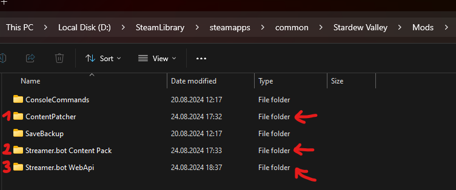

3. Go into Streamer.bot, copy the import code from above and import the content
   
   

4. Done! 🥳 The import also included a websocket client. Auto-connect is unchecked on import, so to receive triggers, make sure that its status is `Open` when Stardew Valley is running. You can have auto-connect and reconnect checked if you like.

   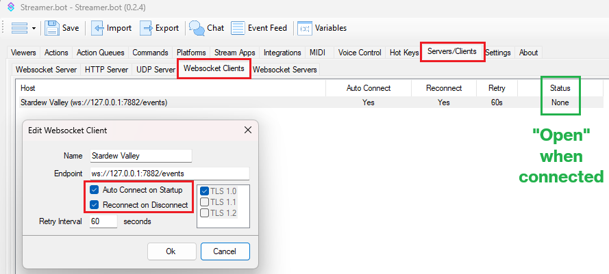


---

## <span class="iconify" data-icon="tabler:git-pull-request" data-inline="false"></span> **Requests**

The extension also comes with a bunch of requests

### Apply Buff
Applies a buff to the player.

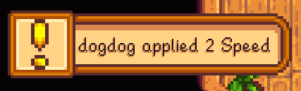

Parameters:
- `buffName` *(string)* - the name of the buff
- `buffValue` *(int)* - the value of the buff (e.g. `10` speed; multiplier buffs are automatically getting divided by 100, so 10 equals a 0.1 multiplier). The buff value only applies for non-unique buffs.
- `duration` *(int)* - the buff duration in seconds
- `hudMessage` *(string)* - a notification message that shows which user redeemed which request

Full List of Buff Names here: [**All Buff Names**](https://tawmae.github.io/stardew_valley_full_list.html#buffs)

*Note: Some of the buffs don't have an icon indicator (like CombatLevel or all the Multiplier buffs)*

---

### Change Hairstyle
Changes the player's hairstyle and/or color.

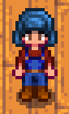


Parameters:
- `hairstyleId` *(int)* - the ID of the hairstyle, from `1` to `74`. `0` for a random hairstyle.
- `hairColor` *(string)* - the color of the hair (available colors: blond, brown, black, red, blue, green, purple, pink, gray, white, orange, yellow; "random" for a random one)
- `hudMessage` *(string)* - a notification message that shows which user redeemed which request

---

### Change Player's Energy By %
Changes the player's energy by a specified percent value (-100 to 100). Uses the max stamina to adjust.

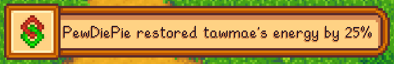
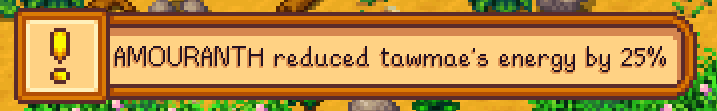

Parameters:
- `percent` *(int)* - the percentage (can be negative, from -100 to 100)
- `hudMessage1` *(string)* - a notification message that shows which user redeemed which request (for adding stamina)
- `hudMessage2` *(string)* - a notification message that shows which user redeemed which request (for reducing stamina)


---

### Change Player's Health By %
Changes the player's health by a specified percent value (-100 to 100). Uses the max health to adjust.

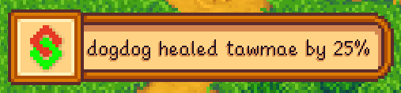


Parameters:
- `percent` *(int)* - the percentage (can be negative, from -100 to 100)
- `hudMessage1` *(string)* - a notification message that shows which user redeemed which request (for healing)
- `hudMessage2` *(string)* - a notification message that shows which user redeemed which request (for damaging)

---

### Fully Heal Player
Fully heals the player.


Parameters:
- `hudMessage` *(string)* - a notification message that shows which user redeemed which request

Variables: `none`

---

### Fully Refill Player's Energy
Fully refills the player's energy.


Parameters:
- `largeHudMessage` *(string)* - shows a large text on screen with a specified message

Variables: `none`

---

### Get Player Info
Fetches various player info.

Variables:
- `name` *(string)* - the name of the player
- `displayName` *(string)* - the display name of the player
- `farmName` *(string)* - the name of the farm
- `money` *(string)* - the amount of money the player has
- `stamina` *(string)* - the current stamina of the player
- `maxStamina` *(string)* - the maximum stamina of the player
- `health` *(string)* - the current health of the player
- `maxHealth` *(string)* - the maximum health of the player
- `location` *(string)* - the current location of the player
- `dailyLuck` *(string)* - the daily luck value
- `dailyLuckDescription` *(string)* - the description of the daily luck value
- `skillName[i]` *(string)* - indexed name of the player's skill
- `skillLevel[i]` *(string)* - indexed level of the player's skill
- `skillProfessions[i]` *(string)* - indexed professions of the player's skill (comma-separated list)
- `datingWith` *(string)* - comma-separated list of NPCs the player is dating
- `engagedTo` *(string)* - comma-separated list of NPCs the player is engaged to
- `marriedTo` *(string)* - comma-separated list of NPCs the player is married to
- `roommateWith` *(string)* - comma-separated list of NPCs the player is a roommate with
- `divorcedTo` *(string)* - comma-separated list of NPCs the player is divorced from

---

### Get Player Inventory
Fetches inventory info.

Variables:
- `item[i]Name` *(string)* - indexed name of the item in the inventory
- `item[i]Quality` *(string)* - indexed quality of the item in the inventory
- `item[i]StackSize` *(string)* - indexed stack size of the item in the inventory
- `itemDictionary` *(string)* - JSON string representing the item dictionary, where the key is the item name and the value is a tuple of quality and stack size

---

### Give Item By ID
Gives the player one item of the specified ID.

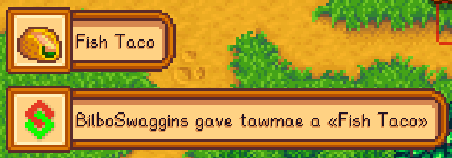

Parameters:
- `hudMessage` *(string)* - a notification message that shows which user redeemed which request

Variables: `none`

Full List of Items here: [**All Items**](https://tawmae.github.io/stardew_valley_full_list.html#items)

---

### Give Item By Name
Gives the player one item of the specified display name.

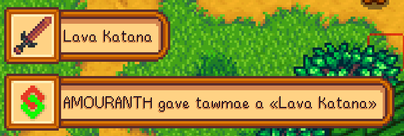

Parameters:
- `hudMessage` *(string)* - a notification message that shows which user redeemed which request

Variables: `none`
Full List of Items here: [**All Items**](https://tawmae.github.io/stardew_valley_full_list.html#items)

---

### Give Money
Gives the player gold of the specified amount.

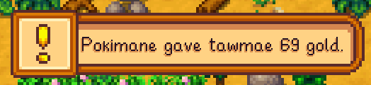

Parameters:
- `hudMessage` *(string)* - a notification message that shows which user redeemed which request
- `amount` *(int)* - the amount of gold to give (can also be a negative value)

Variables: `none`

---

### Knockout Player
Knocks the player out (essentially "kills" them).

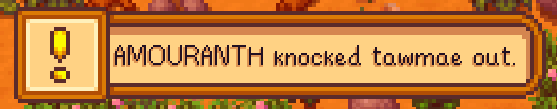

Parameters:
- `hudMessage` *(string)* - a notification message that shows which user redeemed which request

Variables: `none`

---

### Pass Player Out
Fully drains the player's energy, causing them to pass out.

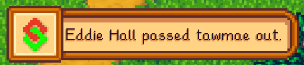

Parameters:
- `hudMessage` *(string)* - a notification message that shows which user redeemed which request

Variables: `none`

---

### Play Music Track
Plays a specified music track.


Parameters:
- `hudMessage` *(string)* - a notification message that shows which user redeemed which request
- `music` *(string)* - the music track

Variables: `none`

Full List of Music Tracks here: [**All Music Tracks**](https://tawmae.github.io/stardew_valley_full_list.html#music-tracks)

---

### Play Sound
Plays a specified sound.


Parameters:
- `hudMessage` *(string)* - a notification message that shows which user redeemed which request
- `sound` *(string)* - the sound name

Variables: `none`
Full List of Sounds here: [**All Sounds**](https://tawmae.github.io/stardew_valley_full_list.html#sounds)

---

### Show Large HUD Message
Shows a large HUD message by a specifiec input.


Parameters:
- `largeHudMessage` *(string)* - message to show

Variables: `none`

---

### Spawn Monster
Spawns a specified monster next to the player.

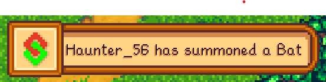

Parameters:
- `monsterName` *(string)* - the name of the monster
- `hudMessage` *(string)* - a notification message that shows which user redeemed which request

Full List of Monster Names here: [**All Monster Names**](https://tawmae.github.io/stardew_valley_full_list.html#monsters)

*Note: Monsters spawn randomly 1-3 tiles next to the player and it can happen that they spawn within another object and can't move*

---

### Tool Downgrade
Downgrade the player's tool.

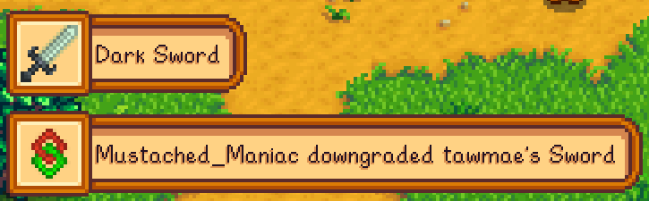

Parameters:
- `tool` *(string)* - the tool type
- `hudMessage` *(string)* - a notification message that shows which user redeemed which request

Full List of the Tool Types here: [**All Tool Types**](https://tawmae.github.io/stardew_valley_full_list.html#tools)

*Note: weapons are upgraded in the following order:*

Swords: `Rusty Sword -> Wooden Blade -> Steel Smallsword -> Pirate's Sword -> Silver Saber -> Cutlass -> Forest Sword -> Iron Edge -> Insect Head -> Bone Sword -> Claymore -> Neptune's Glaive -> Templar's Blade -> Obsidian Edge -> Ossified Blade -> Holy Blade -> Tempered Broadsword -> Yeti Tooth -> Steel Falchion -> Dark Sword -> Lava Katana -> Dragontooth Cutlass -> Dwarf Sword -> Galaxy Sword -> Infinity Blade
`

Dagger: `Carving Knife -> Iron Dirk -> Wind Spire -> Elf Blade -> Burglar's Shank -> Crystal Dagger -> Shadow Dagger -> Broken Trident -> Wicked Kris -> Galaxy Dagger -> Dwarf Dagger -> Dragontooth Shiv -> Iridium Needle -> Infinity Dagger
` 

Clubs: `Femur -> Wood Club -> Wood Mallet -> Lead Rod -> Kudgel -> The Slammer -> Galaxy Hammer -> Dwarf Hammer -> Dragontooth Club -> Infinity Gavel`

---

### Tool Upgrade
Upgrade the player's tool.

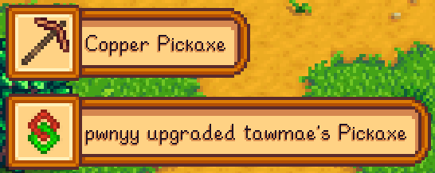

Parameters:
- `tool` *(string)* - the tool type
- `hudMessage` *(string)* - a notification message that shows which user redeemed which request

Full List of the Tool Types here: [**All Tool Types**](https://tawmae.github.io/stardew_valley_full_list.html#tools)

*Note: see the upgrade order on the "Tool Downgrade" request above*

---

### Trigger Emote
Trigger's an emote.


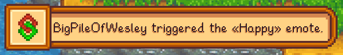

Parameters:
- `emoteName` *(string)* - the name of the emote
- `hudMessage` *(string)* - a notification message that shows which user redeemed which request

Full List of the Emotes here: [**All Emote Names**](https://tawmae.github.io/stardew_valley_full_list.html#emotes)

---

###  Warp Player
Warps the player to a specified location (**Note: Can cause spoilers if you teleport yourself to a location you haven't unlocked or discovered yet**)

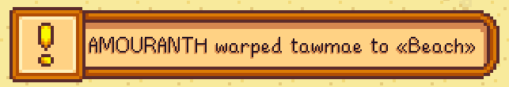

Parameters:
- `hudMessage` *(string)* - a notification message that shows which user redeemed which request
- `locationName` *(string)* - the name of the location

Variables: `none`

Full List of Locations here: [**All Locations**](https://tawmae.github.io/stardew_valley_full_list.html#locations)

---

## <span class="iconify" data-icon="material-symbols:notifications-unread-outline" data-inline="false"></span> **Custom Triggers**

The mod comes with a bunch of events that can be used a custom trigger under `Custom -> Stardew Valley`.

{: .new }
Make sure the websocket client is connected. See step 4 of the setup.

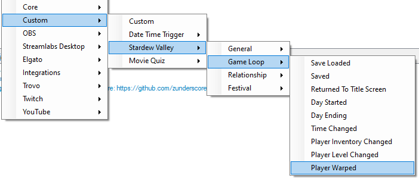
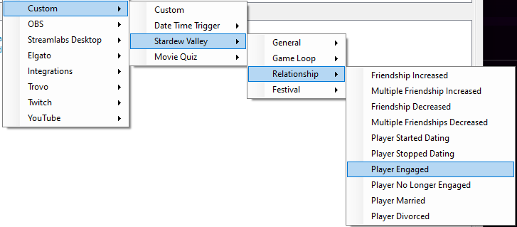

### Connected
Triggers when the mod connects.

Variables: `none`

---

### SaveLoaded
Triggers when a save has been loaded.

Variables:
- `farmName` *(string)* - the name of the farm
- `playerName` *(string)* - the name of the player

---

### Saved
Triggers when the game saves.

Variables:
- `farmName` *(string)* - the name of the farm
- `playerName` *(string)* - the name of the player

---

### Return To Title
Triggers when the game returns to title screen.

Variables: `none`

---

### Day Started
Triggers when a new day starts.

Variables:
- `season` *(string)* - the current season
- `day` *(int)* - the current day
- `year` *(int)* - the current year
- `dayOfWeek` *(string)* - the current day of the week
- `shortDayOfWeek` *(string)* - a shortened version of the current day of the week
- `weather` *(string)* - the current weather
- `birthdays` *(string)* - list of NPCs having birthday

---

### Day Ending
Triggers when a day is ending.

Variables:
- `season` *(string)* - the current season
- `day` *(int)* - the current day
- `year` *(int)* - the current year
- `dayOfWeek` *(string)* - the current day of the week
- `shortDayOfWeek` *(string)* - a shortened version of the current day of the week
- `weather` *(string)* - the current weather

---

### Time Changed
Triggers when the time updates (e.g. 06:30 AM to 06:40 AM).

Variables:
- `oldTime` *(int)* - the old time value
- `newTime` *(int)* - the new time value

---

### Player Inventory Changed
Triggers when the players get a new item, loses an item or gets more items to an already existing stack.

Variables:
- `playerName` *(string)* - the name of the player
- `addedItemCount` *(int)* - count of newly added unique items (e.g. +1 Diamond, +1 Stone that the player did not have in their inventory before makes an `addedItemCount` of `2`)
- `removedItemCount` *(int)* - same as above but for removed items
- `changedItemCount` *(int)* - same as above but for items that changed in quantity
- `addedItem_[i]_itemId` *(string)* - indexed added item id (starting with i=0, like input0 etc.)
- `addedItem_[i]_itemName` *(string)* - indexed added item name
- `addedItem_[i]_itemDisplayName` *(string)* - indexed added item display name
- `addedItem_[i]_itemQuality` *(int)* - indexed added item quality value
- `addedItem_[i]_itemCategory` *(int)* - indexed added item category value
- `addedItem_[i]_stackSize` *(int)* - indexed added item stack size
- `removedItem_[i]_itemId` *(string)* - indexed removed item id (starting with i=0, like input0 etc.)
- `removedItem_[i]_itemName` *(string)* - indexed removed item name
- `removedItem_[i]_itemDisplayName` *(string)* - indexed removed item display name
- `removedItem_[i]_itemQuality` *(int)* - indexed removed item quality value
- `removedItem_[i]_itemCategory` *(int)* - indexed removed item category value
- `removedItem_[i]_stackSize` *(int)* - indexed removed item stack size
- `quantityChangedItem_[i]_itemId` *(string)* - indexed quantity changed item id (starting with i=0, like input0 etc.)
- `quantityChangedItem_[i]_itemName` *(string)* - indexed quantity changed item name
- `quantityChangedItem_[i]_itemDisplayName` *(string)* - indexed quantity changed item display name
- `quantityChangedItem_[i]_oldQuantity` *(int)* - indexed quantity changed item previous stack size
- `quantityChangedItem_[i]_newQuantity` *(int)* - indexed quantity changed item new stack size

---

### Player Level Changed
Triggers when the player's level changes.

Variables:
- `playerName` *(string)* - the name of the player
- `skill` *(string)* - the player's skill
- `oldLevel` *(int)* - the old level
- `newLevel` *(int)* - the new level

---

### Player Warped
Triggers when the player gets warped (changes location).

Variables:
- `playerName` *(string)* - the name of the player
- `oldLocation` *(string)* - the old location
- `newLocation` *(string)* - the new location

---

### Friendship Increased
Triggers when the player's friendship with an NPC increases.

Variables:
- `npcName` *(string)* - the name of the NPC
- `npcType` *(int)* - the type of NPC
- `previousPoints` *(int)* - the previous friendship points
- `newPoints` *(int)* - the new friendship points
- `previousHearts` *(int)* - the previous heart count
- `newHearts` *(int)* - the new heart count

---

### Multiple Friendships Increased
Triggers when the player's friendship with multiple NPCs increases.

Variables:
- `npcCount` *(int)* - the number of NPCs whose friendship increased
- `npc_[i]_name` *(string)* - indexed NPC name
- `npc_[i]_type` *(int)* - indexed NPC type
- `npc_[i]_previousPoints` *(int)* - indexed previous friendship points
- `npc_[i]_newPoints` *(int)* - indexed new friendship points
- `npc_[i]_previousHearts` *(int)* - indexed previous heart count
- `npc_[i]_newHearts` *(int)* - indexed new heart count

---

### Friendship Decreased
Triggers when the player's friendship with an NPC decreases.

Variables:
- `npcName` *(string)* - the name of the NPC
- `npcType` *(int)* - the type of NPC
- `npcUrl` *(string)* - the URL of the NPC
- `previousPoints` *(int)* - the previous friendship points
- `newPoints` *(int)* - the new friendship points
- `previousHearts` *(int)* - the previous heart count
- `newHearts` *(int)* - the new heart count

---

### Multiple Friendships Decreased
Triggers when the player's friendship with multiple NPCs decreases.

Variables:
- `npcCount` *(int)* - the number of NPCs whose friendship decreased
- `npc_[i]_name` *(string)* - indexed NPC name
- `npc_[i]_type` *(int)* - indexed NPC type
- `npc_[i]_previousPoints` *(int)* - indexed previous friendship points
- `npc_[i]_newPoints` *(int)* - indexed new friendship points
- `npc_[i]_previousHearts` *(int)* - indexed previous heart count
- `npc_[i]_newHearts` *(int)* - indexed new heart count

---

### Player Started Dating
Triggers when the player starts dating an NPC.

Variables:
- `npcName` *(string)* - the name of the NPC
- `npcType` *(int)* - the type of NPC

---

### Player Stopped Dating
Triggers when the player stops dating an NPC.

Variables:
- `npcName` *(string)* - the name of the NPC
- `npcType` *(int)* - the type of NPC

---

### Player Engaged
Triggers when the player gets engaged to an NPC.

Variables:
- `npcName` *(string)* - the name of the NPC
- `npcType` *(int)* - the type of NPC

---

### Player No Longer Engaged
Triggers when the player is no longer engaged to an NPC.

Variables:
- `npcName` *(string)* - the name of the NPC
- `npcType` *(int)* - the type of NPC

---

### Player Married
Triggers when the player marries an NPC.

Variables:
- `npcName` *(string)* - the name of the NPC
- `npcType` *(int)* - the type of NPC
- `isRoommate` *(bool)* - whether the NPC is a roommate

---

### Player Divorced
Triggers when the player divorces an NPC.

Variables:
- `npcName` *(string)* - the name of the NPC
- `npcType` *(int)* - the type of NPC
- `wasRoommate` *(bool)* - whether the NPC was a roommate

---

### Festival Started
Triggers when a festival starts.

Variables:
- `festivalName` *(string)* - the name of the festival

---

### Festival Ended
Triggers when a festival ends.

Variables:
- `festivalName` *(string)* - the name of the festival

---

## <span class="iconify" data-icon="material-symbols:published-with-changes" data-inline="false"></span> **Changelog**

| Date        | Changes          | Version | Requires Mod-Update?
|:-------------|:------------------|:------------------|:-----|
| October 08, 2024           | Fixed a typo causing the Save Loaded trigger to not fire correctly | 1.0.8 | No |
| September 1, 2024           | Added "Change Hairstyle" and "Trigger Emote" requests // Added the `birthdays` variable to the Day Started trigger // Added a new queue for events, preventing "Day Started", "Day Ending" and "Saved" to trigger multiple times in a row | 1.0.7 | Yes |
| August 29, 2024           | Tool Up- and Downgrade are now case insensitive, changed a typo for "Cookies" in Add Item By Name | 1.0.6 | No |
| August 27, 2024           | Added unique buffs to the "Apply Buff" request | 1.0.5 | Yes |
| August 26, 2024           | Added "Tool Upgrade" and "Tool Downgrade" requests | 1.0.4 | Yes |
| August 24, 2024           | Added a "Spawn Monster" request | 1.0.3 | Yes |
| August 23, 2024           | Added a "Apply Buffs" request | 1.0.2 | Yes |
| August 22, 2024           | Added "Change Player's Health By %" and "Change Player's Energy By %" requests | 1.0.1 | Yes |
| August 21, 2024           | Release | 1.0.0 | - |
