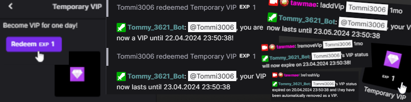
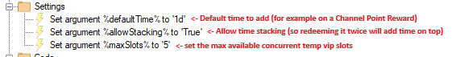
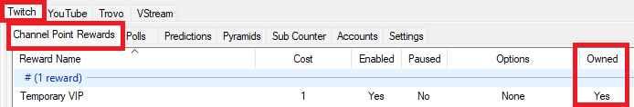
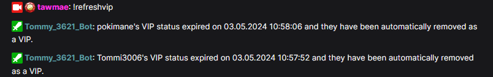

Twitch
{: .label .label-purple }

StreamerBot
{: .label .label-blue }


# Table of contents
{: .no_toc .text-delta }

1. TOC
{:toc}

---


## Description
Give users a VIP status - but only for a limited amount of time! You can either add a custom amount of time with a command or use a channel point reward with a set amount of time.



- - - -

## Import Code
```scss
U0JBRR+LCAAAAAAABADtPWlz4kiW3zdi/wNT+2FnY1s1qROpI+aDocxlmy7ACNBUx4bykFChg0ECjCf6v+9LiUtI2NjtuiaqInDZylQe78p3Jv/6z/+oVN6t2CL2ovDdrxX5l/SBF8yjRWKePg680AuWweH5O/Reeq8Itj+f2u+Vd9teLLGh7V/8D/gztAPGu94zPqi92FTM9sc46wvN9jKZRgveIbHXgc32Dav8LPK+gbKYLLx5sm1sh3GyWBL+Z/xrZZok8/jXv/0tG+y96yXTJX7vRX9LdtP/38qbv58mgX+8hKi/DK/Idshw6fu86Y9sP9TO7cfOpoIn/8ieVHZNabNH+aKIZlPmEEOoKpQKiqY5gi0TWdAlQxR1VaESxbv509f+uWRLtp37+DkLbewzPiZskuVaHoi/pKyxiIKWFyfRYgOdHNuPc7120P9HDvy/V64ordx7Acstwl1Ey3kBV7kutr+2NzFAq2yyhR3SKNjDsdBOopAsFwsWJmWtycJzXUD6MWRPoLsdJQhgonYKaFFHouGISLBFQxSUqk0FQ3ZsQdaQUxVlBdmycbyBIxxVNUViqiMKDLEqvIoBPRr8kHRFlnWkIN1BhVeTzZzDU0HiactZTB2wFe8I5/fj1j9+eWq3C7a2F9vNVmVEq7rtCHpV0QQFMVnAWDYEo4oUrMgOw6J+ZrNUpxqxJQYEqeiCoiAs6BQjQZcZkrGqY8eWzm1WFKW32+zhj99zdFXkqjJorGw/ZZN3Vyvb8/kaKglQccWJFoGdAP+Lm18qYhDBjzV8KHym/IEXws+4sEES+Zns+S8dIdRonAGehijSVEMXqjolgsKYCHCrMkGSNUwcQ9OqRC68umaeO+WEjt6jc4BFyDht2vHgiSC4AOpeSNkDn+9y4tqDc/fk+sEO5j77tVL5C4hJLiQ+svUHj330WEVUaCX37wlwNhpPgFOmVaoBKQtMkoAWNawJhqMBaSIJE1mlIsHs+wGneDk4d8K2TLimHU6OrkL7gjkMxCNhBUZIm+u/fvo0gnVF6/jTpzuPLKI4cpL33ev7T58aC5h8HS1mmvLp00p5j97LSBaNT5+CmEQL38Pvqe+fTvjaMQebGM7TdMT8gL+f7ghvElaPaAoWOu7OcUDcoew/0qaZ/LZGN6fPbmfdFW4++BO5P8eS+ng7oz4OzI09uqt+6M1FIvlLa1O7Z+MuskZoaTZNhdbVgTWiIm42Nv3xdE0C8xH6rXCYf4e2Ov5kJPrEUz0s95Y9yUjwyFjezkzJGqmIPMbduotuSMv0cNP/3G5248m4+9i+7vYG1/4Sni2tHrphsO52/cptt2riJHiYTzY1D0tG3L42FWvUFWlzGN30dn1gTA/+r2ef/tjycdgfsnHNbzezeWnLX1uDKyOdp662rHG/QQNzSRt9lfCx7vNj9MRa+9bvb9iQ+vS6sbE2rgdw9MnMn7W9tYtlE7VbXUSCdN+wf3MzGPXmv+3WnX5qH4bX7tJsddS+ZKLeuBPe1Dtp33NjXL4OdYpHQ++2XlvRcc8lch/wp4btlvlojTu/cRxcMhYJGvJgpK5hjJKxOlOK/CXgCl0ylp2Nsy7Z2xyHNZF+uLoEPtu+18X1NLO13A1mQHPRfi1bnA5J6HO81khAonbQiHHTkIdyfzqREk7/+/EmgbHC9doUeGBFxS6ajLoLPv5Fexx3u1jq+wA3hOX26ZhzgsSV1TQ3k3F/RbxL1uk/moF/gFmzs8LS2oV5Rvb4InhtrDGdkqDfsertuN00RFqvPQIfpjwPfCpPxp3ZhbS5sUZ9H49ryAaehXfKaMKH/SWklcoOmPOSPYpT1ujGWO4/Hvb5sOLrw6OGMpQAD63uHYxXwAHMCX2P3v+A3BugA1r3k8l4eg84RgSlY+XX0fSDdn3qpzzeSnnc/XiPcrIhlYMjcYqD/hDoNLSA/yyAU26cE9lyNPaOptNx217bdVprd88DH5DRbqogL9f58TLYV4vPjmmuC/K437VALk5G1L+p97xeK0nlgzNYu4TLbpABKa8PAFewt4lkbADXnwH3AZY7AJue1q6TKQXa6o36s3YjMfn740ENm00/sUwUtk/p8+gDYyE67izbTWuKW10/TzvZxwH5W7I3aTJuu1tZubQC3f042NEandNmN+L0Zu7bjTobPqwsOD9udvx9SlPZuHPLu4py4wLccWjGuD4r4qgMb0d0P5TMpXUN55TcnVrSMOrUO1dMTmWnATSfwjSdy7sKmbRdVwtg1uyvrPGdiwMD6NJUgE/RrVcbnsEB8PGd29k0JHtcq1nNnjsS0zko4GNog4weD9rzMthme+j4tGVusFcLJqOHR+u+ZE8tVEKfZkyk4Utgkp1JwFtH8F2ah3PmLJ0cnUUcz9tzUA3wRk3p7b5phPZIeeZ9OFNL5/ZnZ2HT9B/vR8YMYDmlTaOw9kFeTp+dfytnT9feIaI1Jx+eh3eBBzLZkNH7dg8wZosEhkjq052eELcbNdB7+imdwBkj2+P+Z7u+dtt+DdbMZRLIrXptNDBrIDNnz8ukTO7eg64zux9x3awRWgN31p7VqilcQhS3W/6KDmpwVgCtDmprgF0yGakgD3uuOfN77WYjBvqdWq3Zslw2ZDxoZTIUpfoVl3PXmY5lpjqWOqSSjybSdLA9lwbHZ8peZzv6sHM43p4l+/GOxulJjeVEMuMbziMSnM3X/gz49vT8KuWtM3ILztG+SALFtUB3AP7J75/j3c2dnyksTvSBL4Gn5Gh8F/A1A515ij3KdQXQb693uAN9qx/BefDIdb82P59Hw594vBSP2bn9kMKhDqd560E/6JtXBsiHJR09xPl9l53jpXrVzBpZU3gfpWfvYK+n7XTdU93MgHFL9CC+r0YKEy7v7k7kUx9owDJTvLvcziMgF0H3U1P9EvqnugXYemDzZPKmkZ5FI+gDZ7A/+3jdB1lqpufSR+9IVtU7YAeKa5BVU9DruLzkeiEioVmwMY7XwGk82y+3uw5j387UFX081fMmoNcVdHa3402Ke6lfn4wnzrHP9RRYz/P44bpV+l56ZpyM/TweYJ0N0IElU7md8TOoATTt7ukH4HLV9lV8N0Dq2HyY3YSz2UXy+wS3HN+3PsiAsOvv9aKBek9HnZ1uH93V9/rmw+3sAfZFkV2/StpAT6d42eoFS6uR4QboeQ+H21ljZjV80Ck7jzdH6zgdw8nD1ud64fa8474Bn9Xh3ETilOt4hzWv3V69w0aP18lvpkis+jzBm553M8jrbGWyw2qldhTYGQpfL/BKbzlsNjbA0wd4+11xEu7sTHd9e+Cp5T3fr9yP2nXgFcBBmQzJ0egBPkuuM4N+saTN6deAidypt+cX0O6MpvqOv8IeXy+3g9Qex5s1mO73PZRNb2ev3Xy4ig9yTL2D/Ya06bq3g6uHm1M7uoQ/DvBRQX/tX0/Gfh4en0mZ7DqmOS6DX843Qe/H4BuQQ2x8Fx3R6heCh/uDwGO6ol9JjoBd8Q1gcvcKmMD5FJrI+hp0Et79GHTS6PpgLy+t1oth8uy5Ue5D6WQyrWmtuH2V6V6gMzRB3/RqPdw0pxzeoJ/CuuJMz07t744K7TUaNOa42fAw2PlWYGww4IE8Ru7deBa3PzTgTFvD74T/Dvrr1QO35e5GgHePP7/zyuFzgY9qZxs2tvpx49j/przCt3QY78iP9wH2+9karaMjf2H8rK/vjI6U0dzTvouC7n79MCdyT09tZtDl4DyfToIH3wQdno6G+pFe+b8fvdR3O+Q6KdfZyCbn19/ZGan/Aez4Kfn8AOdW30/PsXslaoepbQF00NgwE+x87jdt9Tcwzyn9pbYBrD82ORwa0Ld1x2MaIreZP35GR/7Lu3JdNbWrXq2rnvNVDe2muQFbD8bh8Za+CvYf/7tavta+cSsnB3+pjFxYI4/fpPR8vOZ2w+oM4b2fduOzduMON2jn19zT7qyjwtw7XyWXB16BLkAuHHSrtQtyRrRO9bFUPrjTXSzgQt/CDl5cX+PvRUc+ulJ4XOJzZiND3NLYEsuE+yVGA/PKpYB3ewTt0k7Wm0a74NN8SzleXBfxsrWAzjsFmfPYboJ9ueH+NbALNjVO/3MM/LWH9xgV5HGBJg7yK7Vz9/vhdBCivxfCyvMFI1Ew93xWknezDUz79maQ2IuyzJy0R2yvWJ/FSz+5j0x74fHQ+VN9c72Kke4sEwBpTJYdRxdEhydWENkWbNERBVplDBNWVVQbvyYTwOD/zqUCvEvj0V8htyLbfnebFGD7frQGEJOZF7qF6XeZGGWT8/y0+2xjpWtLQWlL2BF11RAkpWoIii7pgq2JssBsEKqGo1NHrb4qqUKSzwJywJIENlPMq3nzzIpTYFLm2JwUy5Is9kktIi20XQRKw5ANW5eIwKoqFRSkSAJWkCEwJiqKTERVVF+Xn/LlQPmanB+epbKM2SKuJFElmbJKupjKp3cf2SKwQxYmaabmp3e8HUTIij+BfkHFWURBBXOZAkuu2JXkXLpgOuGFSVaKihzF0BRBFh0GUMdVwZaYLTgENHnNYAyxYoban8wKKsqly8AtvQLcdTsEmHGI04oXAtTqUzsMmV/5GHkA2H6a5wegjn6pfF7GSSVmKbQrW1LP8txsQqIFBaj7m9fCmTiy5kgaFpgGPxSmSoJhiIZQJRjJkkwcSS8mEX4jOMuvlxCB/TDwo6TIUDuEiIWNXCQcJGoYVFcAcrotC4oMFGozUQOqZVUJU0ck2vcmHPLU+mQCZpNP+WwW5vbw1jWFUt0QELN1QRGRLei6JAtUYwhTjA2NvOzE2aXPlZ7PWW7xOY1jt1X1coLZ5sVizcZIRIJYNThOqSHohEkCMkRVkRVCq6iYBHzJJs7i7LKNKJfgDDjet+cgUA5o2yfbHjZfzE5nsi7KpCoJsiZLgmLLGogAmQmYVg0iyqqiKrmj862y0087lSWne/PfK2Bvewub0yMISUZmP2CS+o66uPaFsKDpVc4ihiwYMjYELKmqQ6pylTnkbNa1qnylFHN+siyyDHNVVjXiOI4gKwYsWJYoHMIy/HB0Qm3KcBlPb7N6FVFRJdirxIjIdXlVMFTJFlQqa7ajGgYzipn4271Wv1o6fa54QDeoChoHFgzEeFK8qAqYKbqgq5rkOHYVO8654gFNlaua7GgCdgzQVoio8N9UQRc1qkrUxrZYtFy+RPHAk+L8WTLdceBTHJd2/OaZy98oz/h7yBne5m/yPK3HYWAmWLZ8q85jbGX5b7Xj3GH3xB92iLPn/GLuqU/kjueOfTzE4OeTUSe2zMw3mIvFf1ZeEs9/NIPGJh/Ld0v9T+U+J+4fN6cTyXVvLlmbt80dAxy0W6d+1edjvGl8I81Zbi+3vl73I+ztyN+7vA8M+c/5DcUV4OvgC/NyuWnn8+/O5eqEmf/p1j/kWjsD+pj6TnnuLaydju+ALqZre9wBOqqtsLfN7/HU0WT0IFpjtI0x9CNrPHPtZkOyBjXPGpnLdrMBtGokPCYykRoxbs14PuaWJmtTsqlNs7mU8rjCkX/SHKmPpz5xTh+90O9Y23y07T7g77V7uW/82NfPfc3dHZyzXD5OWxfkK5bnz7lp3ioROz7IAeChXupbf8bv/AFLIs9nm5mtztySqA8wm73Wx96eqSue30maPs8JTnOsAO4BlqFfCdz/ff2HRCcI6aIOmoasCApFMhhjGPR4QyVMtmWR0Ff5DJ70H36VUqK92+DoZCb8ZK5M7fmchXFlPWVh6iC4X3sJmVYGyYLZQcWNWFzxvRX7pcJWDJRjUa0EXrhM4DEoPpWIux7+Asf1gsVT0LYrW43ote4EADeTwOADmIMprGBS5UWuVcFxNMnWqtSW8csMqC/oTkCXa05HFtVbWFwUdMMq4U4XTKiggJmVObpV6mhVEbRubFS/hMV1cT1wnwXRiv1blAQzpkhVQrn/GwFFIk0UDFEGo4toYJ6Aki8q52wYqao6rKprAjNkR1A0bgsgsIGQTuAJwWAmFF/9frX6M0hN+3xzhf6XtxnzZynia82Kn2WEP1AZ4WEeBCZPCGqzuSuLScuMTtKtD/vrT0nAzbADzF74TiczNdNysRNzLCsHpDz0Dns7KWvhaVWl6TVbc3a3j6yc5bw5e5wCvy5Nga+/PAX+mRKr9S7liqalbGnpwmcs8xLELtqnaX2IduVTW/NiWFJCRcrNoJemILWsKfGOy4D2aUU786m1o4m0HXXUrQm5h12xfHFn3nY6OLBWZ8sCX10qksItkwV1Wt2twxkQ12oaPpgsS5B93BTl6VXLduMMnHnp6uYqbI+BThpbs4uXCqYpLQhgnqZ20DNpQc+nzhztzeK4eJ6GCjx4eWla/t37oJGldx/hYWvy3mGJzvHnMtop4c/i+x2rtERs++71ny1RK+Hf4zXMstLhi0oWMlra0m6/g2d0A7J1fVPY59odNh9gvZwu0L5kk6cwDZsmT3tc8rNzmyZ2URr/RWk8cm4dPLX9kZc2kdM5edl20HMnUmPZAbreuk2Q3TTnwLsoTfFs7d0G59LYXlUidEYGvxEfJzmadQacH3OlX2+6l5/lToVypxz836zs6dQl+iF2S/mz4DpNcXBIWx2oXYBJ5jr8ojynrgBP09y6s1S/N6W/YWACrN1UBk7S0td9+Qro1Vfe2I8fbu99Om72/skG36BcaPDycqHRCPSZ8C66Hf0soSqUUNXFo9KlU727RD8YvJxOrPqPQScgK1SycZOfJUMnJUNfgUbwyF9+g1K7x1eU2nF5L8L59FXgQr6FPHkF74BN+RlL6uwV/PP9lg1xXeNDg+vYD5w++f9kU34tyNPXspzR/Y9579nQ6hM63tOhxD+lP6Wfp8K2W93bfItShoLe059bTSUE3EaTsZX6IvjVLXhsAs9sbYrmg2+FYHeM7/alDzfb8OCOHywO1/uIj5/X5VpoDvt+xJvUTlHbzemU+zEwwJ5f4WCNlGJ49xX6V1nItVhmtbVF/jweDzL8DE7P4eIU/h35LrvCotWFuWEvm5psg+2xLePwWQtsIQ4vgPEzZSZnYMH5Ys554wcKu1Y1RkVFsgVkE01QbKcq2AamgiTpVVElIlKUtw+7frWyjW3gNQuexGn0JMt4t9N0+cpfYzvIXTtaseOKTXlW9v+8r7SdyiZaVhZZ6CWIFtuuydTOwrXpGFN4xWdO8gt/lD7f/LfvV1yWVJbhypvP2asDsobkSAg5WFCrPCau2aKgp4Fxo6qLlKqGSr+b/O43uqo0A/bJbaXHl5W+9qbSalXRDZUhAcm6Iyiibgu2akgCwrJDqratwx/fCyzzyQUXBrefT2H9HrO8L0pof22oHhGFaZJCYMOyyC9ZpgImBAsSL47QVM0wqPFNQ/VDLkCuQy5vKh/shP2wOdK5qL0kIV3UJBBbqmQIiqLzdHRbEjSEqkhCILecc1F75mhVR+KXMhscY0CeIPEkHUhUtR3kUIch9QeK2j+P37T7Nw/gf9VwO5gO4T7E/RnMlkdQxUD1n3YwPMMBmFDhXqVa01Enhvd2ocYGa5qf6bgPKt7OjDwxJcpuBg13YYfizaW7MPnFoWzvzBiX3MIaHoVuz4TUszDSZTe65sI+xZtdc+GD0lDsSZiX3yya7XsLr2t/2Zc7K7qv7k6r38EcBROEm5n7KnyXq++905v+uHl5gdn3ogzlk5sH9rd+9k8r5MMujNXO3ehw81JT8YCb/U0Qh3dr6S2xba80pMZvXPQno27Urh9MH3vETXQzc6/f526LcHkmarpuD0z/ws0TL7p5tHyt9dhIM2gb2yzooxs1bzYcDlfeC24xSOmnPd7Bh7uTebj54SOZpTd5qOkta41TE/Vu/qIM6/IxOM5L93jr70LK0/L2nAux3PXhlKyvGEp+7bqvPDDHl9aglGbKbzg5G9briiTspLxWcrOG1m4lpTBwztwEu3f5ZFnYz4VXjkJGtVOeOs+Th1sr8nzZek1m+C5c+lVuQjlOKVGxPAxJ5lpBPHxcgP+ZzO2jedKQzIU3QBfh+zaVC0Wa8s0IzraIu/jz+zU3z1YdnODBGSjuiN/m0epG8H6cc30BPVij7oJnvG9v1tiNC2dr4zG7mZRK+1tAAtOHOTb7zH/eZ3cj6fWDeV9/4nbj56o0nnDzHb1v4rB7NsT7Ovo9luVnsvifl8MX0ut5/IHudQZ/pber5NPMzsgMvlan9/cfyA1mUFuxFWYLqq5JglKljqAjbAhEVZEqyTrSWLF88MeqPhim90MQe1d8sCs68BbcoKzEiZ0s4wrjNQrs1V+vo1c1B6OqLjgik8H0M2QB25IMpp+kKKpNNUfVvhcvyxcuIch+2fXPXAu5IXZG89nvH4uj5aLE5kNnljpni8BLEkZTTBcWu28udxm9uwMDb2EnEbx6ZgLvVV/TlfsqHV6lUihMOKCr4H/wwtS9UuJ4CTJ7FOXxkdW/wGTb7zz6tPgU/sWmFObNTblgLnu4fpj7HvGSuj1PlosyIfLOj4i9NctzM3luGC1YLUquCImWqe/kdIFZl3aYsEVo+yUd5vxb8eKkzt9ni3LfzK4JlbzI0fzEy8tDM0f2v/7IjWzHbMDC2Eu8VenGXT/Ctl+PIp9G68L2s7HL2y5wWLkLO0y213Psqbnckfd98sBLq80PntJU9KaFYIzmvj0x7fZFOOFQIJZyAzBGP3vykyN+csRbccRLK7VOC5u+6sGQzZlyQxZv+nk8/GSGcmYoIfWXhjdeEA34YhSfzpQSfKr8/6T375/eT+yHNcNxRGYsGbDF6oR4D41132Nhkm9M7wR65kuOX3pZUPlXQT9929MTtL1gc2aXUg3H1yqlFwPl4JrFNduH9iLG50AZRx1yr/temIoNdIbATtHA/4Pf//h/dFglqWZ7AAA=
```
- - - -

## Installation

1. Copy the import code from above and import the content

    

2. Move to the `Commands` tab and enable the imported commands

    

3. Done! 🥳

- - - -

## Settings (optional)

- In the `[Temporary VIP] Add Time` action, you can set a default time. The `defaultTime` is either used when no time is specified in a command or when you use a channel point reward. So a default time of `1d` would add 1 day if used with a channel point reward.

{: .new }
Allowed time formats:  1y / 2mo / 3d / 4h / 5min / 6s



- `allowStacking` will, as the name already suggests, allow that time is being stacked. So if you redeem it here twice, you will get 1 day + 1 day, so a total of 2 days of VIP. If set to false, it will just "refresh" to 1 day upon a new redemption.

- `maxSlots` is the maximum amount of available concurrent temporary VIPs. If it set to 5 and you have 5 temporary VIPs, then noone else will be able to become a new temporary VIP. You can however still stack additional time if you already are a temporary VIP.

- If you have **permanent VIPs**, you can add them to a group called `Permanent VIPs`. To create a group, go to `Settings -> Groups` and type in the name of the group down under "Add Group". In the `Viewers` tab, you can then rightclick a user and add them to the group.

- If you use the extension with a **Channel Point Reward**, make sure the reward is owned by StreamerBot, so it can be automatically be refunded whenever someone redeems it who wasn't supposed to do so. Also make sure `Redemption Skips Queue` stays unchecked in the reward's settings.

  

- - - -

## Commands

- ## `!ADDVIP [USERNAME] [TIME]`
  {: .no_toc }

  

  Adds VIP time to the specified user. If `[Time]` has been left blank, it will pick the default time that is set in the action. See the available time formats above.


- - - -


- ## `!REMOVEVIP [USERNAME] [TIME]`
  {: .no_toc }

  

  Removes VIP time. If the removed time exceeds the time the user had left, it will un-vip them. So to completely remove someone from being a timed VIP, you can just remove 100 years.


- - - -

- ## `!CHECKVIP`
  {: .no_toc }

  

  Will allow the users to check when their VIP status expires. If a moderator or permanent VIP uses this, it lists all current temporary VIPs.


- - - -

- ## `!REFRESHVIP`
  {: .no_toc }
  
    

   A manual refresh and checks for expired VIPs. If any are expired, they'll be removed.


- - - -

The extension checks automatically for expired VIPs whenever your Twitch stream goes live, whenever you use the `refreshVip` command **and** every 15 minutes. If you want to change the check interval, you can go to `Settings -> Timed Actions` and set the time for `Temporary VIP Expiration Check` to your liking.

