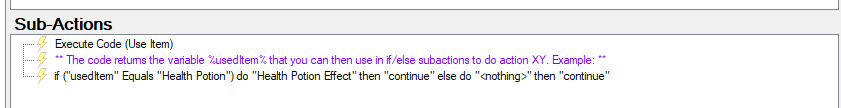
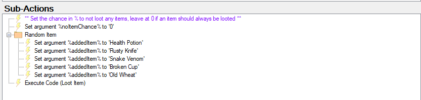

Twitch
{: .label .label-purple }

StreamerBot
{: .label .label-blue }


# Table of contents
{: .no_toc .text-delta }

1. TOC
{:toc}

---

## Description

Users in chat are able to store items in their own inventory. They can either loot a random item or have an item added manually. Upon usage, specific items can trigger specific actions and allow for funny interactions!


_Examples:_
- a [*VIP-Voucher*](https://tawmae.github.io/user_inventory.html#vip-voucher) that grants a user VIP
-  a *Potion Of Silence* that mutes the streamer's mic
- a *Ban Hammer* that allows the user to timeout another user

- - - -

## Import Code
```scss
U0JBRR+LCAAAAAAABADtPWtz4kiS3y/i/gPbFxtxF7Ny6wnSROwHwAaEbboNmNd6YqJUVRJq9GCQZIw35r9fliQw6OE30z2z7gmPjapUlZWZlZWVL/793/9VqXy6pavA9r1PP1ekf8QPbHfpr8JR9rFre7YbuQ/PP/En4onMIWc5Ryfyp7QXDRG0/Zt9gI8ecinreh3QVUX3bqkX+qtN0heaURTO/RXrEKK1i+iu4fZwFmnXQGiAV/YyTBt1LwhXEWYfg58r8zBcBj9//pwMdmLZ4TwyTmz/cwTT/2pvpz+Zh66zD4Pfj7w6Tsf0IsdhTb8nCyLoYEEomQue/Ct5Utk2xc02YVAZoqxIRKhxFJMqJ9eqPKfWqgYnCQZVVMUweKG6nT9+7beIRjSde/859ZDhUDYmrJIetNxhJyK0tfLdjh3ESP25YiInOOi1Rf+/DvH/S6VOSEUPqXsAhbXyo2U5tZL1O2u0CQBfRdOtkEd8d4fJXDv2PRytVjBsUWu4si0L6L6P2wx+01FcFybSY1TXVElWkCxzuFqVOFmTeQ5hLHBiTcSybIq1mmzuL2CPSlQ1aopMMVdDPLyKayanSsTkCF8TKEJ81TTyr4abJcOozAvZllJaPdAr2LLOL/utvz98+OUA1XlWK0LHlsZFJI07ZLZMrn1FTQo0wTQ3Vdzc/PnmZmwDYdfBzc2ljVd+4JvhSe9seHPTWsHka3+1qMo3N7fyCX8i8ZKg3dy4AfZXjm2cEMfJTvjaMQebAJZ30vRX9AjDshEPB/wliyhjE9KmT2Jsk0lvabjYupace9IehV/W/Hn22cWid2u075yp1F8aonJ/sSCO4Y42aHxZO71aClh0otmmMaSTHj8b89Gw7UR4GPSa3ugejRVPb/UULPUdY6BczyZz/sLpOjNpFEwn3RbtNDazSQ/6aRG+h3cs/hx3RrbRdr7p7R706d3rZ72rwZkTwbNodsWfU4BRb9YtvdMQpu7dcrpp2IaoBfrZSJ6NewJpX/vnV9s+MKYNv5vJz5XQ0C+c/oZeE4ectTazjWVjtyUNxsqaTK7si2bjFn5bAO8mhr3TnRMe1tMZ8efDw7F2fdqKQwTot6lr+/3ZOnH7bj4Vr3399otl6XUYX7fLxhkLvEVEbTMDuAAmRT/lLcCzdA3wXTi9NayfP29iq7tZAN793fv7cx6+w8bl/ex8RTgAmjvY1gO9rQmk2bgnnW7MA8nzzHyMHk3lGntOZzbpN7CLfd1N5r9s5sdACW7Xpfjr9OfYBVhao/vZRLe+DhoRGd8FX7Z0jn+24xFjMmhIhtRd4By+H8PRbI7tBvDqaAO0dg32broOIjr8VJyztYx27XxXGbY1D41lvwx+NJ5a5x0Gc7druLNbvXmmAS8IRnu9PJz78L3kWW7Ne7ApMRxDtxXOMnOaV0U4Sem0cGD/CZcI9iHjg5jOCzZHX0KT/jcUz9UdTye6usX9V3vOwz70tmu/aNbt3Fj22oJ5hNlgYX29Vy1Ga+KOItLWNnTo2xk6LWd23d/bU9bXIW/ptv40ThJ6DGdjZTEcj+6x2PJmA2uhLxq1GCaPD2DPB7Nx634W4+vaIu25A3LiFntdkE9X1szVNsa4xX+x654+bi1mAA+TYXorjNcHvGMMJiCLRrynZ/k6gR/kUV/ArgxjtQKYI8NH/AHcs/EdgyW75uhK1AA/raXhXfqAP/t8sDh4jx7gbH9f9kC29ntMJk7HxDlvXtlXnTDmDXOwtjCTw4ALnfHdoMGj9rU1BZmB3dE32HMu7ItwOrmq6k08n477C73N6MhbYyGmPQE8dBk+JgMc6a2+z2CP8dPuzQ1XuYUxbHgGfRsOrAfevbKm3sKaDhrfDFEIp4OznPzK8KRjdAC+tuPqzUPeAp58/v54Fi/E8Me40S/Pa1RMZVBHav62aSwMcXQP87E1ObQNZ1lTzsGeyk+HdEYbw264U0bPZ6zvSfiT9adySrmEdXikbVlf7frd+VWe9kX8kIzd47Ebn68xnUZtrTFrXzF5sd370cDVloZt2TqTvR1yi93+PfDRCk3q/uVgsfzy9NgCbvfnMP4i3hvXd0ssxXOM0ueJXHxo87My4qJ5AF/5nGV0dXrCVIQxpZ7LZD8dNOazdt+ZNU+bkRTujd3X1r8FsO9Vi0r7MrSrdaVLdtaIMDYPeFcuQOY8Ccekv5X/8RpHbmtzfiibA73ZFTLrZ3pCEc4YT27I+LpwXrOA7rH8eAk//BAyMj2/3RFPJt1Ib8/mbE88veaGBmMd6gDbMRK8ZWRtD+RHn+l3u3NuNGks4JkzyvDf+T4vH9Iq2OPzzXRCuobXAP3kaXn8oJ805qTTd9iZAHuirtvW56+ATwJ89tW5W5xvHHnSufzt/FRVEZt3qBgT+46cbxZ2EU6GgHvgt1NDvAM69Xim++ptAXip588ml2yOwQxkP20qvSk7t9uj+62eweg0jGUZOwtaPHwGuVV4jp2hdGyQwcrXHQ7WbI/wX+2E5teT0dzw+vC348T6FNNlN0+9axXyN+Mr4LtvqFn3kzValpH+Bj0q/XsO8ywKZHCBDM3oODFuBwzGBFeg22wMabTGQmAnbV1y4TBeHDlluu++nmJ4V+zsFNhvwDn7HF23QfcGfT2FO+pLXbgPNO7Hm+43mCsizYc5Hhs7h1shkWGTGP6Ed8r2SwEtEz6IYQbePUvWz3S8a3cE56sVpfje10GCPb4tpFesv7aTMzN9P7qWRt+mcG6+mkbx3P2YTxl86ecUfqWDXU3AnZ4BOiTTS+zJQBnDmQu6JdwnXCc8b5bLG8Z7egrvVQndyudLcK47fAQyPiiT0Xtnd8H+UGDPKvx0DDDwoUMH85Qe8VqWRef643hL1xXL2pYwBfjg7yXofsY+HoFnVsk62VzlvJPMxZfRKK+3POe8eYSfH9YukD1an8b75LSUV7QC/i56VgJv4xH+iPmZwdMn4xbo3w7IsNF9bL/w+nOA734gjpTz/Tv9oIDPn5gn5ZHcPGPpYdzJIFj9ADR6OO9aPOyV+t2LYGLPrILzi50/p3fbPf8T3EXWsza7KyT8uneOxGfz7vy4l4vlcXsGOutozs6J8+SeviJePT4z8nvjcvkSniCpvjBL+BR4gek7oC95IZsjlQUjjcIYSJqtLxawryd8yT2hGB8PesIhHpJzGnABd7h9vfSL3aht37lYLG+ZjYHdseN7dgbec4CliGYPelPBnKcl9xcGv8f/M2c5Xa4o9t2l7dACe3Zqe3XQZhCiVZHFO+4RoFvap0HkhEN/hFY2MyI/1vegV96Ym5i2ERIE2VRMThQVgZMlhecMSglHhSqReFk1DERyr66pbc0ZnPwJX2L21ti/bNvWbZBxXsRtjxvFbY/QOzbh883hbTZZYkM/9Cw4DloGlOy1b5t/33XMe2oIQrJg8hqnaILCyQRRTlXgf0ZVooZWk+VqVf2+npo2DWOzfvCnd9UIEuKRoVFOkAjPyZTInEZkxBmqipFRkwlBfAk/S5qACOUFTqAC8LOACadJQDCCBQQv87JsiH8iV82Wpj+eq+aNHpDTq+WajLsBGl/CDeFujqXL2DoHmjU8U+CEXu5OnAdvRffWENdWfzKHW/aIh1v57qQ6PLkbp9dnVjTqdJW+CJrspOudpxYGdgKA9sTrmdtsueU8eyvcWbU7RZaN/ZM4sezDqeNlx9B3Vgz9VP2sN+GU92YOaBW32FtU9W/lVvB9OEDbyJx672UBdm7JgFn3ZI80G/50MnP0diuiqSUTb0BTthsK4HHDbgs7S/Ugaw3KaJ3tEbP2PmkVKF7vgYWP7w3rL9JS2M2Z3TjYjQaxG+Jpvaa3F9bXZs6aEQ3bo2gm9f0vsE69GUDfK+Gy+WotFm60jTXc8vntuEyTZ7dBuD31mGbSO71eXzwCh94EzX9QfmtLaL3j53guNkfOgsgsgN6233x5kYGr/Lad/BRazxkOh7x12ax/1jOWdNKeLxmvwE/CK50wns8c6BZoaPHfj9zwj3aLeY4XoAD2DH36Wol3Q8t5Mw402gfvR+zx2a2fvbfU/jyao2ZSuWZWBU4RTDhpqzXMaYIpcYqqaoJBiGIQ9UNzZIEnVJTUWk3kqoqJORkLIqdSonKyQgRZFqtmrUa+r+Z44fth5X+bc+R51Kl89W0vrPTpGq3I//0ZdclVDHqqSmpSTZEUwqmiCqoksBZnoFqVMwjcdkVRrRqqUsLgpimLssJT0B1rMmj8psFpVRneV8SqRqsC3Jry2zVlYkEQfxRV8jbdyr2U+ogQSgp1ylvkxHz3qUORE86BEWI6ZbuxMLhhsszCDZfo4bymEV6UOZXwJierisKpWJE5hVZVWeSpplbxa6SDIEplsuFTP+auYn35NULiH++M1n4UhJvKuWeb9HVIVUCAoKqscKJg1uBexEucWsMqZ2K4jopCtSrhPDN/d6QKR0XqwEMLWhlRz893ehZSeb4mURnuidjkRUCqDNscmbDhBY03cE0RqJi/bH53pIpHRWpj5S+oV2kCtK/CqSaKiiggmUMyMuDIA0Y1KJE4ovG1KgZpQE3jx8OpdFScfnFIZTynKHwdSg1RoaRKqyBLMQWUiogzqggUL4JlQ4NjTMP50+i7o1R+Pkq32kmsjPyYNo/3jyPNj3gKI9YNB1kUOoaRad7c+EZQuaeRxR6sKAy6avghfAA1abV5h2FWtuNbR1hg+t5Jy1+5wRHGP12hte0dA/KnIof13umX8eBgWAqoREFAXcPZ3Ny0681f2dhfVzQAMiHGs2zQZLZf2Yzw36+/SoJhSqpSRUSqylRS8m+8GYzLgX6xw0QDBc+AYa/zm9nrAbYGdk7qwcbDuhfSlYlgn76deRN6DefwjDBeGKJgEZyc3YXUi7XpozCHZ9pWtIpJdITxJ65zhFH1LwC4uwTuYng5adkOfVQOvWWuXgT0sfExkA8Xy9B26QmTWsix749FhFMUonfk/T2GPKVLCqejhze6943Gd7iTuhGEq/Q+98fN+u6bL7UgPEr3F8isfVG4o9fLJOjutfcVo/GJxsSYlUiBZ4vU7IvvSGzmbal7yNkE9rvJ1abvODRlS911o5DpfO81eJ+a6eAnlzRE5D12XDr0JXX9UtXoXSTbCCD3V+93gNG78KQbvOOmZAOeedhnGzM4GdMyDfbFIzegDy1d+VuQO6A4WtnhMegGx8Wtjekl7BHnJNY/YKccYw3DFfKCxyX5m44lGtjWMc67Q6WGJcsi5xhqCNNBfA/Ec0KK+GNgH+kQL+f697h2HJEWBzhiqkjd8/zkRDsKV9mrWJxt0m0SnHxd+aGP/aNskfxsR8io/E/Msnx7hmFrMdtmWwzy4+xFPmf9/EXxFpHBx77nU9RuRVPxepf5abQ1hudM++gSaOLlMwBZRLJym/hde/50rHybMf994ssHuLQ4RuBKnM8Nt+cM2dj3h2Ncu61o1tZClslouHFEczSb4N3zXER04rPfwFwLQxS+kLFgpxmE8bOLheLQzpV/OVhbl8P6XXHWIpurf2tcK4Ix7gL+6yqbN4OT18drOHG2iaKf7cVtAJ709p0wFYMk3iGO45Ct8VgT9HZ/OWvH8Rwu4HSxH8+hd/rsvVtDuoreI2PvR4qdeTJytJU+H2XnmRdkuZRnKm9jCgoyQZ9YSxFcu2zQoj37nNidNGaH0XSX4fUQqRxn7+WzDMsyhfYzJgCfc8Jk2kO8SWkGWzkfrIuzv0tk3ftnCaXZHmf758F+9gzjC5Dt4ki+WOyyhooy8tYwDg9ri2JcHsZ5HD076FBm7UV4b7NX2tvfzn720zMypw8zIuOM93y2TtL2kO3B5P/SGBRnLiVyPM0QSTIZ4PxszLHXc84Lso3SrKG97JVCufSKLKB8htxwl0G1n9mS54H9rIYc7bPy/5lZP49mxaVjDHZZWYdjvo0W75vlU0QblrFdkF2wl7ndu5hNFv5+Jk5htkh5VtTTWTMsfu9wrU/HbL0yruwZWUYvh6UoG/4w47NwXzwX9/s63Yuypl+ZnfMuGbpPzs3iO89eE5uXzabJZYtsq3/oZ/EZt1flIbvX4koBznQM8rc5F0EPsFj2SyKL8/CfP03Tw2xoRstxf8HiFqkYiriZysmJIOudJPOGZWKZxTG5L9OR3iG7JlNNZVsNoCjD+0DvMK/++SfKppE1ySAi5TmsUcrJpoI5VFN4jq+JgolrBInCqwJ0jhQT+YaAB89nLnpm8Mf5YKZtzENuOc+KdDAxMnlKqxxRNJ5V2xI5w9BEjlQlgWg8NMnvHpDzR4Q2bQOWaFgJ57SCY9xVbK/y90roVzw/rDgs9AF5m4rN0nj+UXEoMF4FhRW+YpvQED+vBHM/ckglCbSsGDR+jeaztLDvJBXz/kfleb7VKituZsimYNYwRyliUU+CygGSDU42MBJZ3Koq5in8HHTzfCnLvhbfrwrifYwqabCiiFWemjynAodxsiqLnIpFylEBAdMRWlXkl23bbSzLYwE0SSzsi8K8Shb82sBkCsvVBNhjJjVMTtZqBsv9EziRl6lBiUBkWdoHexeY/ElFhJpYVDiDlzXgGYQ4ZGoCZ+CqAEeEJPGHWYPHC13uU9eHPfKXqFBYpaZiCljgTGKw8HBN4rSaYnICrqoCVU3V4Gslm1jFsiho7OChNXhVQyxjzqQsVhkTVSYC7Os/UdpbCVXjPn+xKLAL2/vtGH4o5v/rUyty0ApU1TTs4xjm/CNGX72zT+CvZP9/YWW/Ivt8ck8+recrMra3lQaf4TOIbZp6QVXH+Plz/AR7FYNe5HPY9dlWY2R3s/0KcdfuaG20W99mA8tWq/ASGz9XsSpf9RDgApgWqZ+ADKYTHF1LjQBNrvzupp7zURxU4tt7p9gG81FlMW8H+Kiy+GgFsUnXMcaauKsk+AdUWiTt1mYGezSuAmazXONErhTYKbrNKyfe19fiKJqdCazC3HwmXkNDt06lpHIcyIe4kmLiC0kqziXypxFXm5u1NQcn+cbvWEmw/qepJAnPQkNiPpvvWk0y6/NKeD6zT55hqyrjh9oBX3n8Pt3L8swBb6MlyLx9P9+7+ClfYkuNqwZ3Lh9ysk9l6/JlturDKmuj/u31lubs3MrZ0+JzeVvdcohEZ31+erZ8JF96T4Ye2OB2cnQ7X0Lf2Qb4I5HPZf7OxE55bQhb+fNY5bD4DCm0H+7OhIexC3L3y/fau/BVpw+/r9IKdy/lq0LZ8vBTUNfgcZ4qOCv+wCqZz8DnkIx735hcm3mjwOgsrK18ylQLHQB/3IJsSGS4170F3GZp4cX7+Jk4zuAEdEwiGGNWFTCJb0l4mmfr3q80+SKaHbVKqPca+Q/4ivF4veVPI8adA+cAn/qxvlOV0Cd8/1v6x/u9z+ifxFG8sWJoZs8c1LZIfK6xXtjU/a/3d0nVyFMFz5rBkrbu7s/juICYT34aC3IwGQTLbFzI0SuEnvWX6T1zDjy/01MvkqqYPxX5gB58S4+/m49X+vD9v9b3/x4VDUtr2Dztp/xJhzP9rT7mB122Ty4G/B/o376MtjrF+SOxUQlf8Tkd9HC/ZP2pOX/nLm4vWx3x0f3w0mqHhXsiW31RYRW4Y70jrmiYVqs1J5aV+mIvZhMnXx8m729+UmfrZuPbOmGuKjm76+b0AFiXOdCz32LxF/W7SrwhVWuqxNUM9jVKyOA5VIW/UE3FqMZjVZVf5cP6y9WiQaJo8LypckRVCSczt6pBxCpXkyWNaBQjUTB+dJcPfP5r+Hs0IioiL2MOIQ0D1/IypwqCwUmyKZGaYAJhqiUMz1ephqQaEMKUgeGxWuUMWkWcLJkGEmXR5Gt5hv9x/T1FJI07fDh7Ppw9yRz/yc6eNyd7lF/EmFIVGwGYQ2bUIUumjCeXT1Ccvu0pWZ1HjRA89kbO+aD++esmV5TyGU6kva/XyhfoLL/oP/TZOl2SJI1df2UwmzSC6RguGs2Lex9eYgbevGKWjiOEJP16lwYGmOggDciOv3pMGcKFfkmalqc3cdapszfnwTvFJff/GGPrvvFdMaRrZhSLujAPareYMwEuTotEIZ5cxsoxHWvCdzS0vr8B86lLyZYORV/NM8wX0HxRgOxrC63mDZUFhVbLnCMFJebLjJPlhuotP+XlgZ3guNS5VkC3nWwoN1w/m39Tvr3PGidjw2BhkksJnjLrZI5oMhaA568Sh3Z60WNrKndAP1xkHzMwfBjWPgxrGVx/GNY+DGtPzP1hWPswrGUuwt+nyHNV1VRRJJyhmYSTkahySFBVjlJaNSWDYonkv07hRzGsPS8ef8hi8eFiWVnRMFp5QRycv013qPw9CpLCjn+H5yisbPyogpHHOnkVaGPx+7b5mQKSK0FkpHYPFtBP/EryqTKZnlTO7pC7dOjPr43Sr9Z4lYhAA0lQBU7WVMwZgHwO4ZqpSLxco2Y+NviNUfqvp8MbSr5u8Z1bjL+kSXWSosSSZ1Uujamhp0Vfk39cwf+2//LGpsjTXZcSG4XU2ZSgAJkhXe3MiDlAGaPU3woIG6T/HGDi2R4HaC8lp1BUpOxnIhNXTZ6rVbHGybLCc8iUTQ6rkqSqNV7QXpghscvJybU8j/uKYX1J1sTr7evJH9v+iYn8wP6Yt7u/2HpuOD5e2J5VYD7PGU3LAEuNzaWgBX60KrCc8iUIg/3n2mFICTOx51G2ay7OvPnEitnABvbh1ZIJ0nL5qiQrSJY5XK1KIOlkYDWMBU6siViWTbFWk81PRfjIOQrqhOQdBeUsBOwT+yUKUO4mhkf+kEVi7LKZ/4ZgJjs704pa9A60L8fGdthESzhdinbZJ6B0kVz7ZFuev6INP6xj7Eex3yELV9JlW8+qoAMQJbCDsMnep6tiv8a2iS94kaH0kZejh2ZG8H//fjAyCuiA1R8M7dvChVuObyCn6fsO8de55SdjF7c9x9tjrZAXppJtx9LFvrGjb4QCNn/pd1y99Hu/jsLncV7izerG+5tdiPMPlv9g+bfI/pdmwL08L/Ao22KVTPZxAnxsh8PmR0+Al7r/XxgRcRROB5J8cPiPzuGZa8CaGgFcJmjI6i1m2PWhsenYMMFhI6u0vXq4/MDAv/8/fgAZJAqQAAA=
```

- - - -

## Installation

1. Copy the import code from above and import the content

    

2. Move to the `Commands` tab and enable the imported commands

    

3. Done! 🥳

- - - -

## Commands

- ## `!ADD ITEM [USERNAME] [ITEM]`
  {: .no_toc }

     

    Add an item of your choice to a user's inventory. The items can contain spaces and can have a set amount before them (e. g. 10x Health Potion).

- - - -


- ## `!REMOVE ITEM [USERNAME] [ITEM]`
  {: .no_toc }

    

    Remove a specific item from a user's inventory (you can only remove a single item at once).

- - - -


- ## `!USE [ITEM]`
  {: .no_toc } 

    

    Use an item in your inventory.

- - - -


- ## `!ITEMS` or `!INVENTORY`
  {: .no_toc } 

    

    See the content of your inventory.

- - - -

{: .highlight }
Items are case-sensitive!


## Configuration

1. In the action `[User Inventory] Use Item`, a variable called `%usedItem%` is being populated that can then be used in an if/else-subaction to trigger another action off of it. An example would be:

    `if usedItem equals Health Potion <do action for Health Potion> then continue, else continue"`

      


2. In the action `[User Inventory] Loot (Channel Point Reward)` you can duplicate a `Set Argument` subaction inside the "Random Item" group and add any items you want to be in the loot pool. By rightclicking the subactions, you can change the "Weight" and therefore its loot probabilites. The item is picked randomly and will be added to the user's inventory.

   
   


   The `Set Argument` subaction allows you to set a %-chance for *noItemChance* that __no__ item will be looted.  The user will then simply draw a blank :) It is set to 0% by default.

- - - -

## Items to import

### 1. VIP-Voucher
   {: .no_toc } 

Here's an item called **VIP-Voucher** that grants a user a VIP status on time upon usage. This only works in combination with the [Temporary VIP extension](https://tawmae.github.io/temporary_vip.html).

```scss
U0JBRR+LCAAAAAAABADNV1tT2zgUft+Z/Q8e9mF3Z+og323eSighoYQNSRxIw3RkSXZM5MvackLa6X/fYzsBcoEFpg9lBoP1nZs+HZ1z/P333yTpYM6yPEzigyNJ+1AthFGaZMLdXo7COIyK6HH9ADXUhi5jnk5xQz9YSTGBAftevsBrjCNWirrtf2Q3KciUZbUgYLgQ0yQrUYEXEWYPwHzThfYAUJaTLEzFCvwYS6FgkeQnmSSmTBrmLJPa8ZzFIsmWErsXLC4NSX9NhUjzo8PD2lEjCMW08BphcliAytdwrdKYioj//UFKYr6UFkk2y6UwlkgSeWGMS6/SAjQrXwNWsoTBDWztVa7EWuPrPExrT0+pSK6K+CNZbS0uOC+hHzWpFG+QiiuxHFa+1CvSGqrgkJbk+LZpKBoismdiJuumZssY20Q2DGqqyLKJSv21/0rt34IVbOX76TqLscdZaVNkBdtA7gkvKDvNkugszEsCQcjHPN+QWqfAl83jOZLawMittCczKrUgS4q01NunJjUTzlnN1lMlzBd4mQOT+wLJcEyT6IHjHZwkMSmyDPzsQ0UWBgEkZsn67YbP3dPYOpE6qTGv6D0YvSevjqQ35NVTSlY74/VF+8NGCJ2e7gjUKWNZtoc8ZMuK72FZpwaWPeLYsmPomulT7FmqtqO6YGEwLRlDDbSNiWVabllByNmGHo53x+Cz+VZHGlN2X9p8uv7jw8vMZ2FpsrtKRKBplXCDMGI7/h8OSqE7WHlPB/Wm9gZX0YhsTVFtw5JV0zJkHf6VHVO3ZF3zqa3aukcN5100qtrPZtF4C4srWvpMVJkqgDxpmiwknsRBtTKvWZXyaVJwKgVw4USZxu/NR1Wjjmpplkw8lci6Z1myrVNHNjTDMoipEsdHv0o+au9g8uMch7w0XnMJbSzCIof4ltKhpEYJPLUFPHQKD2MKDxOaMPyx8hcoRchG+i4vNaUe0xhRICNtG9uyTjRfxhQpsscM3bGJxRym/yqU6u+gtFXmXF5lY9naJSyJjYKaCyyKl9h7MSGZQxBF0FMVYulQID0ke7YB19uwDZN6DlIN/1dhD72evXWH3vG0NW/t4BnzGfRLwna6XwU3jyaTEcSTLPLJ5CIkWZInvmh0Pw0mk9MMnJYjlqlPJnO9gRoa0hRnMolykmQ89BqU84NNk7fb/r2lYM2EVsHT627qRSQYavwbbbnicoHOT3rpgo46OR5dBDfq/ZRoF0FPOW73RwasGRxw66SXdMiZG3otftdudeaeugiurqf8RnPRuB+kJc7AVrPHT4afgsI96xhXqot61534vNlRiOouB9GpGPfbebvlKLR5/I2edapYICZOZsbUGw3Ty+dtqPj6eORp7h1uuUu3xffbivjCjRzlRp1ywq/SbZvDlT06UrgX95J2xAvYF7pogq0z99v4unN5A9j5IO82g1mn5OEz73L66XQ51lwxHhlgDHzFxwo9+RR+bh7viWtW8dUcdnv9ptGnI+P4RoNYVKPJhnwG+nfd6HQ2Ho3vLvtI67auZp8HPbUb3YibQffuYon0i7vZ/cUgULqt3nLcaofreEjkInrdKdpnV0s6GlZ+/B46L393Ei/NGExPacjZnlFtlbocL/sCZ/uGuUoix3N2xfKCi0HirkaEl2Q3pHbvQl0hKHQqokKFUC0dRijEGJRWmAIo9YnjMWha1u7E8YoK4ZQ/z5aIkyT+E5py2X5/SrV4fNkz6bZKr/877tZ0aDr0cB2GSaSaMAppxIaJkiqyBsOkaihI997YwdelCoYQEcbBbiWvh/znznG9XfX1xXHVN22sWb6uyr6qlaOx6UHlV3XZVhhhhmVaqvm20Xi9kZeO7nV7MV9zdNDgOE5zRh9P73YNr3TW8vWH4MZ3DqhHEQSzubhgXp6QGRN9ls23vowewSYP4YtqEyzHnewxCAjgx3/TBeghjBAAAA==
```

   

