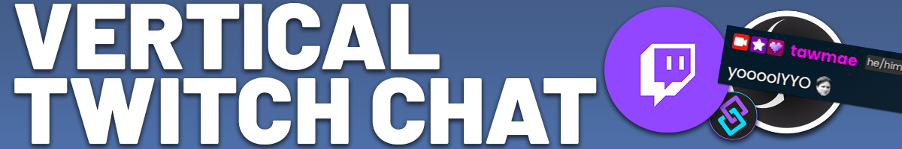
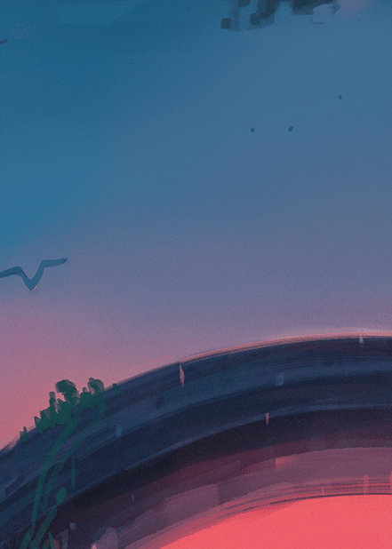

{: .highlight }
This overlay is still in a testing phase, so you may experience some hickups. Since I am not a Twitch affiliate, I have a hard time testing everything properly. So if you catch anything or feel like a key feature is missing, let me know in my discord!

Twitch
{: .label .label-purple }

OBS
{: .label .label-yellow }

StreamerBot
{: .label .label-blue }


# Table of contents
{: .no_toc .text-delta }

1. TOC
{:toc}

---

## <span class="iconify" data-icon="material-symbols:description-outline-sharp" data-inline="false"></span> **Description**
A customizable vertical Twitch chat overlay for OBS!

- Pronouns
- Timestamps
- Profile Pictures
- Removes Deleted Messages
- Twitch Events (including Watch Streaks, Gigantify, Announcements, Channel Rewards)
- Kofi Donations
- Replies
- and much more...




---

## <span class="iconify" data-icon="material-symbols:settings-alert-rounded" data-inline="false"></span> **Setup**

1. Go into Streamerbot and head to the tab `Servers/Clients -> WebSocket Server` and start the websocket server. Leave the adress at `127.0.0.1` and the port at `8080`. Check `Auto Start` as well. You can set a password, but you don't have to. If you do, make sure `Enforce for All Requests` stays unchecked.

   [](https://tawmae.github.io/assets/media/notif_sb.png)
   
2. Copy the URL
   
    ```
    https://tawmae.github.io/overlays/VerticalTwitchChat.html
    ```
   
3. Go into your OBS, create a browser source and paste the URL in there. Set it to your preferred size.
   
   [](https://tawmae.github.io/assets/media/notif_obs_1.png)
   
   [](https://tawmae.github.io/assets/media/notif_obs_2.png)
   
4. Done 🥳

---

## <span class="iconify" data-icon="material-symbols:dataset-linked-sharp" data-inline="false"></span> **URL Parameters** 

You can customize the chat with URL parameters. The first parameter gets added with a `?`, every additional one with `&`.

**Example:**
`https://tawmae.github.io/overlays/VerticalTwitchChat.html?background=true&fontsize=21px&showavatars=false&excludecommands=true&excludeaccounts=tawmaebot+kofibot`

---

### <span class="iconify" data-icon="material-symbols:alarm-off" data-inline="false"></span> Timestamp

Toggle the timestamp. Default is `false`.

`showTimestamp=true`

---

### <span class="iconify" data-icon="ic:twotone-transgender" data-inline="false"></span> Pronouns

Toggle pronouns. Default is `true`.

`showPronouns=false`

---

### <span class="iconify" data-icon="tdesign:user-avatar-filled" data-inline="false"></span> Avatars

Hide user avatars / profile pictures. Default is `true`.

`showAvatars=false`

---

### <span class="iconify" data-icon="material-symbols:notifications-off-sharp" data-inline="false"></span> Exclude Events

Exclude specified Twitch events from appearing in the chat overlay. Seperate multiple events with a `+`.

`excludeEvents=sub`

`excludeEvents=sub+resub+watchstreak+donation+raid`

You can copy this to exclude all events: `excludeEvents=sub+resub+giftsub+giftbomb+rewardredemption+watchstreak+cheer+raid+donation+announcement`

---

### <span class="iconify" data-icon="material-symbols:person-cancel" data-inline="false"></span> Exclude Accounts

Exclude specified accounts/users like bots from appearing in the chat overlay. Seperate multiple users with a `+`.

`excludeAccounts=tawmaebot`

`excludeAccounts=tawmaebot+streamelements+kofibot`

---

### <span class="iconify" data-icon="tabler:exclamation-mark-off" data-inline="false"></span> Exclude Commands

Exclude commands (messages that start with an exclamation mark, `!command`).

`excludeCommands=true`

---

### <span class="iconify" data-icon="material-symbols:background-grid-small-sharp" data-inline="false"></span> Background

Toggles the background.

`background=true`

---

### <span class="iconify" data-icon="mdi:circle-opacity" data-inline="false"></span> Background Opacity

Changes the opacity of the background.

`backgroundopacity=69`

---

### <span class="iconify" data-icon="ion:color-palette" data-inline="false"></span> Background Color

Changes the background color of the background box. Supports hex colors, but then you need to replace the `#` with `%23`

`backgroundcolor=pink`

`backgroundcolor=%23ffc0cb`

---

### <span class="iconify" data-icon="mdi:format-font" data-inline="false"></span> Font

Changes the font used for the text. Supports standard and google fonts. Spaces are replaced with a `+`.

`font=Arial`

`font=Comic+Sans+MS`

---

### <span class="iconify" data-icon="material-symbols:format-size" data-inline="false"></span> Font Size

Changes the font size and also scales all other elements according to it.

`fontsize=10px`

`fontsize=26px`

---

### <span class="iconify" data-icon="tabler:inner-shadow-right" data-inline="false"></span> Dropshadow

Toggle the dropshadow for the text. Default is `true`.

`dropshadow=false`

---

### <span class="iconify" data-icon="material-symbols:send-money" data-inline="false"></span> Minimum Reward Cost

Set the minimum cost of channel point rewards to show in the overlay, so you can exclude cheap high-frequency rewards.

`minRewardCost=250`

---

## **FAQ**


### 1. Can I make the chat horizontal?
   - No, the Vertical Twitch Chat has no option to make it horizontal.

### 2. Does it support YouTube, Kick, Tiktok and Trovo?
   - No, the Vertical Twitch Chat does not support any other platforms.

---

## <span class="iconify" data-icon="material-symbols:published-with-changes" data-inline="false"></span> **Changelog**

| Date        | Changes          | Version |
|:-------------|:------------------|:------------------|:-----|
| January 17, 2025           | Beta-Release | 0.1.0 |
